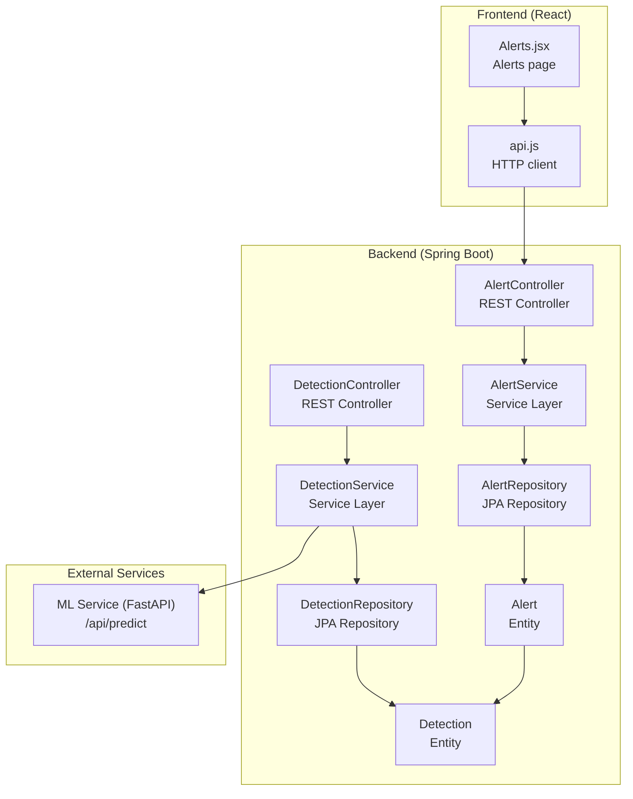
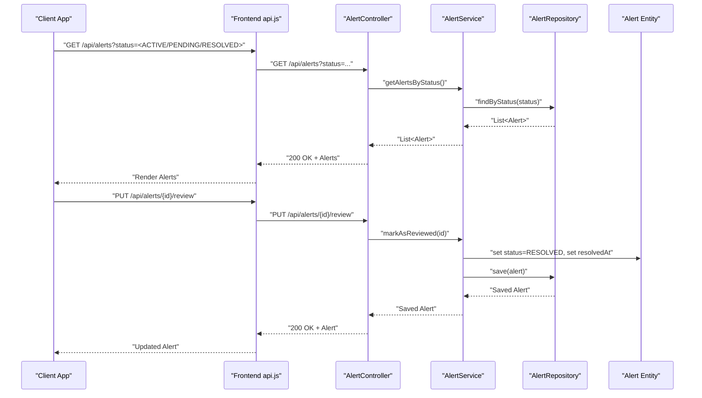
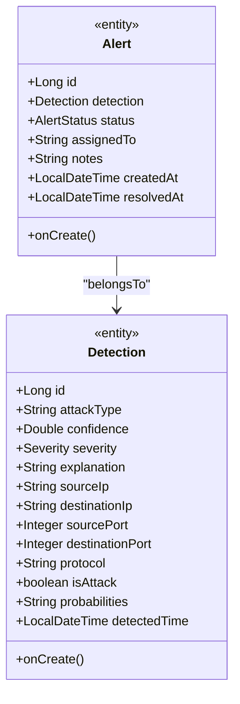
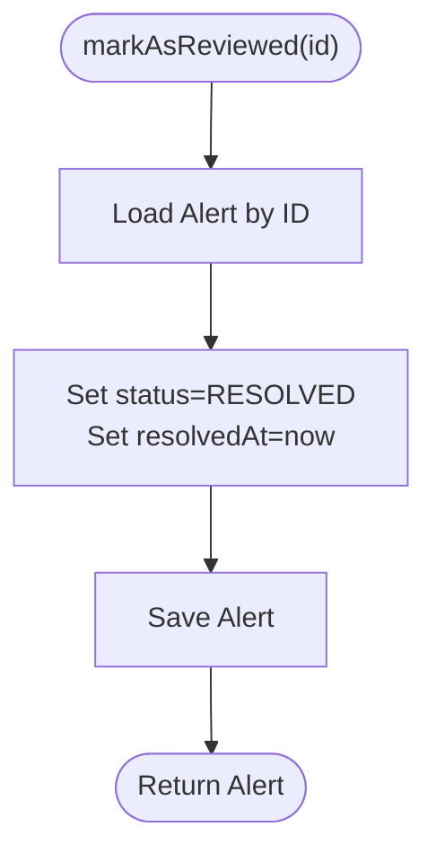
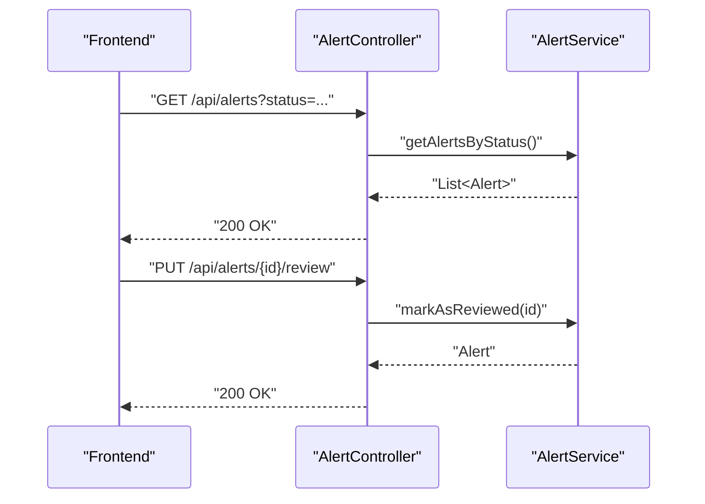
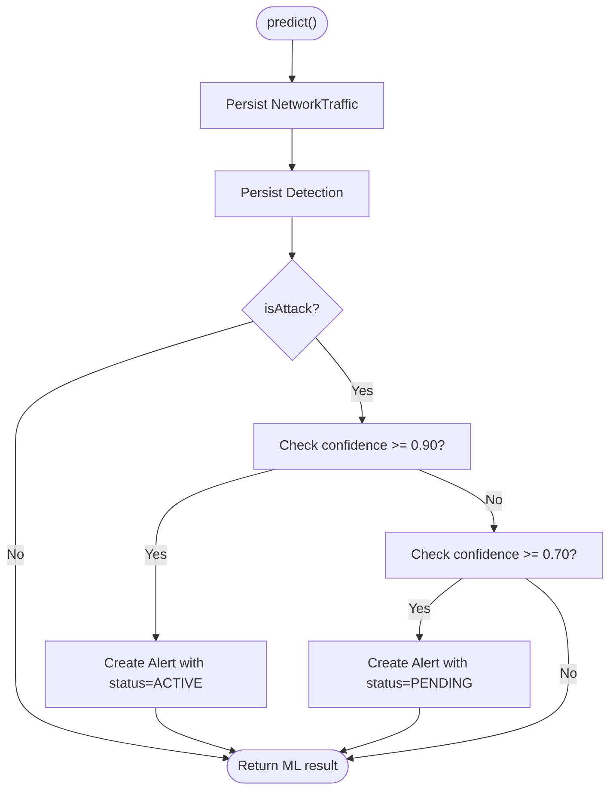
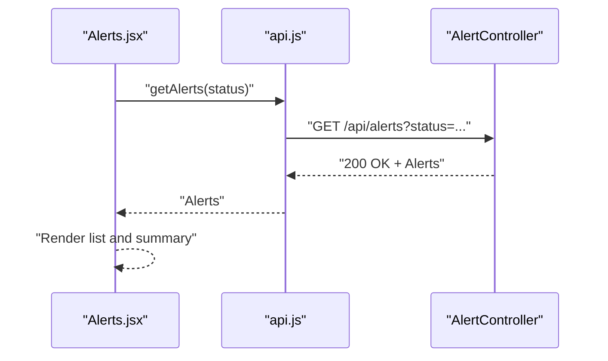
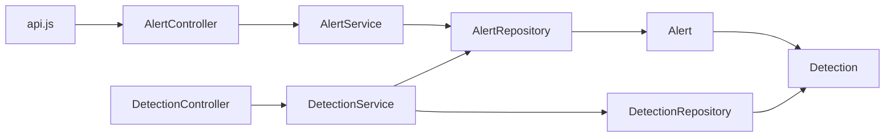

# Alert Management

<cite>
**Referenced Files in This Document**
- [AlertController.java](file://Mini_Project/backend/src/main/java/com/clinicalnids/backend/controller/AlertController.java)
- [AlertService.java](file://Mini_Project/backend/src/main/java/com/clinicalnids/backend/service/AlertService.java)
- [Alert.java](file://Mini_Project/backend/src/main/java/com/clinicalnids/backend/entity/Alert.java)
- [AlertRepository.java](file://Mini_Project/backend/src/main/java/com/clinicalnids/backend/repository/AlertRepository.java)
- [Detection.java](file://Mini_Project/backend/src/main/java/com/clinicalnids/backend/entity/Detection.java)
- [DetectionService.java](file://Mini_Project/backend/src/main/java/com/clinicalnids/backend/service/DetectionService.java)
- [DetectionController.java](file://Mini_Project/backend/src/main/java/com/clinicalnids/backend/controller/DetectionController.java)
- [api.js](file://Mini_Project/clinical-nids-dashboard/src/data/api.js)
- [Alerts.jsx](file://Mini_Project/clinical-nids-dashboard/src/pages/Alerts.jsx)
- [application.properties](file://Mini_Project/backend/src/main/resources/application.properties)
</cite>

## Table of Contents
1. [Introduction](#introduction)
2. [Project Structure](#project-structure)
3. [Core Components](#core-components)
4. [Architecture Overview](#architecture-overview)
5. [Detailed Component Analysis](#detailed-component-analysis)
6. [Dependency Analysis](#dependency-analysis)
7. [Performance Considerations](#performance-considerations)
8. [Troubleshooting Guide](#troubleshooting-guide)
9. [Conclusion](#conclusion)
10. [Appendices](#appendices)

## Introduction
This document provides comprehensive API documentation for the Alert Management subsystem. It covers:
- How security alerts are generated automatically from detection results
- Filtering and retrieval of active and historical alerts
- Manual alert state management (marking as reviewed/resolved)
- Alert severity classification and status lifecycle
- Frontend integration and dashboard usage
- Notification and escalation considerations
- Integration points with the Machine Learning (ML) service

The goal is to enable both developers and operators to understand, deploy, and troubleshoot the alert pipeline effectively.

## Project Structure
The alert management feature spans backend Java services and entities, a dedicated frontend page, and configuration for the ML service integration.

**Diagram sources**
- [AlertController.java:11-44](file://Mini_Project/backend/src/main/java/com/clinicalnids/backend/controller/AlertController.java#L11-L44)
- [AlertService.java:10-44](file://Mini_Project/backend/src/main/java/com/clinicalnids/backend/service/AlertService.java#L10-L44)
- [AlertRepository.java:9-13](file://Mini_Project/backend/src/main/java/com/clinicalnids/backend/repository/AlertRepository.java#L9-L13)
- [Alert.java:7-43](file://Mini_Project/backend/src/main/java/com/clinicalnids/backend/entity/Alert.java#L7-L43)
- [DetectionController.java:14-50](file://Mini_Project/backend/src/main/java/com/clinicalnids/backend/controller/DetectionController.java#L14-L50)
- [DetectionService.java:22-158](file://Mini_Project/backend/src/main/java/com/clinicalnids/backend/service/DetectionService.java#L22-L158)
- [Detection.java:7-53](file://Mini_Project/backend/src/main/java/com/clinicalnids/backend/entity/Detection.java#L7-L53)
- [api.js:71-97](file://Mini_Project/clinical-nids-dashboard/src/data/api.js#L71-L97)
- [Alerts.jsx:15-156](file://Mini_Project/clinical-nids-dashboard/src/pages/Alerts.jsx#L15-L156)

**Section sources**
- [AlertController.java:11-44](file://Mini_Project/backend/src/main/java/com/clinicalnids/backend/controller/AlertController.java#L11-L44)
- [AlertService.java:10-44](file://Mini_Project/backend/src/main/java/com/clinicalnids/backend/service/AlertService.java#L10-L44)
- [AlertRepository.java:9-13](file://Mini_Project/backend/src/main/java/com/clinicalnids/backend/repository/AlertRepository.java#L9-L13)
- [Alert.java:7-43](file://Mini_Project/backend/src/main/java/com/clinicalnids/backend/entity/Alert.java#L7-L43)
- [DetectionController.java:14-50](file://Mini_Project/backend/src/main/java/com/clinicalnids/backend/controller/DetectionController.java#L14-L50)
- [DetectionService.java:22-158](file://Mini_Project/backend/src/main/java/com/clinicalnids/backend/service/DetectionService.java#L22-L158)
- [Detection.java:7-53](file://Mini_Project/backend/src/main/java/com/clinicalnids/backend/entity/Detection.java#L7-L53)
- [api.js:71-97](file://Mini_Project/clinical-nids-dashboard/src/data/api.js#L71-L97)
- [Alerts.jsx:15-156](file://Mini_Project/clinical-nids-dashboard/src/pages/Alerts.jsx#L15-L156)

## Core Components
- Alert entity encapsulates detection linkage, status, ownership, notes, timestamps, and lifecycle.
- Alert repository provides status-based queries and counting.
- Alert service exposes CRUD-like operations for alerts and state transitions.
- Alert controller exposes REST endpoints for listing, retrieving, reviewing, and adding notes.
- Detection entity defines severity and attack metadata.
- Detection service orchestrates ML predictions, persists detections, and conditionally creates alerts.
- Frontend integrates via api.js and renders alerts in Alerts.jsx.

Key capabilities:
- Automatic alert creation when attacks are detected with sufficient confidence.
- Status transitions to RESOLVED upon manual review.
- Filtering by status via the controller endpoint.
- Notes addition for contextual tracking.

**Section sources**
- [Alert.java:13-43](file://Mini_Project/backend/src/main/java/com/clinicalnids/backend/entity/Alert.java#L13-L43)
- [AlertRepository.java:10-13](file://Mini_Project/backend/src/main/java/com/clinicalnids/backend/repository/AlertRepository.java#L10-L13)
- [AlertService.java:19-43](file://Mini_Project/backend/src/main/java/com/clinicalnids/backend/service/AlertService.java#L19-L43)
- [AlertController.java:21-43](file://Mini_Project/backend/src/main/java/com/clinicalnids/backend/controller/AlertController.java#L21-L43)
- [Detection.java:13-53](file://Mini_Project/backend/src/main/java/com/clinicalnids/backend/entity/Detection.java#L13-L53)
- [DetectionService.java:107-125](file://Mini_Project/backend/src/main/java/com/clinicalnids/backend/service/DetectionService.java#L107-L125)
- [api.js:71-97](file://Mini_Project/clinical-nids-dashboard/src/data/api.js#L71-L97)
- [Alerts.jsx:15-156](file://Mini_Project/clinical-nids-dashboard/src/pages/Alerts.jsx#L15-L156)

## Architecture Overview
The alert lifecycle begins when traffic features are sent to the ML service. The backend receives the prediction, persists the detection, and conditionally creates an alert. Operators can then review and resolve alerts through the REST API, which is consumed by the frontend.

**Diagram sources**
- [AlertController.java:21-38](file://Mini_Project/backend/src/main/java/com/clinicalnids/backend/controller/AlertController.java#L21-L38)
- [AlertService.java:32-37](file://Mini_Project/backend/src/main/java/com/clinicalnids/backend/service/AlertService.java#L32-L37)
- [AlertRepository.java:10-12](file://Mini_Project/backend/src/main/java/com/clinicalnids/backend/repository/AlertRepository.java#L10-L12)
- [Alert.java:23-33](file://Mini_Project/backend/src/main/java/com/clinicalnids/backend/entity/Alert.java#L23-L33)
- [api.js:73-97](file://Mini_Project/clinical-nids-dashboard/src/data/api.js#L73-L97)

## Detailed Component Analysis

### Alert Entity and Status Lifecycle
The Alert entity links to a Detection and tracks status, ownership, notes, and timestamps. The AlertStatus enum supports ACTIVE, PENDING, and RESOLVED states. The entity auto-populates created timestamps.

**Diagram sources**
- [Alert.java:13-43](file://Mini_Project/backend/src/main/java/com/clinicalnids/backend/entity/Alert.java#L13-L43)
- [Detection.java:13-53](file://Mini_Project/backend/src/main/java/com/clinicalnids/backend/entity/Detection.java#L13-L53)

**Section sources**
- [Alert.java:13-43](file://Mini_Project/backend/src/main/java/com/clinicalnids/backend/entity/Alert.java#L13-L43)
- [Detection.java:13-53](file://Mini_Project/backend/src/main/java/com/clinicalnids/backend/entity/Detection.java#L13-L53)

### Alert Repository and Queries
The AlertRepository provides:
- Find by status
- Count by status

These methods support efficient filtering and statistics.

**Section sources**
- [AlertRepository.java:10-13](file://Mini_Project/backend/src/main/java/com/clinicalnids/backend/repository/AlertRepository.java#L10-L13)

### Alert Service Operations
The AlertService implements:
- Retrieve all alerts
- Retrieve alerts by status
- Retrieve alert by ID
- Mark alert as reviewed (transition to RESOLVED with resolved timestamp)
- Add notes to an alert

**Diagram sources**
- [AlertService.java:32-37](file://Mini_Project/backend/src/main/java/com/clinicalnids/backend/service/AlertService.java#L32-L37)

**Section sources**
- [AlertService.java:19-43](file://Mini_Project/backend/src/main/java/com/clinicalnids/backend/service/AlertService.java#L19-L43)

### Alert Controller Endpoints
The AlertController exposes:
- GET /api/alerts (optional status filter)
- GET /api/alerts/{id}
- PUT /api/alerts/{id}/review
- PUT /api/alerts/{id}/notes

**Diagram sources**
- [AlertController.java:21-43](file://Mini_Project/backend/src/main/java/com/clinicalnids/backend/controller/AlertController.java#L21-L43)
- [AlertService.java:32-37](file://Mini_Project/backend/src/main/java/com/clinicalnids/backend/service/AlertService.java#L32-L37)

**Section sources**
- [AlertController.java:21-43](file://Mini_Project/backend/src/main/java/com/clinicalnids/backend/controller/AlertController.java#L21-L43)

### Detection and Automatic Alert Creation
When a detection is created, the DetectionService evaluates:
- If the prediction indicates an attack
- Confidence thresholds to decide alert status:
  - High confidence: ACTIVE
  - Medium confidence: PENDING
  - Lower confidence: logged only (no alert)

It then persists the Detection and optionally creates an Alert linked to it.

**Diagram sources**
- [DetectionService.java:107-125](file://Mini_Project/backend/src/main/java/com/clinicalnids/backend/service/DetectionService.java#L107-L125)

**Section sources**
- [DetectionService.java:46-137](file://Mini_Project/backend/src/main/java/com/clinicalnids/backend/service/DetectionService.java#L46-L137)
- [Detection.java:50-52](file://Mini_Project/backend/src/main/java/com/clinicalnids/backend/entity/Detection.java#L50-L52)

### Frontend Integration and Dashboard
The frontend integrates with the backend via api.js and renders alerts in Alerts.jsx. It supports:
- Fetching alerts with optional status filter
- Rendering summary cards and filters
- Navigating to threat details

**Diagram sources**
- [Alerts.jsx:15-156](file://Mini_Project/clinical-nids-dashboard/src/pages/Alerts.jsx#L15-L156)
- [api.js:73-80](file://Mini_Project/clinical-nids-dashboard/src/data/api.js#L73-L80)

**Section sources**
- [Alerts.jsx:15-156](file://Mini_Project/clinical-nids-dashboard/src/pages/Alerts.jsx#L15-L156)
- [api.js:71-97](file://Mini_Project/clinical-nids-dashboard/src/data/api.js#L71-L97)

## Dependency Analysis
- Alert depends on Detection via a foreign key relationship.
- AlertController depends on AlertService.
- AlertService depends on AlertRepository.
- DetectionController depends on DetectionService and DetectionRepository.
- DetectionService depends on DetectionRepository, AlertRepository, NetworkTrafficRepository, WebClient, and ObjectMapper.
- Frontend api.js depends on backend base URL and JWT tokens.

**Diagram sources**
- [AlertController.java:15-19](file://Mini_Project/backend/src/main/java/com/clinicalnids/backend/controller/AlertController.java#L15-L19)
- [AlertService.java:13-17](file://Mini_Project/backend/src/main/java/com/clinicalnids/backend/service/AlertService.java#L13-L17)
- [AlertRepository.java:10-12](file://Mini_Project/backend/src/main/java/com/clinicalnids/backend/repository/AlertRepository.java#L10-L12)
- [Alert.java:19-21](file://Mini_Project/backend/src/main/java/com/clinicalnids/backend/entity/Alert.java#L19-L21)
- [DetectionController.java:18-24](file://Mini_Project/backend/src/main/java/com/clinicalnids/backend/controller/DetectionController.java#L18-L24)
- [DetectionService.java:27-41](file://Mini_Project/backend/src/main/java/com/clinicalnids/backend/service/DetectionService.java#L27-L41)
- [DetectionRepository.java](file://Mini_Project/backend/src/main/java/com/clinicalnids/backend/repository/DetectionRepository.java)
- [Detection.java:13-53](file://Mini_Project/backend/src/main/java/com/clinicalnids/backend/entity/Detection.java#L13-L53)
- [api.js:71-97](file://Mini_Project/clinical-nids-dashboard/src/data/api.js#L71-L97)

**Section sources**
- [AlertController.java:15-19](file://Mini_Project/backend/src/main/java/com/clinicalnids/backend/controller/AlertController.java#L15-L19)
- [AlertService.java:13-17](file://Mini_Project/backend/src/main/java/com/clinicalnids/backend/service/AlertService.java#L13-L17)
- [AlertRepository.java:10-12](file://Mini_Project/backend/src/main/java/com/clinicalnids/backend/repository/AlertRepository.java#L10-L12)
- [Alert.java:19-21](file://Mini_Project/backend/src/main/java/com/clinicalnids/backend/entity/Alert.java#L19-L21)
- [DetectionController.java:18-24](file://Mini_Project/backend/src/main/java/com/clinicalnids/backend/controller/DetectionController.java#L18-L24)
- [DetectionService.java:27-41](file://Mini_Project/backend/src/main/java/com/clinicalnids/backend/service/DetectionService.java#L27-L41)
- [DetectionRepository.java](file://Mini_Project/backend/src/main/java/com/clinicalnids/backend/repository/DetectionRepository.java)
- [Detection.java:13-53](file://Mini_Project/backend/src/main/java/com/clinicalnids/backend/entity/Detection.java#L13-L53)
- [api.js:71-97](file://Mini_Project/clinical-nids-dashboard/src/data/api.js#L71-L97)

## Performance Considerations
- Use status-based filtering to reduce payload sizes when retrieving alerts.
- Prefer paginated or limited retrieval for detections to avoid large lists.
- Ensure database indexing on frequently queried fields (e.g., status, detection_id) for optimal query performance.
- Monitor ML service latency and availability to prevent alert creation delays.

## Troubleshooting Guide
Common issues and resolutions:
- Alerts not appearing after detection:
  - Verify ML service health and connectivity.
  - Confirm DetectionService threshold logic and that isAttack is true.
- Status filter returning empty results:
  - Check the status parameter casing and supported values.
- Review endpoint failing:
  - Ensure the alert exists and is accessible.
  - Confirm authentication headers are present.
- Frontend not loading alerts:
  - Validate backend base URL and CORS configuration.
  - Check JWT token presence and expiration.

Operational checks:
- Application configuration for ML service URL and CORS origins.
- Database connectivity and schema updates.

**Section sources**
- [application.properties:32-36](file://Mini_Project/backend/src/main/resources/application.properties#L32-L36)
- [application.properties:35-36](file://Mini_Project/backend/src/main/resources/application.properties#L35-L36)
- [DetectionService.java:107-125](file://Mini_Project/backend/src/main/java/com/clinicalnids/backend/service/DetectionService.java#L107-L125)
- [AlertController.java:21-28](file://Mini_Project/backend/src/main/java/com/clinicalnids/backend/controller/AlertController.java#L21-L28)
- [AlertService.java:27-30](file://Mini_Project/backend/src/main/java/com/clinicalnids/backend/service/AlertService.java#L27-L30)
- [api.js:71-97](file://Mini_Project/clinical-nids-dashboard/src/data/api.js#L71-L97)

## Conclusion
The Alert Management subsystem integrates detection results with a robust alert lifecycle, enabling automatic alert creation, filtering, and manual resolution. The frontend provides a practical interface for operators to monitor and act on threats. Extending the system to support advanced notifications and escalations would require integrating external systems and defining escalation policies.

## Appendices

### API Reference

- GET /api/alerts
  - Description: Retrieve all alerts or filter by status.
  - Query parameters:
    - status: ACTIVE | PENDING | RESOLVED
  - Responses:
    - 200 OK: Array of Alert objects
    - 400 Bad Request: On invalid status value
    - 500 Internal Server Error: On server errors

- GET /api/alerts/{id}
  - Description: Retrieve a single alert by ID.
  - Path parameters:
    - id: numeric identifier
  - Responses:
    - 200 OK: Alert object
    - 404 Not Found: If alert does not exist

- PUT /api/alerts/{id}/review
  - Description: Mark an alert as reviewed and resolve it.
  - Path parameters:
    - id: numeric identifier
  - Responses:
    - 200 OK: Updated Alert object with status RESOLVED and resolvedAt set
    - 404 Not Found: If alert does not exist

- PUT /api/alerts/{id}/notes
  - Description: Add or update notes for an alert.
  - Path parameters:
    - id: numeric identifier
  - Request body:
    - { "notes": "string" }
  - Responses:
    - 200 OK: Alert object with updated notes
    - 404 Not Found: If alert does not exist

- GET /api/detections
  - Description: Retrieve recent detections (limited by default).
  - Query parameters:
    - limit: integer (default 100)
  - Responses:
    - 200 OK: Array of Detection objects

- GET /api/detections/{id}
  - Description: Retrieve a single detection by ID.
  - Path parameters:
    - id: numeric identifier
  - Responses:
    - 200 OK: Detection object
    - 404 Not Found: If detection does not exist

- POST /api/detection/predict
  - Description: Send traffic features to the ML service for prediction.
  - Request body:
    - Traffic features and connection metadata
  - Responses:
    - 200 OK: Prediction result including detection_id
    - 500 Internal Server Error: On ML service failure or JSON processing errors

- GET /api/dashboard/statistics
  - Description: Retrieve dashboard statistics including critical alert counts.
  - Responses:
    - 200 OK: DashboardStats object

**Section sources**
- [AlertController.java:21-43](file://Mini_Project/backend/src/main/java/com/clinicalnids/backend/controller/AlertController.java#L21-L43)
- [DetectionController.java:26-49](file://Mini_Project/backend/src/main/java/com/clinicalnids/backend/controller/DetectionController.java#L26-L49)
- [AlertService.java:19-43](file://Mini_Project/backend/src/main/java/com/clinicalnids/backend/service/AlertService.java#L19-L43)
- [DetectionService.java:46-137](file://Mini_Project/backend/src/main/java/com/clinicalnids/backend/service/DetectionService.java#L46-L137)
- [api.js:71-107](file://Mini_Project/clinical-nids-dashboard/src/data/api.js#L71-L107)

### Alert Severity Classification
- CRITICAL: High-severity threat requiring immediate action
- HIGH: Significant threat requiring prompt attention
- MEDIUM: Moderate threat requiring review
- LOW: Minor threat for awareness
- NONE: No threat detected

These severities originate from Detection and are used during alert creation decisions.

**Section sources**
- [Detection.java:50-52](file://Mini_Project/backend/src/main/java/com/clinicalnids/backend/entity/Detection.java#L50-L52)
- [DetectionService.java:88-90](file://Mini_Project/backend/src/main/java/com/clinicalnids/backend/service/DetectionService.java#L88-L90)

### Filtering Capabilities
- By status: Use the status query parameter on GET /api/alerts
- By time range: Extend DetectionService and AlertRepository with temporal filters (not currently implemented)
- By attack type: Extend DetectionRepository with attackType-based queries (not currently implemented)
- By resolution status: Use status=RESOLVED to view resolved alerts

Note: Additional filters can be added by extending repositories and controllers accordingly.

**Section sources**
- [AlertController.java:22-28](file://Mini_Project/backend/src/main/java/com/clinicalnids/backend/controller/AlertController.java#L22-L28)
- [AlertRepository.java:10-12](file://Mini_Project/backend/src/main/java/com/clinicalnids/backend/repository/AlertRepository.java#L10-L12)
- [DetectionRepository.java](file://Mini_Project/backend/src/main/java/com/clinicalnids/backend/repository/DetectionRepository.java)

### Notification Mechanisms and Escalation
- Current implementation does not include built-in alert notifications or escalation workflows.
- Recommended extensions:
  - Integrate with external systems (email/SMS/webhooks)
  - Define escalation rules based on severity and time thresholds
  - Persist notification events and delivery status

[No sources needed since this section provides general guidance]

### Integration with External Monitoring Systems
- ML Service Integration:
  - Base URL configured via application property
  - Predictions forwarded to /api/predict
- Frontend Integration:
  - api.js manages base URLs for backend and ML service
  - Authentication handled via JWT tokens stored in localStorage

**Section sources**
- [application.properties:32-33](file://Mini_Project/backend/src/main/resources/application.properties#L32-L33)
- [api.js:6-7](file://Mini_Project/clinical-nids-dashboard/src/data/api.js#L6-L7)
- [api.js:11-27](file://Mini_Project/clinical-nids-dashboard/src/data/api.js#L11-L27)