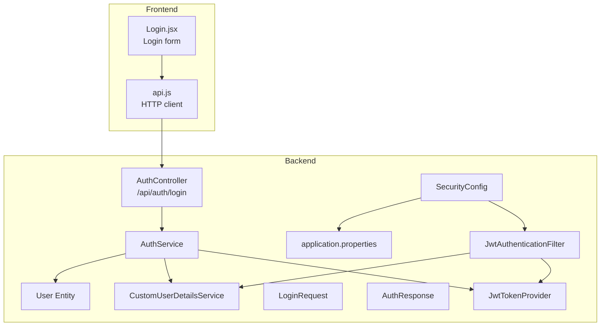
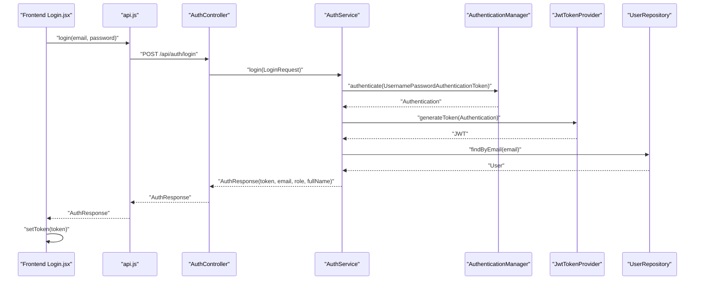
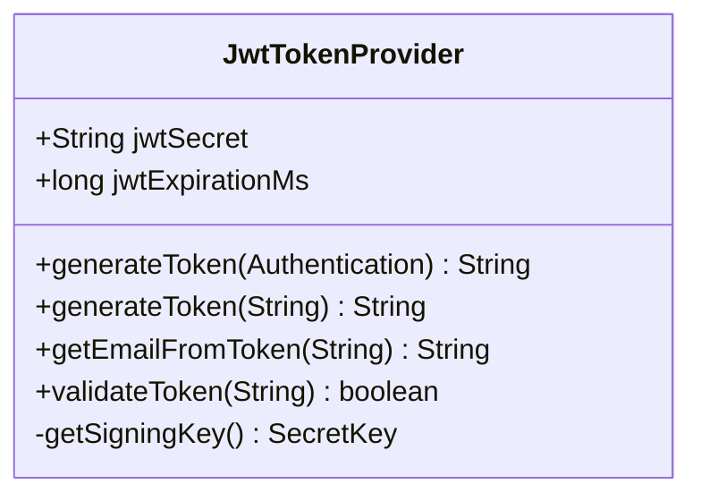
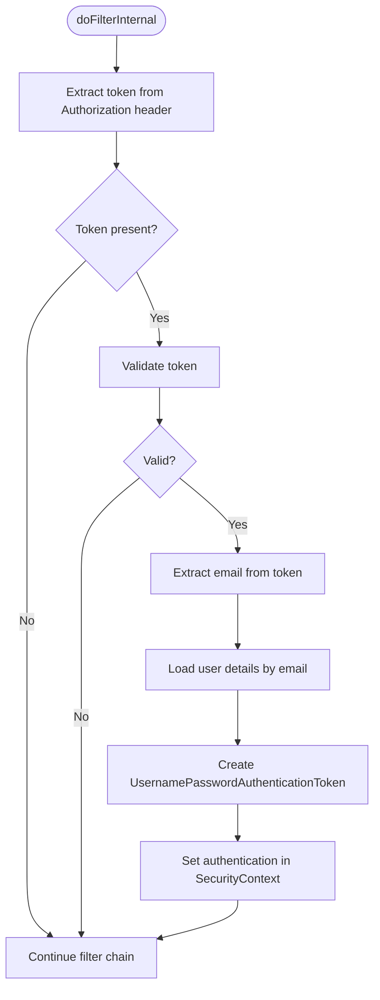
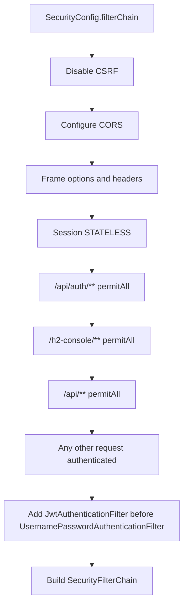
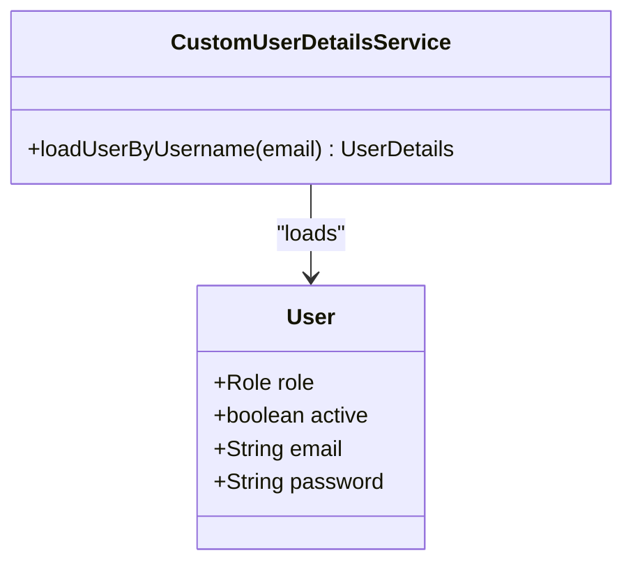
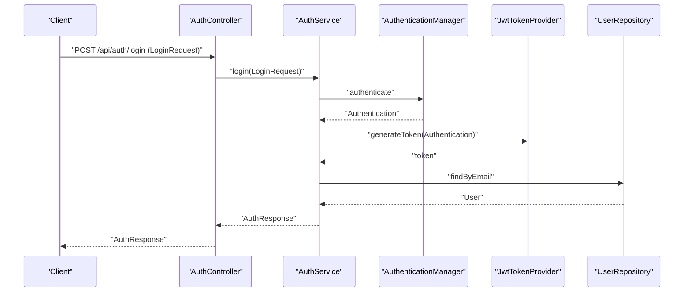
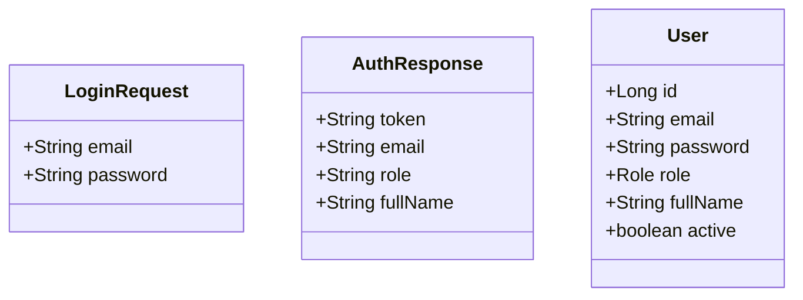
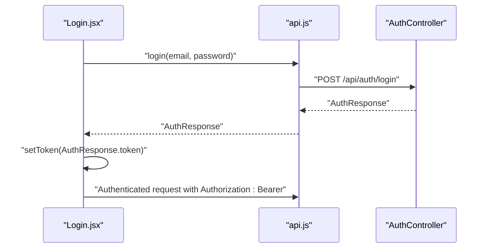
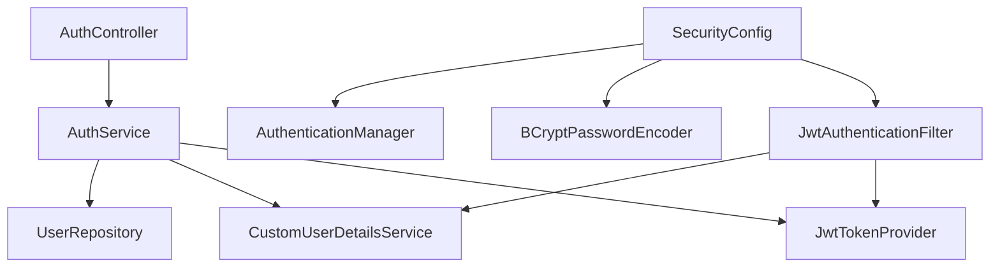

# Authentication System

<cite>
**Referenced Files in This Document**
- [AuthController.java](file://Mini_Project/backend/src/main/java/com/clinicalnids/backend/controller/AuthController.java)
- [AuthService.java](file://Mini_Project/backend/src/main/java/com/clinicalnids/backend/service/AuthService.java)
- [JwtTokenProvider.java](file://Mini_Project/backend/src/main/java/com/clinicalnids/backend/security/JwtTokenProvider.java)
- [JwtAuthenticationFilter.java](file://Mini_Project/backend/src/main/java/com/clinicalnids/backend/security/JwtAuthenticationFilter.java)
- [SecurityConfig.java](file://Mini_Project/backend/src/main/java/com/clinicalnids/backend/config/SecurityConfig.java)
- [CustomUserDetailsService.java](file://Mini_Project/backend/src/main/java/com/clinicalnids/backend/service/CustomUserDetailsService.java)
- [LoginRequest.java](file://Mini_Project/backend/src/main/java/com/clinicalnids/backend/dto/LoginRequest.java)
- [AuthResponse.java](file://Mini_Project/backend/src/main/java/com/clinicalnids/backend/dto/AuthResponse.java)
- [User.java](file://Mini_Project/backend/src/main/java/com/clinicalnids/backend/entity/User.java)
- [application.properties](file://Mini_Project/backend/src/main/resources/application.properties)
- [api.js](file://Mini_Project/clinical-nids-dashboard/src/data/api.js)
- [Login.jsx](file://Mini_Project/clinical-nids-dashboard/src/pages/Login.jsx)
</cite>

## Table of Contents
1. [Introduction](#introduction)
2. [Project Structure](#project-structure)
3. [Core Components](#core-components)
4. [Architecture Overview](#architecture-overview)
5. [Detailed Component Analysis](#detailed-component-analysis)
6. [Dependency Analysis](#dependency-analysis)
7. [Performance Considerations](#performance-considerations)
8. [Troubleshooting Guide](#troubleshooting-guide)
9. [Conclusion](#conclusion)
10. [Appendices](#appendices)

## Introduction
This document provides comprehensive authentication API documentation for the JWT-based user authentication system. It covers the /api/auth/login endpoint, including request/response schemas, validation rules, and the complete authentication flow. It also explains JWT token generation, validation, and refresh mechanisms, the security filter implementation, CORS configuration, password encoding with BCrypt, authentication middleware integration, role-based access control, and session management. Practical examples of login requests, token handling, and secure API consumption patterns are included.

## Project Structure
The authentication system spans the backend Spring Boot application and the React frontend. The backend exposes the authentication endpoint and manages security filters, while the frontend handles login UI and token storage.

**Diagram sources**
- [AuthController.java:10-24](file://Mini_Project/backend/src/main/java/com/clinicalnids/backend/controller/AuthController.java#L10-L24)
- [AuthService.java:15-62](file://Mini_Project/backend/src/main/java/com/clinicalnids/backend/service/AuthService.java#L15-L62)
- [JwtTokenProvider.java:14-71](file://Mini_Project/backend/src/main/java/com/clinicalnids/backend/security/JwtTokenProvider.java#L14-L71)
- [JwtAuthenticationFilter.java:18-56](file://Mini_Project/backend/src/main/java/com/clinicalnids/backend/security/JwtAuthenticationFilter.java#L18-L56)
- [SecurityConfig.java:23-73](file://Mini_Project/backend/src/main/java/com/clinicalnids/backend/config/SecurityConfig.java#L23-L73)
- [CustomUserDetailsService.java:13-36](file://Mini_Project/backend/src/main/java/com/clinicalnids/backend/service/CustomUserDetailsService.java#L13-L36)
- [LoginRequest.java:7-16](file://Mini_Project/backend/src/main/java/com/clinicalnids/backend/dto/LoginRequest.java#L7-L16)
- [AuthResponse.java:5-19](file://Mini_Project/backend/src/main/java/com/clinicalnids/backend/dto/AuthResponse.java#L5-L19)
- [User.java:7-45](file://Mini_Project/backend/src/main/java/com/clinicalnids/backend/entity/User.java#L7-L45)
- [application.properties:28-46](file://Mini_Project/backend/src/main/resources/application.properties#L28-L46)
- [api.js:11-41](file://Mini_Project/clinical-nids-dashboard/src/data/api.js#L11-L41)
- [Login.jsx:15-31](file://Mini_Project/clinical-nids-dashboard/src/pages/Login.jsx#L15-L31)

**Section sources**
- [AuthController.java:10-24](file://Mini_Project/backend/src/main/java/com/clinicalnids/backend/controller/AuthController.java#L10-L24)
- [SecurityConfig.java:33-73](file://Mini_Project/backend/src/main/java/com/clinicalnids/backend/config/SecurityConfig.java#L33-L73)
- [application.properties:28-46](file://Mini_Project/backend/src/main/resources/application.properties#L28-L46)

## Core Components
- AuthController: Exposes the /api/auth/login endpoint and delegates authentication to AuthService.
- AuthService: Authenticates users via AuthenticationManager, generates JWT tokens via JwtTokenProvider, and constructs AuthResponse.
- JwtTokenProvider: Generates and validates JWT tokens using HMAC signing with a secret key derived from application configuration.
- JwtAuthenticationFilter: Extracts Bearer tokens from Authorization headers, validates them, loads user details, and establishes an authenticated SecurityContext.
- SecurityConfig: Configures stateless sessions, CORS, CSRF disablement, and registers the JWT filter before the default authentication filter.
- CustomUserDetailsService: Loads user details from the database and maps roles to Spring Security authorities.
- DTOs and Entities: LoginRequest defines validation constraints; AuthResponse carries token and user metadata; User entity stores credentials and roles.
- Frontend API: Provides login function, token storage helpers, and authenticated request headers.

**Section sources**
- [AuthController.java:14-23](file://Mini_Project/backend/src/main/java/com/clinicalnids/backend/controller/AuthController.java#L14-L23)
- [AuthService.java:18-61](file://Mini_Project/backend/src/main/java/com/clinicalnids/backend/service/AuthService.java#L18-L61)
- [JwtTokenProvider.java:23-70](file://Mini_Project/backend/src/main/java/com/clinicalnids/backend/security/JwtTokenProvider.java#L23-L70)
- [JwtAuthenticationFilter.java:29-46](file://Mini_Project/backend/src/main/java/com/clinicalnids/backend/security/JwtAuthenticationFilter.java#L29-L46)
- [SecurityConfig.java:33-73](file://Mini_Project/backend/src/main/java/com/clinicalnids/backend/config/SecurityConfig.java#L33-L73)
- [CustomUserDetailsService.java:22-34](file://Mini_Project/backend/src/main/java/com/clinicalnids/backend/service/CustomUserDetailsService.java#L22-L34)
- [LoginRequest.java:8-15](file://Mini_Project/backend/src/main/java/com/clinicalnids/backend/dto/LoginRequest.java#L8-L15)
- [AuthResponse.java:6-18](file://Mini_Project/backend/src/main/java/com/clinicalnids/backend/dto/AuthResponse.java#L6-L18)
- [User.java:13-44](file://Mini_Project/backend/src/main/java/com/clinicalnids/backend/entity/User.java#L13-L44)
- [api.js:11-41](file://Mini_Project/clinical-nids-dashboard/src/data/api.js#L11-L41)

## Architecture Overview
The authentication flow integrates the frontend login submission with backend validation and token issuance, followed by runtime token validation for protected endpoints.

**Diagram sources**
- [Login.jsx:15-31](file://Mini_Project/clinical-nids-dashboard/src/pages/Login.jsx#L15-L31)
- [api.js:11-19](file://Mini_Project/clinical-nids-dashboard/src/data/api.js#L11-L19)
- [AuthController.java:20-23](file://Mini_Project/backend/src/main/java/com/clinicalnids/backend/controller/AuthController.java#L20-L23)
- [AuthService.java:53-61](file://Mini_Project/backend/src/main/java/com/clinicalnids/backend/service/AuthService.java#L53-L61)
- [JwtTokenProvider.java:28-39](file://Mini_Project/backend/src/main/java/com/clinicalnids/backend/security/JwtTokenProvider.java#L28-L39)
- [User.java:19-32](file://Mini_Project/backend/src/main/java/com/clinicalnids/backend/entity/User.java#L19-L32)

## Detailed Component Analysis

### JWT Token Provider
Implements token generation and validation using HMAC signing with a configurable secret and expiration.

**Diagram sources**
- [JwtTokenProvider.java:14-71](file://Mini_Project/backend/src/main/java/com/clinicalnids/backend/security/JwtTokenProvider.java#L14-L71)

**Section sources**
- [JwtTokenProvider.java:17-26](file://Mini_Project/backend/src/main/java/com/clinicalnids/backend/security/JwtTokenProvider.java#L17-L26)
- [JwtTokenProvider.java:28-51](file://Mini_Project/backend/src/main/java/com/clinicalnids/backend/security/JwtTokenProvider.java#L28-L51)
- [JwtTokenProvider.java:53-70](file://Mini_Project/backend/src/main/java/com/clinicalnids/backend/security/JwtTokenProvider.java#L53-L70)

### Authentication Filter
Extracts Bearer tokens, validates them, loads user details, and sets the SecurityContext.

**Diagram sources**
- [JwtAuthenticationFilter.java:29-46](file://Mini_Project/backend/src/main/java/com/clinicalnids/backend/security/JwtAuthenticationFilter.java#L29-L46)

**Section sources**
- [JwtAuthenticationFilter.java:32-43](file://Mini_Project/backend/src/main/java/com/clinicalnids/backend/security/JwtAuthenticationFilter.java#L32-L43)

### Security Configuration
Configures stateless sessions, CORS, CSRF disablement, and registers the JWT filter.

**Diagram sources**
- [SecurityConfig.java:34-49](file://Mini_Project/backend/src/main/java/com/clinicalnids/backend/config/SecurityConfig.java#L34-L49)

**Section sources**
- [SecurityConfig.java:33-73](file://Mini_Project/backend/src/main/java/com/clinicalnids/backend/config/SecurityConfig.java#L33-L73)

### User Details Service and Roles
Maps database roles to Spring Security authorities.

**Diagram sources**
- [CustomUserDetailsService.java:14-36](file://Mini_Project/backend/src/main/java/com/clinicalnids/backend/service/CustomUserDetailsService.java#L14-L36)
- [User.java:25-32](file://Mini_Project/backend/src/main/java/com/clinicalnids/backend/entity/User.java#L25-L32)

**Section sources**
- [CustomUserDetailsService.java:22-34](file://Mini_Project/backend/src/main/java/com/clinicalnids/backend/service/CustomUserDetailsService.java#L22-L34)
- [User.java:41-43](file://Mini_Project/backend/src/main/java/com/clinicalnids/backend/entity/User.java#L41-L43)

### Authentication Controller and Service
Handles login request validation, authentication, and response construction.

**Diagram sources**
- [AuthController.java:20-23](file://Mini_Project/backend/src/main/java/com/clinicalnids/backend/controller/AuthController.java#L20-L23)
- [AuthService.java:53-61](file://Mini_Project/backend/src/main/java/com/clinicalnids/backend/service/AuthService.java#L53-L61)
- [JwtTokenProvider.java:28-39](file://Mini_Project/backend/src/main/java/com/clinicalnids/backend/security/JwtTokenProvider.java#L28-L39)

**Section sources**
- [AuthController.java:20-23](file://Mini_Project/backend/src/main/java/com/clinicalnids/backend/controller/AuthController.java#L20-L23)
- [AuthService.java:53-61](file://Mini_Project/backend/src/main/java/com/clinicalnids/backend/service/AuthService.java#L53-L61)

### DTOs and Entities
Defines request/response contracts and user entity with roles.

**Diagram sources**
- [LoginRequest.java:8-15](file://Mini_Project/backend/src/main/java/com/clinicalnids/backend/dto/LoginRequest.java#L8-L15)
- [AuthResponse.java:6-18](file://Mini_Project/backend/src/main/java/com/clinicalnids/backend/dto/AuthResponse.java#L6-L18)
- [User.java:15-43](file://Mini_Project/backend/src/main/java/com/clinicalnids/backend/entity/User.java#L15-L43)

**Section sources**
- [LoginRequest.java:8-15](file://Mini_Project/backend/src/main/java/com/clinicalnids/backend/dto/LoginRequest.java#L8-L15)
- [AuthResponse.java:6-18](file://Mini_Project/backend/src/main/java/com/clinicalnids/backend/dto/AuthResponse.java#L6-L18)
- [User.java:15-43](file://Mini_Project/backend/src/main/java/com/clinicalnids/backend/entity/User.java#L15-L43)

### Frontend Integration
Demonstrates login submission, token storage, and authenticated requests.

**Diagram sources**
- [Login.jsx:15-31](file://Mini_Project/clinical-nids-dashboard/src/pages/Login.jsx#L15-L31)
- [api.js:11-19](file://Mini_Project/clinical-nids-dashboard/src/data/api.js#L11-L19)
- [api.js:35-41](file://Mini_Project/clinical-nids-dashboard/src/data/api.js#L35-L41)

**Section sources**
- [Login.jsx:15-31](file://Mini_Project/clinical-nids-dashboard/src/pages/Login.jsx#L15-L31)
- [api.js:11-19](file://Mini_Project/clinical-nids-dashboard/src/data/api.js#L11-L19)
- [api.js:35-41](file://Mini_Project/clinical-nids-dashboard/src/data/api.js#L35-L41)

## Dependency Analysis
The authentication system exhibits low coupling and clear separation of concerns. Controllers depend on services, services depend on repositories and JWT providers, and filters depend on JWT providers and user details services. Security configuration wires filters and encoders.

**Diagram sources**
- [AuthController.java:14-18](file://Mini_Project/backend/src/main/java/com/clinicalnids/backend/controller/AuthController.java#L14-L18)
- [AuthService.java:18-29](file://Mini_Project/backend/src/main/java/com/clinicalnids/backend/service/AuthService.java#L18-L29)
- [JwtTokenProvider.java:14-26](file://Mini_Project/backend/src/main/java/com/clinicalnids/backend/security/JwtTokenProvider.java#L14-L26)
- [JwtAuthenticationFilter.java:21-27](file://Mini_Project/backend/src/main/java/com/clinicalnids/backend/security/JwtAuthenticationFilter.java#L21-L27)
- [SecurityConfig.java:63-71](file://Mini_Project/backend/src/main/java/com/clinicalnids/backend/config/SecurityConfig.java#L63-L71)

**Section sources**
- [AuthService.java:18-29](file://Mini_Project/backend/src/main/java/com/clinicalnids/backend/service/AuthService.java#L18-L29)
- [JwtAuthenticationFilter.java:21-27](file://Mini_Project/backend/src/main/java/com/clinicalnids/backend/security/JwtAuthenticationFilter.java#L21-L27)
- [SecurityConfig.java:63-71](file://Mini_Project/backend/src/main/java/com/clinicalnids/backend/config/SecurityConfig.java#L63-L71)

## Performance Considerations
- Token Validation Overhead: Each request performs a single JWT signature verification and a user lookup. Keep the signing key and user cache warm to minimize latency.
- Session Management: Stateless sessions eliminate server-side session storage, reducing memory footprint but requiring clients to manage tokens securely.
- CORS Configuration: Allowlist origins and methods to reduce preflight overhead and improve performance for cross-origin requests.
- Password Encoding: BCrypt cost factor impacts login latency; tune for acceptable security vs. performance balance.

[No sources needed since this section provides general guidance]

## Troubleshooting Guide
Common issues and resolutions:
- Invalid Credentials: Authentication failure occurs if credentials are incorrect or user is inactive. Verify user existence and active status.
- Token Validation Failures: Ensure the Authorization header uses the Bearer scheme and the token is unexpired and correctly signed.
- CORS Errors: Confirm the origin is whitelisted and credentials are allowed in the CORS configuration.
- Missing Roles: Ensure user roles are persisted correctly and mapped to authorities in the user details service.
- Token Storage: Frontend must persist tokens securely and attach Authorization headers to authenticated requests.

**Section sources**
- [CustomUserDetailsService.java:22-34](file://Mini_Project/backend/src/main/java/com/clinicalnids/backend/service/CustomUserDetailsService.java#L22-L34)
- [JwtAuthenticationFilter.java:48-54](file://Mini_Project/backend/src/main/java/com/clinicalnids/backend/security/JwtAuthenticationFilter.java#L48-L54)
- [SecurityConfig.java:52-61](file://Mini_Project/backend/src/main/java/com/clinicalnids/backend/config/SecurityConfig.java#L52-L61)
- [api.js:21-31](file://Mini_Project/clinical-nids-dashboard/src/data/api.js#L21-L31)

## Conclusion
The authentication system provides a robust, stateless JWT-based solution with clear separation of concerns, secure password handling via BCrypt, and seamless integration with Spring Security filters. The frontend demonstrates secure token handling and authenticated request patterns. The configuration supports development and can be adapted for production environments.

[No sources needed since this section summarizes without analyzing specific files]

## Appendices

### API Definition: /api/auth/login
- Method: POST
- Path: /api/auth/login
- Content-Type: application/json
- Request Body Schema (LoginRequest):
  - email: string (required, email format)
  - password: string (required)
- Response Body Schema (AuthResponse):
  - token: string
  - email: string
  - role: string (ADMIN or SECURITY_ANALYST)
  - fullName: string

Example Request:
{
  "email": "admin@hospital.org",
  "password": "admin123"
}

Example Response:
{
  "token": "eyJhb...omitted...",
  "email": "admin@hospital.org",
  "role": "ADMIN",
  "fullName": "Dr. Sarah Chen"
}

**Section sources**
- [AuthController.java:20-23](file://Mini_Project/backend/src/main/java/com/clinicalnids/backend/controller/AuthController.java#L20-L23)
- [LoginRequest.java:8-15](file://Mini_Project/backend/src/main/java/com/clinicalnids/backend/dto/LoginRequest.java#L8-L15)
- [AuthResponse.java:6-18](file://Mini_Project/backend/src/main/java/com/clinicalnids/backend/dto/AuthResponse.java#L6-L18)

### JWT Configuration Properties
- app.jwt.secret: Secret key for HMAC signing
- app.jwt.expiration-ms: Token expiration in milliseconds
- app.cors.allowed-origins: Allowed frontend origins for CORS

**Section sources**
- [application.properties:28-36](file://Mini_Project/backend/src/main/resources/application.properties#L28-L36)

### Frontend Token Handling Patterns
- Store token in localStorage after successful login
- Attach Authorization: Bearer header to authenticated requests
- Clear token on logout

**Section sources**
- [api.js:21-31](file://Mini_Project/clinical-nids-dashboard/src/data/api.js#L21-L31)
- [api.js:35-41](file://Mini_Project/clinical-nids-dashboard/src/data/api.js#L35-L41)
- [Login.jsx:15-31](file://Mini_Project/clinical-nids-dashboard/src/pages/Login.jsx#L15-L31)