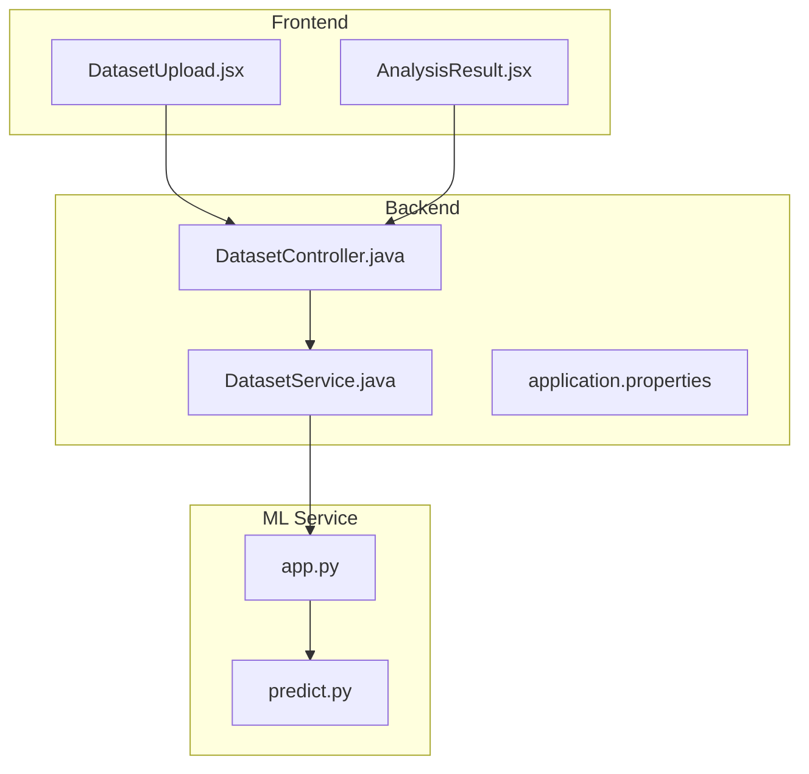
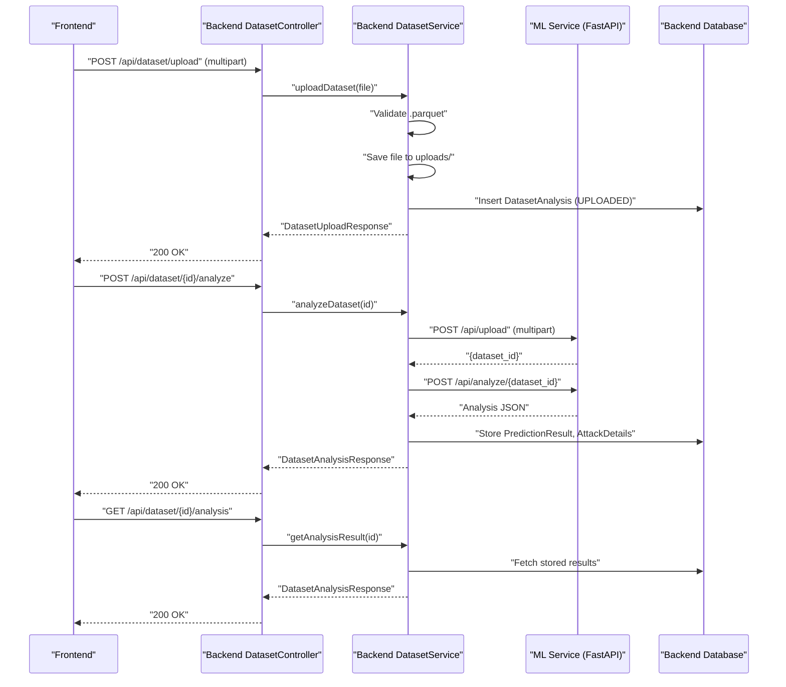
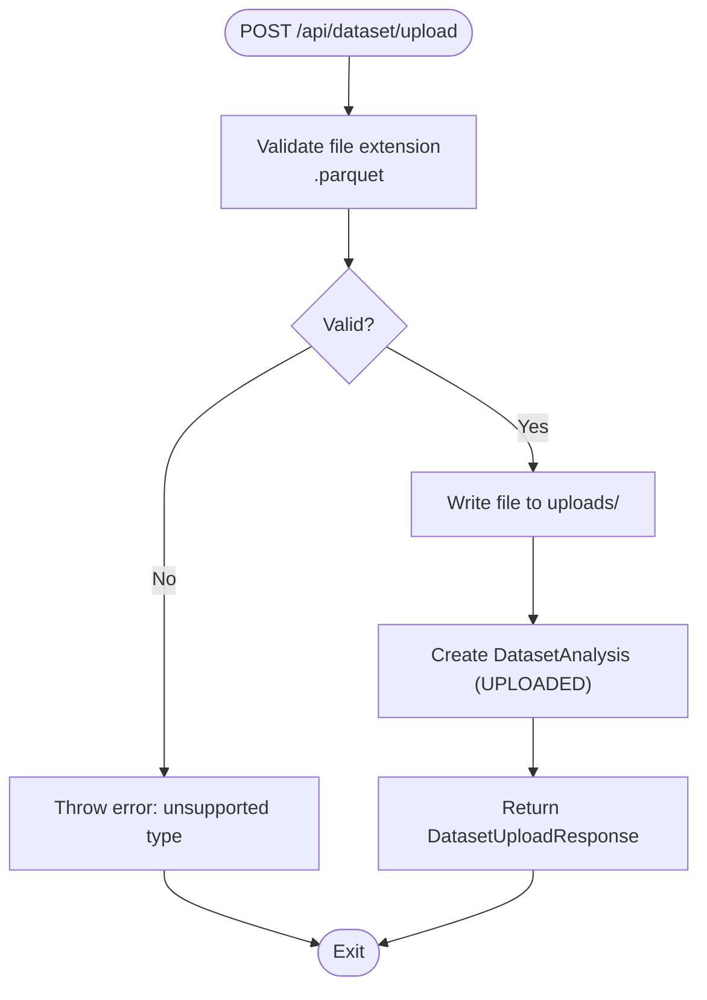
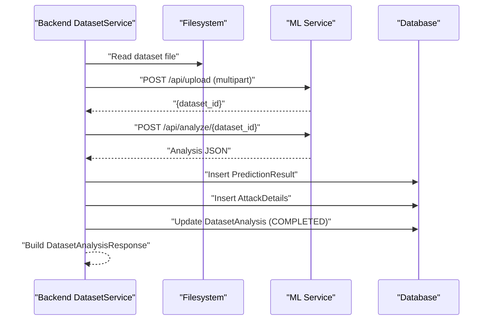
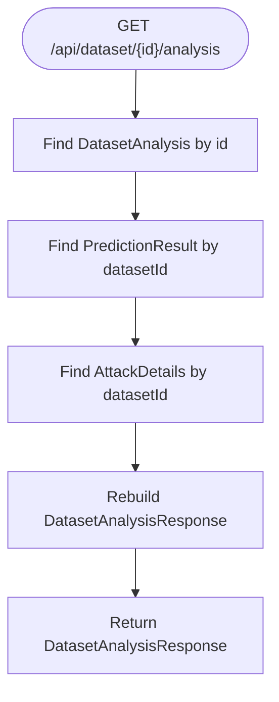
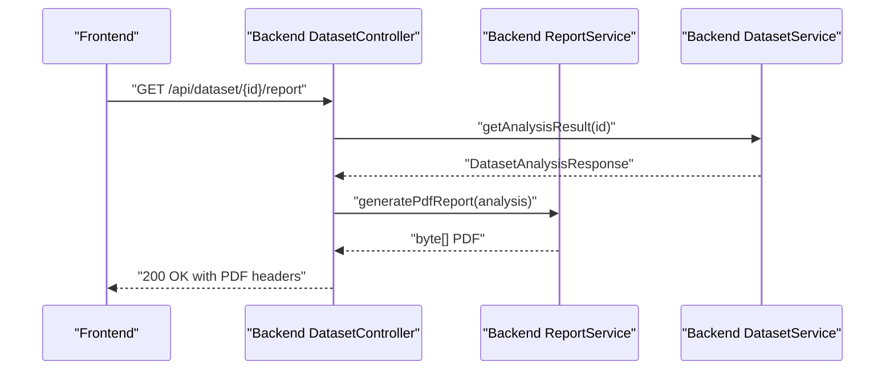
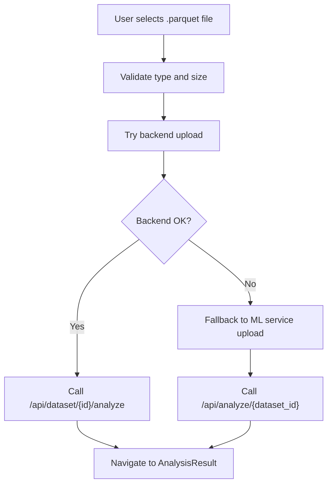
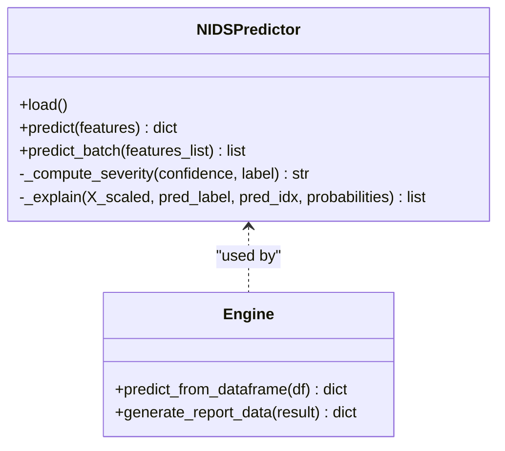
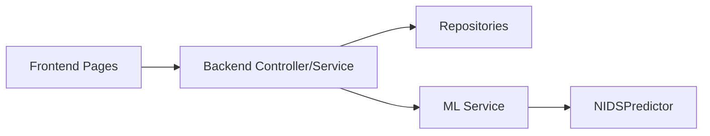

# Dataset Operations

<cite>
**Referenced Files in This Document**
- [DatasetController.java](file://Mini_Project/backend/src/main/java/com/clinicalnids/backend/controller/DatasetController.java)
- [DatasetService.java](file://Mini_Project/backend/src/main/java/com/clinicalnids/backend/service/DatasetService.java)
- [DatasetUploadResponse.java](file://Mini_Project/backend/src/main/java/com/clinicalnids/backend/dto/DatasetUploadResponse.java)
- [DatasetAnalysisResponse.java](file://Mini_Project/backend/src/main/java/com/clinicalnids/backend/dto/DatasetAnalysisResponse.java)
- [DatasetAnalysis.java](file://Mini_Project/backend/src/main/java/com/clinicalnids/backend/entity/DatasetAnalysis.java)
- [application.properties](file://Mini_Project/backend/src/main/resources/application.properties)
- [DatasetUpload.jsx](file://Mini_Project/clinical-nids-dashboard/src/pages/DatasetUpload.jsx)
- [AnalysisResult.jsx](file://Mini_Project/clinical-nids-dashboard/src/pages/AnalysisResult.jsx)
- [app.py](file://Mini_Project/ml-service/app.py)
- [predict.py](file://Mini_Project/ml-service/predict.py)
</cite>

## Table of Contents
1. [Introduction](#introduction)
2. [Project Structure](#project-structure)
3. [Core Components](#core-components)
4. [Architecture Overview](#architecture-overview)
5. [Detailed Component Analysis](#detailed-component-analysis)
6. [Dependency Analysis](#dependency-analysis)
7. [Performance Considerations](#performance-considerations)
8. [Troubleshooting Guide](#troubleshooting-guide)
9. [Conclusion](#conclusion)

## Introduction
This document provides comprehensive API documentation for dataset operations, focusing on batch analysis workflows and data processing pipelines. It covers:
- Dataset upload endpoint
- Batch prediction processing
- Analysis result retrieval
- Validation and preprocessing requirements
- Integration with the ML service for batch inference
- File upload handling, progress tracking, result formatting, and report generation
- Workflow from upload through completion, error handling for invalid datasets, and result export options

## Project Structure
The system comprises three primary parts:
- Backend REST API (Spring Boot) exposing dataset operations and orchestrating ML service integration
- Frontend React application for upload, progress tracking, and result visualization
- ML microservice (FastAPI) performing batch inference and SHAP explanations

**Diagram sources**
- [DatasetController.java:19-95](file://Mini_Project/backend/src/main/java/com/clinicalnids/backend/controller/DatasetController.java#L19-L95)
- [DatasetService.java:30-56](file://Mini_Project/backend/src/main/java/com/clinicalnids/backend/service/DatasetService.java#L30-L56)
- [application.properties:32-46](file://Mini_Project/backend/src/main/resources/application.properties#L32-L46)
- [app.py:253-393](file://Mini_Project/ml-service/app.py#L253-L393)
- [predict.py:17-179](file://Mini_Project/ml-service/predict.py#L17-L179)

**Section sources**
- [DatasetController.java:19-95](file://Mini_Project/backend/src/main/java/com/clinicalnids/backend/controller/DatasetController.java#L19-L95)
- [DatasetService.java:30-56](file://Mini_Project/backend/src/main/java/com/clinicalnids/backend/service/DatasetService.java#L30-L56)
- [application.properties:32-46](file://Mini_Project/backend/src/main/resources/application.properties#L32-L46)
- [app.py:253-393](file://Mini_Project/ml-service/app.py#L253-L393)

## Core Components
- DatasetController: Exposes endpoints for upload, analysis, result retrieval, and PDF report generation
- DatasetService: Handles file validation, persistence, orchestration of ML service calls, and result storage
- DTOs: DatasetUploadResponse and DatasetAnalysisResponse define request/response structures
- Entity: DatasetAnalysis persists dataset metadata and status
- Frontend Pages: DatasetUpload.jsx and AnalysisResult.jsx manage UI, progress, and visualization
- ML Service: FastAPI app with upload and analyze endpoints; predict module performs inference and SHAP explanations

**Section sources**
- [DatasetController.java:31-93](file://Mini_Project/backend/src/main/java/com/clinicalnids/backend/controller/DatasetController.java#L31-L93)
- [DatasetService.java:62-155](file://Mini_Project/backend/src/main/java/com/clinicalnids/backend/service/DatasetService.java#L62-L155)
- [DatasetUploadResponse.java:8-14](file://Mini_Project/backend/src/main/java/com/clinicalnids/backend/dto/DatasetUploadResponse.java#L8-L14)
- [DatasetAnalysisResponse.java:10-68](file://Mini_Project/backend/src/main/java/com/clinicalnids/backend/dto/DatasetAnalysisResponse.java#L10-L68)
- [DatasetAnalysis.java:13-56](file://Mini_Project/backend/src/main/java/com/clinicalnids/backend/entity/DatasetAnalysis.java#L13-L56)
- [DatasetUpload.jsx:24-135](file://Mini_Project/clinical-nids-dashboard/src/pages/DatasetUpload.jsx#L24-L135)
- [AnalysisResult.jsx:41-70](file://Mini_Project/clinical-nids-dashboard/src/pages/AnalysisResult.jsx#L41-L70)
- [app.py:253-393](file://Mini_Project/ml-service/app.py#L253-L393)
- [predict.py:17-179](file://Mini_Project/ml-service/predict.py#L17-L179)

## Architecture Overview
The dataset workflow integrates frontend, backend, and ML service:
- Frontend uploads a .parquet file and triggers analysis
- Backend validates and stores the file, then calls ML service
- ML service performs batch inference and SHAP explanations
- Backend persists results and exposes retrieval endpoints
- Frontend renders charts, tables, and allows PDF report download

**Diagram sources**
- [DatasetController.java:34-57](file://Mini_Project/backend/src/main/java/com/clinicalnids/backend/controller/DatasetController.java#L34-L57)
- [DatasetService.java:62-155](file://Mini_Project/backend/src/main/java/com/clinicalnids/backend/service/DatasetService.java#L62-L155)
- [app.py:253-347](file://Mini_Project/ml-service/app.py#L253-L347)

## Detailed Component Analysis

### Dataset Upload Endpoint
- Endpoint: POST /api/dataset/upload
- Purpose: Accepts a .parquet file, validates type, saves to uploads directory, and records metadata
- Validation: Rejects non-.parquet files
- Persistence: Creates DatasetAnalysis record with status UPLOADED
- Response: DatasetUploadResponse with datasetId, filename, fileSize, status, and message

**Diagram sources**
- [DatasetController.java:34-39](file://Mini_Project/backend/src/main/java/com/clinicalnids/backend/controller/DatasetController.java#L34-L39)
- [DatasetService.java:62-97](file://Mini_Project/backend/src/main/java/com/clinicalnids/backend/service/DatasetService.java#L62-L97)

**Section sources**
- [DatasetController.java:34-39](file://Mini_Project/backend/src/main/java/com/clinicalnids/backend/controller/DatasetController.java#L34-L39)
- [DatasetService.java:62-97](file://Mini_Project/backend/src/main/java/com/clinicalnids/backend/service/DatasetService.java#L62-L97)
- [DatasetUploadResponse.java:8-14](file://Mini_Project/backend/src/main/java/com/clinicalnids/backend/dto/DatasetUploadResponse.java#L8-L14)

### Batch Prediction Processing
- Endpoint: POST /api/dataset/{id}/analyze
- Workflow:
  - Mark dataset status as ANALYZING
  - Forward file to ML service /api/upload to obtain dataset_id
  - Invoke ML service /api/analyze/{dataset_id} for batch inference and SHAP explanations
  - Parse and persist results (PredictionResult, AttackDetails)
  - Set status to COMPLETED and return DatasetAnalysisResponse

**Diagram sources**
- [DatasetService.java:102-155](file://Mini_Project/backend/src/main/java/com/clinicalnids/backend/service/DatasetService.java#L102-L155)
- [app.py:295-347](file://Mini_Project/ml-service/app.py#L295-L347)

**Section sources**
- [DatasetService.java:102-155](file://Mini_Project/backend/src/main/java/com/clinicalnids/backend/service/DatasetService.java#L102-L155)
- [app.py:295-347](file://Mini_Project/ml-service/app.py#L295-L347)

### Analysis Result Retrieval
- Endpoint: GET /api/dataset/{id}/analysis
- Behavior: Loads persisted results from PredictionResult and AttackDetails repositories
- Response: DatasetAnalysisResponse populated from stored data

**Diagram sources**
- [DatasetController.java:53-57](file://Mini_Project/backend/src/main/java/com/clinicalnids/backend/controller/DatasetController.java#L53-L57)
- [DatasetService.java:283-380](file://Mini_Project/backend/src/main/java/com/clinicalnids/backend/service/DatasetService.java#L283-L380)

**Section sources**
- [DatasetController.java:53-57](file://Mini_Project/backend/src/main/java/com/clinicalnids/backend/controller/DatasetController.java#L53-L57)
- [DatasetService.java:283-380](file://Mini_Project/backend/src/main/java/com/clinicalnids/backend/service/DatasetService.java#L283-L380)

### PDF Report Generation
- Endpoint: GET /api/dataset/{id}/report
- Behavior: Retrieves analysis result, delegates to ReportService to generate PDF, sets appropriate headers, and returns binary content
- Frontend: AnalysisResult.jsx triggers download and handles errors

**Diagram sources**
- [DatasetController.java:62-74](file://Mini_Project/backend/src/main/java/com/clinicalnids/backend/controller/DatasetController.java#L62-L74)
- [AnalysisResult.jsx:54-69](file://Mini_Project/clinical-nids-dashboard/src/pages/AnalysisResult.jsx#L54-L69)

**Section sources**
- [DatasetController.java:62-74](file://Mini_Project/backend/src/main/java/com/clinicalnids/backend/controller/DatasetController.java#L62-L74)
- [AnalysisResult.jsx:54-69](file://Mini_Project/clinical-nids-dashboard/src/pages/AnalysisResult.jsx#L54-L69)

### Frontend Upload and Progress Tracking
- DatasetUpload.jsx:
  - Validates .parquet and size (< 500MB)
  - Attempts backend upload first; falls back to ML service directly if backend unavailable
  - Updates progress states and navigates to AnalysisResult upon completion
- AnalysisResult.jsx:
  - Fetches analysis results from backend or ML service
  - Renders charts, attack details, and prediction table
  - Provides PDF report download

**Diagram sources**
- [DatasetUpload.jsx:24-135](file://Mini_Project/clinical-nids-dashboard/src/pages/DatasetUpload.jsx#L24-L135)
- [AnalysisResult.jsx:41-70](file://Mini_Project/clinical-nids-dashboard/src/pages/AnalysisResult.jsx#L41-L70)

**Section sources**
- [DatasetUpload.jsx:24-135](file://Mini_Project/clinical-nids-dashboard/src/pages/DatasetUpload.jsx#L24-L135)
- [AnalysisResult.jsx:41-70](file://Mini_Project/clinical-nids-dashboard/src/pages/AnalysisResult.jsx#L41-L70)

### ML Service Integration Details
- ML app.py:
  - /api/upload: Saves .parquet, returns dataset_id
  - /api/analyze/{dataset_id}: Reads parquet, runs prediction engine, attaches filename and dataset_id, stores result, returns comprehensive JSON
  - /api/analysis/{dataset_id}: Returns stored analysis result
  - /api/report/{dataset_id}: Generates report data for PDF
- predict.py:
  - Loads model artifacts and initializes SHAP explainer
  - Performs scaling, prediction, severity computation, and SHAP feature importance extraction

**Diagram sources**
- [predict.py:17-179](file://Mini_Project/ml-service/predict.py#L17-L179)
- [app.py:295-393](file://Mini_Project/ml-service/app.py#L295-L393)

**Section sources**
- [app.py:253-393](file://Mini_Project/ml-service/app.py#L253-L393)
- [predict.py:17-179](file://Mini_Project/ml-service/predict.py#L17-L179)

## Dependency Analysis
- Backend depends on:
  - DatasetService for orchestration
  - DatasetAnalysisRepository, PredictionResultRepository, AttackDetailRepository for persistence
  - WebClient configured to ML service base URL
- ML service depends on:
  - NIDSPredictor for inference and explanations
  - Feature mapping and model artifacts in model/ directory
- Frontend depends on:
  - DatasetUpload.jsx and AnalysisResult.jsx for UI and API calls

**Diagram sources**
- [DatasetController.java:23-29](file://Mini_Project/backend/src/main/java/com/clinicalnids/backend/controller/DatasetController.java#L23-L29)
- [DatasetService.java:35-56](file://Mini_Project/backend/src/main/java/com/clinicalnids/backend/service/DatasetService.java#L35-L56)
- [app.py:253-393](file://Mini_Project/ml-service/app.py#L253-L393)
- [predict.py:17-179](file://Mini_Project/ml-service/predict.py#L17-L179)

**Section sources**
- [DatasetController.java:23-29](file://Mini_Project/backend/src/main/java/com/clinicalnids/backend/controller/DatasetController.java#L23-L29)
- [DatasetService.java:35-56](file://Mini_Project/backend/src/main/java/com/clinicalnids/backend/service/DatasetService.java#L35-L56)
- [app.py:253-393](file://Mini_Project/ml-service/app.py#L253-L393)
- [predict.py:17-179](file://Mini_Project/ml-service/predict.py#L17-L179)

## Performance Considerations
- Large file handling: Backend enforces max file size via Spring configuration; ML service also limits uploads
- Timeout tuning: Backend sets extended timeouts for ML analysis calls to accommodate large datasets
- Caching and persistence: Backend stores parsed results to avoid recomputation; ML service maintains in-memory dataset store during analysis
- Scalability: Consider asynchronous processing queues for very large datasets and concurrent analysis requests

[No sources needed since this section provides general guidance]

## Troubleshooting Guide
Common issues and resolutions:
- Unsupported file type: Ensure .parquet format; backend and ML service reject other extensions
- File size exceeded: Limit uploads to under 500MB as enforced by frontend and backend configuration
- Backend unavailability: Frontend attempts fallback to ML service directly
- Empty ML responses: Backend marks dataset as FAILED and captures error messages
- Report generation failures: Frontend displays error messages if backend is unreachable

**Section sources**
- [DatasetService.java:148-154](file://Mini_Project/backend/src/main/java/com/clinicalnids/backend/service/DatasetService.java#L148-L154)
- [DatasetUpload.jsx:24-32](file://Mini_Project/clinical-nids-dashboard/src/pages/DatasetUpload.jsx#L24-L32)
- [AnalysisResult.jsx:65-69](file://Mini_Project/clinical-nids-dashboard/src/pages/AnalysisResult.jsx#L65-L69)
- [application.properties:43-46](file://Mini_Project/backend/src/main/resources/application.properties#L43-L46)

## Conclusion
The dataset operations pipeline integrates a React frontend, a Spring Boot backend, and a FastAPI ML service to deliver robust batch analysis workflows. The system supports validation, preprocessing, batch inference, SHAP explanations, result persistence, and report generation, with clear endpoints and error handling for reliable operation.