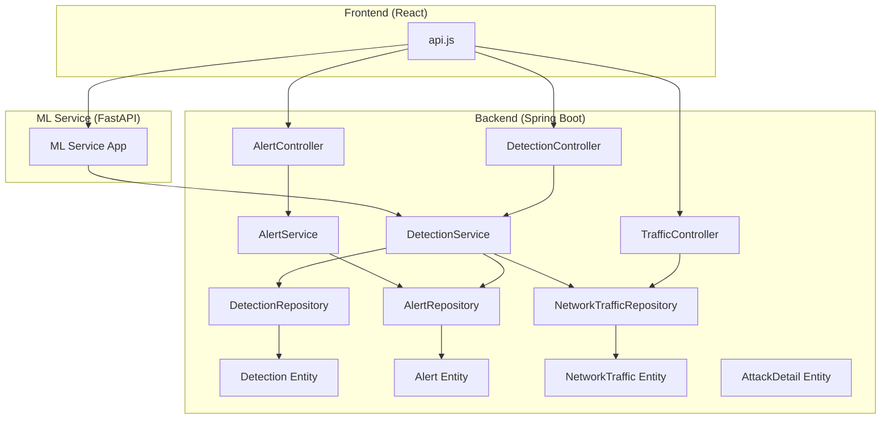
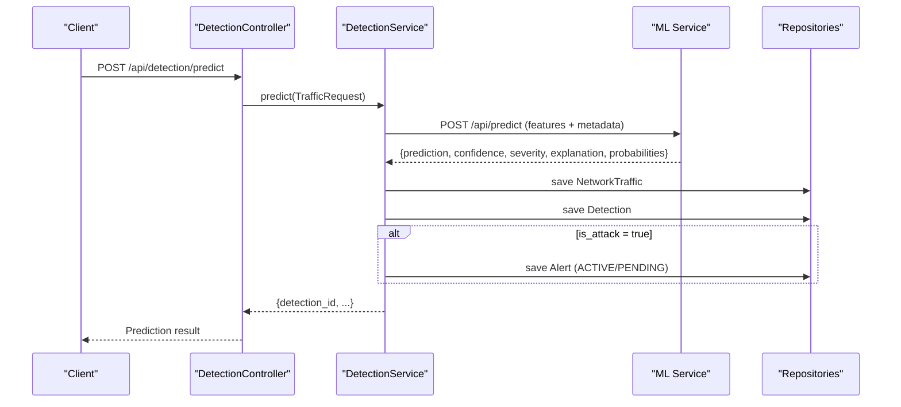
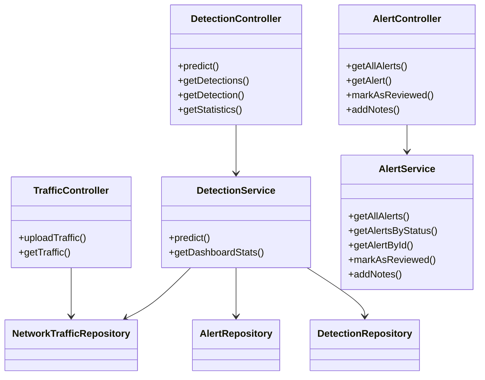

# Detection Management

<cite>
**Referenced Files in This Document**
- [DetectionController.java](file://Mini_Project/backend/src/main/java/com/clinicalnids/backend/controller/DetectionController.java)
- [AlertController.java](file://Mini_Project/backend/src/main/java/com/clinicalnids/backend/controller/AlertController.java)
- [TrafficController.java](file://Mini_Project/backend/src/main/java/com/clinicalnids/backend/controller/TrafficController.java)
- [DetectionService.java](file://Mini_Project/backend/src/main/java/com/clinicalnids/backend/service/DetectionService.java)
- [AlertService.java](file://Mini_Project/backend/src/main/java/com/clinicalnids/backend/service/AlertService.java)
- [Detection.java](file://Mini_Project/backend/src/main/java/com/clinicalnids/backend/entity/Detection.java)
- [Alert.java](file://Mini_Project/backend/src/main/java/com/clinicalnids/backend/entity/Alert.java)
- [NetworkTraffic.java](file://Mini_Project/backend/src/main/java/com/clinicalnids/backend/entity/NetworkTraffic.java)
- [AttackDetail.java](file://Mini_Project/backend/src/main/java/com/clinicalnids/backend/entity/AttackDetail.java)
- [DetectionRepository.java](file://Mini_Project/backend/src/main/java/com/clinicalnids/backend/repository/DetectionRepository.java)
- [AlertRepository.java](file://Mini_Project/backend/src/main/java/com/clinicalnids/backend/repository/AlertRepository.java)
- [NetworkTrafficRepository.java](file://Mini_Project/backend/src/main/java/com/clinicalnids/backend/repository/NetworkTrafficRepository.java)
- [TrafficRequest.java](file://Mini_Project/backend/src/main/java/com/clinicalnids/backend/dto/TrafficRequest.java)
- [DashboardStats.java](file://Mini_Project/backend/src/main/java/com/clinicalnids/backend/dto/DashboardStats.java)
- [application.properties](file://Mini_Project/backend/src/main/resources/application.properties)
- [app.py](file://Mini_Project/ml-service/app.py)
- [api.js](file://Mini_Project/clinical-nids-dashboard/src/data/api.js)
</cite>

## Table of Contents
1. [Introduction](#introduction)
2. [Project Structure](#project-structure)
3. [Core Components](#core-components)
4. [Architecture Overview](#architecture-overview)
5. [Detailed Component Analysis](#detailed-component-analysis)
6. [Dependency Analysis](#dependency-analysis)
7. [Performance Considerations](#performance-considerations)
8. [Troubleshooting Guide](#troubleshooting-guide)
9. [Conclusion](#conclusion)
10. [Appendices](#appendices)

## Introduction
This document describes the Detection Management API for real-time network traffic analysis and intrusion detection. It covers endpoints for retrieving detection results, managing alerts, and accessing attack details. It also explains the integration with the machine learning (ML) service for prediction processing, data persistence patterns, and real-time monitoring capabilities. The documentation includes request/response schemas for detection queries, alert filtering, and statistical analytics, along with the detection lifecycle, confidence scoring, and automated alert generation based on threat severity levels.

## Project Structure
The system comprises:
- Spring Boot backend with REST controllers, services, repositories, and entities for detection, alerts, and traffic.
- An ML service built with FastAPI that performs predictions, supports dataset uploads and analysis, and simulates traffic.
- A React dashboard that consumes both the Spring Boot backend and the ML service.

**Diagram sources**
- [DetectionController.java:14-50](file://Mini_Project/backend/src/main/java/com/clinicalnids/backend/controller/DetectionController.java#L14-L50)
- [AlertController.java:11-44](file://Mini_Project/backend/src/main/java/com/clinicalnids/backend/controller/AlertController.java#L11-L44)
- [TrafficController.java:12-40](file://Mini_Project/backend/src/main/java/com/clinicalnids/backend/controller/TrafficController.java#L12-L40)
- [DetectionService.java:22-41](file://Mini_Project/backend/src/main/java/com/clinicalnids/backend/service/DetectionService.java#L22-L41)
- [AlertService.java:10-44](file://Mini_Project/backend/src/main/java/com/clinicalnids/backend/service/AlertService.java#L10-L44)
- [DetectionRepository.java:10-17](file://Mini_Project/backend/src/main/java/com/clinicalnids/backend/repository/DetectionRepository.java#L10-L17)
- [AlertRepository.java:9-13](file://Mini_Project/backend/src/main/java/com/clinicalnids/backend/repository/AlertRepository.java#L9-L13)
- [NetworkTrafficRepository.java:7-9](file://Mini_Project/backend/src/main/java/com/clinicalnids/backend/repository/NetworkTrafficRepository.java#L7-L9)
- [Detection.java:7-53](file://Mini_Project/backend/src/main/java/com/clinicalnids/backend/entity/Detection.java#L7-L53)
- [Alert.java:7-43](file://Mini_Project/backend/src/main/java/com/clinicalnids/backend/entity/Alert.java#L7-L43)
- [NetworkTraffic.java:7-34](file://Mini_Project/backend/src/main/java/com/clinicalnids/backend/entity/NetworkTraffic.java#L7-L34)
- [AttackDetail.java:6-34](file://Mini_Project/backend/src/main/java/com/clinicalnids/backend/entity/AttackDetail.java#L6-L34)
- [app.py:40-661](file://Mini_Project/ml-service/app.py#L40-L661)
- [api.js:110-235](file://Mini_Project/clinical-nids-dashboard/src/data/api.js#L110-L235)

**Section sources**
- [DetectionController.java:14-50](file://Mini_Project/backend/src/main/java/com/clinicalnids/backend/controller/DetectionController.java#L14-L50)
- [AlertController.java:11-44](file://Mini_Project/backend/src/main/java/com/clinicalnids/backend/controller/AlertController.java#L11-L44)
- [TrafficController.java:12-40](file://Mini_Project/backend/src/main/java/com/clinicalnids/backend/controller/TrafficController.java#L12-L40)
- [DetectionService.java:22-41](file://Mini_Project/backend/src/main/java/com/clinicalnids/backend/service/DetectionService.java#L22-L41)
- [AlertService.java:10-44](file://Mini_Project/backend/src/main/java/com/clinicalnids/backend/service/AlertService.java#L10-L44)
- [DetectionRepository.java:10-17](file://Mini_Project/backend/src/main/java/com/clinicalnids/backend/repository/DetectionRepository.java#L10-L17)
- [AlertRepository.java:9-13](file://Mini_Project/backend/src/main/java/com/clinicalnids/backend/repository/AlertRepository.java#L9-L13)
- [NetworkTrafficRepository.java:7-9](file://Mini_Project/backend/src/main/java/com/clinicalnids/backend/repository/NetworkTrafficRepository.java#L7-L9)
- [Detection.java:7-53](file://Mini_Project/backend/src/main/java/com/clinicalnids/backend/entity/Detection.java#L7-L53)
- [Alert.java:7-43](file://Mini_Project/backend/src/main/java/com/clinicalnids/backend/entity/Alert.java#L7-L43)
- [NetworkTraffic.java:7-34](file://Mini_Project/backend/src/main/java/com/clinicalnids/backend/entity/NetworkTraffic.java#L7-L34)
- [AttackDetail.java:6-34](file://Mini_Project/backend/src/main/java/com/clinicalnids/backend/entity/AttackDetail.java#L6-L34)
- [app.py:40-661](file://Mini_Project/ml-service/app.py#L40-L661)
- [api.js:110-235](file://Mini_Project/clinical-nids-dashboard/src/data/api.js#L110-L235)

## Core Components
- DetectionController: Exposes endpoints for real-time prediction, retrieval of recent detections, and dashboard statistics.
- AlertController: Manages alerts with filtering by status, retrieval by ID, marking as reviewed, and adding notes.
- TrafficController: Handles traffic file uploads and retrieval of recent traffic records.
- DetectionService: Orchestrates ML prediction, persists traffic and detection records, and generates alerts based on confidence and severity thresholds.
- AlertService: Provides CRUD operations for alerts and status updates.
- Entities: Detection, Alert, NetworkTraffic, AttackDetail define the persistence model.
- Repositories: JPA repositories for Detection, Alert, and NetworkTraffic.
- DTOs: TrafficRequest and DashboardStats define request/response schemas.

**Section sources**
- [DetectionController.java:14-50](file://Mini_Project/backend/src/main/java/com/clinicalnids/backend/controller/DetectionController.java#L14-L50)
- [AlertController.java:11-44](file://Mini_Project/backend/src/main/java/com/clinicalnids/backend/controller/AlertController.java#L11-L44)
- [TrafficController.java:12-40](file://Mini_Project/backend/src/main/java/com/clinicalnids/backend/controller/TrafficController.java#L12-L40)
- [DetectionService.java:22-159](file://Mini_Project/backend/src/main/java/com/clinicalnids/backend/service/DetectionService.java#L22-L159)
- [AlertService.java:10-44](file://Mini_Project/backend/src/main/java/com/clinicalnids/backend/service/AlertService.java#L10-L44)
- [Detection.java:7-53](file://Mini_Project/backend/src/main/java/com/clinicalnids/backend/entity/Detection.java#L7-L53)
- [Alert.java:7-43](file://Mini_Project/backend/src/main/java/com/clinicalnids/backend/entity/Alert.java#L7-L43)
- [NetworkTraffic.java:7-34](file://Mini_Project/backend/src/main/java/com/clinicalnids/backend/entity/NetworkTraffic.java#L7-L34)
- [AttackDetail.java:6-34](file://Mini_Project/backend/src/main/java/com/clinicalnids/backend/entity/AttackDetail.java#L6-L34)
- [DetectionRepository.java:10-17](file://Mini_Project/backend/src/main/java/com/clinicalnids/backend/repository/DetectionRepository.java#L10-L17)
- [AlertRepository.java:9-13](file://Mini_Project/backend/src/main/java/com/clinicalnids/backend/repository/AlertRepository.java#L9-L13)
- [NetworkTrafficRepository.java:7-9](file://Mini_Project/backend/src/main/java/com/clinicalnids/backend/repository/NetworkTrafficRepository.java#L7-L9)
- [TrafficRequest.java:6-14](file://Mini_Project/backend/src/main/java/com/clinicalnids/backend/dto/TrafficRequest.java#L6-L14)
- [DashboardStats.java:9-17](file://Mini_Project/backend/src/main/java/com/clinicalnids/backend/dto/DashboardStats.java#L9-L17)

## Architecture Overview
The backend integrates with the ML service to perform real-time predictions on network traffic features. The DetectionService forwards traffic features to the ML service, persists the traffic and detection records, and creates alerts when attacks are detected above configured confidence thresholds. The AlertController exposes management endpoints for alerts, while TrafficController handles traffic metadata storage and retrieval.

**Diagram sources**
- [DetectionController.java:26-29](file://Mini_Project/backend/src/main/java/com/clinicalnids/backend/controller/DetectionController.java#L26-L29)
- [DetectionService.java:46-137](file://Mini_Project/backend/src/main/java/com/clinicalnids/backend/service/DetectionService.java#L46-L137)
- [app.py:439-464](file://Mini_Project/ml-service/app.py#L439-L464)
- [NetworkTrafficRepository.java:7-9](file://Mini_Project/backend/src/main/java/com/clinicalnids/backend/repository/NetworkTrafficRepository.java#L7-L9)
- [DetectionRepository.java:10-17](file://Mini_Project/backend/src/main/java/com/clinicalnids/backend/repository/DetectionRepository.java#L10-L17)
- [AlertRepository.java:9-13](file://Mini_Project/backend/src/main/java/com/clinicalnids/backend/repository/AlertRepository.java#L9-L13)

## Detailed Component Analysis

### Detection Management Endpoints
- POST /api/detection/predict
  - Purpose: Submit traffic features for real-time prediction.
  - Request: TrafficRequest (sourceIp, destinationIp, sourcePort, destinationPort, protocol, features).
  - Response: Prediction result including detection_id and ML-provided fields.
  - Implementation: Delegates to DetectionService.predict.
  - Section sources
    - [DetectionController.java:26-29](file://Mini_Project/backend/src/main/java/com/clinicalnids/backend/controller/DetectionController.java#L26-L29)
    - [DetectionService.java:46-137](file://Mini_Project/backend/src/main/java/com/clinicalnids/backend/service/DetectionService.java#L46-L137)
    - [TrafficRequest.java:6-14](file://Mini_Project/backend/src/main/java/com/clinicalnids/backend/dto/TrafficRequest.java#L6-L14)

- GET /api/detections
  - Purpose: Retrieve recent detections with optional limit.
  - Query: limit (default 100).
  - Response: Array of Detection entities.
  - Implementation: Uses DetectionRepository.findAll with slicing.
  - Section sources
    - [DetectionController.java:31-37](file://Mini_Project/backend/src/main/java/com/clinicalnids/backend/controller/DetectionController.java#L31-L37)
    - [DetectionRepository.java:10-17](file://Mini_Project/backend/src/main/java/com/clinicalnids/backend/repository/DetectionRepository.java#L10-L17)

- GET /api/detections/{id}
  - Purpose: Retrieve a specific detection by ID.
  - Path: id (Long).
  - Response: Detection entity or 404.
  - Implementation: Uses DetectionRepository.findById.
  - Section sources
    - [DetectionController.java:39-44](file://Mini_Project/backend/src/main/java/com/clinicalnids/backend/controller/DetectionController.java#L39-L44)

- GET /api/dashboard/statistics
  - Purpose: Retrieve dashboard statistics.
  - Response: DashboardStats (totals, distributions, model metrics).
  - Implementation: Uses DetectionRepository and AlertRepository counts.
  - Section sources
    - [DetectionController.java:46-49](file://Mini_Project/backend/src/main/java/com/clinicalnids/backend/controller/DetectionController.java#L46-L49)
    - [DetectionService.java:139-157](file://Mini_Project/backend/src/main/java/com/clinicalnids/backend/service/DetectionService.java#L139-L157)
    - [DashboardStats.java:9-17](file://Mini_Project/backend/src/main/java/com/clinicalnids/backend/dto/DashboardStats.java#L9-L17)

### Alert Management Endpoints
- GET /api/alerts
  - Purpose: Retrieve all alerts or filter by status.
  - Query: status (optional).
  - Response: Array of Alert entities.
  - Implementation: Uses AlertService with AlertRepository.
  - Section sources
    - [AlertController.java:21-28](file://Mini_Project/backend/src/main/java/com/clinicalnids/backend/controller/AlertController.java#L21-L28)
    - [AlertService.java:19-25](file://Mini_Project/backend/src/main/java/com/clinicalnids/backend/service/AlertService.java#L19-L25)
    - [AlertRepository.java:9-13](file://Mini_Project/backend/src/main/java/com/clinicalnids/backend/repository/AlertRepository.java#L9-L13)

- GET /api/alerts/{id}
  - Purpose: Retrieve a specific alert by ID.
  - Path: id (Long).
  - Response: Alert entity.
  - Implementation: Uses AlertService.getAlertById.
  - Section sources
    - [AlertController.java:30-33](file://Mini_Project/backend/src/main/java/com/clinicalnids/backend/controller/AlertController.java#L30-L33)
    - [AlertService.java:27-30](file://Mini_Project/backend/src/main/java/com/clinicalnids/backend/service/AlertService.java#L27-L30)

- PUT /api/alerts/{id}/review
  - Purpose: Mark an alert as reviewed and resolved.
  - Path: id (Long).
  - Response: Updated Alert entity.
  - Implementation: Uses AlertService.markAsReviewed.
  - Section sources
    - [AlertController.java:35-38](file://Mini_Project/backend/src/main/java/com/clinicalnids/backend/controller/AlertController.java#L35-L38)
    - [AlertService.java:32-37](file://Mini_Project/backend/src/main/java/com/clinicalnids/backend/service/AlertService.java#L32-L37)

- PUT /api/alerts/{id}/notes
  - Purpose: Add notes to an alert.
  - Path: id (Long).
  - Request: { notes: string }.
  - Response: Updated Alert entity.
  - Implementation: Uses AlertService.addNotes.
  - Section sources
    - [AlertController.java:40-43](file://Mini_Project/backend/src/main/java/com/clinicalnids/backend/controller/AlertController.java#L40-L43)
    - [AlertService.java:39-43](file://Mini_Project/backend/src/main/java/com/clinicalnids/backend/service/AlertService.java#L39-L43)

### Traffic Management Endpoints
- POST /api/traffic/upload
  - Purpose: Upload traffic file (metadata handled by ML service).
  - Request: multipart/form-data with file.
  - Response: Status message.
  - Implementation: Returns metadata placeholder; ML service handles analysis.
  - Section sources
    - [TrafficController.java:22-32](file://Mini_Project/backend/src/main/java/com/clinicalnids/backend/controller/TrafficController.java#L22-L32)

- GET /api/traffic
  - Purpose: Retrieve recent traffic records with optional limit.
  - Query: limit (default 100).
  - Response: Array of NetworkTraffic entities.
  - Implementation: Uses NetworkTrafficRepository.findAll with slicing.
  - Section sources
    - [TrafficController.java:34-39](file://Mini_Project/backend/src/main/java/com/clinicalnids/backend/controller/TrafficController.java#L34-L39)
    - [NetworkTrafficRepository.java:7-9](file://Mini_Project/backend/src/main/java/com/clinicalnids/backend/repository/NetworkTrafficRepository.java#L7-L9)

### ML Service Integration
- Real-time prediction: POST /api/predict accepts TrafficFeatures and returns prediction, confidence, severity, explanation, and probabilities.
- Simulation: POST /api/simulate/start and /api/simulate/stop drive continuous traffic simulation.
- Statistics: GET /api/dashboard/statistics aggregates totals and distributions.
- Section sources
  - [app.py:439-464](file://Mini_Project/ml-service/app.py#L439-L464)
  - [app.py:497-546](file://Mini_Project/ml-service/app.py#L497-L546)
  - [app.py:618-649](file://Mini_Project/ml-service/app.py#L618-L649)

### Data Persistence Patterns
- NetworkTraffic: Stores raw features and metadata for each flow.
- Detection: Stores prediction outcome, confidence, severity, explanation, probabilities, and timestamps.
- Alert: Links to Detection, tracks status, resolution, and notes.
- AttackDetail: Aggregated dataset-level attack statistics.
- Section sources
  - [NetworkTraffic.java:7-34](file://Mini_Project/backend/src/main/java/com/clinicalnids/backend/entity/NetworkTraffic.java#L7-L34)
  - [Detection.java:7-53](file://Mini_Project/backend/src/main/java/com/clinicalnids/backend/entity/Detection.java#L7-L53)
  - [Alert.java:7-43](file://Mini_Project/backend/src/main/java/com/clinicalnids/backend/entity/Alert.java#L7-L43)
  - [AttackDetail.java:6-34](file://Mini_Project/backend/src/main/java/com/clinicalnids/backend/entity/AttackDetail.java#L6-L34)

### Detection Lifecycle and Confidence Scoring
- Input: TrafficRequest with features and metadata.
- ML prediction: Forwarded to ML service; response includes prediction, confidence, severity, explanation, and probabilities.
- Persistence: NetworkTraffic and Detection saved; Alert optionally created based on thresholds.
- Automated alert generation:
  - ACTIVE: confidence >= 0.90
  - PENDING: confidence >= 0.70
  - Below threshold: logged without alert
- Section sources
  - [DetectionService.java:46-137](file://Mini_Project/backend/src/main/java/com/clinicalnids/backend/service/DetectionService.java#L46-L137)
  - [Detection.java:50-52](file://Mini_Project/backend/src/main/java/com/clinicalnids/backend/entity/Detection.java#L50-L52)
  - [Alert.java:40-42](file://Mini_Project/backend/src/main/java/com/clinicalnids/backend/entity/Alert.java#L40-L42)

### Request/Response Schemas

#### TrafficRequest
- Fields:
  - sourceIp: string
  - destinationIp: string
  - sourcePort: integer
  - destinationPort: integer
  - protocol: string
  - features: object (key-value pairs of feature names and values)
- Section sources
  - [TrafficRequest.java:6-14](file://Mini_Project/backend/src/main/java/com/clinicalnids/backend/dto/TrafficRequest.java#L6-L14)

#### Detection
- Fields:
  - id: long
  - attackType: string
  - confidence: number (double)
  - severity: enum (CRITICAL, HIGH, MEDIUM, LOW, NONE)
  - explanation: text
  - sourceIp: string
  - destinationIp: string
  - sourcePort: integer
  - destinationPort: integer
  - protocol: string
  - isAttack: boolean
  - probabilities: text
  - detectedTime: datetime
- Section sources
  - [Detection.java:13-48](file://Mini_Project/backend/src/main/java/com/clinicalnids/backend/entity/Detection.java#L13-L48)

#### Alert
- Fields:
  - id: long
  - detection: Detection
  - status: enum (ACTIVE, PENDING, RESOLVED)
  - assignedTo: string
  - notes: text
  - createdAt: datetime
  - resolvedAt: datetime
- Section sources
  - [Alert.java:13-38](file://Mini_Project/backend/src/main/java/com/clinicalnids/backend/entity/Alert.java#L13-L38)

#### NetworkTraffic
- Fields:
  - id: long
  - sourceIp: string
  - destinationIp: string
  - sourcePort: integer
  - destinationPort: integer
  - protocol: string
  - rawFeatures: text
  - timestamp: datetime
- Section sources
  - [NetworkTraffic.java:13-33](file://Mini_Project/backend/src/main/java/com/clinicalnids/backend/entity/NetworkTraffic.java#L13-L33)

#### DashboardStats
- Fields:
  - totalFlows: long
  - totalAttacks: long
  - criticalAlerts: long
  - modelAccuracy: number (double)
  - activeDevices: long
  - attackTypes: map<string,long>
  - severityDistribution: map<string,long>
- Section sources
  - [DashboardStats.java:9-17](file://Mini_Project/backend/src/main/java/com/clinicalnids/backend/dto/DashboardStats.java#L9-L17)

### Real-time Monitoring Capabilities
- Frontend integration:
  - ML service health and model info endpoints.
  - Simulation controls and status.
  - Direct ML prediction and detection retrieval.
- Section sources
  - [api.js:110-235](file://Mini_Project/clinical-nids-dashboard/src/data/api.js#L110-L235)
  - [app.py:418-426](file://Mini_Project/ml-service/app.py#L418-L426)
  - [app.py:429-436](file://Mini_Project/ml-service/app.py#L429-L436)
  - [app.py:618-649](file://Mini_Project/ml-service/app.py#L618-L649)
  - [app.py:489-494](file://Mini_Project/ml-service/app.py#L489-L494)

## Dependency Analysis

**Diagram sources**
- [DetectionController.java:14-50](file://Mini_Project/backend/src/main/java/com/clinicalnids/backend/controller/DetectionController.java#L14-L50)
- [AlertController.java:11-44](file://Mini_Project/backend/src/main/java/com/clinicalnids/backend/controller/AlertController.java#L11-L44)
- [TrafficController.java:12-40](file://Mini_Project/backend/src/main/java/com/clinicalnids/backend/controller/TrafficController.java#L12-L40)
- [DetectionService.java:22-41](file://Mini_Project/backend/src/main/java/com/clinicalnids/backend/service/DetectionService.java#L22-L41)
- [AlertService.java:10-17](file://Mini_Project/backend/src/main/java/com/clinicalnids/backend/service/AlertService.java#L10-L17)
- [DetectionRepository.java:10-17](file://Mini_Project/backend/src/main/java/com/clinicalnids/backend/repository/DetectionRepository.java#L10-L17)
- [AlertRepository.java:9-13](file://Mini_Project/backend/src/main/java/com/clinicalnids/backend/repository/AlertRepository.java#L9-L13)
- [NetworkTrafficRepository.java:7-9](file://Mini_Project/backend/src/main/java/com/clinicalnids/backend/repository/NetworkTrafficRepository.java#L7-L9)

**Section sources**
- [DetectionController.java:14-50](file://Mini_Project/backend/src/main/java/com/clinicalnids/backend/controller/DetectionController.java#L14-L50)
- [AlertController.java:11-44](file://Mini_Project/backend/src/main/java/com/clinicalnids/backend/controller/AlertController.java#L11-L44)
- [TrafficController.java:12-40](file://Mini_Project/backend/src/main/java/com/clinicalnids/backend/controller/TrafficController.java#L12-L40)
- [DetectionService.java:22-41](file://Mini_Project/backend/src/main/java/com/clinicalnids/backend/service/DetectionService.java#L22-L41)
- [AlertService.java:10-17](file://Mini_Project/backend/src/main/java/com/clinicalnids/backend/service/AlertService.java#L10-L17)
- [DetectionRepository.java:10-17](file://Mini_Project/backend/src/main/java/com/clinicalnids/backend/repository/DetectionRepository.java#L10-L17)
- [AlertRepository.java:9-13](file://Mini_Project/backend/src/main/java/com/clinicalnids/backend/repository/AlertRepository.java#L9-L13)
- [NetworkTrafficRepository.java:7-9](file://Mini_Project/backend/src/main/java/com/clinicalnids/backend/repository/NetworkTrafficRepository.java#L7-L9)

## Performance Considerations
- Prediction throughput: The ML service supports batch predictions and a traffic simulator for load testing.
- Data limits: Detection and traffic endpoints return sliced lists based on limit parameters to avoid excessive payloads.
- Caching and persistence: Consider indexing Detection.severity and Detection.isAttack for efficient filtering and aggregation.
- Section sources
  - [DetectionController.java:31-37](file://Mini_Project/backend/src/main/java/com/clinicalnids/backend/controller/DetectionController.java#L31-L37)
  - [TrafficController.java:34-39](file://Mini_Project/backend/src/main/java/com/clinicalnids/backend/controller/TrafficController.java#L34-L39)
  - [DetectionRepository.java:10-17](file://Mini_Project/backend/src/main/java/com/clinicalnids/backend/repository/DetectionRepository.java#L10-L17)

## Troubleshooting Guide
- ML service unavailability:
  - Symptom: RuntimeException indicating ML service unavailable.
  - Cause: Network failure or empty response from ML service.
  - Action: Verify ML service health endpoint and network connectivity.
- JSON processing errors:
  - Symptom: RuntimeException during JSON processing of ML response.
  - Cause: Malformed response from ML service.
  - Action: Inspect ML service logs and response format.
- Alert not found:
  - Symptom: Runtime exception when retrieving alert by ID.
  - Cause: Invalid alert ID.
  - Action: Validate alert ID and existence in AlertRepository.
- Section sources
  - [DetectionService.java:130-136](file://Mini_Project/backend/src/main/java/com/clinicalnids/backend/service/DetectionService.java#L130-L136)
  - [AlertService.java:27-30](file://Mini_Project/backend/src/main/java/com/clinicalnids/backend/service/AlertService.java#L27-L30)

## Conclusion
The Detection Management API provides a robust foundation for real-time network traffic analysis and intrusion detection. It integrates seamlessly with the ML service for predictions, persists traffic and detection data, and automates alert generation based on confidence and severity thresholds. The exposed endpoints enable comprehensive monitoring, alert management, and statistical analytics, supporting both operational visibility and incident response workflows.

## Appendices

### Configuration
- ML service URL: Configured via application property for DetectionService WebClient.
- Section sources
  - [application.properties:32-33](file://Mini_Project/backend/src/main/resources/application.properties#L32-L33)
  - [DetectionService.java:33-40](file://Mini_Project/backend/src/main/java/com/clinicalnids/backend/service/DetectionService.java#L33-L40)