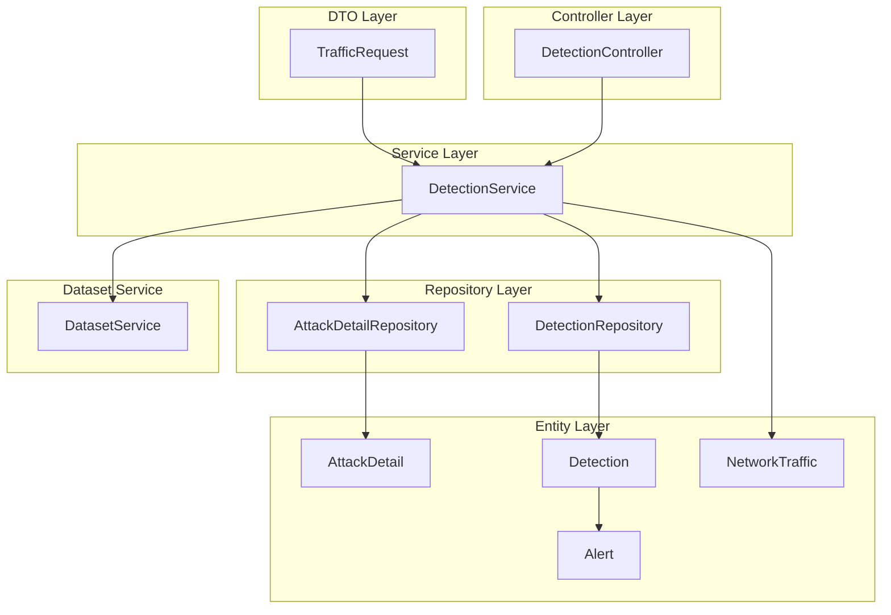
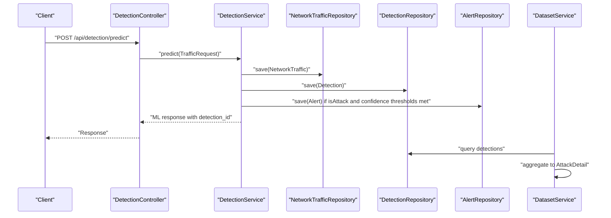
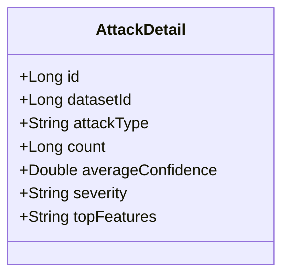
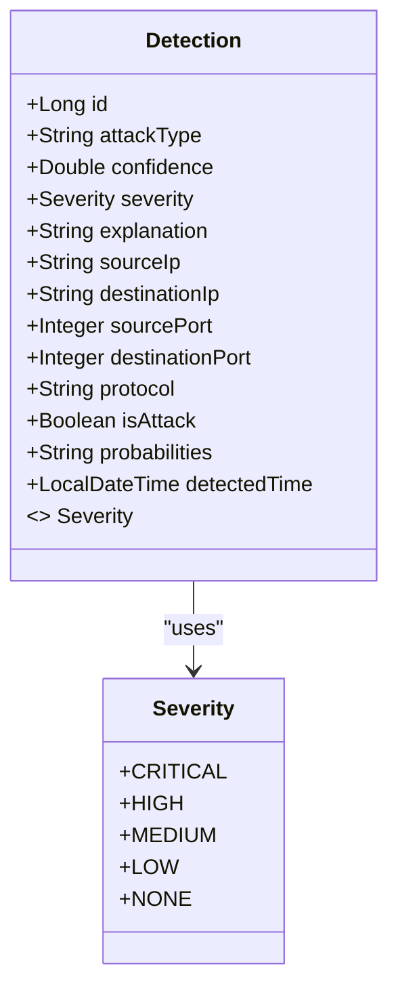
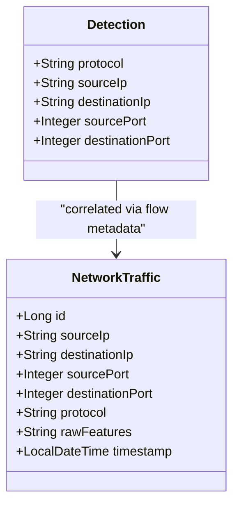
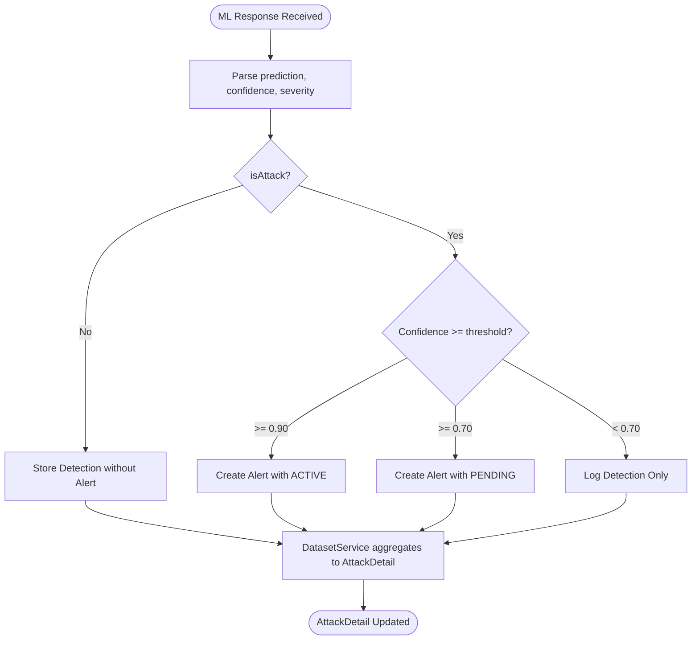
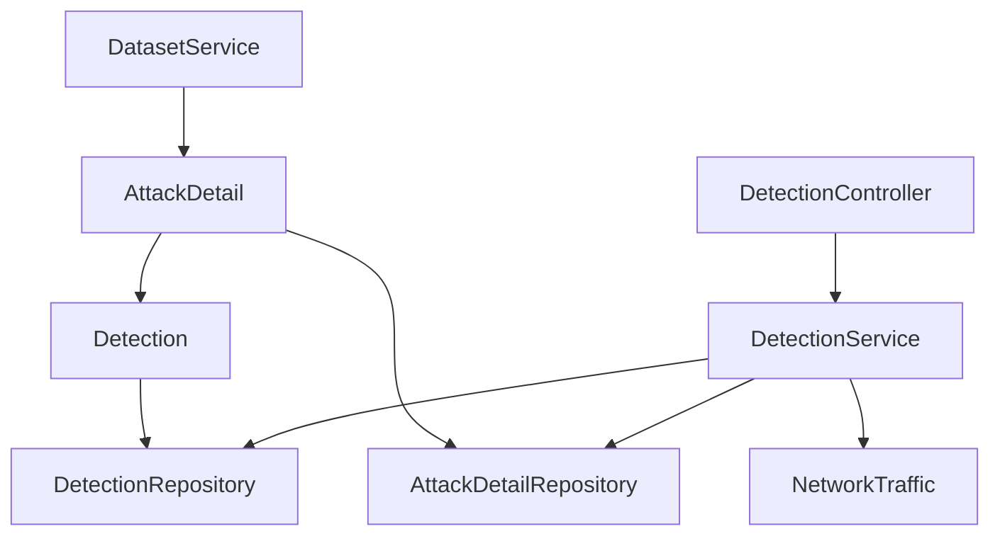

# Attack Detail Entity

<cite>
**Referenced Files in This Document**
- [AttackDetail.java](file://Mini_Project/backend/src/main/java/com/clinicalnids/backend/entity/AttackDetail.java)
- [AttackDetailRepository.java](file://Mini_Project/backend/src/main/java/com/clinicalnids/backend/repository/AttackDetailRepository.java)
- [Detection.java](file://Mini_Project/backend/src/main/java/com/clinicalnids/backend/entity/Detection.java)
- [DetectionRepository.java](file://Mini_Project/backend/src/main/java/com/clinicalnids/backend/repository/DetectionRepository.java)
- [DetectionService.java](file://Mini_Project/backend/src/main/java/com/clinicalnids/backend/service/DetectionService.java)
- [DetectionController.java](file://Mini_Project/backend/src/main/java/com/clinicalnids/backend/controller/DetectionController.java)
- [Alert.java](file://Mini_Project/backend/src/main/java/com/clinicalnids/backend/entity/Alert.java)
- [NetworkTraffic.java](file://Mini_Project/backend/src/main/java/com/clinicalnids/backend/entity/NetworkTraffic.java)
- [TrafficRequest.java](file://Mini_Project/backend/src/main/java/com/clinicalnids/backend/dto/TrafficRequest.java)
- [DatasetService.java](file://Mini_Project/backend/src/main/java/com/clinicalnids/backend/service/DatasetService.java)
</cite>

## Table of Contents
1. [Introduction](#introduction)
2. [Project Structure](#project-structure)
3. [Core Components](#core-components)
4. [Architecture Overview](#architecture-overview)
5. [Detailed Component Analysis](#detailed-component-analysis)
6. [Dependency Analysis](#dependency-analysis)
7. [Performance Considerations](#performance-considerations)
8. [Troubleshooting Guide](#troubleshooting-guide)
9. [Conclusion](#conclusion)

## Introduction
This document provides comprehensive documentation for the AttackDetail entity, focusing on its role in representing detected attack characteristics and integrating with Detection entities to deliver contextual information about security threats. It explains the attack classification system, severity scoring, protocol-specific details, and threat categorization. The document also covers how AttackDetail correlates with network traffic patterns in healthcare environments and how it connects to Detection records for enriched threat insights.

## Project Structure
The AttackDetail entity resides in the backend module alongside related entities and services that collectively support detection, alerting, and analytics workflows. The primary components involved in AttackDetail's lifecycle and integration include:
- Entity layer: AttackDetail, Detection, Alert, NetworkTraffic
- Repository layer: AttackDetailRepository, DetectionRepository
- Service layer: DetectionService
- Controller layer: DetectionController
- DTO layer: TrafficRequest
- Dataset analysis service: DatasetService

**Diagram sources**
- [AttackDetail.java:1-35](file://Mini_Project/backend/src/main/java/com/clinicalnids/backend/entity/AttackDetail.java#L1-L35)
- [AttackDetailRepository.java:1-13](file://Mini_Project/backend/src/main/java/com/clinicalnids/backend/repository/AttackDetailRepository.java#L1-L13)
- [Detection.java:1-54](file://Mini_Project/backend/src/main/java/com/clinicalnids/backend/entity/Detection.java#L1-L54)
- [DetectionRepository.java:1-18](file://Mini_Project/backend/src/main/java/com/clinicalnids/backend/repository/DetectionRepository.java#L1-L18)
- [DetectionService.java:1-159](file://Mini_Project/backend/src/main/java/com/clinicalnids/backend/service/DetectionService.java#L1-L159)
- [DetectionController.java:1-51](file://Mini_Project/backend/src/main/java/com/clinicalnids/backend/controller/DetectionController.java#L1-L51)
- [Alert.java:1-44](file://Mini_Project/backend/src/main/java/com/clinicalnids/backend/entity/Alert.java#L1-L44)
- [NetworkTraffic.java:1-35](file://Mini_Project/backend/src/main/java/com/clinicalnids/backend/entity/NetworkTraffic.java#L1-L35)
- [TrafficRequest.java:1-15](file://Mini_Project/backend/src/main/java/com/clinicalnids/backend/dto/TrafficRequest.java#L1-L15)
- [DatasetService.java:170-250](file://Mini_Project/backend/src/main/java/com/clinicalnids/backend/service/DatasetService.java#L170-L250)

**Section sources**
- [AttackDetail.java:1-35](file://Mini_Project/backend/src/main/java/com/clinicalnids/backend/entity/AttackDetail.java#L1-L35)
- [Detection.java:1-54](file://Mini_Project/backend/src/main/java/com/clinicalnids/backend/entity/Detection.java#L1-L54)
- [DetectionService.java:1-159](file://Mini_Project/backend/src/main/java/com/clinicalnids/backend/service/DetectionService.java#L1-L159)

## Core Components
AttackDetail encapsulates aggregated characteristics derived from Detection records, enabling higher-level analysis and reporting. Its core attributes include:
- datasetId: Links AttackDetail to a specific dataset for analysis and reporting contexts
- attackType: Categorical identifier for the detected attack family or variant
- count: Aggregated frequency or occurrence metric for the attack type within the dataset
- averageConfidence: Average confidence score across detections for the attack type
- severity: Severity label associated with the attack type
- topFeatures: Text field containing notable features or indicators that characterize the attack

These attributes enable AttackDetail to serve as a summarized view of attack patterns, facilitating trend analysis and operational dashboards.

**Section sources**
- [AttackDetail.java:18-34](file://Mini_Project/backend/src/main/java/com/clinicalnids/backend/entity/AttackDetail.java#L18-L34)

## Architecture Overview
AttackDetail participates in a multi-tier architecture where Detection entities capture real-time traffic anomalies, and AttackDetail aggregates these detections for analysis. The flow begins with TrafficRequest DTOs being processed by DetectionService, which interacts with DetectionRepository and NetworkTrafficRepository. When attacks are detected, Alert entities may be created based on confidence thresholds. DatasetService later consumes Detection data to produce AttackDetail entries for reporting and analytics.

**Diagram sources**
- [DetectionController.java:26-29](file://Mini_Project/backend/src/main/java/com/clinicalnids/backend/controller/DetectionController.java#L26-L29)
- [DetectionService.java:47-137](file://Mini_Project/backend/src/main/java/com/clinicalnids/backend/service/DetectionService.java#L47-L137)
- [DetectionRepository.java:1-18](file://Mini_Project/backend/src/main/java/com/clinicalnids/backend/repository/DetectionRepository.java#L1-L18)
- [NetworkTraffic.java:1-35](file://Mini_Project/backend/src/main/java/com/clinicalnids/backend/entity/NetworkTraffic.java#L1-L35)
- [Alert.java:1-44](file://Mini_Project/backend/src/main/java/com/clinicalnids/backend/entity/Alert.java#L1-L44)
- [DatasetService.java:170-250](file://Mini_Project/backend/src/main/java/com/clinicalnids/backend/service/DatasetService.java#L170-L250)

## Detailed Component Analysis

### AttackDetail Entity
AttackDetail is a JPA entity mapped to the attack_details table. It stores aggregated metrics for attack types, including counts, confidence averages, and severity labels. The entity supports efficient querying via AttackDetailRepository by datasetId, enabling dataset-specific analysis.

Key characteristics:
- Identity: Auto-generated Long id
- Dataset linkage: datasetId for analysis scoping
- Classification: attackType string for categorization
- Aggregation: count Long and averageConfidence Double
- Severity: severity string aligned with Detection.Severity
- Feature insight: topFeatures TEXT for notable indicators

**Diagram sources**
- [AttackDetail.java:12-34](file://Mini_Project/backend/src/main/java/com/clinicalnids/backend/entity/AttackDetail.java#L12-L34)

**Section sources**
- [AttackDetail.java:1-35](file://Mini_Project/backend/src/main/java/com/clinicalnids/backend/entity/AttackDetail.java#L1-L35)
- [AttackDetailRepository.java:1-13](file://Mini_Project/backend/src/main/java/com/clinicalnids/backend/repository/AttackDetailRepository.java#L1-L13)

### Detection and Severity Scoring
Detection captures per-flow anomaly decisions with explicit severity enumeration and confidence scores. Severity levels include CRITICAL, HIGH, MEDIUM, LOW, and NONE. DetectionService translates ML service outputs into Detection entities, including protocol, ports, IPs, and timestamps. The service also creates Alert entities when attack probability exceeds configured thresholds.

**Diagram sources**
- [Detection.java:13-54](file://Mini_Project/backend/src/main/java/com/clinicalnids/backend/entity/Detection.java#L13-L54)

**Section sources**
- [Detection.java:50-52](file://Mini_Project/backend/src/main/java/com/clinicalnids/backend/entity/Detection.java#L50-L52)
- [DetectionService.java:88-90](file://Mini_Project/backend/src/main/java/com/clinicalnids/backend/service/DetectionService.java#L88-L90)

### Protocol-Specific Details and Traffic Correlation
NetworkTraffic records capture raw features and metadata for each flow, including protocol, source/destination IPs and ports. DetectionService persists these records before saving Detection results, ensuring protocol-specific context is preserved for downstream analysis. AttackDetail leverages Detection-derived aggregations to correlate attack occurrences with protocol distributions and feature profiles.

**Diagram sources**
- [NetworkTraffic.java:13-35](file://Mini_Project/backend/src/main/java/com/clinicalnids/backend/entity/NetworkTraffic.java#L13-L35)
- [Detection.java:32-36](file://Mini_Project/backend/src/main/java/com/clinicalnids/backend/entity/Detection.java#L32-L36)

**Section sources**
- [NetworkTraffic.java:19-26](file://Mini_Project/backend/src/main/java/com/clinicalnids/backend/entity/NetworkTraffic.java#L19-L26)
- [Detection.java:32-36](file://Mini_Project/backend/src/main/java/com/clinicalnids/backend/entity/Detection.java#L32-L36)

### Threat Categorization and Alerting
AttackDetail complements Detection by summarizing attack patterns across datasets. DetectionService evaluates ML outputs to set Detection.isAttack and severity, and conditionally creates Alert entities based on confidence thresholds. This triad enables contextual threat categorization and actionable alerts for security operations.

**Diagram sources**
- [DetectionService.java:108-125](file://Mini_Project/backend/src/main/java/com/clinicalnids/backend/service/DetectionService.java#L108-L125)
- [Alert.java:40-42](file://Mini_Project/backend/src/main/java/com/clinicalnids/backend/entity/Alert.java#L40-L42)
- [DatasetService.java:178-247](file://Mini_Project/backend/src/main/java/com/clinicalnids/backend/service/DatasetService.java#L178-L247)

**Section sources**
- [DetectionService.java:108-125](file://Mini_Project/backend/src/main/java/com/clinicalnids/backend/service/DetectionService.java#L108-L125)
- [Alert.java:19-25](file://Mini_Project/backend/src/main/java/com/clinicalnids/backend/entity/Alert.java#L19-L25)

### Healthcare Environment Considerations
Healthcare environments often involve specialized protocols and sensitive data patterns. While AttackDetail itself is protocol-agnostic, Detection and NetworkTraffic preserve protocol metadata, enabling analysis of healthcare-specific traffic such as HL7, DICOM, or medical device communications. AttackDetail aggregation can reveal trends in attack types targeting healthcare assets, aiding compliance and risk management.

[No sources needed since this section provides general guidance]

## Dependency Analysis
AttackDetail depends on Detection for aggregation and on DatasetService for population. The dependency graph highlights the relationships among entities, repositories, and services.

**Diagram sources**
- [AttackDetailRepository.java:10-12](file://Mini_Project/backend/src/main/java/com/clinicalnids/backend/repository/AttackDetailRepository.java#L10-L12)
- [DetectionRepository.java:11-16](file://Mini_Project/backend/src/main/java/com/clinicalnids/backend/repository/DetectionRepository.java#L11-L16)
- [DetectionService.java:33-41](file://Mini_Project/backend/src/main/java/com/clinicalnids/backend/service/DetectionService.java#L33-L41)
- [DatasetService.java:178-247](file://Mini_Project/backend/src/main/java/com/clinicalnids/backend/service/DatasetService.java#L178-L247)

**Section sources**
- [AttackDetailRepository.java:1-13](file://Mini_Project/backend/src/main/java/com/clinicalnids/backend/repository/AttackDetailRepository.java#L1-L13)
- [DetectionRepository.java:1-18](file://Mini_Project/backend/src/main/java/com/clinicalnids/backend/repository/DetectionRepository.java#L1-L18)
- [DetectionService.java:1-159](file://Mini_Project/backend/src/main/java/com/clinicalnids/backend/service/DetectionService.java#L1-L159)

## Performance Considerations
- Indexing: Add database indexes on Detection.attackType, Detection.severity, Detection.detectedTime, and AttackDetail.datasetId to optimize filtering and aggregation queries.
- Aggregation Strategy: Prefer batch processing in DatasetService to minimize repeated scans over DetectionRepository.
- Caching: Cache frequently accessed AttackDetail summaries by datasetId to reduce database load during dashboard rendering.
- Pagination: Use DetectionController pagination for large detection lists to avoid memory overhead.

[No sources needed since this section provides general guidance]

## Troubleshooting Guide
Common issues and resolutions:
- Empty ML Response: DetectionService throws a runtime exception when the ML service returns null or empty data. Verify ML service availability and payload format.
- JSON Processing Errors: ObjectMapper exceptions indicate malformed ML response payloads. Validate serialization of explanation and probabilities fields.
- Confidence Thresholds: Adjust DetectionService alert thresholds to balance sensitivity and noise in healthcare environments.
- Data Integrity: Ensure Detection.detectedTime defaults are applied consistently via @PrePersist to maintain temporal accuracy.

**Section sources**
- [DetectionService.java:130-136](file://Mini_Project/backend/src/main/java/com/clinicalnids/backend/service/DetectionService.java#L130-L136)
- [Detection.java:45-48](file://Mini_Project/backend/src/main/java/com/clinicalnids/backend/entity/Detection.java#L45-L48)

## Conclusion
AttackDetail serves as a crucial analytical construct that transforms raw Detection records into summarized, dataset-scoped insights for threat characterization. By integrating with Detection, Alert, and NetworkTraffic entities, and leveraging DetectionService and DatasetService, AttackDetail enables robust attack classification, severity scoring, and protocol-aware correlation. These capabilities are essential for contextual threat analysis in healthcare environments, supporting operational visibility and informed security decision-making.