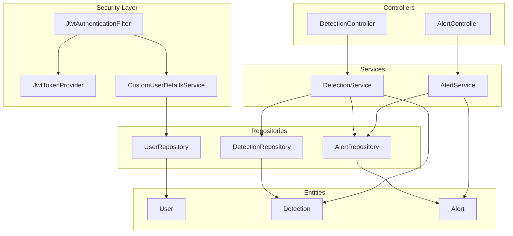
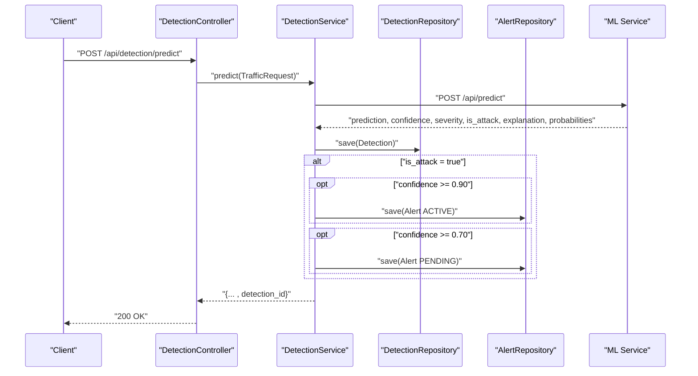
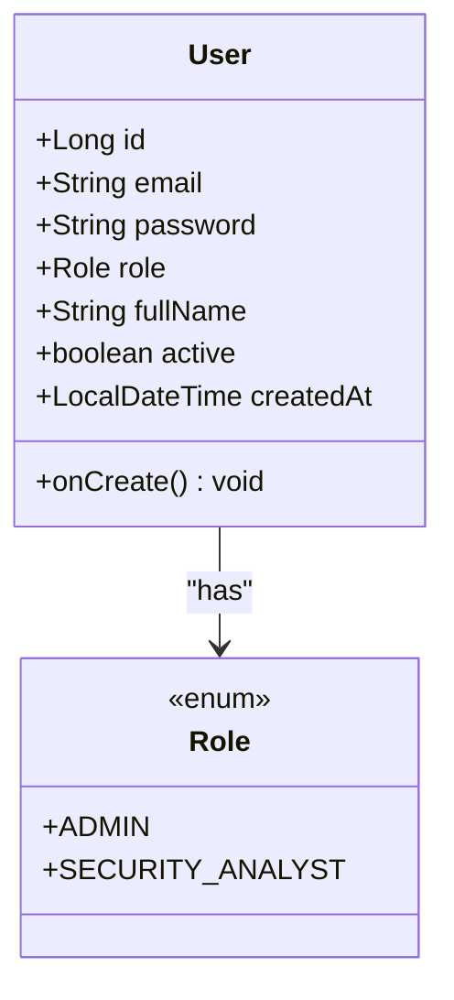
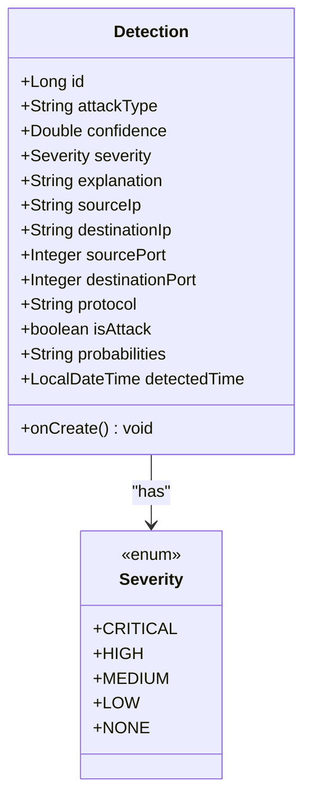
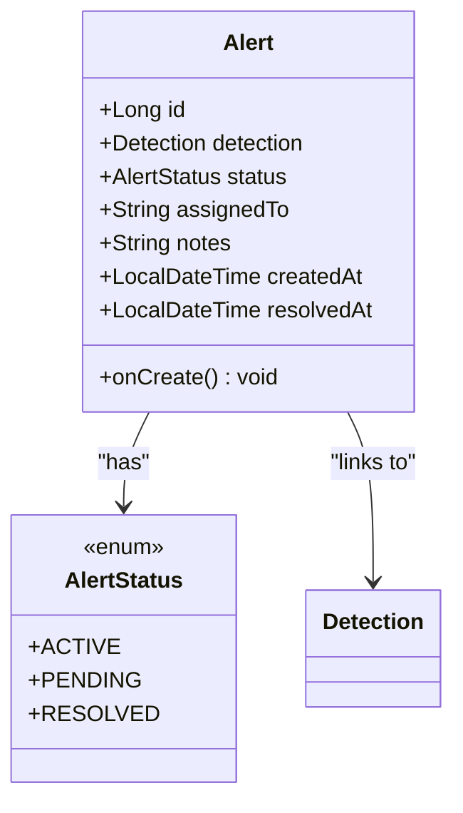
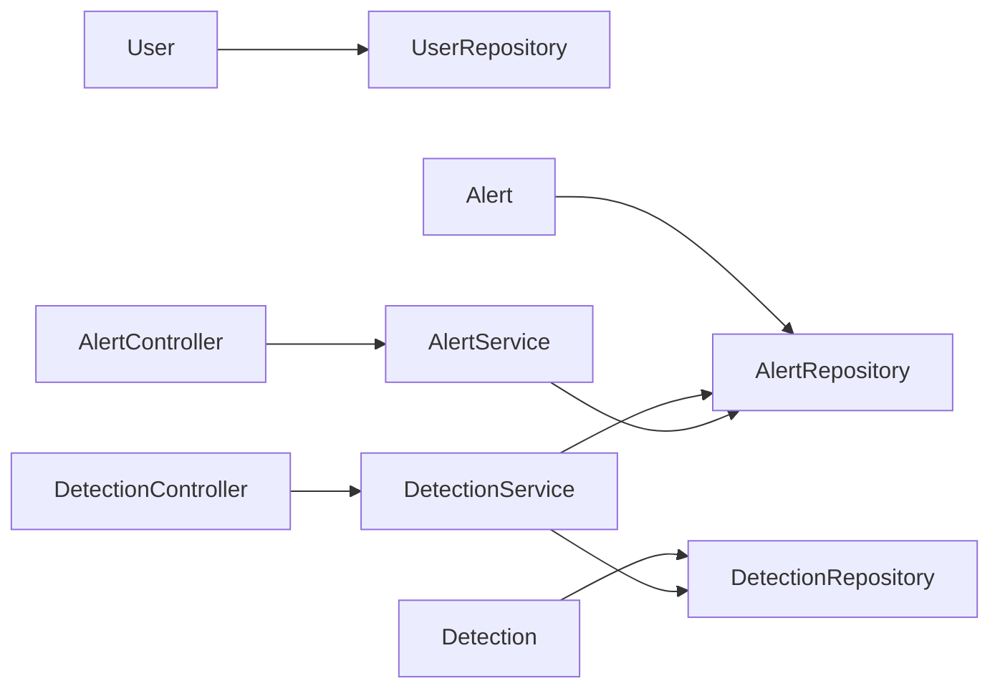

# Core Entities

<cite>
**Referenced Files in This Document**
- [User.java](file://Mini_Project/backend/src/main/java/com/clinicalnids/backend/entity/User.java)
- [Detection.java](file://Mini_Project/backend/src/main/java/com/clinicalnids/backend/entity/Detection.java)
- [Alert.java](file://Mini_Project/backend/src/main/java/com/clinicalnids/backend/entity/Alert.java)
- [AlertService.java](file://Mini_Project/backend/src/main/java/com/clinicalnids/backend/service/AlertService.java)
- [DetectionService.java](file://Mini_Project/backend/src/main/java/com/clinicalnids/backend/service/DetectionService.java)
- [AlertController.java](file://Mini_Project/backend/src/main/java/com/clinicalnids/backend/controller/AlertController.java)
- [DetectionController.java](file://Mini_Project/backend/src/main/java/com/clinicalnids/backend/controller/DetectionController.java)
- [AlertRepository.java](file://Mini_Project/backend/src/main/java/com/clinicalnids/backend/repository/AlertRepository.java)
- [DetectionRepository.java](file://Mini_Project/backend/src/main/java/com/clinicalnids/backend/repository/DetectionRepository.java)
- [UserRepository.java](file://Mini_Project/backend/src/main/java/com/clinicalnids/backend/repository/UserRepository.java)
- [CustomUserDetailsService.java](file://Mini_Project/backend/src/main/java/com/clinicalnids/backend/service/CustomUserDetailsService.java)
- [JwtAuthenticationFilter.java](file://Mini_Project/backend/src/main/java/com/clinicalnids/backend/security/JwtAuthenticationFilter.java)
- [JwtTokenProvider.java](file://Mini_Project/backend/src/main/java/com/clinicalnids/backend/security/JwtTokenProvider.java)
- [LoginRequest.java](file://Mini_Project/backend/src/main/java/com/clinicalnids/backend/dto/LoginRequest.java)
- [AuthResponse.java](file://Mini_Project/backend/src/main/java/com/clinicalnids/backend/dto/AuthResponse.java)
</cite>

## Table of Contents
1. [Introduction](#introduction)
2. [Project Structure](#project-structure)
3. [Core Components](#core-components)
4. [Architecture Overview](#architecture-overview)
5. [Detailed Component Analysis](#detailed-component-analysis)
6. [Dependency Analysis](#dependency-analysis)
7. [Performance Considerations](#performance-considerations)
8. [Troubleshooting Guide](#troubleshooting-guide)
9. [Conclusion](#conclusion)

## Introduction
This document provides comprehensive documentation for the core domain entities in the security monitoring system: User, Detection, and Alert. It explains field definitions, data types, validation constraints, lifecycle hooks, and business logic for each entity. It also covers the role-based access control system for Users, Detection results with confidence scoring and severity, and Alert management for security operations. Integration patterns with the security system, including JWT-based authentication and ML-driven detection, are included.

## Project Structure
The core domain entities reside under the entity package and are persisted via Spring Data JPA repositories. Services orchestrate business logic, while controllers expose REST endpoints. Authentication is handled via JWT filters and providers, backed by a custom user details service.



**Diagram sources**
- [JwtAuthenticationFilter.java:1-56](file://Mini_Project/backend/src/main/java/com/clinicalnids/backend/security/JwtAuthenticationFilter.java#L1-L56)
- [JwtTokenProvider.java:1-71](file://Mini_Project/backend/src/main/java/com/clinicalnids/backend/security/JwtTokenProvider.java#L1-L71)
- [CustomUserDetailsService.java:1-36](file://Mini_Project/backend/src/main/java/com/clinicalnids/backend/service/CustomUserDetailsService.java#L1-L36)
- [AlertController.java:1-45](file://Mini_Project/backend/src/main/java/com/clinicalnids/backend/controller/AlertController.java#L1-L45)
- [DetectionController.java:1-51](file://Mini_Project/backend/src/main/java/com/clinicalnids/backend/controller/DetectionController.java#L1-L51)
- [AlertService.java:1-45](file://Mini_Project/backend/src/main/java/com/clinicalnids/backend/service/AlertService.java#L1-L45)
- [DetectionService.java:1-159](file://Mini_Project/backend/src/main/java/com/clinicalnids/backend/service/DetectionService.java#L1-L159)
- [AlertRepository.java:1-14](file://Mini_Project/backend/src/main/java/com/clinicalnids/backend/repository/AlertRepository.java#L1-L14)
- [DetectionRepository.java:1-18](file://Mini_Project/backend/src/main/java/com/clinicalnids/backend/repository/DetectionRepository.java#L1-L18)
- [UserRepository.java:1-14](file://Mini_Project/backend/src/main/java/com/clinicalnids/backend/repository/UserRepository.java#L1-L14)
- [User.java:1-45](file://Mini_Project/backend/src/main/java/com/clinicalnids/backend/entity/User.java#L1-L45)
- [Detection.java:1-54](file://Mini_Project/backend/src/main/java/com/clinicalnids/backend/entity/Detection.java#L1-L54)
- [Alert.java:1-44](file://Mini_Project/backend/src/main/java/com/clinicalnids/backend/entity/Alert.java#L1-L44)

**Section sources**
- [AlertController.java:1-45](file://Mini_Project/backend/src/main/java/com/clinicalnids/backend/controller/AlertController.java#L1-L45)
- [DetectionController.java:1-51](file://Mini_Project/backend/src/main/java/com/clinicalnids/backend/controller/DetectionController.java#L1-L51)
- [AlertService.java:1-45](file://Mini_Project/backend/src/main/java/com/clinicalnids/backend/service/AlertService.java#L1-L45)
- [DetectionService.java:1-159](file://Mini_Project/backend/src/main/java/com/clinicalnids/backend/service/DetectionService.java#L1-L159)
- [AlertRepository.java:1-14](file://Mini_Project/backend/src/main/java/com/clinicalnids/backend/repository/AlertRepository.java#L1-L14)
- [DetectionRepository.java:1-18](file://Mini_Project/backend/src/main/java/com/clinicalnids/backend/repository/DetectionRepository.java#L1-L18)
- [UserRepository.java:1-14](file://Mini_Project/backend/src/main/java/com/clinicalnids/backend/repository/UserRepository.java#L1-L14)
- [JwtAuthenticationFilter.java:1-56](file://Mini_Project/backend/src/main/java/com/clinicalnids/backend/security/JwtAuthenticationFilter.java#L1-L56)
- [JwtTokenProvider.java:1-71](file://Mini_Project/backend/src/main/java/com/clinicalnids/backend/security/JwtTokenProvider.java#L1-L71)
- [CustomUserDetailsService.java:1-36](file://Mini_Project/backend/src/main/java/com/clinicalnids/backend/service/CustomUserDetailsService.java#L1-L36)

## Core Components
This section documents the three core domain entities and their associated services and repositories.

- User
  - Purpose: Represents system users with role-based permissions.
  - Lifecycle: Creation timestamp set via pre-persist hook.
  - Validation: Email uniqueness and non-null constraints enforced at persistence level.
  - RBAC: Roles are mapped to authorities for Spring Security.

- Detection
  - Purpose: Stores intrusion detection results from the ML pipeline.
  - Confidence scoring: Numeric confidence with severity classification.
  - Network metadata: Source/destination IPs, ports, and protocol.
  - Lifecycle: Detected time defaults to current time on persist.

- Alert
  - Purpose: Security alert records linked to Detection.
  - Status lifecycle: ACTIVE, PENDING, RESOLVED.
  - Notes and assignment: Optional fields for analyst workflows.
  - Lifecycle: Created time defaults to current time on persist.

**Section sources**
- [User.java:1-45](file://Mini_Project/backend/src/main/java/com/clinicalnids/backend/entity/User.java#L1-L45)
- [Detection.java:1-54](file://Mini_Project/backend/src/main/java/com/clinicalnids/backend/entity/Detection.java#L1-L54)
- [Alert.java:1-44](file://Mini_Project/backend/src/main/java/com/clinicalnids/backend/entity/Alert.java#L1-L44)
- [AlertService.java:1-45](file://Mini_Project/backend/src/main/java/com/clinicalnids/backend/service/AlertService.java#L1-L45)
- [DetectionService.java:1-159](file://Mini_Project/backend/src/main/java/com/clinicalnids/backend/service/DetectionService.java#L1-L159)

## Architecture Overview
The system integrates JWT-based authentication, REST controllers, service-layer orchestration, and JPA repositories. The DetectionService interacts with an external ML service to produce Detection entities and conditionally creates Alerts based on confidence thresholds.



**Diagram sources**
- [DetectionController.java:1-51](file://Mini_Project/backend/src/main/java/com/clinicalnids/backend/controller/DetectionController.java#L1-L51)
- [DetectionService.java:1-159](file://Mini_Project/backend/src/main/java/com/clinicalnids/backend/service/DetectionService.java#L1-L159)
- [DetectionRepository.java:1-18](file://Mini_Project/backend/src/main/java/com/clinicalnids/backend/repository/DetectionRepository.java#L1-L18)
- [AlertRepository.java:1-14](file://Mini_Project/backend/src/main/java/com/clinicalnids/backend/repository/AlertRepository.java#L1-L14)

## Detailed Component Analysis

### User Entity
- Identity and Attributes
  - id: Auto-generated primary key.
  - email: Unique, non-null.
  - password: Non-null.
  - role: Enumerated role (ADMIN, SECURITY_ANALYST).
  - fullName: Non-null display name.
  - active: Boolean flag for account status.
  - createdAt: Timestamp set on creation via pre-persist hook.

- Validation Constraints
  - Unique email enforced at persistence level.
  - Non-null constraints on identity and credentials.

- Role-Based Access Control
  - Authorities are derived from the User role and applied to the authenticated principal.
  - CustomUserDetailsService loads users by email and maps roles to Spring Security authorities.

- Lifecycle Methods
  - PrePersist sets createdAt to the current timestamp if not provided.

- Examples
  - Instantiation: Use builder pattern to construct a User with role and credentials.
  - Common Operations: Login flow uses JWT token provider and filter to authenticate and authorize requests.



**Diagram sources**
- [User.java:1-45](file://Mini_Project/backend/src/main/java/com/clinicalnids/backend/entity/User.java#L1-L45)

**Section sources**
- [User.java:1-45](file://Mini_Project/backend/src/main/java/com/clinicalnids/backend/entity/User.java#L1-L45)
- [UserRepository.java:1-14](file://Mini_Project/backend/src/main/java/com/clinicalnids/backend/repository/UserRepository.java#L1-L14)
- [CustomUserDetailsService.java:1-36](file://Mini_Project/backend/src/main/java/com/clinicalnids/backend/service/CustomUserDetailsService.java#L1-L36)
- [JwtAuthenticationFilter.java:1-56](file://Mini_Project/backend/src/main/java/com/clinicalnids/backend/security/JwtAuthenticationFilter.java#L1-L56)
- [JwtTokenProvider.java:1-71](file://Mini_Project/backend/src/main/java/com/clinicalnids/backend/security/JwtTokenProvider.java#L1-L71)
- [LoginRequest.java:1-16](file://Mini_Project/backend/src/main/java/com/clinicalnids/backend/dto/LoginRequest.java#L1-L16)
- [AuthResponse.java:1-19](file://Mini_Project/backend/src/main/java/com/clinicalnids/backend/dto/AuthResponse.java#L1-L19)

### Detection Entity
- Identity and Attributes
  - id: Auto-generated primary key.
  - attackType: Non-null textual label for the detected attack.
  - confidence: Non-null numeric score indicating model certainty.
  - severity: Enumerated severity (CRITICAL, HIGH, MEDIUM, LOW, NONE).
  - explanation: Text explanation generated by the ML model.
  - sourceIp, destinationIp: Nullable IP addresses.
  - sourcePort, destinationPort: Nullable integer ports.
  - protocol: Nullable protocol string.
  - isAttack: Boolean flag indicating attack classification.
  - probabilities: JSON-like text containing per-class probabilities.
  - detectedTime: Defaults to current timestamp on creation.

- Validation Constraints
  - Non-null constraints on attackType, confidence, severity, and isAttack.
  - Additional network fields are optional.

- Business Logic
  - Severity mapping from ML response string to enum with fallback to NONE.
  - Confidence thresholds drive alert creation in DetectionService.

- Lifecycle Methods
  - PrePersist ensures detectedTime is set if missing.

- Examples
  - Instantiation: Use builder to populate fields from ML response.
  - Common Operations: Retrieve detections by severity, time range, or attack status via DetectionRepository.



**Diagram sources**
- [Detection.java:1-54](file://Mini_Project/backend/src/main/java/com/clinicalnids/backend/entity/Detection.java#L1-L54)

**Section sources**
- [Detection.java:1-54](file://Mini_Project/backend/src/main/java/com/clinicalnids/backend/entity/Detection.java#L1-L54)
- [DetectionRepository.java:1-18](file://Mini_Project/backend/src/main/java/com/clinicalnids/backend/repository/DetectionRepository.java#L1-L18)
- [DetectionService.java:1-159](file://Mini_Project/backend/src/main/java/com/clinicalnids/backend/service/DetectionService.java#L1-L159)

### Alert Entity
- Identity and Attributes
  - id: Auto-generated primary key.
  - detection: Many-to-one relationship to Detection.
  - status: Enumerated status (ACTIVE, PENDING, RESOLVED).
  - assignedTo: Optional assignee identifier.
  - notes: Optional analyst notes.
  - createdAt: Defaults to current timestamp on creation.
  - resolvedAt: Optional resolution timestamp.

- Validation Constraints
  - Non-null status and detection linkage.
  - Optional fields support flexible analyst workflows.

- Business Logic
  - AlertService supports fetching alerts by status, marking as reviewed (RESOLVED with resolvedAt), and adding notes.
  - DetectionService conditionally creates Alerts based on Detection confidence thresholds.

- Lifecycle Methods
  - PrePersist ensures createdAt is set if missing.

- Examples
  - Instantiation: Use builder to create ACTIVE or PENDING alerts linked to a Detection.
  - Common Operations: Query alerts by status, update status/resolution, and annotate with notes.



**Diagram sources**
- [Alert.java:1-44](file://Mini_Project/backend/src/main/java/com/clinicalnids/backend/entity/Alert.java#L1-L44)

**Section sources**
- [Alert.java:1-44](file://Mini_Project/backend/src/main/java/com/clinicalnids/backend/entity/Alert.java#L1-L44)
- [AlertRepository.java:1-14](file://Mini_Project/backend/src/main/java/com/clinicalnids/backend/repository/AlertRepository.java#L1-L14)
- [AlertService.java:1-45](file://Mini_Project/backend/src/main/java/com/clinicalnids/backend/service/AlertService.java#L1-L45)
- [DetectionService.java:1-159](file://Mini_Project/backend/src/main/java/com/clinicalnids/backend/service/DetectionService.java#L1-L159)

### Integration Patterns
- Authentication and Authorization
  - JWT filter extracts tokens from Authorization header and validates them.
  - Token provider signs tokens with a configured secret and expiration.
  - Custom user details service loads users and maps roles to authorities.

- Detection and Alert Workflow
  - DetectionController exposes endpoint to trigger predictions.
  - DetectionService calls ML service, persists Detection, and optionally persists Alert.
  - AlertController manages alert lifecycle operations (listing, reviewing, annotating).

```mermaid
sequenceDiagram
participant Client as "Client"
participant Filter as "JwtAuthenticationFilter"
participant Provider as "JwtTokenProvider"
participant Details as "CustomUserDetailsService"
participant ACtrl as "AlertController"
participant DCtrl as "DetectionController"
participant ASvc as "AlertService"
participant DSvc as "DetectionService"
Client->>Filter : "HTTP Request with Bearer token"
Filter->>Provider : "validateToken()"
Provider-->>Filter : "valid"
Filter->>Details : "loadUserByUsername(email)"
Details-->>Filter : "UserDetails with ROLE_*"
Filter-->>Client : "Authenticated"
Client->>ACtrl : "GET /api/alerts?status=..."
ACtrl->>ASvc : "getAlertsByStatus(...)"
ASvc-->>ACtrl : "List<Alert>"
ACtrl-->>Client : "200 OK"
Client->>DCtrl : "POST /api/detection/predict"
DCtrl->>DSvc : "predict(TrafficRequest)"
DSvc-->>DCtrl : "Map with detection_id"
DCtrl-->>Client : "200 OK"
```

**Diagram sources**
- [JwtAuthenticationFilter.java:1-56](file://Mini_Project/backend/src/main/java/com/clinicalnids/backend/security/JwtAuthenticationFilter.java#L1-L56)
- [JwtTokenProvider.java:1-71](file://Mini_Project/backend/src/main/java/com/clinicalnids/backend/security/JwtTokenProvider.java#L1-L71)
- [CustomUserDetailsService.java:1-36](file://Mini_Project/backend/src/main/java/com/clinicalnids/backend/service/CustomUserDetailsService.java#L1-L36)
- [AlertController.java:1-45](file://Mini_Project/backend/src/main/java/com/clinicalnids/backend/controller/AlertController.java#L1-L45)
- [AlertService.java:1-45](file://Mini_Project/backend/src/main/java/com/clinicalnids/backend/service/AlertService.java#L1-L45)
- [DetectionController.java:1-51](file://Mini_Project/backend/src/main/java/com/clinicalnids/backend/controller/DetectionController.java#L1-L51)
- [DetectionService.java:1-159](file://Mini_Project/backend/src/main/java/com/clinicalnids/backend/service/DetectionService.java#L1-L159)

## Dependency Analysis
The following diagram shows key dependencies among entities, services, and repositories.



**Diagram sources**
- [User.java:1-45](file://Mini_Project/backend/src/main/java/com/clinicalnids/backend/entity/User.java#L1-L45)
- [Detection.java:1-54](file://Mini_Project/backend/src/main/java/com/clinicalnids/backend/entity/Detection.java#L1-L54)
- [Alert.java:1-44](file://Mini_Project/backend/src/main/java/com/clinicalnids/backend/entity/Alert.java#L1-L44)
- [UserRepository.java:1-14](file://Mini_Project/backend/src/main/java/com/clinicalnids/backend/repository/UserRepository.java#L1-L14)
- [DetectionRepository.java:1-18](file://Mini_Project/backend/src/main/java/com/clinicalnids/backend/repository/DetectionRepository.java#L1-L18)
- [AlertRepository.java:1-14](file://Mini_Project/backend/src/main/java/com/clinicalnids/backend/repository/AlertRepository.java#L1-L14)
- [DetectionService.java:1-159](file://Mini_Project/backend/src/main/java/com/clinicalnids/backend/service/DetectionService.java#L1-L159)
- [AlertService.java:1-45](file://Mini_Project/backend/src/main/java/com/clinicalnids/backend/service/AlertService.java#L1-L45)
- [AlertController.java:1-45](file://Mini_Project/backend/src/main/java/com/clinicalnids/backend/controller/AlertController.java#L1-L45)
- [DetectionController.java:1-51](file://Mini_Project/backend/src/main/java/com/clinicalnids/backend/controller/DetectionController.java#L1-L51)

**Section sources**
- [DetectionService.java:1-159](file://Mini_Project/backend/src/main/java/com/clinicalnids/backend/service/DetectionService.java#L1-L159)
- [AlertService.java:1-45](file://Mini_Project/backend/src/main/java/com/clinicalnids/backend/service/AlertService.java#L1-L45)
- [DetectionRepository.java:1-18](file://Mini_Project/backend/src/main/java/com/clinicalnids/backend/repository/DetectionRepository.java#L1-L18)
- [AlertRepository.java:1-14](file://Mini_Project/backend/src/main/java/com/clinicalnids/backend/repository/AlertRepository.java#L1-L14)

## Performance Considerations
- Entity Persistence
  - Prefer batch operations for high-volume traffic ingestion to reduce round-trips.
  - Use DTO projections for read-heavy queries to minimize payload sizes.

- Detection and Alert Queries
  - Index frequently filtered fields (severity, status, detectedTime) in the database.
  - Paginate results for dashboard statistics and alert listings.

- ML Integration
  - Tune timeouts and retries for the ML service client.
  - Cache static model metadata to avoid repeated serialization overhead.

- Authentication
  - Keep JWT expiration short-lived to balance security and performance.
  - Validate tokens early in the filter chain to fail fast.

## Troubleshooting Guide
- Authentication Failures
  - Verify Authorization header format ("Bearer TOKEN").
  - Confirm JWT secret and expiration settings match provider configuration.
  - Ensure user roles are correctly mapped to authorities.

- Detection Predictions
  - Check ML service availability and response format.
  - Validate that confidence thresholds align with expected alert behavior.
  - Inspect JSON serialization of explanation and probabilities fields.

- Alert Management
  - Confirm alert status transitions follow ACTIVE/PENDING/RESOLVED semantics.
  - Verify resolvedAt is populated upon review operations.

**Section sources**
- [JwtAuthenticationFilter.java:1-56](file://Mini_Project/backend/src/main/java/com/clinicalnids/backend/security/JwtAuthenticationFilter.java#L1-L56)
- [JwtTokenProvider.java:1-71](file://Mini_Project/backend/src/main/java/com/clinicalnids/backend/security/JwtTokenProvider.java#L1-L71)
- [DetectionService.java:1-159](file://Mini_Project/backend/src/main/java/com/clinicalnids/backend/service/DetectionService.java#L1-L159)
- [AlertService.java:1-45](file://Mini_Project/backend/src/main/java/com/clinicalnids/backend/service/AlertService.java#L1-L45)

## Conclusion
The User, Detection, and Alert entities form the backbone of the security monitoring system. Users are governed by a straightforward RBAC model, Detections encapsulate ML-driven intrusion outcomes with confidence and severity, and Alerts manage actionable security events. The service layer orchestrates integration with the ML pipeline and provides robust CRUD operations for alert management, while JWT-based authentication secures access to the platform.