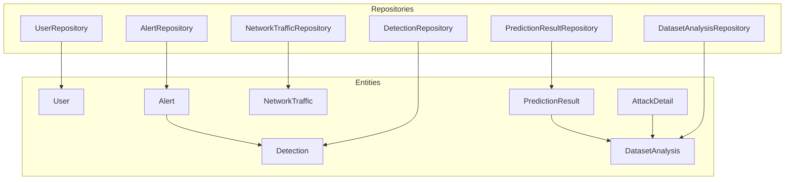
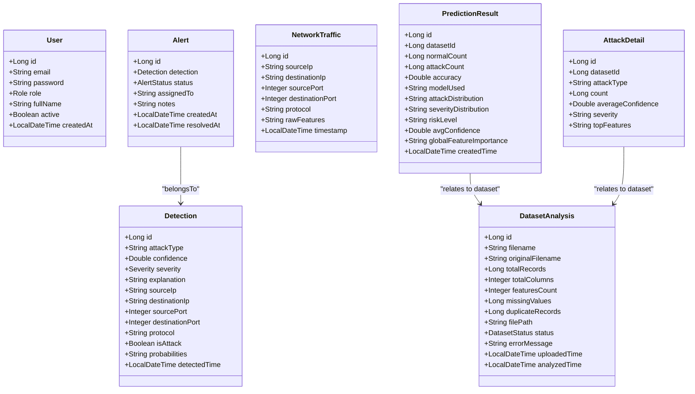
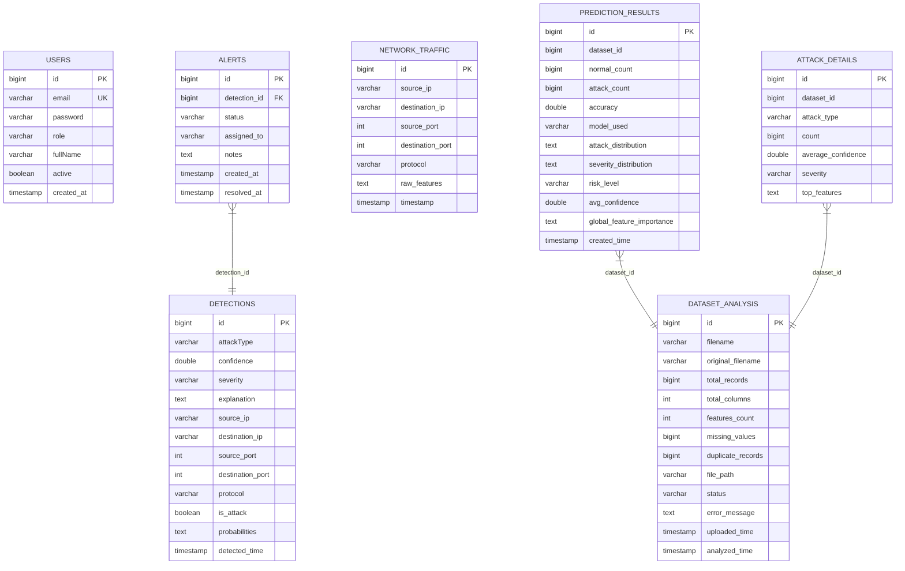
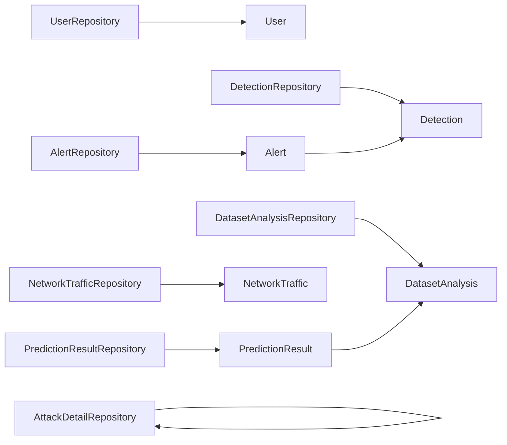

# Data Models & Database Schema

<cite>
**Referenced Files in This Document**
- [User.java](file://Mini_Project/backend/src/main/java/com/clinicalnids/backend/entity/User.java)
- [Detection.java](file://Mini_Project/backend/src/main/java/com/clinicalnids/backend/entity/Detection.java)
- [Alert.java](file://Mini_Project/backend/src/main/java/com/clinicalnids/backend/entity/Alert.java)
- [DatasetAnalysis.java](file://Mini_Project/backend/src/main/java/com/clinicalnids/backend/entity/DatasetAnalysis.java)
- [NetworkTraffic.java](file://Mini_Project/backend/src/main/java/com/clinicalnids/backend/entity/NetworkTraffic.java)
- [PredictionResult.java](file://Mini_Project/backend/src/main/java/com/clinicalnids/backend/entity/PredictionResult.java)
- [AttackDetail.java](file://Mini_Project/backend/src/main/java/com/clinicalnids/backend/entity/AttackDetail.java)
- [UserRepository.java](file://Mini_Project/backend/src/main/java/com/clinicalnids/backend/repository/UserRepository.java)
- [DetectionRepository.java](file://Mini_Project/backend/src/main/java/com/clinicalnids/backend/repository/DetectionRepository.java)
- [AlertRepository.java](file://Mini_Project/backend/src/main/java/com/clinicalnids/backend/repository/AlertRepository.java)
- [DatasetAnalysisRepository.java](file://Mini_Project/backend/src/main/java/com/clinicalnids/backend/repository/DatasetAnalysisRepository.java)
- [NetworkTrafficRepository.java](file://Mini_Project/backend/src/main/java/com/clinicalnids/backend/repository/NetworkTrafficRepository.java)
- [PredictionResultRepository.java](file://Mini_Project/backend/src/main/java/com/clinicalnids/backend/repository/PredictionResultRepository.java)
- [LoginRequest.java](file://Mini_Project/backend/src/main/java/com/clinicalnids/backend/dto/LoginRequest.java)
</cite>

## Table of Contents
1. [Introduction](#introduction)
2. [Project Structure](#project-structure)
3. [Core Components](#core-components)
4. [Architecture Overview](#architecture-overview)
5. [Detailed Component Analysis](#detailed-component-analysis)
6. [Dependency Analysis](#dependency-analysis)
7. [Performance Considerations](#performance-considerations)
8. [Troubleshooting Guide](#troubleshooting-guide)
9. [Conclusion](#conclusion)
10. [Appendices](#appendices)

## Introduction
This document provides comprehensive data model documentation for the Hibernate/JPA entity classes and database schema used in the healthcare cybersecurity monitoring system. It covers the domain model design, entity relationships, field definitions, primary and foreign keys, constraints, business rules, validation requirements, and practical query patterns. It also includes entity relationship diagrams, sample data examples, and guidance for database migrations, indexing, and performance optimization tailored for healthcare environments.

## Project Structure
The data model resides in the backend module under the entity package, with JPA repositories for persistence operations and DTOs for request validation. The entities represent core domain concepts: users, detections, alerts, dataset analysis, network traffic, and prediction results. Repositories expose typed CRUD and derived queries aligned with operational needs.

**Diagram sources**
- [User.java:1-45](file://Mini_Project/backend/src/main/java/com/clinicalnids/backend/entity/User.java#L1-L45)
- [Detection.java:1-54](file://Mini_Project/backend/src/main/java/com/clinicalnids/backend/entity/Detection.java#L1-L54)
- [Alert.java:1-44](file://Mini_Project/backend/src/main/java/com/clinicalnids/backend/entity/Alert.java#L1-L44)
- [DatasetAnalysis.java:1-58](file://Mini_Project/backend/src/main/java/com/clinicalnids/backend/entity/DatasetAnalysis.java#L1-L58)
- [NetworkTraffic.java:1-35](file://Mini_Project/backend/src/main/java/com/clinicalnids/backend/entity/NetworkTraffic.java#L1-L35)
- [PredictionResult.java:1-52](file://Mini_Project/backend/src/main/java/com/clinicalnids/backend/entity/PredictionResult.java#L1-L52)
- [AttackDetail.java:1-35](file://Mini_Project/backend/src/main/java/com/clinicalnids/backend/entity/AttackDetail.java#L1-L35)
- [UserRepository.java:1-14](file://Mini_Project/backend/src/main/java/com/clinicalnids/backend/repository/UserRepository.java#L1-L14)
- [DetectionRepository.java:1-18](file://Mini_Project/backend/src/main/java/com/clinicalnids/backend/repository/DetectionRepository.java#L1-L18)
- [AlertRepository.java:1-14](file://Mini_Project/backend/src/main/java/com/clinicalnids/backend/repository/AlertRepository.java#L1-L14)
- [DatasetAnalysisRepository.java:1-14](file://Mini_Project/backend/src/main/java/com/clinicalnids/backend/repository/DatasetAnalysisRepository.java#L1-L14)
- [NetworkTrafficRepository.java:1-10](file://Mini_Project/backend/src/main/java/com/clinicalnids/backend/repository/NetworkTrafficRepository.java#L1-L10)
- [PredictionResultRepository.java:1-15](file://Mini_Project/backend/src/main/java/com/clinicalnids/backend/repository/PredictionResultRepository.java#L1-L15)

**Section sources**
- [User.java:1-45](file://Mini_Project/backend/src/main/java/com/clinicalnids/backend/entity/User.java#L1-L45)
- [Detection.java:1-54](file://Mini_Project/backend/src/main/java/com/clinicalnids/backend/entity/Detection.java#L1-L54)
- [Alert.java:1-44](file://Mini_Project/backend/src/main/java/com/clinicalnids/backend/entity/Alert.java#L1-L44)
- [DatasetAnalysis.java:1-58](file://Mini_Project/backend/src/main/java/com/clinicalnids/backend/entity/DatasetAnalysis.java#L1-L58)
- [NetworkTraffic.java:1-35](file://Mini_Project/backend/src/main/java/com/clinicalnids/backend/entity/NetworkTraffic.java#L1-L35)
- [PredictionResult.java:1-52](file://Mini_Project/backend/src/main/java/com/clinicalnids/backend/entity/PredictionResult.java#L1-L52)
- [AttackDetail.java:1-35](file://Mini_Project/backend/src/main/java/com/clinicalnids/backend/entity/AttackDetail.java#L1-L35)
- [UserRepository.java:1-14](file://Mini_Project/backend/src/main/java/com/clinicalnids/backend/repository/UserRepository.java#L1-L14)
- [DetectionRepository.java:1-18](file://Mini_Project/backend/src/main/java/com/clinicalnids/backend/repository/DetectionRepository.java#L1-L18)
- [AlertRepository.java:1-14](file://Mini_Project/backend/src/main/java/com/clinicalnids/backend/repository/AlertRepository.java#L1-L14)
- [DatasetAnalysisRepository.java:1-14](file://Mini_Project/backend/src/main/java/com/clinicalnids/backend/repository/DatasetAnalysisRepository.java#L1-L14)
- [NetworkTrafficRepository.java:1-10](file://Mini_Project/backend/src/main/java/com/clinicalnids/backend/repository/NetworkTrafficRepository.java#L1-L10)
- [PredictionResultRepository.java:1-15](file://Mini_Project/backend/src/main/java/com/clinicalnids/backend/repository/PredictionResultRepository.java#L1-L15)

## Core Components
This section documents each entity’s fields, data types, constraints, and business rules. It also outlines enums and validation requirements.

- User
  - Purpose: Authenticates and authorizes system users.
  - Fields: id (PK), email (unique, not null), password (not null), role (not null, enum), fullName (not null), active (default true), createdAt (auto-populated).
  - Constraints: Unique email; non-null fields where annotated.
  - Enums: Role {ADMIN, SECURITY_ANALYST}.
  - Validation: Email and password presence enforced via DTOs.

- Detection
  - Purpose: Captures attack detection events with metadata and ML confidence.
  - Fields: id (PK), attackType (not null), confidence (not null), severity (not null, enum), explanation (TEXT), sourceIp, destinationIp, sourcePort, destinationPort, protocol, isAttack (boolean), probabilities (TEXT), detectedTime (auto-populated).
  - Enums: Severity {CRITICAL, HIGH, MEDIUM, LOW, NONE}.
  - Business rules: detectedTime defaults to now on creation.

- Alert
  - Purpose: Manages alert lifecycle linked to detections.
  - Fields: id (PK), detection (FK to Detection.id, not null), status (not null, enum), assignedTo, notes (TEXT), createdAt (auto-populated), resolvedAt.
  - Enums: AlertStatus {ACTIVE, PENDING, RESOLVED}.
  - Relationships: ManyToOne to Detection.

- DatasetAnalysis
  - Purpose: Tracks dataset upload, analysis lifecycle, and outcomes.
  - Fields: id (PK), filename (not null), originalFilename, totalRecords, totalColumns, featuresCount, missingValues, duplicateRecords, filePath (not null), status (not null, enum), errorMessage (TEXT), uploadedTime (auto-populated), analyzedTime.
  - Enums: DatasetStatus {UPLOADED, ANALYZING, COMPLETED, FAILED}.
  - Business rules: uploadedTime auto-set; status defaults to UPLOADED on create.

- NetworkTraffic
  - Purpose: Stores raw network traffic features for inference.
  - Fields: id (PK), sourceIp, destinationIp, sourcePort, destinationPort, protocol, rawFeatures (TEXT), timestamp (auto-populated).
  - Business rules: timestamp auto-set on creation.

- PredictionResult
  - Purpose: Stores aggregated ML model results per dataset.
  - Fields: id (PK), datasetId (not null), normalCount (not null), attackCount (not null), accuracy, modelUsed, attackDistribution (TEXT), severityDistribution (TEXT), riskLevel, avgConfidence, globalFeatureImportance (TEXT), createdTime (auto-populated).
  - Business rules: createdTime auto-set on creation.

- AttackDetail
  - Purpose: Aggregated statistics per attack type within a dataset.
  - Fields: id (PK), datasetId (not null), attackType (not null), count (not null), averageConfidence, severity (not null), topFeatures (TEXT).

**Section sources**
- [User.java:14-43](file://Mini_Project/backend/src/main/java/com/clinicalnids/backend/entity/User.java#L14-L43)
- [Detection.java:13-52](file://Mini_Project/backend/src/main/java/com/clinicalnids/backend/entity/Detection.java#L13-L52)
- [Alert.java:13-42](file://Mini_Project/backend/src/main/java/com/clinicalnids/backend/entity/Alert.java#L13-L42)
- [DatasetAnalysis.java:13-56](file://Mini_Project/backend/src/main/java/com/clinicalnids/backend/entity/DatasetAnalysis.java#L13-L56)
- [NetworkTraffic.java:13-33](file://Mini_Project/backend/src/main/java/com/clinicalnids/backend/entity/NetworkTraffic.java#L13-L33)
- [PredictionResult.java:13-50](file://Mini_Project/backend/src/main/java/com/clinicalnids/backend/entity/PredictionResult.java#L13-L50)
- [AttackDetail.java:12-33](file://Mini_Project/backend/src/main/java/com/clinicalnids/backend/entity/AttackDetail.java#L12-L33)

## Architecture Overview
The data model follows a layered architecture:
- Entities define the persistent schema and business semantics.
- Repositories encapsulate data access and derive queries for analytics and operational workflows.
- Controllers and Services orchestrate operations using repositories and DTOs for validation.

**Diagram sources**
- [User.java:13-43](file://Mini_Project/backend/src/main/java/com/clinicalnids/backend/entity/User.java#L13-L43)
- [Detection.java:13-52](file://Mini_Project/backend/src/main/java/com/clinicalnids/backend/entity/Detection.java#L13-L52)
- [Alert.java:13-42](file://Mini_Project/backend/src/main/java/com/clinicalnids/backend/entity/Alert.java#L13-L42)
- [DatasetAnalysis.java:13-56](file://Mini_Project/backend/src/main/java/com/clinicalnids/backend/entity/DatasetAnalysis.java#L13-L56)
- [NetworkTraffic.java:13-33](file://Mini_Project/backend/src/main/java/com/clinicalnids/backend/entity/NetworkTraffic.java#L13-L33)
- [PredictionResult.java:13-50](file://Mini_Project/backend/src/main/java/com/clinicalnids/backend/entity/PredictionResult.java#L13-L50)
- [AttackDetail.java:12-33](file://Mini_Project/backend/src/main/java/com/clinicalnids/backend/entity/AttackDetail.java#L12-L33)

## Detailed Component Analysis

### Entity Relationship Model
This section maps primary and foreign keys, relationships, and referential constraints.

**Diagram sources**
- [User.java:15-39](file://Mini_Project/backend/src/main/java/com/clinicalnids/backend/entity/User.java#L15-L39)
- [Detection.java:15-48](file://Mini_Project/backend/src/main/java/com/clinicalnids/backend/entity/Detection.java#L15-L48)
- [Alert.java:15-38](file://Mini_Project/backend/src/main/java/com/clinicalnids/backend/entity/Alert.java#L15-L38)
- [DatasetAnalysis.java:15-52](file://Mini_Project/backend/src/main/java/com/clinicalnids/backend/entity/DatasetAnalysis.java#L15-L52)
- [NetworkTraffic.java:15-33](file://Mini_Project/backend/src/main/java/com/clinicalnids/backend/entity/NetworkTraffic.java#L15-L33)
- [PredictionResult.java:15-50](file://Mini_Project/backend/src/main/java/com/clinicalnids/backend/entity/PredictionResult.java#L15-L50)
- [AttackDetail.java:14-33](file://Mini_Project/backend/src/main/java/com/clinicalnids/backend/entity/AttackDetail.java#L14-L33)

### Sample Data Examples
Below are representative rows illustrating typical records across entities.

- User
  - id: 1
  - email: "analyst@hospital.example"
  - role: "SECURITY_ANALYST"
  - fullName: "Jane Security"
  - active: true
  - createdAt: "2025-01-01T09:00:00"

- Detection
  - id: 1001
  - attackType: "DDoS"
  - confidence: 0.92
  - severity: "HIGH"
  - isAttack: true
  - detectedTime: "2025-01-10T14:30:00"

- Alert
  - id: 5001
  - detection_id: 1001
  - status: "ACTIVE"
  - createdAt: "2025-01-10T14:31:00"

- DatasetAnalysis
  - id: 2001
  - filename: "dataset_20250110.parquet"
  - filePath: "/data/uploads/dataset_20250110.parquet"
  - status: "COMPLETED"
  - uploadedTime: "2025-01-10T12:00:00"
  - analyzedTime: "2025-01-10T13:15:00"

- NetworkTraffic
  - id: 3001
  - sourceIp: "192.168.1.100"
  - destinationIp: "10.0.0.53"
  - sourcePort: 54321
  - destinationPort: 53
  - protocol: "UDP"
  - rawFeatures: "{...}"
  - timestamp: "2025-01-10T14:29:00"

- PredictionResult
  - id: 4001
  - dataset_id: 2001
  - normalCount: 9500
  - attackCount: 500
  - accuracy: 0.97
  - avgConfidence: 0.96
  - riskLevel: "MODERATE"
  - createdTime: "2025-01-10T13:30:00"

- AttackDetail
  - id: 6001
  - dataset_id: 2001
  - attackType: "PortScan"
  - count: 120
  - averageConfidence: 0.85
  - severity: "MEDIUM"
  - topFeatures: "{...}"

**Section sources**
- [User.java:15-39](file://Mini_Project/backend/src/main/java/com/clinicalnids/backend/entity/User.java#L15-L39)
- [Detection.java:15-48](file://Mini_Project/backend/src/main/java/com/clinicalnids/backend/entity/Detection.java#L15-L48)
- [Alert.java:15-38](file://Mini_Project/backend/src/main/java/com/clinicalnids/backend/entity/Alert.java#L15-L38)
- [DatasetAnalysis.java:15-52](file://Mini_Project/backend/src/main/java/com/clinicalnids/backend/entity/DatasetAnalysis.java#L15-L52)
- [NetworkTraffic.java:15-33](file://Mini_Project/backend/src/main/java/com/clinicalnids/backend/entity/NetworkTraffic.java#L15-L33)
- [PredictionResult.java:15-50](file://Mini_Project/backend/src/main/java/com/clinicalnids/backend/entity/PredictionResult.java#L15-L50)
- [AttackDetail.java:14-33](file://Mini_Project/backend/src/main/java/com/clinicalnids/backend/entity/AttackDetail.java#L14-L33)

### Common Query Patterns
Derived queries exposed by repositories enable efficient analytics and operational workflows.

- User
  - Find by email: UserRepository.findByEmail(email)
  - Exists by email: UserRepository.existsByEmail(email)

- Detection
  - Find all attacks: DetectionRepository.findByIsAttackTrue()
  - Filter by severity: DetectionRepository.findBySeverity(severity)
  - Filter by time window: DetectionRepository.findByDetectedTimeBetween(start, end)
  - Counts: DetectionRepository.countByIsAttackTrue(), DetectionRepository.countBySeverity(severity)

- Alert
  - Filter by status: AlertRepository.findByStatus(status)
  - Count by status: AlertRepository.countByStatus(status)

- DatasetAnalysis
  - Sort by upload time desc: DatasetAnalysisRepository.findAllByOrderByUploadedTimeDesc()
  - Filter by status: DatasetAnalysisRepository.findByStatus(status)

- NetworkTraffic
  - Standard CRUD via NetworkTrafficRepository

- PredictionResult
  - Find latest result by dataset: PredictionResultRepository.findByDatasetId(datasetId)
  - Sort by creation time desc: PredictionResultRepository.findAllByOrderByCreatedTimeDesc()

**Section sources**
- [UserRepository.java:10-13](file://Mini_Project/backend/src/main/java/com/clinicalnids/backend/repository/UserRepository.java#L10-L13)
- [DetectionRepository.java:11-17](file://Mini_Project/backend/src/main/java/com/clinicalnids/backend/repository/DetectionRepository.java#L11-L17)
- [AlertRepository.java:9-13](file://Mini_Project/backend/src/main/java/com/clinicalnids/backend/repository/AlertRepository.java#L9-L13)
- [DatasetAnalysisRepository.java:9-13](file://Mini_Project/backend/src/main/java/com/clinicalnids/backend/repository/DatasetAnalysisRepository.java#L9-L13)
- [NetworkTrafficRepository.java:7-9](file://Mini_Project/backend/src/main/java/com/clinicalnids/backend/repository/NetworkTrafficRepository.java#L7-L9)
- [PredictionResultRepository.java:10-14](file://Mini_Project/backend/src/main/java/com/clinicalnids/backend/repository/PredictionResultRepository.java#L10-L14)

### Data Validation Requirements
Validation ensures data integrity at the API boundary.

- LoginRequest enforces:
  - Non-blank email
  - RFC-compliant email format
  - Non-blank password

These constraints apply to incoming authentication requests and should be complemented by backend password policies and secure storage.

**Section sources**
- [LoginRequest.java:8-15](file://Mini_Project/backend/src/main/java/com/clinicalnids/backend/dto/LoginRequest.java#L8-L15)

## Dependency Analysis
This section maps repository-to-entity dependencies and highlights coupling.

**Diagram sources**
- [UserRepository.java:10-13](file://Mini_Project/backend/src/main/java/com/clinicalnids/backend/repository/UserRepository.java#L10-L13)
- [DetectionRepository.java:11-17](file://Mini_Project/backend/src/main/java/com/clinicalnids/backend/repository/DetectionRepository.java#L11-L17)
- [AlertRepository.java:9-13](file://Mini_Project/backend/src/main/java/com/clinicalnids/backend/repository/AlertRepository.java#L9-L13)
- [DatasetAnalysisRepository.java:9-13](file://Mini_Project/backend/src/main/java/com/clinicalnids/backend/repository/DatasetAnalysisRepository.java#L9-L13)
- [NetworkTrafficRepository.java:7-9](file://Mini_Project/backend/src/main/java/com/clinicalnids/backend/repository/NetworkTrafficRepository.java#L7-L9)
- [PredictionResultRepository.java:10-14](file://Mini_Project/backend/src/main/java/com/clinicalnids/backend/repository/PredictionResultRepository.java#L10-L14)
- [Alert.java:19-21](file://Mini_Project/backend/src/main/java/com/clinicalnids/backend/entity/Alert.java#L19-L21)
- [PredictionResult.java:19-20](file://Mini_Project/backend/src/main/java/com/clinicalnids/backend/entity/PredictionResult.java#L19-L20)
- [AttackDetail.java:18-19](file://Mini_Project/backend/src/main/java/com/clinicalnids/backend/entity/AttackDetail.java#L18-L19)

**Section sources**
- [UserRepository.java:10-13](file://Mini_Project/backend/src/main/java/com/clinicalnids/backend/repository/UserRepository.java#L10-L13)
- [DetectionRepository.java:11-17](file://Mini_Project/backend/src/main/java/com/clinicalnids/backend/repository/DetectionRepository.java#L11-L17)
- [AlertRepository.java:9-13](file://Mini_Project/backend/src/main/java/com/clinicalnids/backend/repository/AlertRepository.java#L9-L13)
- [DatasetAnalysisRepository.java:9-13](file://Mini_Project/backend/src/main/java/com/clinicalnids/backend/repository/DatasetAnalysisRepository.java#L9-L13)
- [NetworkTrafficRepository.java:7-9](file://Mini_Project/backend/src/main/java/com/clinicalnids/backend/repository/NetworkTrafficRepository.java#L7-L9)
- [PredictionResultRepository.java:10-14](file://Mini_Project/backend/src/main/java/com/clinicalnids/backend/repository/PredictionResultRepository.java#L10-L14)
- [Alert.java:19-21](file://Mini_Project/backend/src/main/java/com/clinicalnids/backend/entity/Alert.java#L19-L21)
- [PredictionResult.java:19-20](file://Mini_Project/backend/src/main/java/com/clinicalnids/backend/entity/PredictionResult.java#L19-L20)
- [AttackDetail.java:18-19](file://Mini_Project/backend/src/main/java/com/clinicalnids/backend/entity/AttackDetail.java#L18-L19)

## Performance Considerations
- Indexing recommendations
  - Users: Index on email for fast lookup during authentication and deduplication.
  - Detections: Composite index on (severity, detectedTime) for severity-based dashboards and time-range filtering.
  - Alerts: Index on (status, createdAt) for alert triage and SLA tracking.
  - DatasetAnalysis: Index on (status, uploadedTime) for ingestion and status monitoring.
  - NetworkTraffic: Index on (timestamp) and (sourceIp, destinationIp) for correlation and anomaly detection.
  - PredictionResult: Index on (datasetId, createdTime) for latest-result retrieval and audit trails.
  - AttackDetail: Index on (datasetId, attackType) for grouped analytics.

- Query optimization
  - Prefer projections and pagination for large result sets (e.g., paginated dataset listings).
  - Use derived queries with selective fields to reduce payload sizes.
  - Batch writes for bulk network traffic ingestion.

- Storage and retention
  - Archive old detections and alerts after compliance retention periods.
  - Compress large TEXT fields if storage pressure arises; evaluate columnar formats for analytics.

- Healthcare-specific considerations
  - Encrypt sensitive fields at rest and in transit.
  - Enforce strict access controls and audit logs for user and dataset operations.
  - Ensure GDPR/HiGHMED compliance for data minimization and anonymization.

[No sources needed since this section provides general guidance]

## Troubleshooting Guide
- Common issues and resolutions
  - Duplicate email on user creation: Ensure uniqueness constraint is respected; handle duplicate key exceptions and return appropriate error messages.
  - Missing detection linkage in alerts: Verify foreign key integrity; ensure Detection exists before creating Alert.
  - Orphaned prediction results: Validate datasetId references; clean up stale results when datasets are removed.
  - Inconsistent timestamps: Confirm PrePersist hooks are executed; check server time zone settings.

- Validation failures
  - LoginRequest validation errors indicate malformed email or blank password; enforce client-side checks and clear error messaging.

**Section sources**
- [UserRepository.java:11-12](file://Mini_Project/backend/src/main/java/com/clinicalnids/backend/repository/UserRepository.java#L11-L12)
- [Alert.java:19-21](file://Mini_Project/backend/src/main/java/com/clinicalnids/backend/entity/Alert.java#L19-L21)
- [PredictionResult.java:19-20](file://Mini_Project/backend/src/main/java/com/clinicalnids/backend/entity/PredictionResult.java#L19-L20)
- [LoginRequest.java:9-14](file://Mini_Project/backend/src/main/java/com/clinicalnids/backend/dto/LoginRequest.java#L9-L14)

## Conclusion
The data model supports a robust cybersecurity monitoring pipeline for healthcare environments. Entities and repositories are designed around clear business domains: identity and access, threat detection, alerting, dataset lifecycle, traffic ingestion, and ML insights. Derived queries enable efficient analytics and operations. Applying recommended indexing, validation, and retention strategies will ensure scalability, reliability, and compliance.

[No sources needed since this section summarizes without analyzing specific files]

## Appendices

### Appendix A: Entity Lifecycle Hooks
- PrePersist behaviors ensure timestamps are set consistently for User, Detection, Alert, DatasetAnalysis, NetworkTraffic, and PredictionResult.

**Section sources**
- [User.java:36-39](file://Mini_Project/backend/src/main/java/com/clinicalnids/backend/entity/User.java#L36-L39)
- [Detection.java:45-48](file://Mini_Project/backend/src/main/java/com/clinicalnids/backend/entity/Detection.java#L45-L48)
- [Alert.java:35-38](file://Mini_Project/backend/src/main/java/com/clinicalnids/backend/entity/Alert.java#L35-L38)
- [DatasetAnalysis.java:48-52](file://Mini_Project/backend/src/main/java/com/clinicalnids/backend/entity/DatasetAnalysis.java#L48-L52)
- [NetworkTraffic.java:30-33](file://Mini_Project/backend/src/main/java/com/clinicalnids/backend/entity/NetworkTraffic.java#L30-L33)
- [PredictionResult.java:47-50](file://Mini_Project/backend/src/main/java/com/clinicalnids/backend/entity/PredictionResult.java#L47-L50)

### Appendix B: Enumerations and Defaults
- Role: ADMIN, SECURITY_ANALYST
- Severity: CRITICAL, HIGH, MEDIUM, LOW, NONE
- AlertStatus: ACTIVE, PENDING, RESOLVED
- DatasetStatus: UPLOADED, ANALYZING, COMPLETED, FAILED

**Section sources**
- [User.java:41-43](file://Mini_Project/backend/src/main/java/com/clinicalnids/backend/entity/User.java#L41-L43)
- [Detection.java:50-52](file://Mini_Project/backend/src/main/java/com/clinicalnids/backend/entity/Detection.java#L50-L52)
- [Alert.java:40-42](file://Mini_Project/backend/src/main/java/com/clinicalnids/backend/entity/Alert.java#L40-L42)
- [DatasetAnalysis.java:54-56](file://Mini_Project/backend/src/main/java/com/clinicalnids/backend/entity/DatasetAnalysis.java#L54-L56)