# Dataset Analysis Entities

<cite>
**Referenced Files in This Document**
- [DatasetAnalysis.java](file://Mini_Project/backend/src/main/java/com/clinicalnids/backend/entity/DatasetAnalysis.java)
- [NetworkTraffic.java](file://Mini_Project/backend/src/main/java/com/clinicalnids/backend/entity/NetworkTraffic.java)
- [PredictionResult.java](file://Mini_Project/backend/src/main/java/com/clinicalnids/backend/entity/PredictionResult.java)
- [DatasetService.java](file://Mini_Project/backend/src/main/java/com/clinicalnids/backend/service/DatasetService.java)
- [DatasetController.java](file://Mini_Project/backend/src/main/java/com/clinicalnids/backend/controller/DatasetController.java)
- [DatasetAnalysisResponse.java](file://Mini_Project/backend/src/main/java/com/clinicalnids/backend/dto/DatasetAnalysisResponse.java)
- [DatasetUploadResponse.java](file://Mini_Project/backend/src/main/java/com/clinicalnids/backend/dto/DatasetUploadResponse.java)
- [DatasetAnalysisRepository.java](file://Mini_Project/backend/src/main/java/com/clinicalnids/backend/repository/DatasetAnalysisRepository.java)
- [PredictionResultRepository.java](file://Mini_Project/backend/src/main/java/com/clinicalnids/backend/repository/PredictionResultRepository.java)
- [AttackDetail.java](file://Mini_Project/backend/src/main/java/com/clinicalnids/backend/entity/AttackDetail.java)
- [AttackDetailRepository.java](file://Mini_Project/backend/src/main/java/com/clinicalnids/backend/repository/AttackDetailRepository.java)
- [ReportService.java](file://Mini_Project/backend/src/main/java/com/clinicalnids/backend/service/ReportService.java)
- [application.properties](file://Mini_Project/backend/src/main/resources/application.properties)
- [app.py](file://Mini_Project/ml-service/app.py)
- [prediction_engine.py](file://Mini_Project/ml-service/prediction_engine.py)
</cite>

## Table of Contents
1. [Introduction](#introduction)
2. [Project Structure](#project-structure)
3. [Core Components](#core-components)
4. [Architecture Overview](#architecture-overview)
5. [Detailed Component Analysis](#detailed-component-analysis)
6. [Dependency Analysis](#dependency-analysis)
7. [Performance Considerations](#performance-considerations)
8. [Troubleshooting Guide](#troubleshooting-guide)
9. [Conclusion](#conclusion)

## Introduction
This document explains the dataset analysis subsystem focusing on three core entities: DatasetAnalysis, NetworkTraffic, and PredictionResult. It covers the dataset upload workflow, batch processing capabilities, and prediction result storage. It also documents how NetworkTraffic captures network flow features, how DatasetAnalysis records statistical analysis outcomes, and how PredictionResult stores per-dataset predictions and SHAP explanations. The integration with the machine learning service is described end-to-end, including validation rules, batch processing workflows, and report generation.

## Project Structure
The dataset analysis feature spans the Spring Boot backend and the Python-based ML service:
- Backend (Spring Boot):
  - Entities define persisted models for datasets, traffic, and results.
  - Services orchestrate uploads, analysis, and result persistence.
  - Controllers expose REST endpoints for upload, analysis, retrieval, and reports.
  - Repositories manage persistence.
  - ReportService generates PDF reports.
- ML Service (FastAPI):
  - Handles dataset upload, validation, preprocessing, batch prediction, SHAP explanations, and aggregation.
  - Exposes endpoints consumed by the backend.

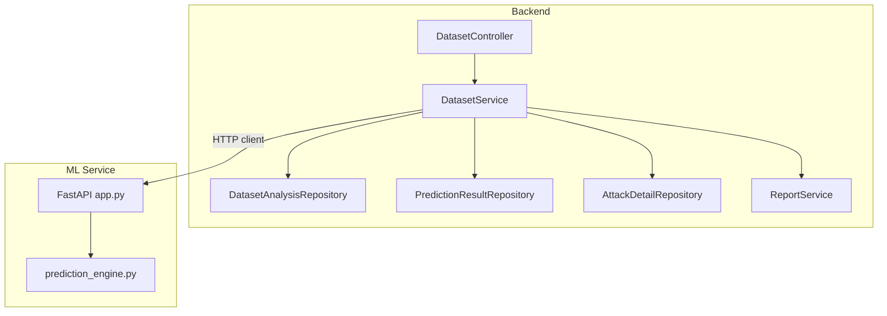

**Diagram sources**
- [DatasetController.java:19-95](file://Mini_Project/backend/src/main/java/com/clinicalnids/backend/controller/DatasetController.java#L19-L95)
- [DatasetService.java:30-56](file://Mini_Project/backend/src/main/java/com/clinicalnids/backend/service/DatasetService.java#L30-L56)
- [DatasetAnalysisRepository.java:9-13](file://Mini_Project/backend/src/main/java/com/clinicalnids/backend/repository/DatasetAnalysisRepository.java#L9-L13)
- [PredictionResultRepository.java:10-14](file://Mini_Project/backend/src/main/java/com/clinicalnids/backend/repository/PredictionResultRepository.java#L10-L14)
- [AttackDetailRepository.java:9-12](file://Mini_Project/backend/src/main/java/com/clinicalnids/backend/repository/AttackDetailRepository.java#L9-L12)
- [ReportService.java:20-287](file://Mini_Project/backend/src/main/java/com/clinicalnids/backend/service/ReportService.java#L20-L287)
- [app.py:253-393](file://Mini_Project/ml-service/app.py#L253-L393)
- [prediction_engine.py:70-413](file://Mini_Project/ml-service/prediction_engine.py#L70-L413)

**Section sources**
- [DatasetController.java:19-95](file://Mini_Project/backend/src/main/java/com/clinicalnids/backend/controller/DatasetController.java#L19-L95)
- [DatasetService.java:30-56](file://Mini_Project/backend/src/main/java/com/clinicalnids/backend/service/DatasetService.java#L30-L56)
- [app.py:253-393](file://Mini_Project/ml-service/app.py#L253-L393)

## Core Components
This section describes the three primary entities and their roles in the dataset analysis pipeline.

- DatasetAnalysis
  - Persists dataset metadata and analysis status.
  - Tracks total records, columns, features, missing values, duplicates, and timestamps.
  - Status lifecycle: UPLOADED → ANALYZING → COMPLETED or FAILED.
- NetworkTraffic
  - Captures per-flow features extracted from PCAP-derived datasets.
  - Stores source/destination IP/port, protocol, and raw feature JSON.
  - Timestamp defaults to current time on creation.
- PredictionResult
  - Stores aggregated results for a dataset: counts, accuracy, risk level, and feature importance.
  - Contains JSON blobs for attack/severity distributions and global feature importance.
  - Links to a dataset via datasetId.

**Section sources**
- [DatasetAnalysis.java:7-56](file://Mini_Project/backend/src/main/java/com/clinicalnids/backend/entity/DatasetAnalysis.java#L7-L56)
- [NetworkTraffic.java:7-34](file://Mini_Project/backend/src/main/java/com/clinicalnids/backend/entity/NetworkTraffic.java#L7-L34)
- [PredictionResult.java:7-50](file://Mini_Project/backend/src/main/java/com/clinicalnids/backend/entity/PredictionResult.java#L7-L50)

## Architecture Overview
The backend orchestrates dataset lifecycle and integrates with the ML service for analysis and explanations.

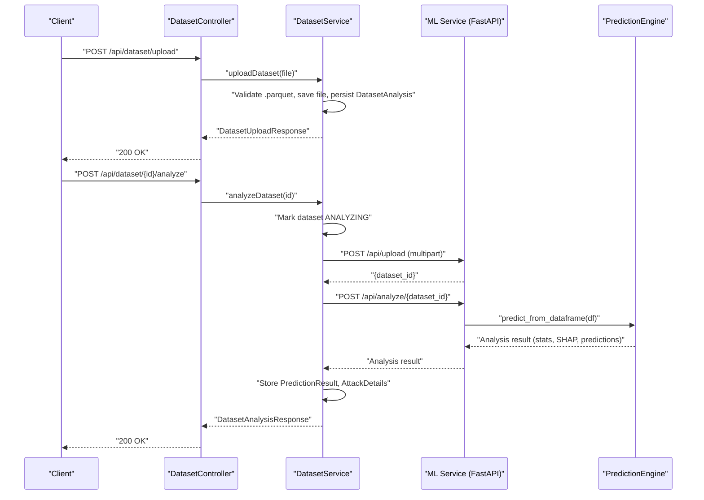

**Diagram sources**
- [DatasetController.java:31-48](file://Mini_Project/backend/src/main/java/com/clinicalnids/backend/controller/DatasetController.java#L31-L48)
- [DatasetService.java:62-155](file://Mini_Project/backend/src/main/java/com/clinicalnids/backend/service/DatasetService.java#L62-L155)
- [app.py:253-347](file://Mini_Project/ml-service/app.py#L253-L347)
- [prediction_engine.py:115-366](file://Mini_Project/ml-service/prediction_engine.py#L115-L366)

## Detailed Component Analysis

### DatasetAnalysis Entity
DatasetAnalysis tracks dataset metadata and analysis progress. It includes:
- Identifiers and file metadata (filename, originalFilename, filePath).
- Statistics counters (totalRecords, totalColumns, featuresCount, missingValues, duplicateRecords).
- Status with lifecycle transitions and optional error messages.
- Timestamps for upload and analysis completion.

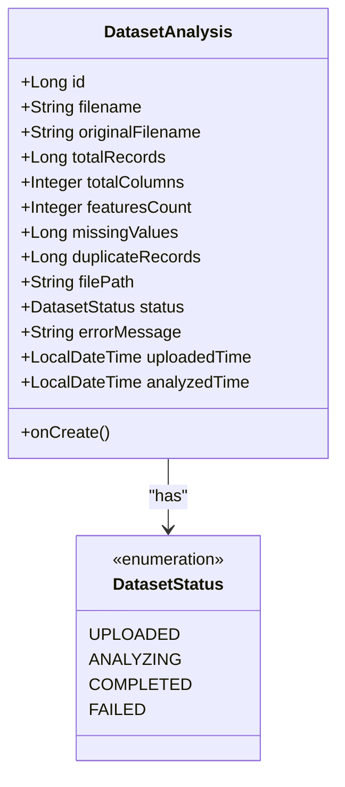

**Diagram sources**
- [DatasetAnalysis.java:13-56](file://Mini_Project/backend/src/main/java/com/clinicalnids/backend/entity/DatasetAnalysis.java#L13-L56)

**Section sources**
- [DatasetAnalysis.java:7-56](file://Mini_Project/backend/src/main/java/com/clinicalnids/backend/entity/DatasetAnalysis.java#L7-L56)

### NetworkTraffic Entity
NetworkTraffic represents a single network flow captured from PCAP-derived datasets. It includes:
- Endpoint identifiers (sourceIp, destinationIp, sourcePort, destinationPort, protocol).
- Raw feature JSON blob for downstream processing.
- Automatic timestamp on creation.

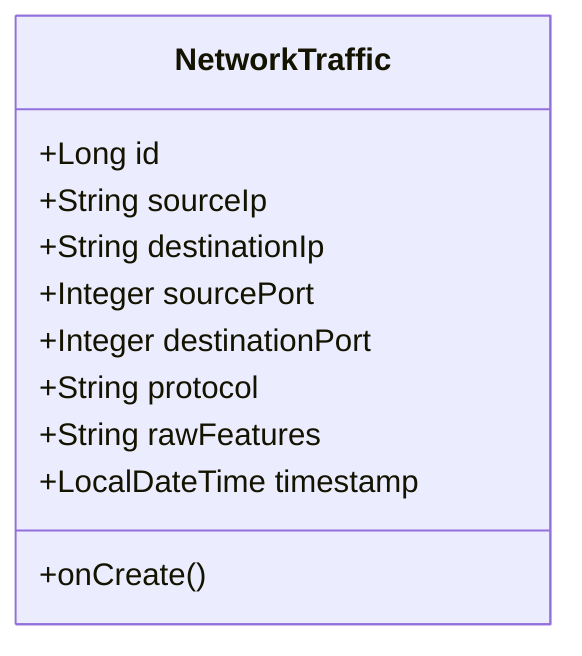

**Diagram sources**
- [NetworkTraffic.java:13-34](file://Mini_Project/backend/src/main/java/com/clinicalnids/backend/entity/NetworkTraffic.java#L13-L34)

**Section sources**
- [NetworkTraffic.java:7-34](file://Mini_Project/backend/src/main/java/com/clinicalnids/backend/entity/NetworkTraffic.java#L7-L34)

### PredictionResult Entity
PredictionResult aggregates dataset-wide results:
- Counts for normal and attack flows, accuracy, and risk level.
- JSON-encoded distributions for attack and severity.
- Global feature importance derived from SHAP.
- Timestamp on creation.

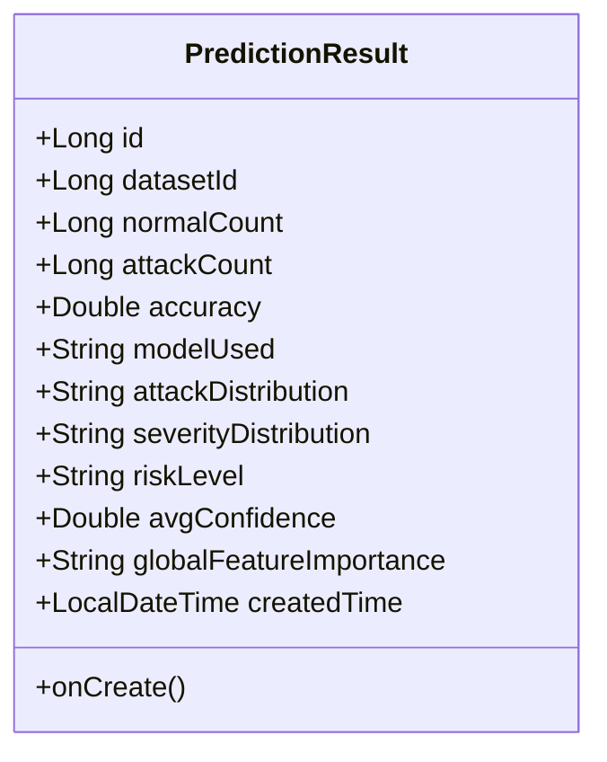

**Diagram sources**
- [PredictionResult.java:13-50](file://Mini_Project/backend/src/main/java/com/clinicalnids/backend/entity/PredictionResult.java#L13-L50)

**Section sources**
- [PredictionResult.java:7-50](file://Mini_Project/backend/src/main/java/com/clinicalnids/backend/entity/PredictionResult.java#L7-L50)

### Dataset Upload Workflow
The upload process validates file type, persists the dataset record, and triggers automatic analysis.

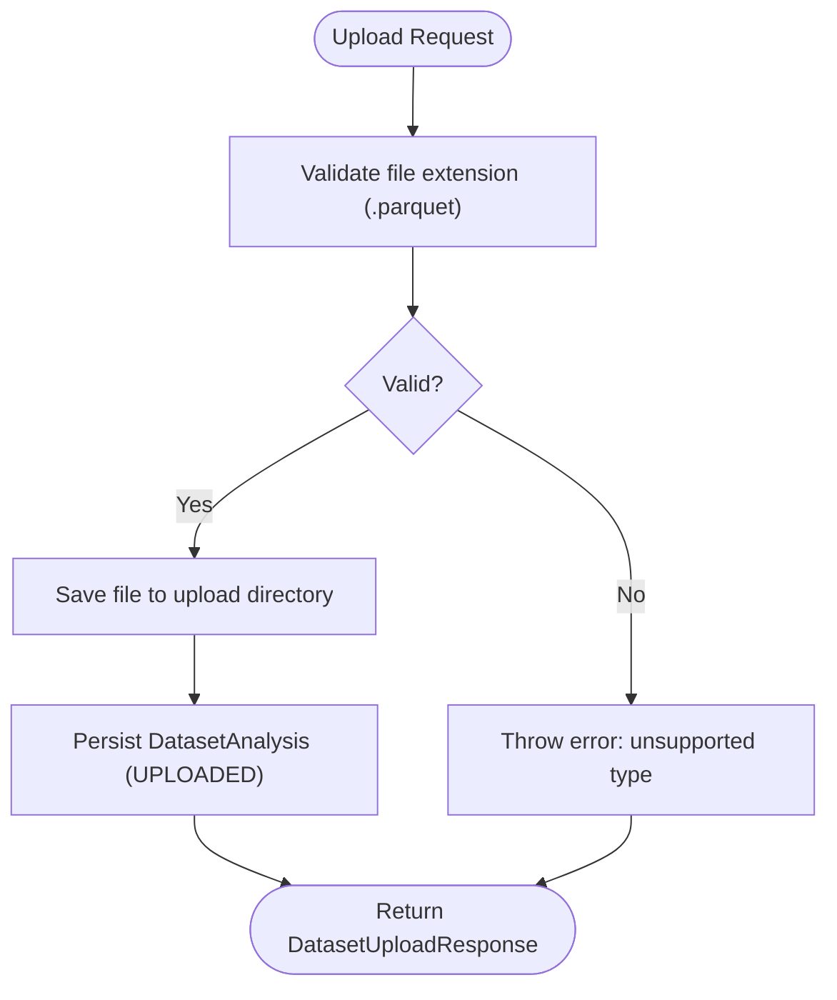

**Diagram sources**
- [DatasetService.java:62-97](file://Mini_Project/backend/src/main/java/com/clinicalnids/backend/service/DatasetService.java#L62-L97)

**Section sources**
- [DatasetService.java:62-97](file://Mini_Project/backend/src/main/java/com/clinicalnids/backend/service/DatasetService.java#L62-L97)

### Dataset Analysis Workflow and Batch Processing
The analysis workflow performs validation, preprocessing, batch prediction, SHAP explanations, and aggregation.

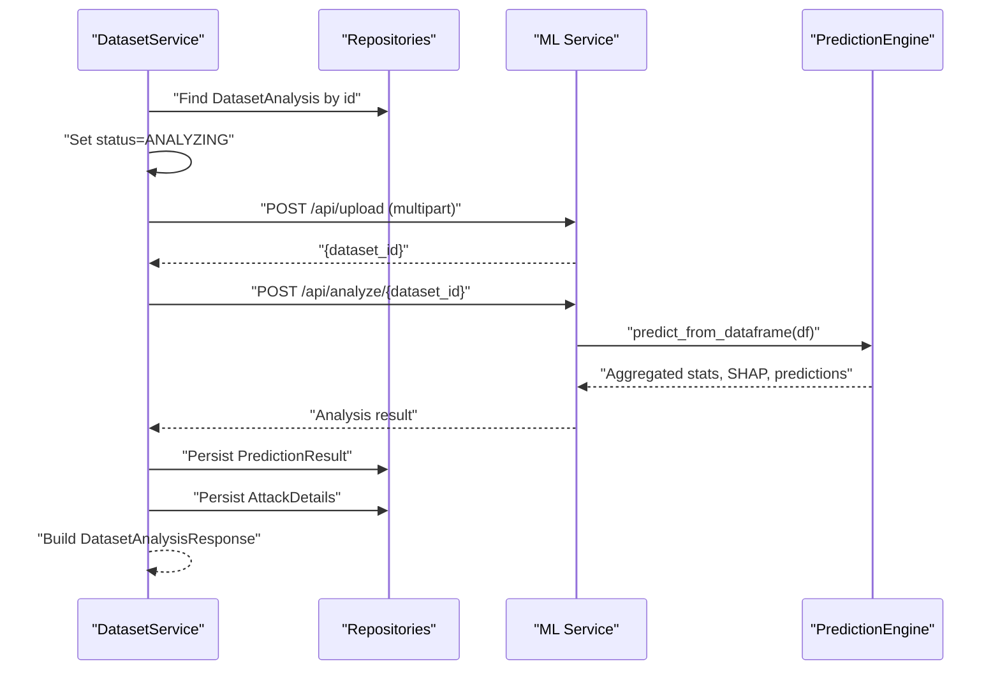

**Diagram sources**
- [DatasetService.java:102-155](file://Mini_Project/backend/src/main/java/com/clinicalnids/backend/service/DatasetService.java#L102-L155)
- [app.py:295-347](file://Mini_Project/ml-service/app.py#L295-L347)
- [prediction_engine.py:115-366](file://Mini_Project/ml-service/prediction_engine.py#L115-L366)

**Section sources**
- [DatasetService.java:102-155](file://Mini_Project/backend/src/main/java/com/clinicalnids/backend/service/DatasetService.java#L102-L155)
- [app.py:295-347](file://Mini_Project/ml-service/app.py#L295-L347)
- [prediction_engine.py:115-366](file://Mini_Project/ml-service/prediction_engine.py#L115-L366)

### Prediction Result Storage and Retrieval
Stored results include:
- Aggregated counts, accuracy, risk level, and confidence.
- JSON-encoded distributions for attack and severity.
- Global feature importance derived from SHAP.
Retrieval reconstructs DTOs from stored JSON fields and repository-backed attack details.

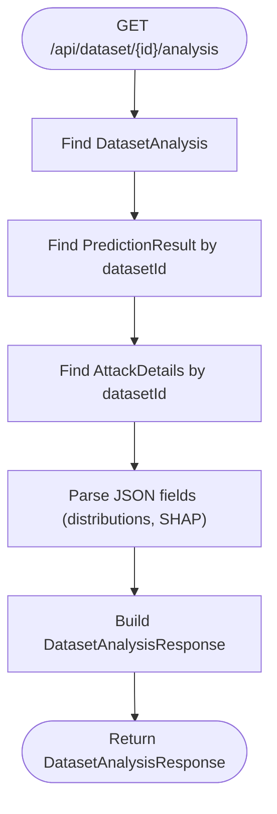

**Diagram sources**
- [DatasetService.java:283-379](file://Mini_Project/backend/src/main/java/com/clinicalnids/backend/service/DatasetService.java#L283-L379)

**Section sources**
- [DatasetService.java:283-379](file://Mini_Project/backend/src/main/java/com/clinicalnids/backend/service/DatasetService.java#L283-L379)

### Data Validation Rules
Validation occurs in two stages:
- Backend upload validation enforces .parquet file type.
- ML service validation checks dataset presence and prevents concurrent analysis.

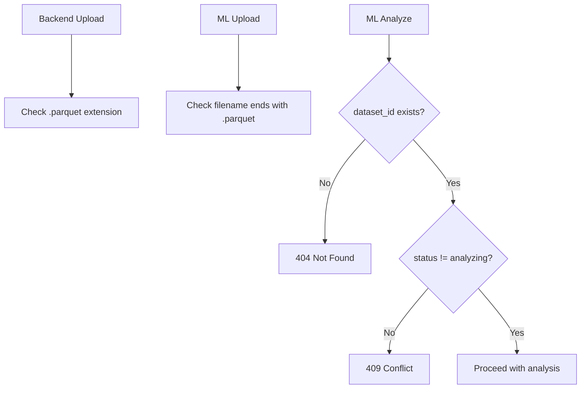

**Diagram sources**
- [DatasetService.java:64-67](file://Mini_Project/backend/src/main/java/com/clinicalnids/backend/service/DatasetService.java#L64-L67)
- [app.py:261-265](file://Mini_Project/ml-service/app.py#L261-L265)
- [app.py:309-314](file://Mini_Project/ml-service/app.py#L309-L314)

**Section sources**
- [DatasetService.java:64-67](file://Mini_Project/backend/src/main/java/com/clinicalnids/backend/service/DatasetService.java#L64-L67)
- [app.py:261-265](file://Mini_Project/ml-service/app.py#L261-L265)
- [app.py:309-314](file://Mini_Project/ml-service/app.py#L309-L314)

### Integration with Machine Learning Service
The backend integrates with the ML service via HTTP:
- Uses WebClient configured with base URL from application properties.
- Uploads datasets as multipart/form-data.
- Triggers analysis and retrieves results for persistence.

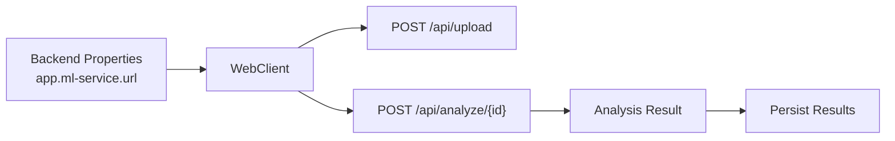

**Diagram sources**
- [application.properties:32-33](file://Mini_Project/backend/src/main/resources/application.properties#L32-L33)
- [DatasetService.java:48-55](file://Mini_Project/backend/src/main/java/com/clinicalnids/backend/service/DatasetService.java#L48-L55)
- [app.py:253-347](file://Mini_Project/ml-service/app.py#L253-L347)

**Section sources**
- [application.properties:32-33](file://Mini_Project/backend/src/main/resources/application.properties#L32-L33)
- [DatasetService.java:48-55](file://Mini_Project/backend/src/main/java/com/clinicalnids/backend/service/DatasetService.java#L48-L55)
- [app.py:253-347](file://Mini_Project/ml-service/app.py#L253-L347)

### Report Generation
The backend generates a PDF report from analysis results using iText.

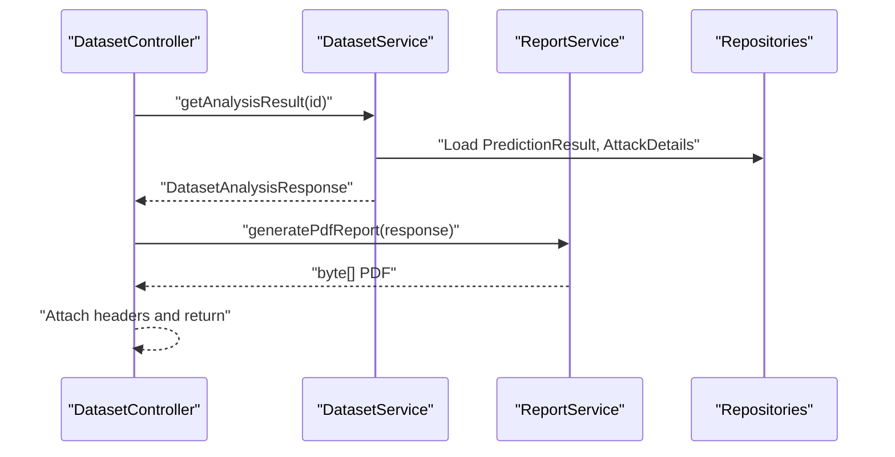

**Diagram sources**
- [DatasetController.java:62-74](file://Mini_Project/backend/src/main/java/com/clinicalnids/backend/controller/DatasetController.java#L62-L74)
- [DatasetService.java:283-379](file://Mini_Project/backend/src/main/java/com/clinicalnids/backend/service/DatasetService.java#L283-L379)
- [ReportService.java:35-231](file://Mini_Project/backend/src/main/java/com/clinicalnids/backend/service/ReportService.java#L35-L231)

**Section sources**
- [DatasetController.java:62-74](file://Mini_Project/backend/src/main/java/com/clinicalnids/backend/controller/DatasetController.java#L62-L74)
- [DatasetService.java:283-379](file://Mini_Project/backend/src/main/java/com/clinicalnids/backend/service/DatasetService.java#L283-L379)
- [ReportService.java:35-231](file://Mini_Project/backend/src/main/java/com/clinicalnids/backend/service/ReportService.java#L35-L231)

## Dependency Analysis
The backend components depend on repositories and DTOs, while the ML service encapsulates prediction logic.

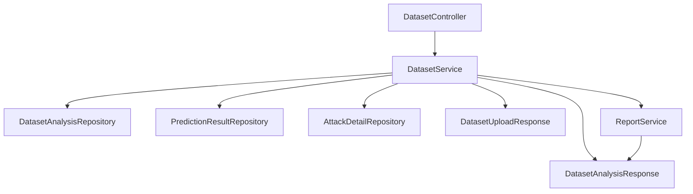

**Diagram sources**
- [DatasetService.java:35-52](file://Mini_Project/backend/src/main/java/com/clinicalnids/backend/service/DatasetService.java#L35-L52)
- [DatasetController.java:23-28](file://Mini_Project/backend/src/main/java/com/clinicalnids/backend/controller/DatasetController.java#L23-L28)
- [DatasetAnalysisRepository.java:9-13](file://Mini_Project/backend/src/main/java/com/clinicalnids/backend/repository/DatasetAnalysisRepository.java#L9-L13)
- [PredictionResultRepository.java:10-14](file://Mini_Project/backend/src/main/java/com/clinicalnids/backend/repository/PredictionResultRepository.java#L10-L14)
- [AttackDetailRepository.java:9-12](file://Mini_Project/backend/src/main/java/com/clinicalnids/backend/repository/AttackDetailRepository.java#L9-L12)
- [DatasetAnalysisResponse.java:8-68](file://Mini_Project/backend/src/main/java/com/clinicalnids/backend/dto/DatasetAnalysisResponse.java#L8-L68)
- [DatasetUploadResponse.java:6-14](file://Mini_Project/backend/src/main/java/com/clinicalnids/backend/dto/DatasetUploadResponse.java#L6-L14)
- [ReportService.java:20-287](file://Mini_Project/backend/src/main/java/com/clinicalnids/backend/service/ReportService.java#L20-L287)

**Section sources**
- [DatasetService.java:35-52](file://Mini_Project/backend/src/main/java/com/clinicalnids/backend/service/DatasetService.java#L35-L52)
- [DatasetController.java:23-28](file://Mini_Project/backend/src/main/java/com/clinicalnids/backend/controller/DatasetController.java#L23-L28)
- [DatasetAnalysisRepository.java:9-13](file://Mini_Project/backend/src/main/java/com/clinicalnids/backend/repository/DatasetAnalysisRepository.java#L9-L13)
- [PredictionResultRepository.java:10-14](file://Mini_Project/backend/src/main/java/com/clinicalnids/backend/repository/PredictionResultRepository.java#L10-L14)
- [AttackDetailRepository.java:9-12](file://Mini_Project/backend/src/main/java/com/clinicalnids/backend/repository/AttackDetailRepository.java#L9-L12)
- [DatasetAnalysisResponse.java:8-68](file://Mini_Project/backend/src/main/java/com/clinicalnids/backend/dto/DatasetAnalysisResponse.java#L8-L68)
- [DatasetUploadResponse.java:6-14](file://Mini_Project/backend/src/main/java/com/clinicalnids/backend/dto/DatasetUploadResponse.java#L6-L14)
- [ReportService.java:20-287](file://Mini_Project/backend/src/main/java/com/clinicalnids/backend/service/ReportService.java#L20-L287)

## Performance Considerations
- Large dataset timeouts: The backend sets explicit timeouts for ML service calls to handle large files.
- JSON parsing overhead: Storing distributions and feature importance as JSON avoids complex joins but requires parsing on retrieval.
- Batch prediction: The ML service computes SHAP explanations for a sample of attack rows to balance accuracy and performance.
- Memory limits: The ML service maintains a bounded detection history for live traffic; similar constraints should be considered for large uploads.

[No sources needed since this section provides general guidance]

## Troubleshooting Guide
Common issues and resolutions:
- Unsupported file type: Ensure uploads are .parquet files; otherwise, validation fails early.
- ML service connectivity: Verify the ML service URL property and service availability.
- Analysis failures: The backend marks datasets FAILED with error messages; inspect logs for stack traces.
- JSON parsing errors: Stored JSON fields are parsed defensively; malformed JSON leads to warnings and empty fields.

**Section sources**
- [DatasetService.java:64-67](file://Mini_Project/backend/src/main/java/com/clinicalnids/backend/service/DatasetService.java#L64-L67)
- [DatasetService.java:148-154](file://Mini_Project/backend/src/main/java/com/clinicalnids/backend/service/DatasetService.java#L148-L154)
- [DatasetService.java:309-311](file://Mini_Project/backend/src/main/java/com/clinicalnids/backend/service/DatasetService.java#L309-L311)
- [application.properties:32-33](file://Mini_Project/backend/src/main/resources/application.properties#L32-L33)

## Conclusion
The dataset analysis subsystem integrates backend orchestration with an ML service to deliver robust dataset uploads, batch analysis, and explainable AI insights. Entities DatasetAnalysis, NetworkTraffic, and PredictionResult capture metadata, raw features, and aggregated results respectively. The workflow ensures validation, persistence, and report generation, with clear separation of concerns between the backend and ML service layers.