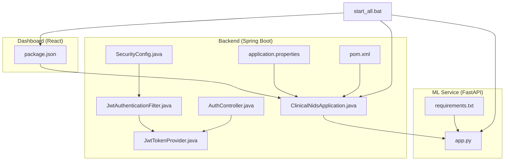
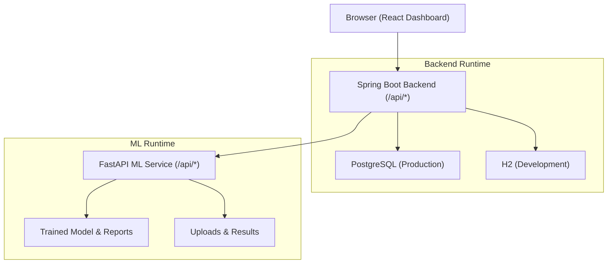
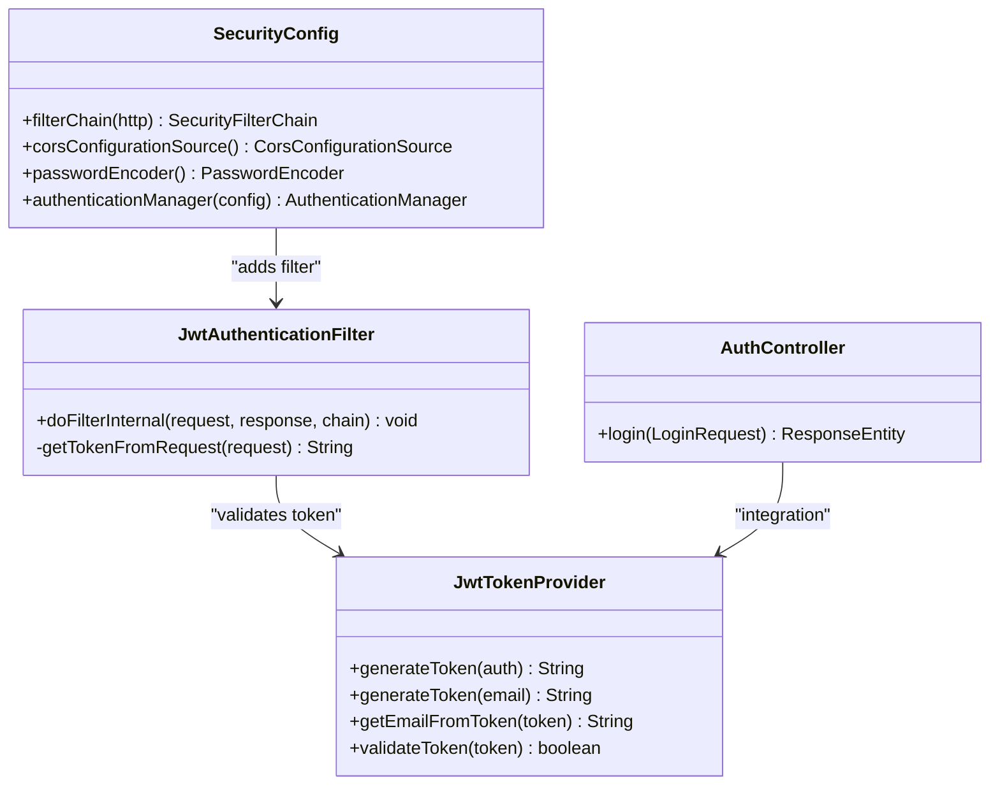
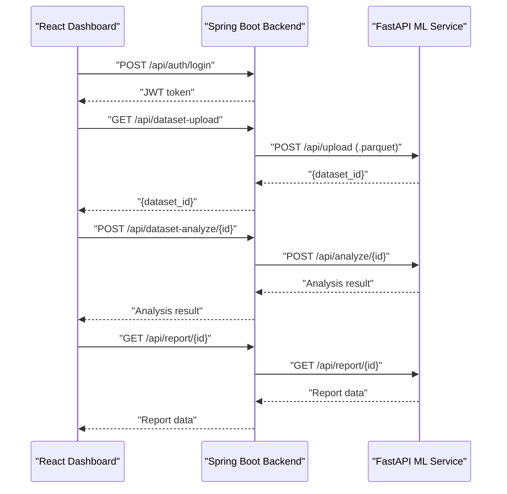
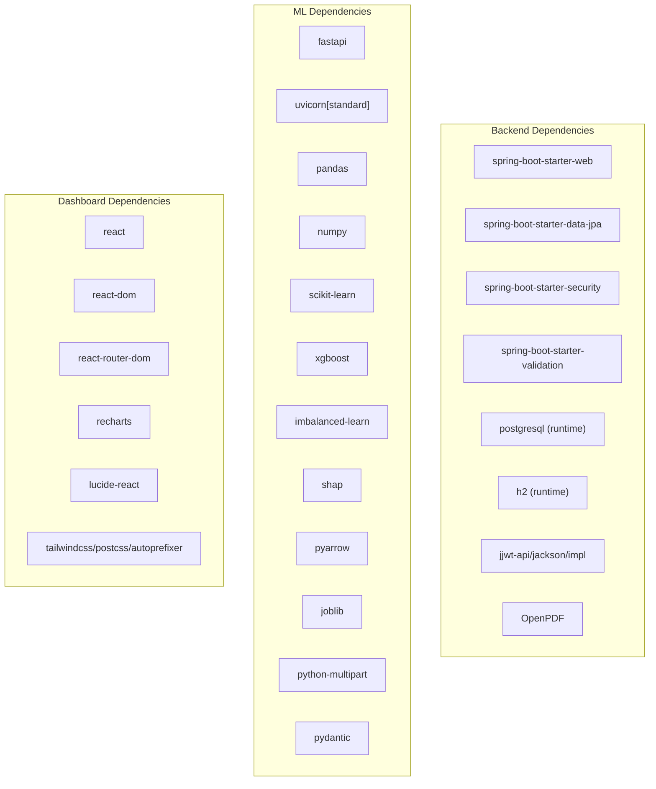

# Deployment & Configuration

<cite>
**Referenced Files in This Document**
- [application.properties](file://Mini_Project/backend/src/main/resources/application.properties)
- [pom.xml](file://Mini_Project/backend/pom.xml)
- [ClinicalNidsApplication.java](file://Mini_Project/backend/src/main/java/com/clinicalnids/backend/ClinicalNidsApplication.java)
- [SecurityConfig.java](file://Mini_Project/backend/src/main/java/com/clinicalnids/backend/config/SecurityConfig.java)
- [JwtAuthenticationFilter.java](file://Mini_Project/backend/src/main/java/com/clinicalnids/backend/security/JwtAuthenticationFilter.java)
- [JwtTokenProvider.java](file://Mini_Project/backend/src/main/java/com/clinicalnids/backend/security/JwtTokenProvider.java)
- [AuthController.java](file://Mini_Project/backend/src/main/java/com/clinicalnids/backend/controller/AuthController.java)
- [LoginRequest.java](file://Mini_Project/backend/src/main/java/com/clinicalnids/backend/dto/LoginRequest.java)
- [app.py](file://Mini_Project/ml-service/app.py)
- [requirements.txt](file://Mini_Project/ml-service/requirements.txt)
- [package.json](file://Mini_Project/clinical-nids-dashboard/package.json)
- [start_all.bat](file://Mini_Project/start_all.bat)
- [README.md](file://README.md)
</cite>

## Table of Contents
1. [Introduction](#introduction)
2. [Project Structure](#project-structure)
3. [Core Components](#core-components)
4. [Architecture Overview](#architecture-overview)
5. [Detailed Component Analysis](#detailed-component-analysis)
6. [Dependency Analysis](#dependency-analysis)
7. [Performance Considerations](#performance-considerations)
8. [Troubleshooting Guide](#troubleshooting-guide)
9. [Conclusion](#conclusion)
10. [Appendices](#appendices)

## Introduction
This document provides comprehensive deployment and configuration guidance for the Clinical-NIDS healthcare network security system. It covers environment configuration, containerization strategies, production setup, database connection management, API endpoint configuration, security parameter tuning, logging configuration, Kubernetes deployment patterns, load balancing considerations, monitoring setup, development versus production differences, configuration management, secrets handling, scaling strategies, backup procedures, and disaster recovery planning tailored for healthcare environments.

## Project Structure
The system comprises three primary components:
- Spring Boot backend service exposing REST APIs and managing authentication and security.
- FastAPI machine learning service providing dataset upload, analysis, prediction, and reporting endpoints.
- React-based dashboard for visualization and user interaction.

**Diagram sources**
- [ClinicalNidsApplication.java:1-12](file://Mini_Project/backend/src/main/java/com/clinicalnids/backend/ClinicalNidsApplication.java#L1-L12)
- [SecurityConfig.java:1-73](file://Mini_Project/backend/src/main/java/com/clinicalnids/backend/config/SecurityConfig.java#L1-L73)
- [JwtAuthenticationFilter.java:1-56](file://Mini_Project/backend/src/main/java/com/clinicalnids/backend/security/JwtAuthenticationFilter.java#L1-L56)
- [JwtTokenProvider.java:1-71](file://Mini_Project/backend/src/main/java/com/clinicalnids/backend/security/JwtTokenProvider.java#L1-L71)
- [AuthController.java:1-25](file://Mini_Project/backend/src/main/java/com/clinicalnids/backend/controller/AuthController.java#L1-L25)
- [application.properties:1-46](file://Mini_Project/backend/src/main/resources/application.properties#L1-L46)
- [pom.xml:1-125](file://Mini_Project/backend/pom.xml#L1-L125)
- [app.py:1-1199](file://Mini_Project/ml-service/app.py#L1-L1199)
- [requirements.txt:1-13](file://Mini_Project/ml-service/requirements.txt#L1-L13)
- [package.json:1-31](file://Mini_Project/clinical-nids-dashboard/package.json#L1-L31)
- [start_all.bat:1-59](file://Mini_Project/start_all.bat#L1-L59)

**Section sources**
- [ClinicalNidsApplication.java:1-12](file://Mini_Project/backend/src/main/java/com/clinicalnids/backend/ClinicalNidsApplication.java#L1-L12)
- [application.properties:1-46](file://Mini_Project/backend/src/main/resources/application.properties#L1-L46)
- [pom.xml:1-125](file://Mini_Project/backend/pom.xml#L1-L125)
- [app.py:1-1199](file://Mini_Project/ml-service/app.py#L1-L1199)
- [requirements.txt:1-13](file://Mini_Project/ml-service/requirements.txt#L1-L13)
- [package.json:1-31](file://Mini_Project/clinical-nids-dashboard/package.json#L1-L31)
- [start_all.bat:1-59](file://Mini_Project/start_all.bat#L1-L59)

## Core Components
- Backend service: Exposes authentication and API endpoints, manages JWT-based security, and integrates with the ML service for predictions and analysis.
- ML service: Provides dataset upload, batch and single-flow prediction, analysis results retrieval, and health checks.
- Dashboard: React application consuming backend APIs for login, analytics, alerts, and monitoring.

Key configuration and runtime parameters:
- Backend server port, datasource selection (H2 for development, PostgreSQL for production), JPA/Hibernate settings, JWT secret and expiration, ML service URL, CORS origins, logging levels, and file upload limits.
- ML service port, CORS configuration, model and data directories, and in-memory stores for detections and datasets.
- Dashboard dependencies and build scripts.

**Section sources**
- [application.properties:1-46](file://Mini_Project/backend/src/main/resources/application.properties#L1-L46)
- [pom.xml:1-125](file://Mini_Project/backend/pom.xml#L1-L125)
- [app.py:1-1199](file://Mini_Project/ml-service/app.py#L1-L1199)
- [requirements.txt:1-13](file://Mini_Project/ml-service/requirements.txt#L1-L13)
- [package.json:1-31](file://Mini_Project/clinical-nids-dashboard/package.json#L1-L31)

## Architecture Overview
The system follows a microservice-like architecture with three distinct services communicating over HTTP:
- React dashboard communicates with the Spring Boot backend.
- Spring Boot backend communicates with the FastAPI ML service.
- Both services expose health and operational endpoints suitable for monitoring and load balancing.

**Diagram sources**
- [application.properties:1-46](file://Mini_Project/backend/src/main/resources/application.properties#L1-L46)
- [pom.xml:1-125](file://Mini_Project/backend/pom.xml#L1-L125)
- [app.py:1-1199](file://Mini_Project/ml-service/app.py#L1-L1199)

## Detailed Component Analysis

### Backend Service Configuration and Security
- Environment configuration:
  - Server port and datasource defaults for development (H2) with commented production PostgreSQL settings.
  - JPA/Hibernate dialect and DDL strategy configured for development.
  - JWT secret and expiration configured for authentication.
  - ML service URL and CORS origins configured for local development.
  - Logging levels set for application and security packages.
  - File upload limits and upload directory configured.
- Security configuration:
  - Stateless session management.
  - CSRF disabled.
  - CORS allows specific origins and credentials.
  - Public endpoints for authentication and console access.
  - JWT filter extracts tokens from Authorization headers and validates them.
  - Token provider generates and validates JWTs using HMAC signing.

**Diagram sources**
- [SecurityConfig.java:1-73](file://Mini_Project/backend/src/main/java/com/clinicalnids/backend/config/SecurityConfig.java#L1-L73)
- [JwtAuthenticationFilter.java:1-56](file://Mini_Project/backend/src/main/java/com/clinicalnids/backend/security/JwtAuthenticationFilter.java#L1-L56)
- [JwtTokenProvider.java:1-71](file://Mini_Project/backend/src/main/java/com/clinicalnids/backend/security/JwtTokenProvider.java#L1-L71)
- [AuthController.java:1-25](file://Mini_Project/backend/src/main/java/com/clinicalnids/backend/controller/AuthController.java#L1-L25)

**Section sources**
- [application.properties:1-46](file://Mini_Project/backend/src/main/resources/application.properties#L1-L46)
- [SecurityConfig.java:1-73](file://Mini_Project/backend/src/main/java/com/clinicalnids/backend/config/SecurityConfig.java#L1-L73)
- [JwtAuthenticationFilter.java:1-56](file://Mini_Project/backend/src/main/java/com/clinicalnids/backend/security/JwtAuthenticationFilter.java#L1-L56)
- [JwtTokenProvider.java:1-71](file://Mini_Project/backend/src/main/java/com/clinicalnids/backend/security/JwtTokenProvider.java#L1-L71)
- [AuthController.java:1-25](file://Mini_Project/backend/src/main/java/com/clinicalnids/backend/controller/AuthController.java#L1-L25)
- [LoginRequest.java:1-16](file://Mini_Project/backend/src/main/java/com/clinicalnids/backend/dto/LoginRequest.java#L1-L16)

### ML Service Endpoints and Data Handling
- Endpoint categories:
  - Dataset lifecycle: upload, analyze, get analysis, get report, list datasets.
  - Prediction: single and batch prediction endpoints.
  - Operational: health check, model info, dashboard statistics.
  - Simulation: start/stop traffic simulation and status.
- Data handling:
  - In-memory stores for detections and datasets during development.
  - File-based persistence for uploads and results.
  - Feature mapping from API requests to model features.
  - CORS configured for development with broad allowances.

**Diagram sources**
- [AuthController.java:1-25](file://Mini_Project/backend/src/main/java/com/clinicalnids/backend/controller/AuthController.java#L1-L25)
- [app.py:253-393](file://Mini_Project/ml-service/app.py#L253-L393)

**Section sources**
- [app.py:1-1199](file://Mini_Project/ml-service/app.py#L1-L1199)
- [requirements.txt:1-13](file://Mini_Project/ml-service/requirements.txt#L1-L13)

### Dashboard Dependencies and Build Scripts
- React dependencies include routing, charts, and UI libraries.
- Build and dev scripts for local development and preview.
- Development origin configured in backend CORS for local testing.

**Section sources**
- [package.json:1-31](file://Mini_Project/clinical-nids-dashboard/package.json#L1-L31)

## Dependency Analysis
Runtime and build dependencies:
- Backend:
  - Spring Boot starters for web, data JPA, security, validation.
  - PostgreSQL driver and H2 database for development.
  - JWT implementation and OpenPDF for reports.
  - Maven plugin configuration for Spring Boot packaging.
- ML Service:
  - FastAPI, Uvicorn, pandas, numpy, scikit-learn, XGBoost, SHAP, PyArrow, joblib, multipart parsing, and Pydantic.
- Dashboard:
  - React, React DOM, React Router, Recharts, Lucide React, Tailwind CSS toolchain.

**Diagram sources**
- [pom.xml:25-105](file://Mini_Project/backend/pom.xml#L25-L105)
- [requirements.txt:1-13](file://Mini_Project/ml-service/requirements.txt#L1-L13)
- [package.json:11-26](file://Mini_Project/clinical-nids-dashboard/package.json#L11-L26)

**Section sources**
- [pom.xml:1-125](file://Mini_Project/backend/pom.xml#L1-L125)
- [requirements.txt:1-13](file://Mini_Project/ml-service/requirements.txt#L1-L13)
- [package.json:1-31](file://Mini_Project/clinical-nids-dashboard/package.json#L1-L31)

## Performance Considerations
- Database:
  - Prefer PostgreSQL in production with connection pooling and appropriate sizing.
  - Use migrations instead of automatic DDL updates for production stability.
- ML service:
  - Persist uploads and results to durable storage; avoid relying solely on in-memory stores in production.
  - Consider asynchronous processing for large dataset analysis.
- Backend:
  - Tune JVM heap and GC settings for production workloads.
  - Enable request timeouts and rate limiting at the gateway or ingress.
- CORS and security:
  - Restrict allowed origins and methods in production.
  - Enforce HTTPS and secure cookies.
- Logging:
  - Reduce log verbosity in production; enable structured logging for observability.

[No sources needed since this section provides general guidance]

## Troubleshooting Guide
Common issues and resolutions:
- Development startup:
  - Use the provided batch script to launch ML service, frontend, and backend locally.
  - Ensure Maven is installed and available for the backend.
- Database connectivity:
  - Confirm datasource URL and credentials; switch from H2 to PostgreSQL for production.
  - Verify JDBC driver availability and network accessibility.
- Authentication failures:
  - Validate JWT secret and expiration settings match across services.
  - Ensure the Authorization header is present and prefixed correctly.
- CORS errors:
  - Align allowed origins with the dashboard origin.
  - Confirm credentials and exposed headers/methods.
- ML service health:
  - Use the health endpoint to confirm service readiness.
  - Verify model report presence and feature mapping correctness.
- File uploads:
  - Check upload directory permissions and size limits.
  - Validate .parquet file format and schema alignment.

**Section sources**
- [start_all.bat:1-59](file://Mini_Project/start_all.bat#L1-L59)
- [application.properties:1-46](file://Mini_Project/backend/src/main/resources/application.properties#L1-L46)
- [SecurityConfig.java:1-73](file://Mini_Project/backend/src/main/java/com/clinicalnids/backend/config/SecurityConfig.java#L1-L73)
- [JwtTokenProvider.java:1-71](file://Mini_Project/backend/src/main/java/com/clinicalnids/backend/security/JwtTokenProvider.java#L1-L71)
- [app.py:418-427](file://Mini_Project/ml-service/app.py#L418-L427)

## Conclusion
This deployment guide outlines how to configure, secure, and operate the Clinical-NIDS system across development and production environments. By aligning backend and ML service configurations, enforcing robust security policies, and adopting containerized and orchestrated deployments, the system can achieve reliability, scalability, and compliance with healthcare security requirements.

[No sources needed since this section summarizes without analyzing specific files]

## Appendices

### A. Environment Configuration Matrix
- Development:
  - Datasource: H2 in-memory.
  - JWT secret and expiration: embedded in configuration.
  - CORS: permissive for local origins.
  - Logging: verbose for debugging.
  - ML service URL: localhost.
- Production:
  - Datasource: PostgreSQL with credentials managed externally.
  - JWT secret: externalized secrets.
  - CORS: restricted to trusted origins.
  - Logging: structured and reduced verbosity.
  - ML service URL: internal cluster DNS or load-balanced endpoint.

**Section sources**
- [application.properties:1-46](file://Mini_Project/backend/src/main/resources/application.properties#L1-L46)
- [SecurityConfig.java:1-73](file://Mini_Project/backend/src/main/java/com/clinicalnids/backend/config/SecurityConfig.java#L1-L73)

### B. Containerization Strategies
- Backend image:
  - Multi-stage build to minimize footprint.
  - Entrypoint runs Spring Boot application.
  - Environment variables override application.properties for secrets and URLs.
- ML service image:
  - Python base image with dependencies installed.
  - Uvicorn ASGI server for production readiness.
  - Mount persistent volumes for uploads and results.
- Dashboard image:
  - Nginx serving prebuilt static assets.
  - Reverse proxy to backend API endpoints.

[No sources needed since this section provides general guidance]

### C. Kubernetes Deployment Patterns
- Deployments:
  - Backend and ML service as stateless Deployments with liveness/readiness probes.
  - Dashboard as a Deployment or static site served via Ingress/Nginx.
- Services:
  - ClusterIP Services for internal communication.
  - LoadBalancer or Ingress for external access.
- ConfigMaps and Secrets:
  - Externalize configuration and sensitive data.
- PersistentVolumes:
  - For ML uploads and results directories.
- HorizontalPodAutoscaler:
  - Scale based on CPU/memory or custom metrics.

[No sources needed since this section provides general guidance]

### D. Load Balancing and Monitoring
- Load balancing:
  - Ingress controller with sticky sessions if required.
  - Health checks against backend and ML service health endpoints.
- Monitoring:
  - Metrics scraping for JVM and Python applications.
  - Centralized logs aggregation.
  - Alerting on error rates, latency, and resource utilization.

[No sources needed since this section provides general guidance]

### E. Scaling Strategies
- Stateless autoscaling:
  - Scale backend and ML service pods independently.
- Database scaling:
  - Primary/replica topology with read replicas.
- Caching:
  - Introduce Redis for session and shared caches.
- Asynchronous processing:
  - Offload heavy ML analysis to background workers.

[No sources needed since this section provides general guidance]

### F. Backup and Disaster Recovery
- Database backups:
  - Automated snapshots with point-in-time recovery.
- Artifact backups:
  - Versioned model artifacts and reports.
- DR drills:
  - Cross-zone failover testing and RTO/RPO validation.

[No sources needed since this section provides general guidance]