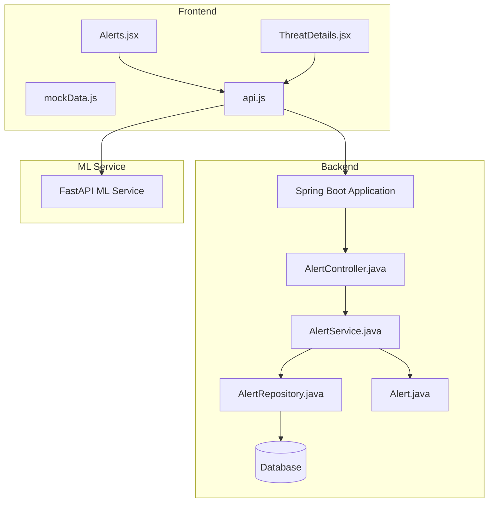
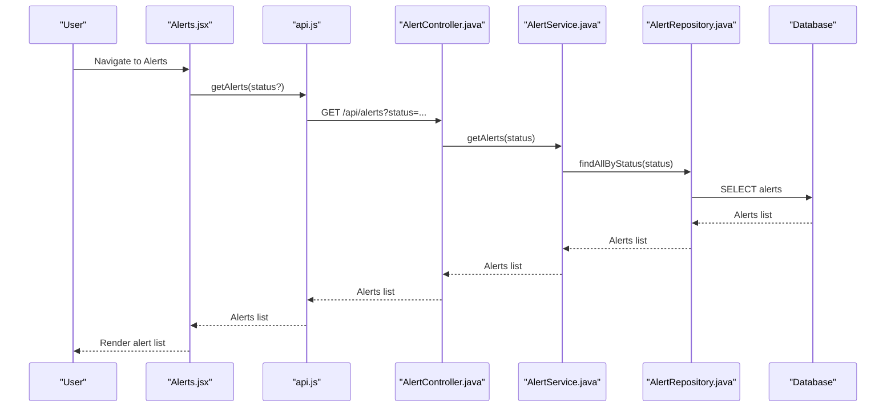
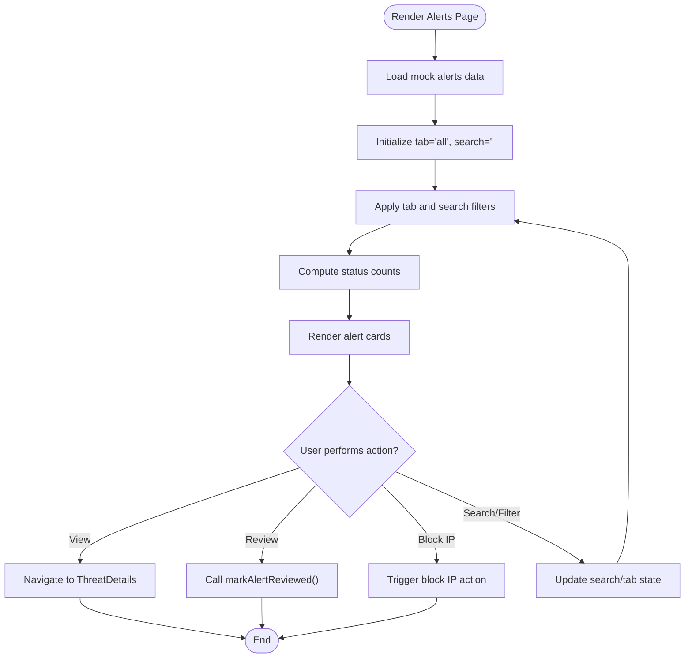
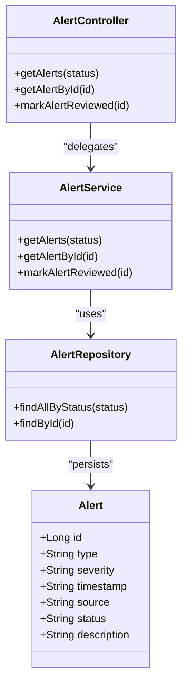
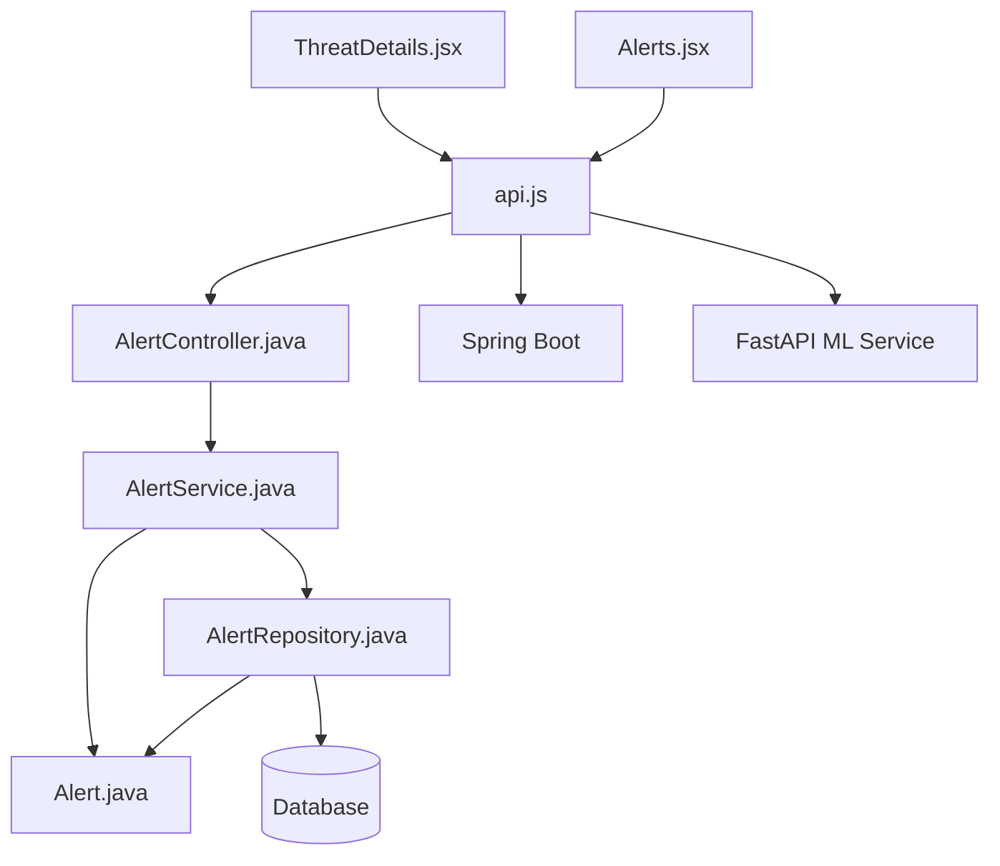

# Alert Management System

<cite>
**Referenced Files in This Document**
- [Alerts.jsx](file://Mini_Project/clinical-nids-dashboard/src/pages/Alerts.jsx)
- [ThreatDetails.jsx](file://Mini_Project/clinical-nids-dashboard/src/pages/ThreatDetails.jsx)
- [mockData.js](file://Mini_Project/clinical-nids-dashboard/src/data/mockData.js)
- [api.js](file://Mini_Project/clinical-nids-dashboard/src/data/api.js)
- [AlertController.java](file://Mini_Project/backend/src/main/java/com/clinicalnids/backend/controller/AlertController.java)
- [AlertService.java](file://Mini_Project/backend/src/main/java/com/clinicalnids/backend/service/AlertService.java)
- [AlertRepository.java](file://Mini_Project/backend/src/main/java/com/clinicalnids/backend/repository/AlertRepository.java)
- [Alert.java](file://Mini_Project/backend/src/main/java/com/clinicalnids/backend/entity/Alert.java)
- [application.properties](file://Mini_Project/backend/src/main/resources/application.properties)
</cite>

## Table of Contents
1. [Introduction](#introduction)
2. [Project Structure](#project-structure)
3. [Core Components](#core-components)
4. [Architecture Overview](#architecture-overview)
5. [Detailed Component Analysis](#detailed-component-analysis)
6. [Dependency Analysis](#dependency-analysis)
7. [Performance Considerations](#performance-considerations)
8. [Troubleshooting Guide](#troubleshooting-guide)
9. [Conclusion](#conclusion)

## Introduction
This document provides comprehensive documentation for the alert management system, focusing on the Alerts listing page and the Threat Details view. It explains the alert data structure, severity classification system, filtering and sorting capabilities, and alert resolution workflows. Additionally, it covers the threat details page implementation with attack pattern visualization, timeline analysis, and remediation recommendations. The document also includes examples of alert categorization, bulk operations, notification systems, and integration with the backend alert API endpoints.

## Project Structure
The alert management system spans three primary areas:
- Frontend dashboard built with React, containing the Alerts listing page and Threat Details view.
- Mock data layer used for demonstration and development.
- Backend REST API implemented with Spring Boot, exposing alert-related endpoints.



**Diagram sources**
- [Alerts.jsx](file://Mini_Project/clinical-nids-dashboard/src/pages/Alerts.jsx)
- [ThreatDetails.jsx](file://Mini_Project/clinical-nids-dashboard/src/pages/ThreatDetails.jsx)
- [mockData.js](file://Mini_Project/clinical-nids-dashboard/src/data/mockData.js)
- [api.js](file://Mini_Project/clinical-nids-dashboard/src/data/api.js)
- [AlertController.java](file://Mini_Project/backend/src/main/java/com/clinicalnids/backend/controller/AlertController.java)
- [AlertService.java](file://Mini_Project/backend/src/main/java/com/clinicalnids/backend/service/AlertService.java)
- [AlertRepository.java](file://Mini_Project/backend/src/main/java/com/clinicalnids/backend/repository/AlertRepository.java)
- [Alert.java](file://Mini_Project/backend/src/main/java/com/clinicalnids/backend/entity/Alert.java)

**Section sources**
- [Alerts.jsx](file://Mini_Project/clinical-nids-dashboard/src/pages/Alerts.jsx)
- [ThreatDetails.jsx](file://Mini_Project/clinical-nids-dashboard/src/pages/ThreatDetails.jsx)
- [mockData.js](file://Mini_Project/clinical-nids-dashboard/src/data/mockData.js)
- [api.js](file://Mini_Project/clinical-nids-dashboard/src/data/api.js)

## Core Components
This section documents the core components involved in alert management, including the frontend pages, mock data, and backend API integration.

- Alerts Listing Page
  - Purpose: Display a paginated and filterable list of security alerts with summary statistics, severity indicators, and action buttons.
  - Key features:
    - Status tabs: All, Active, Pending, Resolved.
    - Search by alert type or source.
    - Severity badges with color-coded indicators.
    - Action buttons: View, Review, Block IP.
    - Export report functionality.
  - Data source: Uses mock data for demonstration.

- Threat Details View
  - Purpose: Present detailed information about a selected threat, including metrics, network information, AI explanation, timeline, and recommended actions.
  - Key features:
    - Metrics cards for confidence, duration, packets per second, and bytes per second.
    - Network information grid with protocol, ports, and traffic statistics.
    - AI explanation with SHAP feature importance visualization.
    - Event timeline showing detection, classification, mitigation, blocking, and normalization.
    - Recommended actions panel with actionable remediation steps.

- Mock Data
  - Provides realistic sample data for alerts, threat details, and AI features.
  - Includes arrays for alerts, threat details data, and AI feature importance.

- API Service
  - Encapsulates REST endpoints for authentication, alerts, detections, dashboard statistics, dataset operations, and ML service integrations.
  - Handles bearer token authentication via Authorization headers.

**Section sources**
- [Alerts.jsx](file://Mini_Project/clinical-nids-dashboard/src/pages/Alerts.jsx)
- [ThreatDetails.jsx](file://Mini_Project/clinical-nids-dashboard/src/pages/ThreatDetails.jsx)
- [mockData.js](file://Mini_Project/clinical-nids-dashboard/src/data/mockData.js)
- [api.js](file://Mini_Project/clinical-nids-dashboard/src/data/api.js)

## Architecture Overview
The alert management system follows a layered architecture:
- Presentation layer: React pages for Alerts and Threat Details.
- Data layer: Mock data for local development and API service for backend integration.
- Business logic layer: Backend Spring Boot controllers, services, repositories, and entities.
- Data persistence: Database accessed via JPA repositories.
- Machine learning service: FastAPI-based ML service for predictions and analytics.



**Diagram sources**
- [Alerts.jsx](file://Mini_Project/clinical-nids-dashboard/src/pages/Alerts.jsx)
- [api.js](file://Mini_Project/clinical-nids-dashboard/src/data/api.js)
- [AlertController.java](file://Mini_Project/backend/src/main/java/com/clinicalnids/backend/controller/AlertController.java)
- [AlertService.java](file://Mini_Project/backend/src/main/java/com/clinicalnids/backend/service/AlertService.java)
- [AlertRepository.java](file://Mini_Project/backend/src/main/java/com/clinicalnids/backend/repository/AlertRepository.java)

## Detailed Component Analysis

### Alerts Listing Page
The Alerts page provides a comprehensive interface for reviewing and managing security alerts. It supports filtering by status and text search, displays summary statistics, and offers quick actions for each alert.

Key implementation aspects:
- State management for active tab and search term.
- Filtering logic combining tab selection and search criteria.
- Severity classification with color-coded badges.
- Action buttons for viewing details, marking reviewed, and blocking IP.
- Responsive layout with summary cards and action buttons.



**Diagram sources**
- [Alerts.jsx](file://Mini_Project/clinical-nids-dashboard/src/pages/Alerts.jsx)
- [mockData.js](file://Mini_Project/clinical-nids-dashboard/src/data/mockData.js)
- [api.js](file://Mini_Project/clinical-nids-dashboard/src/data/api.js)

**Section sources**
- [Alerts.jsx](file://Mini_Project/clinical-nids-dashboard/src/pages/Alerts.jsx)
- [mockData.js](file://Mini_Project/clinical-nids-dashboard/src/data/mockData.js)
- [api.js](file://Mini_Project/clinical-nids-dashboard/src/data/api.js)

### Threat Details View
The Threat Details view presents a deep-dive analysis of a selected threat, combining metrics, network information, AI-driven insights, and remediation recommendations.

Key implementation aspects:
- Route parameter extraction to load specific threat details.
- Metrics cards for confidence, duration, packets per second, and bytes per second.
- Network information grid displaying protocol, ports, and traffic statistics.
- AI explanation with SHAP feature importance visualization and contributing factors.
- Event timeline showing detection, classification, mitigation, blocking, and normalization.
- Recommended actions panel with executable remediation steps.

```mermaid
sequenceDiagram
participant User as "User"
participant Details as "ThreatDetails.jsx"
participant API as "api.js"
participant Spring as "AlertController.java"
participant Service as "AlertService.java"
participant Repo as "AlertRepository.java"
participant DB as "Database"
User->>Details : Navigate to /threats/ : id
Details->>API : Fetch threat details (mock or backend)
API->>Spring : GET /api/alerts/ : id (optional)
Spring->>Service : getAlertById(id)
Service->>Repo : findById(id)
Repo->>DB : SELECT alert
DB-->>Repo : Alert entity
Repo-->>Service : Alert entity
Service-->>Spring : Alert entity
Spring-->>API : Alert entity
API-->>Details : Alert entity
Details-->>User : Render detailed view
```

**Diagram sources**
- [ThreatDetails.jsx](file://Mini_Project/clinical-nids-dashboard/src/pages/ThreatDetails.jsx)
- [api.js](file://Mini_Project/clinical-nids-dashboard/src/data/api.js)
- [AlertController.java](file://Mini_Project/backend/src/main/java/com/clinicalnids/backend/controller/AlertController.java)
- [AlertService.java](file://Mini_Project/backend/src/main/java/com/clinicalnids/backend/service/AlertService.java)
- [AlertRepository.java](file://Mini_Project/backend/src/main/java/com/clinicalnids/backend/repository/AlertRepository.java)

**Section sources**
- [ThreatDetails.jsx](file://Mini_Project/clinical-nids-dashboard/src/pages/ThreatDetails.jsx)
- [mockData.js](file://Mini_Project/clinical-nids-dashboard/src/data/mockData.js)
- [api.js](file://Mini_Project/clinical-nids-dashboard/src/data/api.js)

### Backend Alert API Integration
The frontend integrates with the backend through a dedicated API service that encapsulates REST endpoints for alerts and related operations.

Key API endpoints:
- GET /api/alerts: Retrieve all alerts, optionally filtered by status.
- GET /api/alerts/:id: Retrieve a specific alert by ID.
- PUT /api/alerts/:id/review: Mark an alert as reviewed.
- Additional endpoints for detections, dashboard statistics, dataset operations, and ML service integrations.

Authentication:
- All authenticated endpoints require a Bearer token included in the Authorization header.
- Token management helpers for login, retrieval, storage, and clearing.



**Diagram sources**
- [AlertController.java](file://Mini_Project/backend/src/main/java/com/clinicalnids/backend/controller/AlertController.java)
- [AlertService.java](file://Mini_Project/backend/src/main/java/com/clinicalnids/backend/service/AlertService.java)
- [AlertRepository.java](file://Mini_Project/backend/src/main/java/com/clinicalnids/backend/repository/AlertRepository.java)
- [Alert.java](file://Mini_Project/backend/src/main/java/com/clinicalnids/backend/entity/Alert.java)

**Section sources**
- [api.js](file://Mini_Project/clinical-nids-dashboard/src/data/api.js)
- [AlertController.java](file://Mini_Project/backend/src/main/java/com/clinicalnids/backend/controller/AlertController.java)
- [AlertService.java](file://Mini_Project/backend/src/main/java/com/clinicalnids/backend/service/AlertService.java)
- [AlertRepository.java](file://Mini_Project/backend/src/main/java/com/clinicalnids/backend/repository/AlertRepository.java)
- [Alert.java](file://Mini_Project/backend/src/main/java/com/clinicalnids/backend/entity/Alert.java)

## Dependency Analysis
The alert management system exhibits clear separation of concerns across layers:
- Frontend depends on the API service for backend communication and mock data for local development.
- Backend controllers depend on services, which in turn depend on repositories and entities.
- Repositories interact with the database configured via application properties.



**Diagram sources**
- [Alerts.jsx](file://Mini_Project/clinical-nids-dashboard/src/pages/Alerts.jsx)
- [ThreatDetails.jsx](file://Mini_Project/clinical-nids-dashboard/src/pages/ThreatDetails.jsx)
- [api.js](file://Mini_Project/clinical-nids-dashboard/src/data/api.js)
- [AlertController.java](file://Mini_Project/backend/src/main/java/com/clinicalnids/backend/controller/AlertController.java)
- [AlertService.java](file://Mini_Project/backend/src/main/java/com/clinicalnids/backend/service/AlertService.java)
- [AlertRepository.java](file://Mini_Project/backend/src/main/java/com/clinicalnids/backend/repository/AlertRepository.java)
- [Alert.java](file://Mini_Project/backend/src/main/java/com/clinicalnids/backend/entity/Alert.java)

**Section sources**
- [Alerts.jsx](file://Mini_Project/clinical-nids-dashboard/src/pages/Alerts.jsx)
- [ThreatDetails.jsx](file://Mini_Project/clinical-nids-dashboard/src/pages/ThreatDetails.jsx)
- [api.js](file://Mini_Project/clinical-nids-dashboard/src/data/api.js)
- [AlertController.java](file://Mini_Project/backend/src/main/java/com/clinicalnids/backend/controller/AlertController.java)
- [AlertService.java](file://Mini_Project/backend/src/main/java/com/clinicalnids/backend/service/AlertService.java)
- [AlertRepository.java](file://Mini_Project/backend/src/main/java/com/clinicalnids/backend/repository/AlertRepository.java)
- [Alert.java](file://Mini_Project/backend/src/main/java/com/clinicalnids/backend/entity/Alert.java)

## Performance Considerations
- Frontend filtering and rendering: The current implementation uses client-side filtering with mock data. For large datasets, consider server-side pagination and filtering to reduce payload sizes and improve responsiveness.
- API calls: Batch operations and caching strategies can minimize redundant requests and enhance user experience.
- Real-time updates: Implement WebSocket connections or periodic polling to keep alert lists fresh without manual refresh.
- Image and asset optimization: Compress and lazy-load assets to reduce initial load times.
- Database queries: Ensure proper indexing on frequently queried fields (status, timestamp) to optimize alert retrieval performance.

## Troubleshooting Guide
Common issues and resolutions:
- Authentication failures: Verify token presence and validity. Ensure the Authorization header is correctly populated with the Bearer token.
- Endpoint errors: Confirm backend service availability and correct base URLs for Spring Boot and ML service endpoints.
- Data inconsistencies: Validate mock data structures against expected shapes. Ensure alert and threat details objects contain required fields.
- Network connectivity: Check CORS settings and proxy configurations if integrating with remote services.
- UI rendering issues: Inspect console logs for missing props or incorrect data types passed to components.

**Section sources**
- [api.js](file://Mini_Project/clinical-nids-dashboard/src/data/api.js)
- [Alerts.jsx](file://Mini_Project/clinical-nids-dashboard/src/pages/Alerts.jsx)
- [ThreatDetails.jsx](file://Mini_Project/clinical-nids-dashboard/src/pages/ThreatDetails.jsx)

## Conclusion
The alert management system provides a robust foundation for monitoring and responding to security threats. The Alerts listing page offers efficient filtering and quick actions, while the Threat Details view delivers comprehensive analysis with AI-driven insights and remediation recommendations. The backend integration via REST APIs ensures scalability and maintainability, with room for enhancements such as server-side filtering, real-time updates, and expanded automation capabilities.