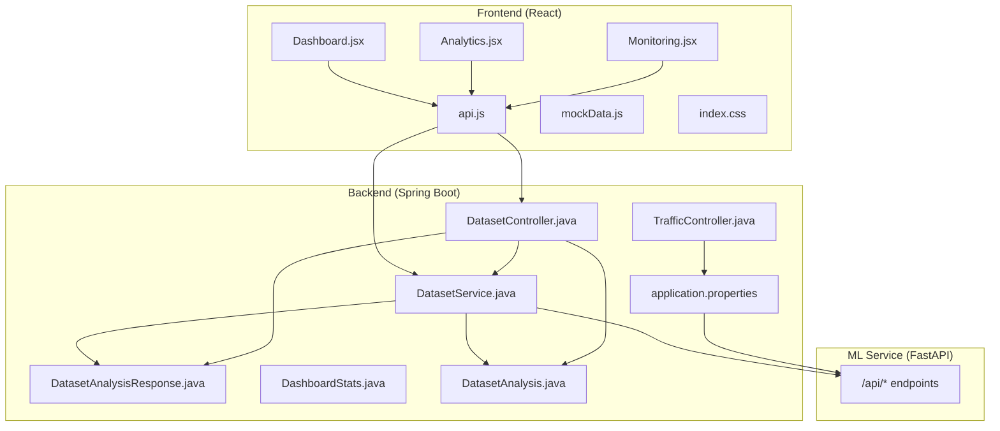
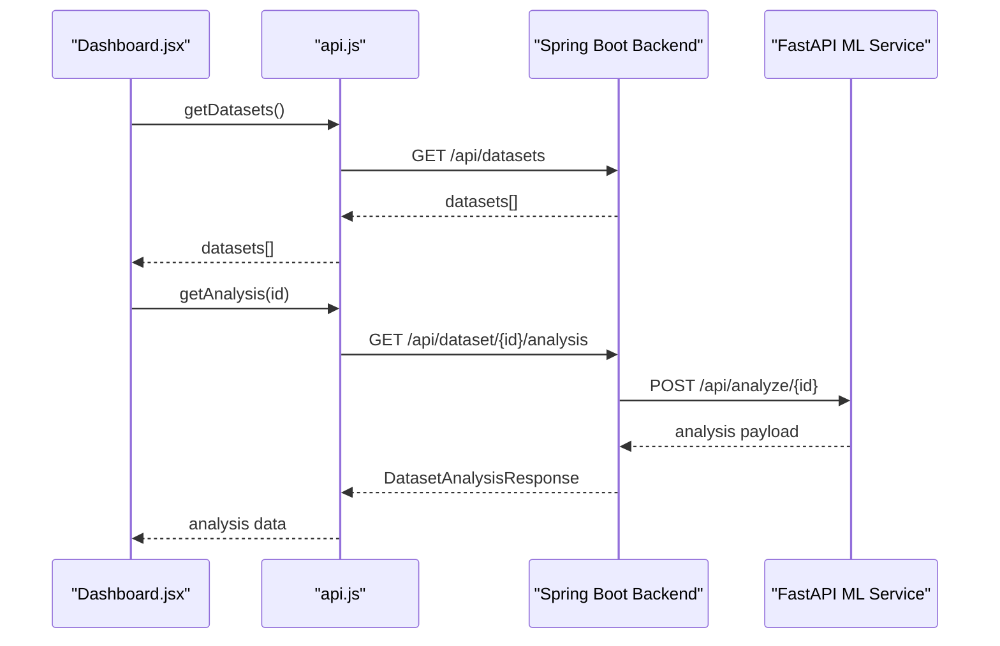
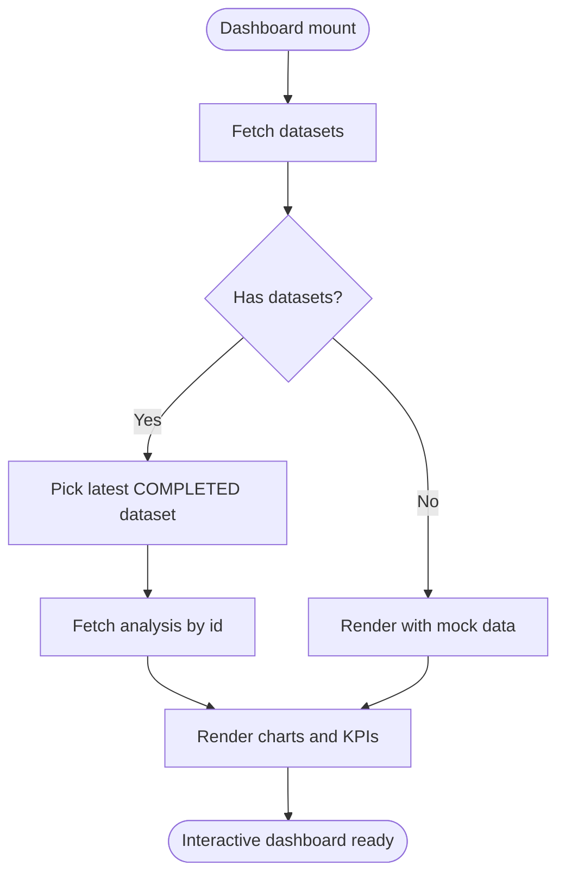
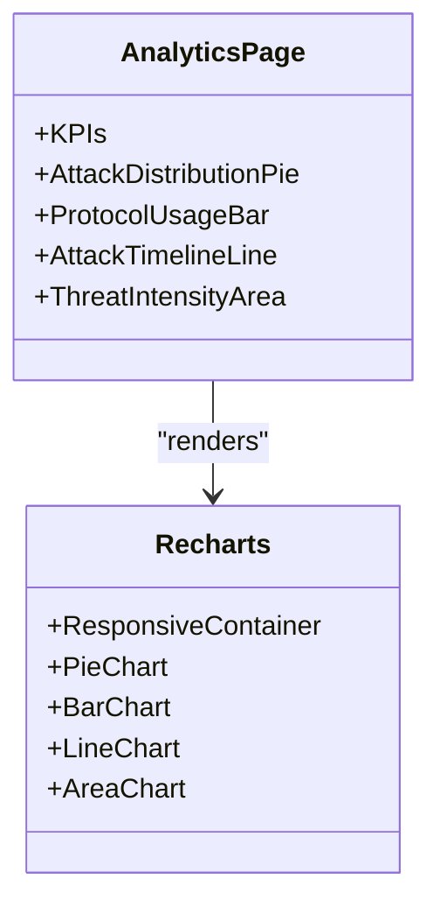
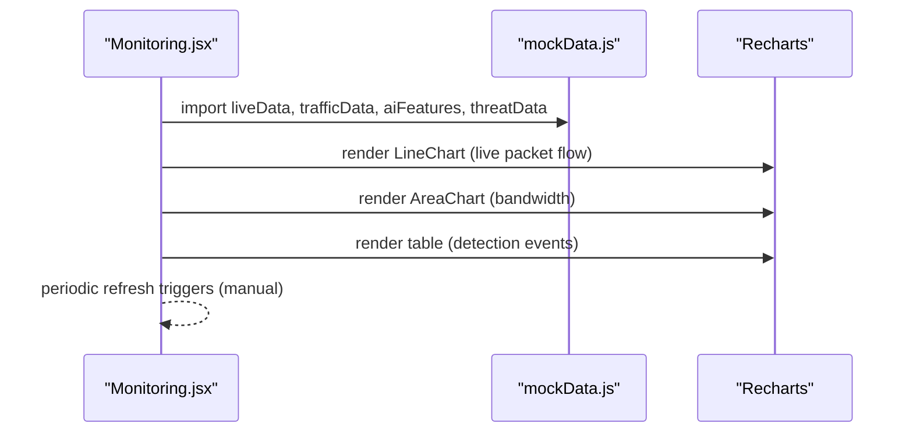
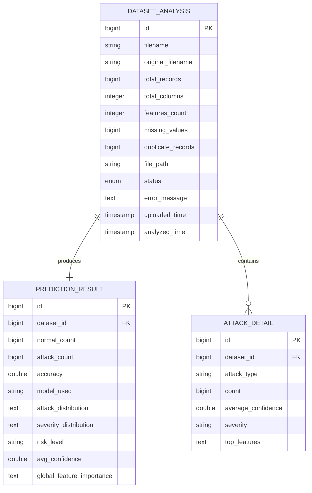
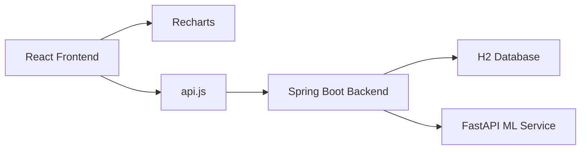

# Dashboard Pages

<cite>
**Referenced Files in This Document**
- [Dashboard.jsx](file://Mini_Project/clinical-nids-dashboard/src/pages/Dashboard.jsx)
- [Analytics.jsx](file://Mini_Project/clinical-nids-dashboard/src/pages/Analytics.jsx)
- [Monitoring.jsx](file://Mini_Project/clinical-nids-dashboard/src/pages/Monitoring.jsx)
- [api.js](file://Mini_Project/clinical-nids-dashboard/src/data/api.js)
- [mockData.js](file://Mini_Project/clinical-nids-dashboard/src/data/mockData.js)
- [index.css](file://Mini_Project/clinical-nids-dashboard/src/index.css)
- [DatasetController.java](file://Mini_Project/backend/src/main/java/com/clinicalnids/backend/controller/DatasetController.java)
- [DatasetService.java](file://Mini_Project/backend/src/main/java/com/clinicalnids/backend/service/DatasetService.java)
- [DatasetAnalysisResponse.java](file://Mini_Project/backend/src/main/java/com/clinicalnids/backend/dto/DatasetAnalysisResponse.java)
- [DashboardStats.java](file://Mini_Project/backend/src/main/java/com/clinicalnids/backend/dto/DashboardStats.java)
- [DatasetAnalysis.java](file://Mini_Project/backend/src/main/java/com/clinicalnids/backend/entity/DatasetAnalysis.java)
- [TrafficController.java](file://Mini_Project/backend/src/main/java/com/clinicalnids/backend/controller/TrafficController.java)
- [application.properties](file://Mini_Project/backend/src/main/resources/application.properties)
</cite>

## Table of Contents
1. [Introduction](#introduction)
2. [Project Structure](#project-structure)
3. [Core Components](#core-components)
4. [Architecture Overview](#architecture-overview)
5. [Detailed Component Analysis](#detailed-component-analysis)
6. [Dependency Analysis](#dependency-analysis)
7. [Performance Considerations](#performance-considerations)
8. [Troubleshooting Guide](#troubleshooting-guide)
9. [Conclusion](#conclusion)

## Introduction
This document provides comprehensive documentation for the core dashboard pages: Dashboard analytics, Analytics overview, and Real-time Monitoring. It explains the data visualization components built with Recharts, the data fetching patterns connecting the React frontend to the Spring Boot backend and FastAPI ML service, and the interactive widgets powering the security dashboards. It also covers analytics data structures, metric calculations, KPI displays, and the monitoring page’s live traffic visualization, threat detection indicators, and system status displays.

## Project Structure
The dashboard is implemented as a React SPA with TailwindCSS styling and Recharts for visualizations. Data flows from the frontend to the backend and ML service via an API layer, while mock data supports development and demonstration.

**Diagram sources**
- [Dashboard.jsx:1-328](file://Mini_Project/clinical-nids-dashboard/src/pages/Dashboard.jsx#L1-L328)
- [Analytics.jsx:1-124](file://Mini_Project/clinical-nids-dashboard/src/pages/Analytics.jsx#L1-L124)
- [Monitoring.jsx:1-191](file://Mini_Project/clinical-nids-dashboard/src/pages/Monitoring.jsx#L1-L191)
- [api.js:1-236](file://Mini_Project/clinical-nids-dashboard/src/data/api.js#L1-L236)
- [mockData.js:1-91](file://Mini_Project/clinical-nids-dashboard/src/data/mockData.js#L1-L91)
- [index.css:1-79](file://Mini_Project/clinical-nids-dashboard/src/index.css#L1-L79)
- [DatasetController.java:1-95](file://Mini_Project/backend/src/main/java/com/clinicalnids/backend/controller/DatasetController.java#L1-L95)
- [DatasetService.java:1-422](file://Mini_Project/backend/src/main/java/com/clinicalnids/backend/service/DatasetService.java#L1-L422)
- [DatasetAnalysisResponse.java:1-69](file://Mini_Project/backend/src/main/java/com/clinicalnids/backend/dto/DatasetAnalysisResponse.java#L1-L69)
- [DashboardStats.java:1-18](file://Mini_Project/backend/src/main/java/com/clinicalnids/backend/dto/DashboardStats.java#L1-L18)
- [DatasetAnalysis.java:1-58](file://Mini_Project/backend/src/main/java/com/clinicalnids/backend/entity/DatasetAnalysis.java#L1-L58)
- [TrafficController.java:1-41](file://Mini_Project/backend/src/main/java/com/clinicalnids/backend/controller/TrafficController.java#L1-L41)
- [application.properties:1-46](file://Mini_Project/backend/src/main/resources/application.properties#L1-L46)

**Section sources**
- [Dashboard.jsx:1-328](file://Mini_Project/clinical-nids-dashboard/src/pages/Dashboard.jsx#L1-L328)
- [Analytics.jsx:1-124](file://Mini_Project/clinical-nids-dashboard/src/pages/Analytics.jsx#L1-L124)
- [Monitoring.jsx:1-191](file://Mini_Project/clinical-nids-dashboard/src/pages/Monitoring.jsx#L1-L191)
- [api.js:1-236](file://Mini_Project/clinical-nids-dashboard/src/data/api.js#L1-L236)
- [mockData.js:1-91](file://Mini_Project/clinical-nids-dashboard/src/data/mockData.js#L1-L91)
- [index.css:1-79](file://Mini_Project/clinical-nids-dashboard/src/index.css#L1-L79)
- [DatasetController.java:1-95](file://Mini_Project/backend/src/main/java/com/clinicalnids/backend/controller/DatasetController.java#L1-L95)
- [DatasetService.java:1-422](file://Mini_Project/backend/src/main/java/com/clinicalnids/backend/service/DatasetService.java#L1-L422)
- [DatasetAnalysisResponse.java:1-69](file://Mini_Project/backend/src/main/java/com/clinicalnids/backend/dto/DatasetAnalysisResponse.java#L1-L69)
- [DashboardStats.java:1-18](file://Mini_Project/backend/src/main/java/com/clinicalnids/backend/dto/DashboardStats.java#L1-L18)
- [DatasetAnalysis.java:1-58](file://Mini_Project/backend/src/main/java/com/clinicalnids/backend/entity/DatasetAnalysis.java#L1-L58)
- [TrafficController.java:1-41](file://Mini_Project/backend/src/main/java/com/clinicalnids/backend/controller/TrafficController.java#L1-L41)
- [application.properties:1-46](file://Mini_Project/backend/src/main/resources/application.properties#L1-L46)

## Core Components
- Dashboard analytics page: Displays KPIs, recent datasets, traffic activity charts, attack distribution, and recent predictions.
- Analytics overview page: Presents KPIs, attack distribution, protocol usage, attack timelines, and threat intensity heatmaps.
- Real-time Monitoring page: Live metrics, live packet flow chart, bandwidth utilization, AI explainability panel, and detection events table.

Key frontend technologies:
- Recharts for responsive charts (Area, Bar, Line, Pie).
- TailwindCSS for theming and card layouts.
- Mock data for development and fallback scenarios.
- API service layer abstracting backend and ML service endpoints.

**Section sources**
- [Dashboard.jsx:1-328](file://Mini_Project/clinical-nids-dashboard/src/pages/Dashboard.jsx#L1-L328)
- [Analytics.jsx:1-124](file://Mini_Project/clinical-nids-dashboard/src/pages/Analytics.jsx#L1-L124)
- [Monitoring.jsx:1-191](file://Mini_Project/clinical-nids-dashboard/src/pages/Monitoring.jsx#L1-L191)
- [api.js:1-236](file://Mini_Project/clinical-nids-dashboard/src/data/api.js#L1-L236)
- [mockData.js:1-91](file://Mini_Project/clinical-nids-dashboard/src/data/mockData.js#L1-L91)
- [index.css:32-78](file://Mini_Project/clinical-nids-dashboard/src/index.css#L32-L78)

## Architecture Overview
The frontend communicates with two backend systems:
- Spring Boot REST API for authentication, dataset lifecycle, alerts, and dashboard statistics.
- FastAPI ML service for machine learning predictions and analysis.

**Diagram sources**
- [Dashboard.jsx:40-56](file://Mini_Project/clinical-nids-dashboard/src/pages/Dashboard.jsx#L40-L56)
- [api.js:188-194](file://Mini_Project/clinical-nids-dashboard/src/data/api.js#L188-L194)
- [DatasetController.java:76-93](file://Mini_Project/backend/src/main/java/com/clinicalnids/backend/controller/DatasetController.java#L76-L93)
- [DatasetService.java:102-155](file://Mini_Project/backend/src/main/java/com/clinicalnids/backend/service/DatasetService.java#L102-L155)

## Detailed Component Analysis

### Dashboard Analytics Page
Responsibilities:
- Fetch datasets and latest analysis.
- Render KPI cards (network flows, detected threats, risk level, model accuracy).
- Display traffic activity area chart.
- Show AI feature importance bars.
- Present attack distribution pie and frequency bar chart.
- List recent predictions in a table.

Data visualization components:
- AreaChart for 24-hour incoming/outgoing traffic.
- PieChart for attack distribution.
- BarChart for attack frequency (excluding benign).
- Horizontal bar chart for AI feature importance.

Data binding and fallback:
- Uses real analysis data when available; falls back to mock data otherwise.
- Calculates derived metrics (e.g., percentages) client-side.

**Diagram sources**
- [Dashboard.jsx:36-56](file://Mini_Project/clinical-nids-dashboard/src/pages/Dashboard.jsx#L36-L56)

**Section sources**
- [Dashboard.jsx:1-328](file://Mini_Project/clinical-nids-dashboard/src/pages/Dashboard.jsx#L1-L328)
- [api.js:188-194](file://Mini_Project/clinical-nids-dashboard/src/data/api.js#L188-L194)
- [mockData.js:14-62](file://Mini_Project/clinical-nids-dashboard/src/data/mockData.js#L14-L62)

### Analytics Overview Page
Responsibilities:
- Display KPIs (blocked attacks, detection time, true positive rate, attack trend).
- Render attack distribution pie chart.
- Show protocol usage bar chart.
- Plot attack timeline over 30 days.
- Visualize threat intensity heatmap over 24 hours.

Chart configurations:
- Responsive containers for all charts.
- Tooltips with dark theme styling.
- Gradient fills and categorical colors.

**Diagram sources**
- [Analytics.jsx:1-124](file://Mini_Project/clinical-nids-dashboard/src/pages/Analytics.jsx#L1-L124)

**Section sources**
- [Analytics.jsx:1-124](file://Mini_Project/clinical-nids-dashboard/src/pages/Analytics.jsx#L1-L124)
- [mockData.js:29-43](file://Mini_Project/clinical-nids-dashboard/src/data/mockData.js#L29-L43)

### Real-time Monitoring Page
Responsibilities:
- Show live system status indicator.
- Display live metrics (active connections, blocked IPs, events/sec, detection rate).
- Render live packet flow chart (last 60 seconds).
- Show bandwidth utilization area chart.
- Present AI explainability panel with SHAP feature importance.
- List detection events with action links.

Real-time patterns:
- Live packet flow data generated client-side for demo purposes.
- Bandwidth chart uses recent traffic data.
- Detection events table renders mock threat entries.

**Diagram sources**
- [Monitoring.jsx:12-17](file://Mini_Project/clinical-nids-dashboard/src/pages/Monitoring.jsx#L12-L17)
- [mockData.js:3-12](file://Mini_Project/clinical-nids-dashboard/src/data/mockData.js#L3-L12)
- [mockData.js:14-19](file://Mini_Project/clinical-nids-dashboard/src/data/mockData.js#L14-L19)
- [mockData.js:56-62](file://Mini_Project/clinical-nids-dashboard/src/data/mockData.js#L56-L62)

**Section sources**
- [Monitoring.jsx:1-191](file://Mini_Project/clinical-nids-dashboard/src/pages/Monitoring.jsx#L1-L191)
- [mockData.js:3-91](file://Mini_Project/clinical-nids-dashboard/src/data/mockData.js#L3-L91)

### Backend Data Structures and Endpoints
Backend provides structured responses consumed by the frontend:
- DatasetAnalysisResponse: dataset metadata, security summary, distributions, attack details, global feature importance, and prediction samples.
- DashboardStats: aggregated metrics for the dashboard.
- DatasetAnalysis entity: dataset lifecycle and status.

Endpoints:
- DatasetController: upload, analyze, get analysis, download report, list datasets.
- TrafficController: upload traffic metadata and fetch recent traffic.

**Diagram sources**
- [DatasetAnalysis.java:1-58](file://Mini_Project/backend/src/main/java/com/clinicalnids/backend/entity/DatasetAnalysis.java#L1-L58)
- [DatasetService.java:182-194](file://Mini_Project/backend/src/main/java/com/clinicalnids/backend/service/DatasetService.java#L182-L194)
- [DatasetService.java:196-227](file://Mini_Project/backend/src/main/java/com/clinicalnids/backend/service/DatasetService.java#L196-L227)

**Section sources**
- [DatasetAnalysisResponse.java:1-69](file://Mini_Project/backend/src/main/java/com/clinicalnids/backend/dto/DatasetAnalysisResponse.java#L1-L69)
- [DashboardStats.java:1-18](file://Mini_Project/backend/src/main/java/com/clinicalnids/backend/dto/DashboardStats.java#L1-L18)
- [DatasetAnalysis.java:1-58](file://Mini_Project/backend/src/main/java/com/clinicalnids/backend/entity/DatasetAnalysis.java#L1-L58)
- [DatasetController.java:1-95](file://Mini_Project/backend/src/main/java/com/clinicalnids/backend/controller/DatasetController.java#L1-L95)
- [DatasetService.java:1-422](file://Mini_Project/backend/src/main/java/com/clinicalnids/backend/service/DatasetService.java#L1-L422)
- [TrafficController.java:1-41](file://Mini_Project/backend/src/main/java/com/clinicalnids/backend/controller/TrafficController.java#L1-L41)

## Dependency Analysis
Frontend dependencies:
- Recharts for all visualizations.
- TailwindCSS utility classes for theming and layout.
- Local API module encapsulating backend and ML service endpoints.
- Mock data module for development and fallback.

Backend dependencies:
- Spring Boot Web MVC for REST controllers.
- Jackson for JSON parsing and serialization.
- WebClient for HTTP calls to the ML service.
- H2 in-memory database for development.

**Diagram sources**
- [api.js:1-236](file://Mini_Project/clinical-nids-dashboard/src/data/api.js#L1-L236)
- [application.properties:1-46](file://Mini_Project/backend/src/main/resources/application.properties#L1-L46)
- [DatasetService.java:53-56](file://Mini_Project/backend/src/main/java/com/clinicalnids/backend/service/DatasetService.java#L53-L56)

**Section sources**
- [api.js:1-236](file://Mini_Project/clinical-nids-dashboard/src/data/api.js#L1-L236)
- [application.properties:1-46](file://Mini_Project/backend/src/main/resources/application.properties#L1-L46)
- [DatasetService.java:1-422](file://Mini_Project/backend/src/main/java/com/clinicalnids/backend/service/DatasetService.java#L1-L422)

## Performance Considerations
- Chart responsiveness: All charts use ResponsiveContainer to adapt to viewport changes efficiently.
- Data size: Large datasets are paginated or sliced (e.g., recent 5 datasets, top 10 predictions).
- Rendering: Conditional rendering avoids unnecessary DOM nodes when data is unavailable.
- Network: API calls are centralized to reduce duplication and enable caching strategies at the service layer.

## Troubleshooting Guide
Common issues and resolutions:
- Backend unavailability: Dashboard gracefully falls back to mock data and logs a warning during fetch failures.
- Authentication: Token handling ensures protected endpoints are called with Authorization headers.
- CORS: Backend configuration allows requests from the frontend origin.
- ML service timeouts: Analysis calls to the ML service include timeouts to prevent indefinite waits.

**Section sources**
- [Dashboard.jsx:52-54](file://Mini_Project/clinical-nids-dashboard/src/pages/Dashboard.jsx#L52-L54)
- [api.js:35-41](file://Mini_Project/clinical-nids-dashboard/src/data/api.js#L35-L41)
- [application.properties:35-36](file://Mini_Project/backend/src/main/resources/application.properties#L35-L36)
- [DatasetService.java:139-140](file://Mini_Project/backend/src/main/java/com/clinicalnids/backend/service/DatasetService.java#L139-L140)

## Conclusion
The dashboard pages combine robust backend APIs with rich frontend visualizations to deliver actionable insights for network security. The Dashboard analytics page aggregates key metrics and trends, the Analytics overview page provides comprehensive threat intelligence, and the Real-time Monitoring page offers live visibility into traffic and detections. The modular design, centralized API layer, and mock data support facilitate maintainability and rapid iteration.