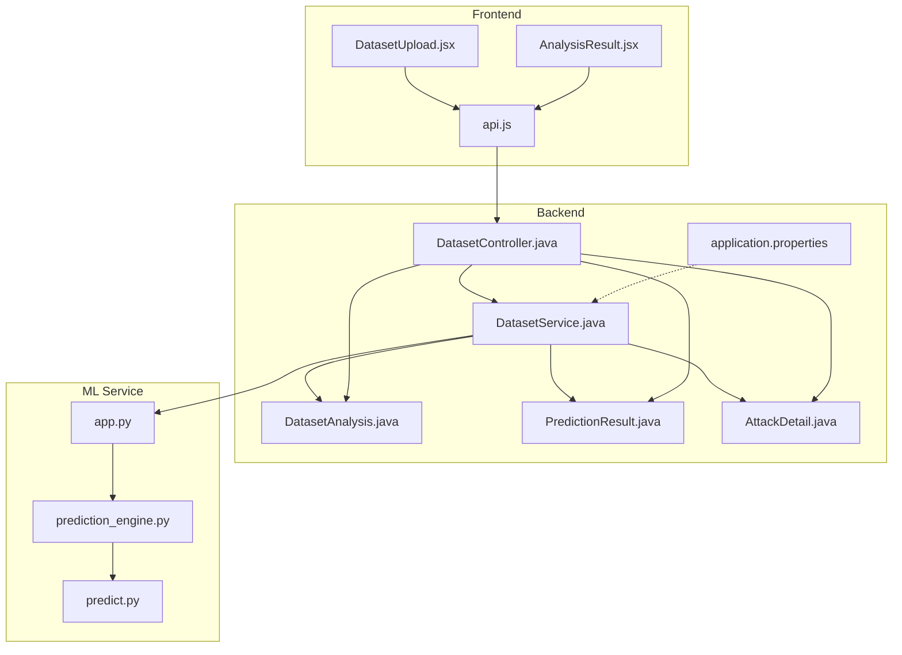
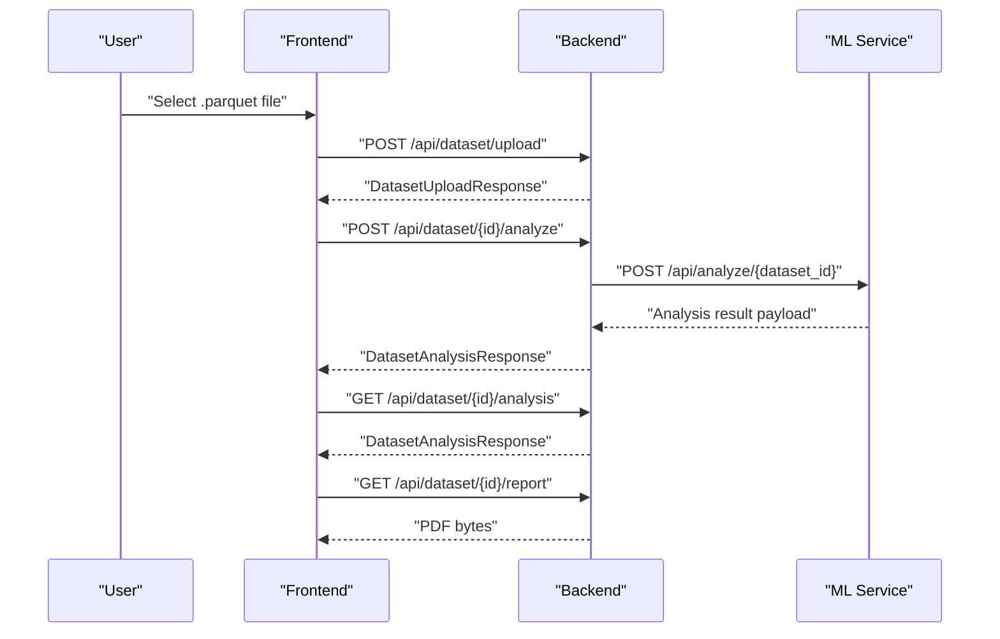
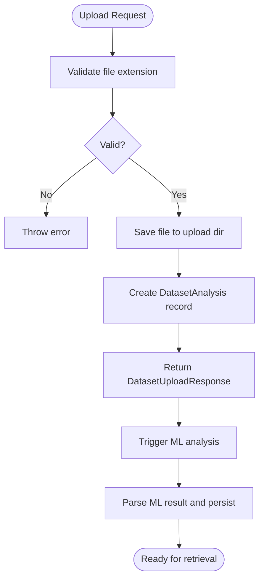
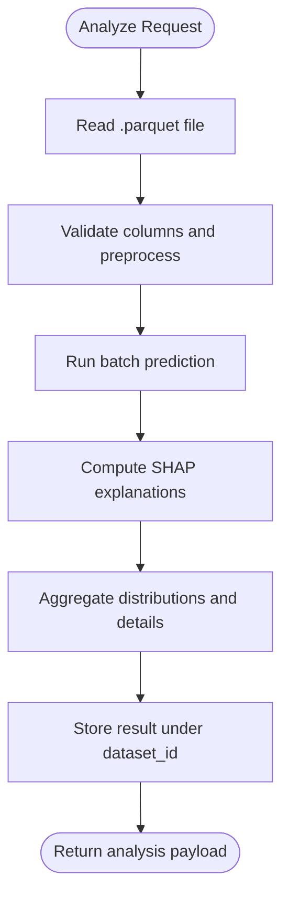
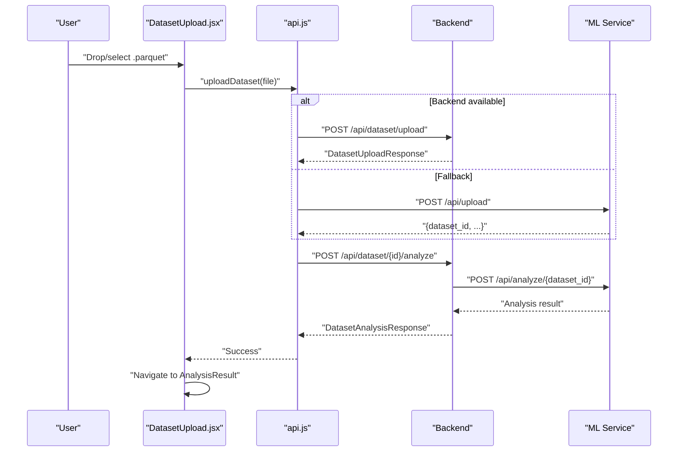
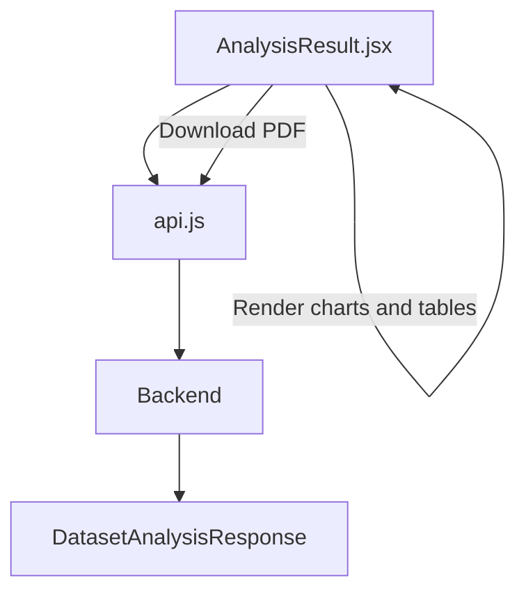
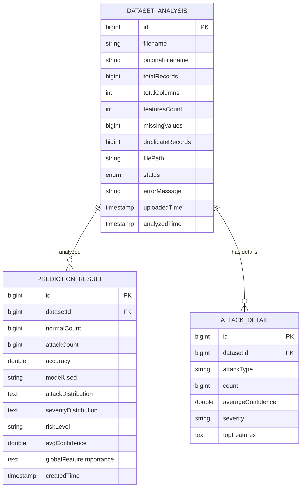
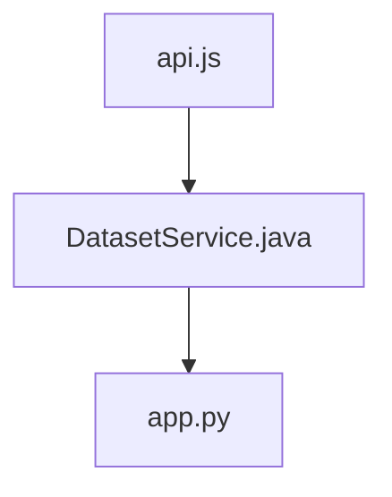

# Dataset Operations

<cite>
**Referenced Files in This Document**
- [DatasetController.java](file://Mini_Project/backend/src/main/java/com/clinicalnids/backend/controller/DatasetController.java)
- [DatasetService.java](file://Mini_Project/backend/src/main/java/com/clinicalnids/backend/service/DatasetService.java)
- [DatasetUploadResponse.java](file://Mini_Project/backend/src/main/java/com/clinicalnids/backend/dto/DatasetUploadResponse.java)
- [DatasetAnalysisResponse.java](file://Mini_Project/backend/src/main/java/com/clinicalnids/backend/dto/DatasetAnalysisResponse.java)
- [DatasetAnalysis.java](file://Mini_Project/backend/src/main/java/com/clinicalnids/backend/entity/DatasetAnalysis.java)
- [PredictionResult.java](file://Mini_Project/backend/src/main/java/com/clinicalnids/backend/entity/PredictionResult.java)
- [AttackDetail.java](file://Mini_Project/backend/src/main/java/com/clinicalnids/backend/entity/AttackDetail.java)
- [DatasetUpload.jsx](file://Mini_Project/clinical-nids-dashboard/src/pages/DatasetUpload.jsx)
- [AnalysisResult.jsx](file://Mini_Project/clinical-nids-dashboard/src/pages/AnalysisResult.jsx)
- [api.js](file://Mini_Project/clinical-nids-dashboard/src/data/api.js)
- [application.properties](file://Mini_Project/backend/src/main/resources/application.properties)
- [app.py](file://Mini_Project/ml-service/app.py)
- [prediction_engine.py](file://Mini_Project/ml-service/prediction_engine.py)
- [predict.py](file://Mini_Project/ml-service/predict.py)
</cite>

## Table of Contents
1. [Introduction](#introduction)
2. [Project Structure](#project-structure)
3. [Core Components](#core-components)
4. [Architecture Overview](#architecture-overview)
5. [Detailed Component Analysis](#detailed-component-analysis)
6. [Dependency Analysis](#dependency-analysis)
7. [Performance Considerations](#performance-considerations)
8. [Troubleshooting Guide](#troubleshooting-guide)
9. [Conclusion](#conclusion)
10. [Appendices](#appendices)

## Introduction
This document explains the dataset upload and analysis workflow for the Clinical-NIDS system. It covers the end-to-end process from uploading a .parquet dataset file to receiving actionable insights and downloadable reports. The workflow integrates a React frontend, a Spring Boot backend, and a FastAPI machine learning service. The backend handles file validation, persistence, orchestration, and result aggregation, while the ML service performs batch inference and SHAP-based explanations. Users can monitor progress, interpret results, and export comprehensive security reports.

## Project Structure
The dataset operations span three layers:
- Frontend (React): Provides the upload UI, progress tracking, and result visualization.
- Backend (Spring Boot): Exposes REST endpoints for upload, analysis initiation, result retrieval, and PDF report generation. It also persists dataset metadata and analysis results.
- ML Service (FastAPI): Performs dataset validation, preprocessing, batch prediction, SHAP explanations, and aggregates statistics.

**Diagram sources**
- [DatasetController.java:19-95](file://Mini_Project/backend/src/main/java/com/clinicalnids/backend/controller/DatasetController.java#L19-L95)
- [DatasetService.java:30-56](file://Mini_Project/backend/src/main/java/com/clinicalnids/backend/service/DatasetService.java#L30-L56)
- [DatasetAnalysis.java:7-58](file://Mini_Project/backend/src/main/java/com/clinicalnids/backend/entity/DatasetAnalysis.java#L7-L58)
- [PredictionResult.java:7-52](file://Mini_Project/backend/src/main/java/com/clinicalnids/backend/entity/PredictionResult.java#L7-L52)
- [AttackDetail.java:6-35](file://Mini_Project/backend/src/main/java/com/clinicalnids/backend/entity/AttackDetail.java#L6-L35)
- [application.properties:32-46](file://Mini_Project/backend/src/main/resources/application.properties#L32-L46)
- [app.py:253-393](file://Mini_Project/ml-service/app.py#L253-L393)
- [prediction_engine.py:70-413](file://Mini_Project/ml-service/prediction_engine.py#L70-L413)
- [predict.py:17-179](file://Mini_Project/ml-service/predict.py#L17-L179)
- [DatasetUpload.jsx:13-287](file://Mini_Project/clinical-nids-dashboard/src/pages/DatasetUpload.jsx#L13-L287)
- [AnalysisResult.jsx:28-433](file://Mini_Project/clinical-nids-dashboard/src/pages/AnalysisResult.jsx#L28-L433)
- [api.js:159-235](file://Mini_Project/clinical-nids-dashboard/src/data/api.js#L159-L235)

**Section sources**
- [DatasetController.java:19-95](file://Mini_Project/backend/src/main/java/com/clinicalnids/backend/controller/DatasetController.java#L19-L95)
- [DatasetService.java:30-56](file://Mini_Project/backend/src/main/java/com/clinicalnids/backend/service/DatasetService.java#L30-L56)
- [DatasetAnalysis.java:7-58](file://Mini_Project/backend/src/main/java/com/clinicalnids/backend/entity/DatasetAnalysis.java#L7-L58)
- [PredictionResult.java:7-52](file://Mini_Project/backend/src/main/java/com/clinicalnids/backend/entity/PredictionResult.java#L7-L52)
- [AttackDetail.java:6-35](file://Mini_Project/backend/src/main/java/com/clinicalnids/backend/entity/AttackDetail.java#L6-L35)
- [application.properties:32-46](file://Mini_Project/backend/src/main/resources/application.properties#L32-L46)
- [app.py:253-393](file://Mini_Project/ml-service/app.py#L253-L393)
- [prediction_engine.py:70-413](file://Mini_Project/ml-service/prediction_engine.py#L70-L413)
- [predict.py:17-179](file://Mini_Project/ml-service/predict.py#L17-L179)
- [DatasetUpload.jsx:13-287](file://Mini_Project/clinical-nids-dashboard/src/pages/DatasetUpload.jsx#L13-L287)
- [AnalysisResult.jsx:28-433](file://Mini_Project/clinical-nids-dashboard/src/pages/AnalysisResult.jsx#L28-L433)
- [api.js:159-235](file://Mini_Project/clinical-nids-dashboard/src/data/api.js#L159-L235)

## Core Components
- DatasetController: Exposes REST endpoints for upload, analysis initiation, result retrieval, and PDF report generation. It delegates to DatasetService and ReportService.
- DatasetService: Implements upload validation, local storage, orchestration of ML service calls, result parsing, and persistence of analysis outcomes.
- DatasetAnalysisResponse: DTO capturing dataset metadata, security summary, distributions, attack details, feature importance, and prediction samples.
- DatasetAnalysis: JPA entity storing dataset metadata and status.
- PredictionResult: JPA entity persisting aggregated analysis results.
- AttackDetail: JPA entity storing per-attack-type details including top features.
- Frontend Pages: DatasetUpload.jsx manages file selection, validation, fallback upload paths, progress tracking, and navigation. AnalysisResult.jsx renders charts, tables, and downloadable reports.
- API Layer: api.js encapsulates backend and ML service endpoints for unified consumption by frontend.

**Section sources**
- [DatasetController.java:19-95](file://Mini_Project/backend/src/main/java/com/clinicalnids/backend/controller/DatasetController.java#L19-L95)
- [DatasetService.java:30-56](file://Mini_Project/backend/src/main/java/com/clinicalnids/backend/service/DatasetService.java#L30-L56)
- [DatasetAnalysisResponse.java:8-69](file://Mini_Project/backend/src/main/java/com/clinicalnids/backend/dto/DatasetAnalysisResponse.java#L8-L69)
- [DatasetAnalysis.java:7-58](file://Mini_Project/backend/src/main/java/com/clinicalnids/backend/entity/DatasetAnalysis.java#L7-L58)
- [PredictionResult.java:7-52](file://Mini_Project/backend/src/main/java/com/clinicalnids/backend/entity/PredictionResult.java#L7-L52)
- [AttackDetail.java:6-35](file://Mini_Project/backend/src/main/java/com/clinicalnids/backend/entity/AttackDetail.java#L6-L35)
- [DatasetUpload.jsx:13-287](file://Mini_Project/clinical-nids-dashboard/src/pages/DatasetUpload.jsx#L13-L287)
- [AnalysisResult.jsx:28-433](file://Mini_Project/clinical-nids-dashboard/src/pages/AnalysisResult.jsx#L28-L433)
- [api.js:159-235](file://Mini_Project/clinical-nids-dashboard/src/data/api.js#L159-L235)

## Architecture Overview
The system supports two operational modes:
- Backend-first mode: Frontend uploads to Spring Boot, which triggers ML service analysis and persists results.
- ML-direct mode: Frontend bypasses Spring Boot and communicates directly with the ML service for upload and analysis.

**Diagram sources**
- [DatasetController.java:34-74](file://Mini_Project/backend/src/main/java/com/clinicalnids/backend/controller/DatasetController.java#L34-L74)
- [DatasetService.java:102-155](file://Mini_Project/backend/src/main/java/com/clinicalnids/backend/service/DatasetService.java#L102-L155)
- [api.js:159-202](file://Mini_Project/clinical-nids-dashboard/src/data/api.js#L159-L202)
- [app.py:295-347](file://Mini_Project/ml-service/app.py#L295-L347)

## Detailed Component Analysis

### Backend Orchestration and Validation
- Upload endpoint accepts multipart/form-data with a .parquet file. Validation ensures only .parquet files are accepted. The file is saved to a configured upload directory, and a DatasetAnalysis record is created with UPLOADED status.
- Analysis endpoint transitions status to ANALYZING, forwards the file to the ML service, and parses the returned result payload into domain entities and DTOs.
- Result retrieval endpoint reconstructs DatasetAnalysisResponse from persisted entities when needed.
- Report endpoint generates a PDF using ReportService and returns it as an attachment.

**Diagram sources**
- [DatasetService.java:62-97](file://Mini_Project/backend/src/main/java/com/clinicalnids/backend/service/DatasetService.java#L62-L97)
- [DatasetService.java:102-155](file://Mini_Project/backend/src/main/java/com/clinicalnids/backend/service/DatasetService.java#L102-L155)

**Section sources**
- [DatasetService.java:62-97](file://Mini_Project/backend/src/main/java/com/clinicalnids/backend/service/DatasetService.java#L62-L97)
- [DatasetService.java:102-155](file://Mini_Project/backend/src/main/java/com/clinicalnids/backend/service/DatasetService.java#L102-L155)
- [DatasetController.java:34-74](file://Mini_Project/backend/src/main/java/com/clinicalnids/backend/controller/DatasetController.java#L34-L74)

### ML Service Pipeline
- Upload endpoint validates .parquet, saves the file, and returns a dataset_id.
- Analyze endpoint reads the dataset, runs preprocessing, batch prediction, SHAP explanations, and aggregates statistics into a comprehensive result payload.
- Report endpoint prepares structured data for PDF generation.

**Diagram sources**
- [app.py:295-347](file://Mini_Project/ml-service/app.py#L295-L347)
- [prediction_engine.py:115-366](file://Mini_Project/ml-service/prediction_engine.py#L115-L366)

**Section sources**
- [app.py:253-393](file://Mini_Project/ml-service/app.py#L253-L393)
- [prediction_engine.py:115-366](file://Mini_Project/ml-service/prediction_engine.py#L115-L366)
- [predict.py:61-114](file://Mini_Project/ml-service/predict.py#L61-L114)

### Frontend Upload Experience
- Validates file type (.parquet) and size (≤ 500MB).
- Supports drag-and-drop and file selection.
- Implements a fallback mechanism: if backend upload fails, attempts direct ML service upload.
- Tracks progress through distinct stages (uploading, analyzing) with a progress bar.
- On completion, navigates to the AnalysisResult page with computed results.

**Diagram sources**
- [DatasetUpload.jsx:65-135](file://Mini_Project/clinical-nids-dashboard/src/pages/DatasetUpload.jsx#L65-L135)
- [api.js:159-178](file://Mini_Project/clinical-nids-dashboard/src/data/api.js#L159-L178)
- [api.js:206-223](file://Mini_Project/clinical-nids-dashboard/src/data/api.js#L206-L223)

**Section sources**
- [DatasetUpload.jsx:13-287](file://Mini_Project/clinical-nids-dashboard/src/pages/DatasetUpload.jsx#L13-L287)
- [api.js:159-235](file://Mini_Project/clinical-nids-dashboard/src/data/api.js#L159-L235)

### Analysis Result Presentation
- Loads analysis data either from route state (direct ML flow) or via backend retrieval.
- Renders:
  - Dataset info cards (records, features, missing values, duplicates, model accuracy).
  - Security summary cards (total traffic, normal vs attacks, risk level, average confidence).
  - Visualizations: attack distribution pie chart, attack frequency bar chart, SHAP feature importance.
  - Interactive prediction table with filtering, searching, and pagination.
  - Downloadable PDF report via backend endpoint.

**Diagram sources**
- [AnalysisResult.jsx:41-52](file://Mini_Project/clinical-nids-dashboard/src/pages/AnalysisResult.jsx#L41-L52)
- [AnalysisResult.jsx:54-69](file://Mini_Project/clinical-nids-dashboard/src/pages/AnalysisResult.jsx#L54-L69)
- [AnalysisResult.jsx:166-433](file://Mini_Project/clinical-nids-dashboard/src/pages/AnalysisResult.jsx#L166-L433)
- [api.js:180-202](file://Mini_Project/clinical-nids-dashboard/src/data/api.js#L180-L202)

**Section sources**
- [AnalysisResult.jsx:28-433](file://Mini_Project/clinical-nids-dashboard/src/pages/AnalysisResult.jsx#L28-L433)
- [api.js:180-202](file://Mini_Project/clinical-nids-dashboard/src/data/api.js#L180-L202)

### Data Models and Persistence
The backend persists dataset metadata and analysis results across multiple entities.

**Diagram sources**
- [DatasetAnalysis.java:7-58](file://Mini_Project/backend/src/main/java/com/clinicalnids/backend/entity/DatasetAnalysis.java#L7-L58)
- [PredictionResult.java:7-52](file://Mini_Project/backend/src/main/java/com/clinicalnids/backend/entity/PredictionResult.java#L7-L52)
- [AttackDetail.java:6-35](file://Mini_Project/backend/src/main/java/com/clinicalnids/backend/entity/AttackDetail.java#L6-L35)

**Section sources**
- [DatasetAnalysis.java:7-58](file://Mini_Project/backend/src/main/java/com/clinicalnids/backend/entity/DatasetAnalysis.java#L7-L58)
- [PredictionResult.java:7-52](file://Mini_Project/backend/src/main/java/com/clinicalnids/backend/entity/PredictionResult.java#L7-L52)
- [AttackDetail.java:6-35](file://Mini_Project/backend/src/main/java/com/clinicalnids/backend/entity/AttackDetail.java#L6-L35)

## Dependency Analysis
- Backend depends on:
  - Spring Web MVC for REST endpoints.
  - Spring WebClient to communicate with the ML service.
  - Jackson for JSON serialization/deserialization.
  - JPA/Hibernate for persistence.
  - H2 in-memory database for development; configurable to PostgreSQL.
- ML Service depends on:
  - Pandas/Numpy for data processing.
  - XGBoost for predictions.
  - SHAP for explanations.
  - FastAPI for REST endpoints.

**Diagram sources**
- [DatasetService.java:38-55](file://Mini_Project/backend/src/main/java/com/clinicalnids/backend/service/DatasetService.java#L38-L55)
- [app.py:253-347](file://Mini_Project/ml-service/app.py#L253-L347)
- [api.js:159-235](file://Mini_Project/clinical-nids-dashboard/src/data/api.js#L159-L235)

**Section sources**
- [DatasetService.java:38-55](file://Mini_Project/backend/src/main/java/com/clinicalnids/backend/service/DatasetService.java#L38-L55)
- [application.properties:32-46](file://Mini_Project/backend/src/main/resources/application.properties#L32-L46)
- [app.py:253-347](file://Mini_Project/ml-service/app.py#L253-L347)
- [api.js:159-235](file://Mini_Project/clinical-nids-dashboard/src/data/api.js#L159-L235)

## Performance Considerations
- File size limits: Maximum 500MB for uploads (validated in frontend and enforced by backend configuration).
- Timeout tuning: Backend sets explicit timeouts for ML service calls (upload and analysis) to prevent hanging requests.
- Data sampling: ML service samples attack rows for SHAP computation to balance accuracy and performance.
- Pagination: Frontend paginates prediction tables to improve rendering performance on large datasets.
- Caching: ML model artifacts are loaded once and reused; SHAP explainer initialization is attempted but gracefully handled if unavailable.

[No sources needed since this section provides general guidance]

## Troubleshooting Guide
Common issues and resolutions:
- Unsupported file format: Only .parquet files are accepted. Verify the file extension and content.
- File too large: Exceeds 500MB limit. Reduce dataset size or split into smaller chunks.
- Backend unresponsive: The frontend falls back to direct ML service communication. Retry after ensuring ML service is healthy.
- Empty ML responses: Backend marks dataset as FAILED and stores the error message. Inspect logs and retry analysis.
- Missing report: Ensure backend is running and reachable; PDF generation requires backend to proxy the ML report data.

**Section sources**
- [DatasetUpload.jsx:24-32](file://Mini_Project/clinical-nids-dashboard/src/pages/DatasetUpload.jsx#L24-L32)
- [DatasetService.java:148-154](file://Mini_Project/backend/src/main/java/com/clinicalnids/backend/service/DatasetService.java#L148-L154)
- [api.js:196-202](file://Mini_Project/clinical-nids-dashboard/src/data/api.js#L196-L202)

## Conclusion
The dataset upload and analysis workflow integrates a robust frontend, a resilient backend, and a powerful ML service to deliver comprehensive network intrusion detection insights. Users benefit from clear validation, progress tracking, interactive dashboards, and downloadable reports. The system supports graceful fallbacks and maintains strong separation of concerns across layers.

[No sources needed since this section summarizes without analyzing specific files]

## Appendices

### Supported File Formats and Limits
- Supported format: .parquet
- Maximum file size: 500MB
- Backend upload limits: Configured via multipart properties

**Section sources**
- [DatasetUpload.jsx](file://Mini_Project/clinical-nids-dashboard/src/pages/DatasetUpload.jsx#L11)
- [application.properties:43-44](file://Mini_Project/backend/src/main/resources/application.properties#L43-L44)

### Processing Time Expectations
- Upload time: Proportional to file size and network speed.
- Analysis time: Depends on dataset size and ML service capacity; expect several minutes for large datasets.
- Backend timeouts: Explicitly configured for upload and analysis calls to avoid indefinite waits.

**Section sources**
- [DatasetService.java:119-143](file://Mini_Project/backend/src/main/java/com/clinicalnids/backend/service/DatasetService.java#L119-L143)

### Result Interpretation Guidelines
- Security Summary:
  - Total Traffic: Number of network flows processed.
  - Normal vs Attacks: Counts and percentages.
  - Risk Level: Determined by severity distribution.
  - Average Confidence: Mean prediction confidence across flows.
- Attack Categories:
  - Count and average confidence per attack type.
  - Severity: Most common severity for the category.
  - Top Features: SHAP-derived influential features driving the prediction.
- SHAP Explanations:
  - Global feature importance highlights the most impactful features across all detected attacks.
- Prediction Table:
  - Filter by attack/normal/severity.
  - Search by attack type.
  - Paginate through results.

**Section sources**
- [AnalysisResult.jsx:186-433](file://Mini_Project/clinical-nids-dashboard/src/pages/AnalysisResult.jsx#L186-L433)
- [DatasetAnalysisResponse.java:8-69](file://Mini_Project/backend/src/main/java/com/clinicalnids/backend/dto/DatasetAnalysisResponse.java#L8-L69)