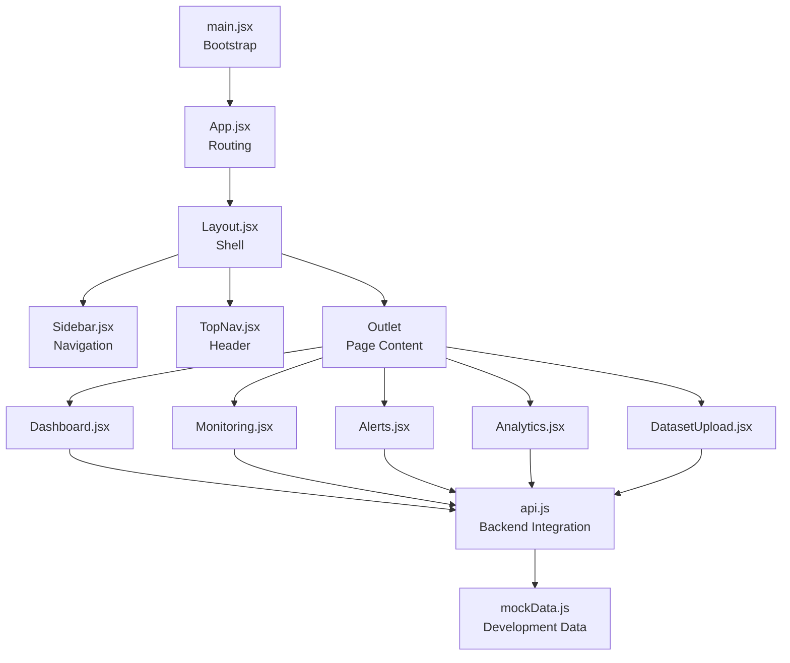
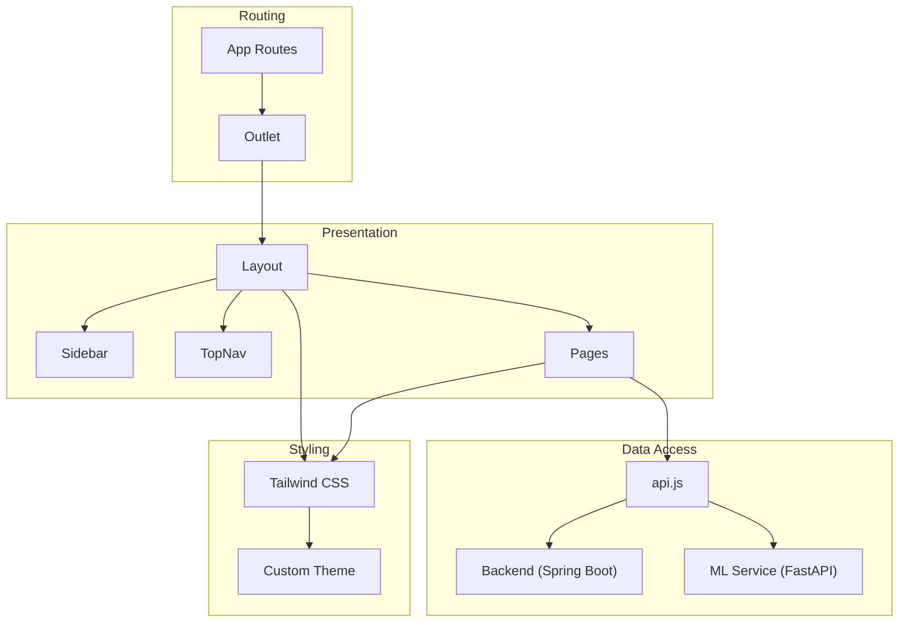
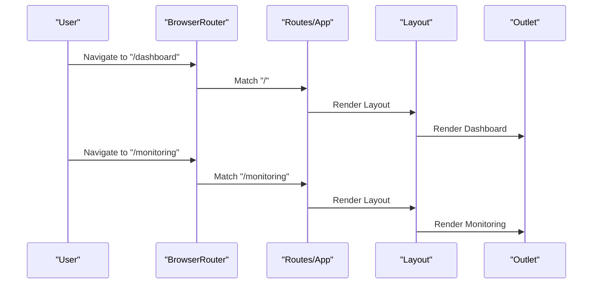
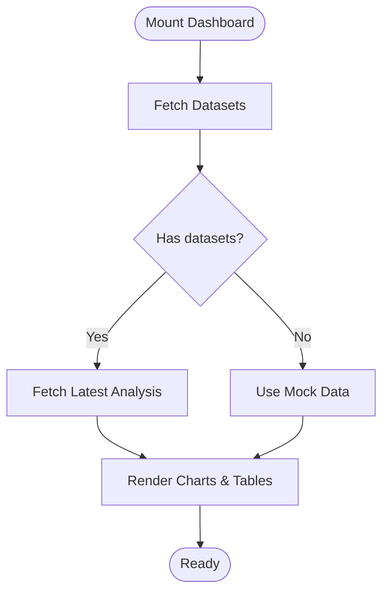
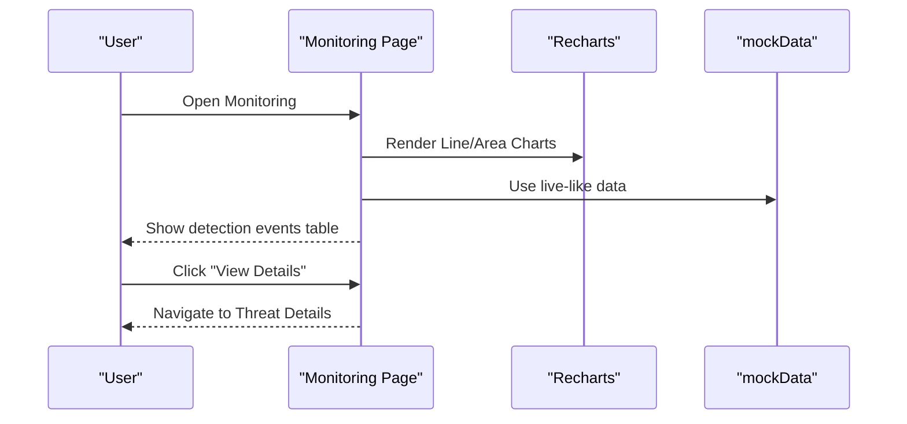
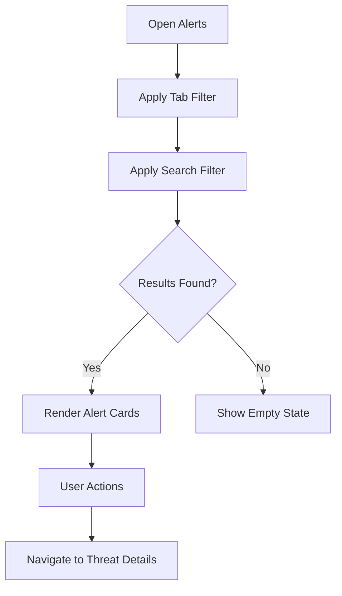
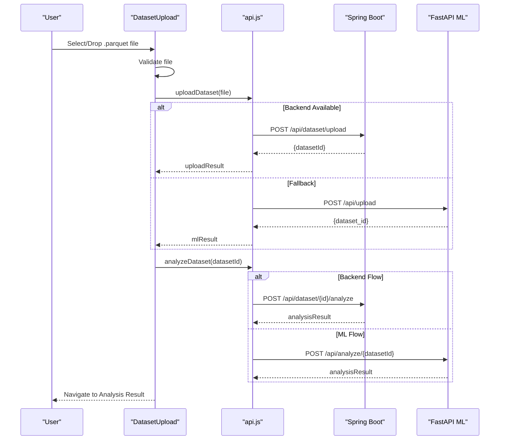
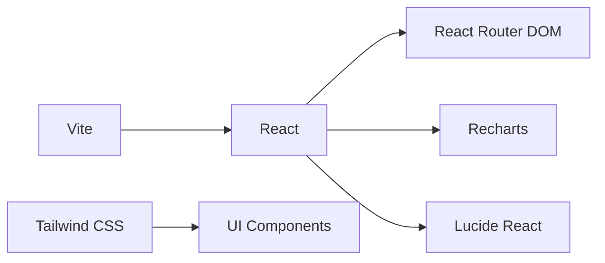

# Frontend Application Documentation

<cite>
**Referenced Files in This Document**
- [App.jsx](file://Mini_Project/clinical-nids-dashboard/src/App.jsx)
- [main.jsx](file://Mini_Project/clinical-nids-dashboard/src/main.jsx)
- [Layout.jsx](file://Mini_Project/clinical-nids-dashboard/src/components/Layout.jsx)
- [Sidebar.jsx](file://Mini_Project/clinical-nids-dashboard/src/components/Sidebar.jsx)
- [TopNav.jsx](file://Mini_Project/clinical-nids-dashboard/src/components/TopNav.jsx)
- [api.js](file://Mini_Project/clinical-nids-dashboard/src/data/api.js)
- [mockData.js](file://Mini_Project/clinical-nids-dashboard/src/data/mockData.js)
- [Dashboard.jsx](file://Mini_Project/clinical-nids-dashboard/src/pages/Dashboard.jsx)
- [Monitoring.jsx](file://Mini_Project/clinical-nids-dashboard/src/pages/Monitoring.jsx)
- [Alerts.jsx](file://Mini_Project/clinical-nids-dashboard/src/pages/Alerts.jsx)
- [Analytics.jsx](file://Mini_Project/clinical-nids-dashboard/src/pages/Analytics.jsx)
- [DatasetUpload.jsx](file://Mini_Project/clinical-nids-dashboard/src/pages/DatasetUpload.jsx)
- [package.json](file://Mini_Project/clinical-nids-dashboard/package.json)
- [tailwind.config.js](file://Mini_Project/clinical-nids-dashboard/tailwind.config.js)
- [vite.config.js](file://Mini_Project/clinical-nids-dashboard/vite.config.js)
</cite>

## Table of Contents
1. [Introduction](#introduction)
2. [Project Structure](#project-structure)
3. [Core Components](#core-components)
4. [Architecture Overview](#architecture-overview)
5. [Detailed Component Analysis](#detailed-component-analysis)
6. [Dependency Analysis](#dependency-analysis)
7. [Performance Considerations](#performance-considerations)
8. [Troubleshooting Guide](#troubleshooting-guide)
9. [Conclusion](#conclusion)

## Introduction
This document describes the React-based frontend dashboard for the Clinical-NIDS cybersecurity platform. It covers the component architecture, routing system, state management patterns, styling with Tailwind CSS, and integration with backend APIs. It documents the major pages: Dashboard analytics, Real-time Monitoring, Alert management, Dataset Upload interface, and Threat Details view. Guidance is included for extending the dashboard with new features and maintaining responsive design.

## Project Structure
The frontend is organized around a clean separation of concerns:
- Routing and entry point: App routes and main.jsx bootstrap
- Layout and navigation: Layout, Sidebar, and TopNav compose the shell
- Pages: Individual feature pages under pages/
- Data layer: API service module and mock data for development
- Styling: Tailwind CSS configuration and Vite build pipeline

**Diagram sources**
- [main.jsx:1-14](file://Mini_Project/clinical-nids-dashboard/src/main.jsx#L1-L14)
- [App.jsx:1-32](file://Mini_Project/clinical-nids-dashboard/src/App.jsx#L1-L32)
- [Layout.jsx:1-18](file://Mini_Project/clinical-nids-dashboard/src/components/Layout.jsx#L1-L18)
- [Sidebar.jsx:1-76](file://Mini_Project/clinical-nids-dashboard/src/components/Sidebar.jsx#L1-L76)
- [TopNav.jsx:1-46](file://Mini_Project/clinical-nids-dashboard/src/components/TopNav.jsx#L1-L46)
- [Dashboard.jsx:1-328](file://Mini_Project/clinical-nids-dashboard/src/pages/Dashboard.jsx#L1-L328)
- [Monitoring.jsx:1-191](file://Mini_Project/clinical-nids-dashboard/src/pages/Monitoring.jsx#L1-L191)
- [Alerts.jsx:1-157](file://Mini_Project/clinical-nids-dashboard/src/pages/Alerts.jsx#L1-L157)
- [Analytics.jsx:1-124](file://Mini_Project/clinical-nids-dashboard/src/pages/Analytics.jsx#L1-L124)
- [DatasetUpload.jsx:1-287](file://Mini_Project/clinical-nids-dashboard/src/pages/DatasetUpload.jsx#L1-L287)
- [api.js:1-236](file://Mini_Project/clinical-nids-dashboard/src/data/api.js#L1-L236)
- [mockData.js:1-91](file://Mini_Project/clinical-nids-dashboard/src/data/mockData.js#L1-L91)

**Section sources**
- [main.jsx:1-14](file://Mini_Project/clinical-nids-dashboard/src/main.jsx#L1-L14)
- [App.jsx:1-32](file://Mini_Project/clinical-nids-dashboard/src/App.jsx#L1-L32)

## Core Components
- Layout composes Sidebar, TopNav, and Outlet for nested page rendering.
- Sidebar provides primary navigation with icons and active state styling.
- TopNav displays status indicators, notifications, and user profile.
- Pages implement domain-specific UI and integrate with the API service.

Key styling and build configuration:
- Tailwind CSS configured with custom colors, fonts, animations, and keyframes.
- Vite plugin for React enables fast development builds.
- Package dependencies include React, React Router DOM, Recharts, and Lucide icons.

**Section sources**
- [Layout.jsx:1-18](file://Mini_Project/clinical-nids-dashboard/src/components/Layout.jsx#L1-L18)
- [Sidebar.jsx:1-76](file://Mini_Project/clinical-nids-dashboard/src/components/Sidebar.jsx#L1-L76)
- [TopNav.jsx:1-46](file://Mini_Project/clinical-nids-dashboard/src/components/TopNav.jsx#L1-L46)
- [tailwind.config.js:1-49](file://Mini_Project/clinical-nids-dashboard/tailwind.config.js#L1-L49)
- [vite.config.js:1-7](file://Mini_Project/clinical-nids-dashboard/vite.config.js#L1-L7)
- [package.json:1-31](file://Mini_Project/clinical-nids-dashboard/package.json#L1-L31)

## Architecture Overview
The application follows a layered architecture:
- Presentation layer: React components and pages
- Routing layer: React Router DOM with nested routes inside Layout
- Data access layer: api.js encapsulates HTTP requests to Spring Boot and FastAPI services
- Styling layer: Tailwind CSS utility classes with custom theme tokens

**Diagram sources**
- [App.jsx:1-32](file://Mini_Project/clinical-nids-dashboard/src/App.jsx#L1-L32)
- [Layout.jsx:1-18](file://Mini_Project/clinical-nids-dashboard/src/components/Layout.jsx#L1-L18)
- [Sidebar.jsx:1-76](file://Mini_Project/clinical-nids-dashboard/src/components/Sidebar.jsx#L1-L76)
- [TopNav.jsx:1-46](file://Mini_Project/clinical-nids-dashboard/src/components/TopNav.jsx#L1-L46)
- [Dashboard.jsx:1-328](file://Mini_Project/clinical-nids-dashboard/src/pages/Dashboard.jsx#L1-L328)
- [Monitoring.jsx:1-191](file://Mini_Project/clinical-nids-dashboard/src/pages/Monitoring.jsx#L1-L191)
- [Alerts.jsx:1-157](file://Mini_Project/clinical-nids-dashboard/src/pages/Alerts.jsx#L1-L157)
- [Analytics.jsx:1-124](file://Mini_Project/clinical-nids-dashboard/src/pages/Analytics.jsx#L1-L124)
- [DatasetUpload.jsx:1-287](file://Mini_Project/clinical-nids-dashboard/src/pages/DatasetUpload.jsx#L1-L287)
- [api.js:1-236](file://Mini_Project/clinical-nids-dashboard/src/data/api.js#L1-L236)
- [tailwind.config.js:1-49](file://Mini_Project/clinical-nids-dashboard/tailwind.config.js#L1-L49)

## Detailed Component Analysis

### Routing System
- Root routes define public login and protected layout.
- Nested routes under Layout include Dashboard, Monitoring, Alerts, Analytics, Dataset Upload, and Threat Details.
- Catch-all route redirects to Dashboard.

**Diagram sources**
- [App.jsx:12-28](file://Mini_Project/clinical-nids-dashboard/src/App.jsx#L12-L28)
- [Layout.jsx:1-18](file://Mini_Project/clinical-nids-dashboard/src/components/Layout.jsx#L1-L18)

**Section sources**
- [App.jsx:1-32](file://Mini_Project/clinical-nids-dashboard/src/App.jsx#L1-L32)

### Dashboard Analytics Page
Responsibilities:
- Fetch datasets and latest analysis results via API.
- Render summary cards, charts, recent datasets, and predictions table.
- Integrate Recharts for area, pie, bar, and line charts.
- Support fallback to mock data when backend is unavailable.

State management:
- useState for datasets, latest analysis, loading state.
- useEffect to load data on mount.

Data flow:
- getDatasets -> getAnalysis -> render charts and tables.

**Diagram sources**
- [Dashboard.jsx:30-56](file://Mini_Project/clinical-nids-dashboard/src/pages/Dashboard.jsx#L30-L56)
- [Dashboard.jsx:85-327](file://Mini_Project/clinical-nids-dashboard/src/pages/Dashboard.jsx#L85-L327)
- [api.js:158-194](file://Mini_Project/clinical-nids-dashboard/src/data/api.js#L158-L194)
- [mockData.js:1-91](file://Mini_Project/clinical-nids-dashboard/src/data/mockData.js#L1-L91)

**Section sources**
- [Dashboard.jsx:1-328](file://Mini_Project/clinical-nids-dashboard/src/pages/Dashboard.jsx#L1-L328)
- [api.js:158-194](file://Mini_Project/clinical-nids-dashboard/src/data/api.js#L158-L194)
- [mockData.js:1-91](file://Mini_Project/clinical-nids-dashboard/src/data/mockData.js#L1-L91)

### Real-time Monitoring Page
Responsibilities:
- Display live metrics and detection events.
- Render live packet flow chart and bandwidth utilization.
- Show AI feature importance for explainability.
- Provide navigation to Threat Details.

State management:
- useState for filter state.

Data sources:
- Uses mockData for live-like charts and threat events.

**Diagram sources**
- [Monitoring.jsx:19-191](file://Mini_Project/clinical-nids-dashboard/src/pages/Monitoring.jsx#L19-L191)
- [mockData.js:1-91](file://Mini_Project/clinical-nids-dashboard/src/data/mockData.js#L1-L91)

**Section sources**
- [Monitoring.jsx:1-191](file://Mini_Project/clinical-nids-dashboard/src/pages/Monitoring.jsx#L1-L191)
- [mockData.js:1-91](file://Mini_Project/clinical-nids-dashboard/src/data/mockData.js#L1-L91)

### Alert Management Page
Responsibilities:
- Filter and display security alerts by status and search term.
- Show summary cards for alert counts.
- Provide actions to review and block IPs.

State management:
- useState for tab selection and search input.

Data sources:
- Static mock data for alerts.

**Diagram sources**
- [Alerts.jsx:15-157](file://Mini_Project/clinical-nids-dashboard/src/pages/Alerts.jsx#L15-L157)
- [mockData.js:45-54](file://Mini_Project/clinical-nids-dashboard/src/data/mockData.js#L45-L54)

**Section sources**
- [Alerts.jsx:1-157](file://Mini_Project/clinical-nids-dashboard/src/pages/Alerts.jsx#L1-L157)
- [mockData.js:45-54](file://Mini_Project/clinical-nids-dashboard/src/data/mockData.js#L45-L54)

### Analytics Page
Responsibilities:
- Present attack analytics with KPIs and multiple charts.
- Render attack distribution pie, protocol usage bar, attack timeline line, and threat intensity area charts.

Data sources:
- Uses mockData for all analytics visuals.

**Section sources**
- [Analytics.jsx:1-124](file://Mini_Project/clinical-nids-dashboard/src/pages/Analytics.jsx#L1-L124)
- [mockData.js:29-43](file://Mini_Project/clinical-nids-dashboard/src/data/mockData.js#L29-L43)

### Dataset Upload Interface
Responsibilities:
- Drag-and-drop file upload with validation.
- Two-stage process: upload dataset and trigger analysis.
- Fallback to ML service if backend is unavailable.
- Progress tracking and success/error messaging.
- Auto-navigation to Analysis Result page upon completion.

**Diagram sources**
- [DatasetUpload.jsx:65-135](file://Mini_Project/clinical-nids-dashboard/src/pages/DatasetUpload.jsx#L65-L135)
- [api.js:159-178](file://Mini_Project/clinical-nids-dashboard/src/data/api.js#L159-L178)
- [api.js:206-223](file://Mini_Project/clinical-nids-dashboard/src/data/api.js#L206-L223)

**Section sources**
- [DatasetUpload.jsx:1-287](file://Mini_Project/clinical-nids-dashboard/src/pages/DatasetUpload.jsx#L1-L287)
- [api.js:159-178](file://Mini_Project/clinical-nids-dashboard/src/data/api.js#L159-L178)
- [api.js:206-223](file://Mini_Project/clinical-nids-dashboard/src/data/api.js#L206-L223)

### Threat Details View
- Navigation to Threat Details is integrated across Monitoring and Alerts pages.
- The route pattern supports dynamic ID binding for detailed views.
- Implementation is routed but not present in the current snapshot; integration points are defined in parent pages.

**Section sources**
- [Monitoring.jsx:178-180](file://Mini_Project/clinical-nids-dashboard/src/pages/Monitoring.jsx#L178-L180)
- [Alerts.jsx:129-131](file://Mini_Project/clinical-nids-dashboard/src/pages/Alerts.jsx#L129-L131)
- [App.jsx:24](file://Mini_Project/clinical-nids-dashboard/src/App.jsx#L24)

## Dependency Analysis
External libraries and their roles:
- React and React DOM: Core framework
- React Router DOM: Declarative routing and navigation
- Recharts: Charting library for analytics and monitoring
- Lucide React: Icons for UI affordances

Build and tooling:
- Vite: Development server and bundling
- Tailwind CSS: Utility-first styling with custom theme

**Diagram sources**
- [package.json:11-26](file://Mini_Project/clinical-nids-dashboard/package.json#L11-L26)
- [vite.config.js:1-7](file://Mini_Project/clinical-nids-dashboard/vite.config.js#L1-L7)
- [tailwind.config.js:1-49](file://Mini_Project/clinical-nids-dashboard/tailwind.config.js#L1-L49)

**Section sources**
- [package.json:1-31](file://Mini_Project/clinical-nids-dashboard/package.json#L1-L31)
- [vite.config.js:1-7](file://Mini_Project/clinical-nids-dashboard/vite.config.js#L1-L7)
- [tailwind.config.js:1-49](file://Mini_Project/clinical-nids-dashboard/tailwind.config.js#L1-L49)

## Performance Considerations
- Prefer lazy loading for heavy pages if the bundle grows large.
- Debounce search inputs in Alerts and Analytics for reduced re-renders.
- Virtualize long lists (e.g., detection events) to minimize DOM nodes.
- Use responsive chart containers to avoid layout thrashing on resize.
- Cache API responses where appropriate and implement optimistic updates for better perceived performance.

## Troubleshooting Guide
Common issues and resolutions:
- Backend unavailability during upload: The upload flow automatically falls back to the ML service if the Spring Boot endpoint fails.
- Authentication errors: Ensure tokens are persisted and included in API requests; verify token lifecycle in local storage.
- Chart rendering anomalies: Confirm responsive container sizes and data shape compatibility with Recharts.
- Styling inconsistencies: Verify Tailwind content paths and ensure custom theme tokens are applied consistently.

**Section sources**
- [DatasetUpload.jsx:77-87](file://Mini_Project/clinical-nids-dashboard/src/pages/DatasetUpload.jsx#L77-L87)
- [api.js:35-41](file://Mini_Project/clinical-nids-dashboard/src/data/api.js#L35-L41)
- [tailwind.config.js:3-6](file://Mini_Project/clinical-nids-dashboard/tailwind.config.js#L3-L6)

## Conclusion
The Clinical-NIDS dashboard provides a modular, data-driven interface with clear separation between routing, layout, and feature pages. Its integration with backend APIs and Recharts enables rich visualizations and real-time monitoring capabilities. The Tailwind CSS configuration ensures a cohesive, responsive design. Extending the dashboard involves adding new pages, integrating additional API endpoints, and leveraging the existing charting and styling patterns.