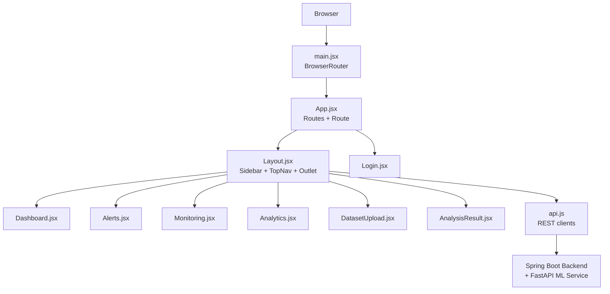
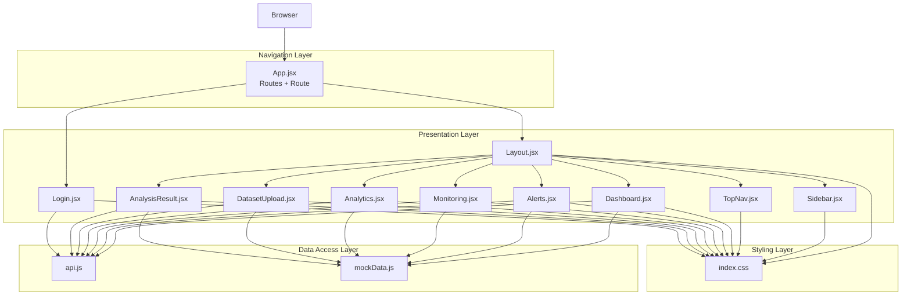
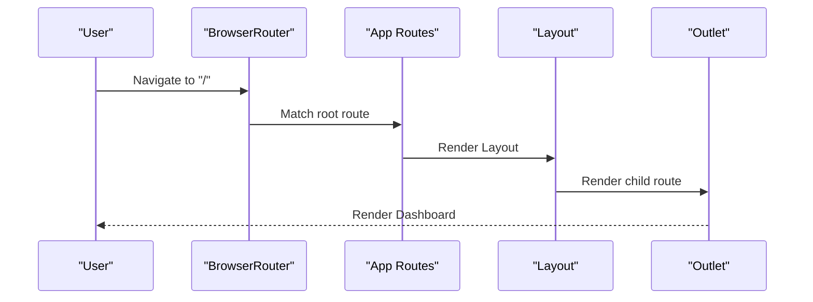
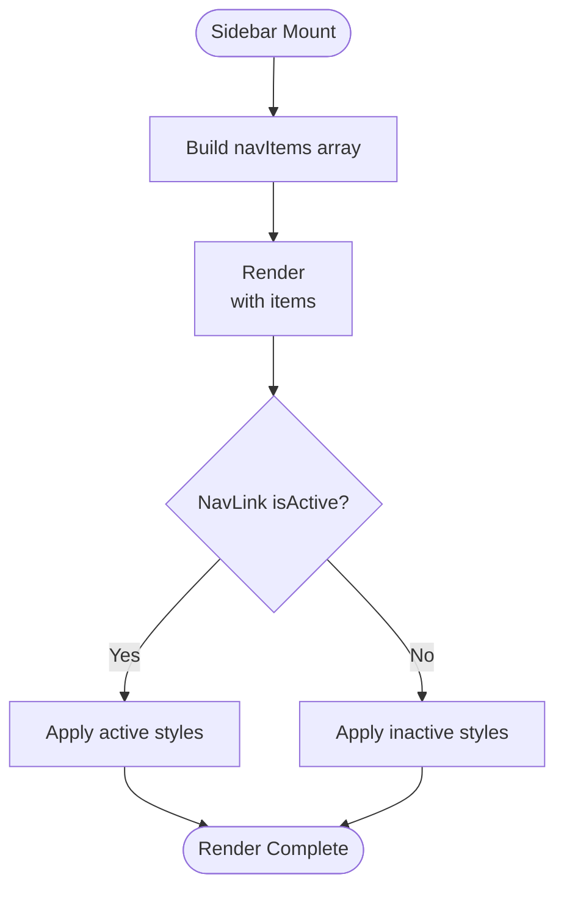
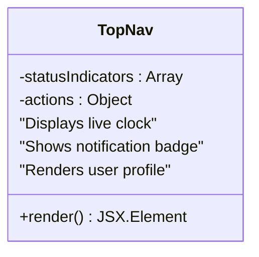
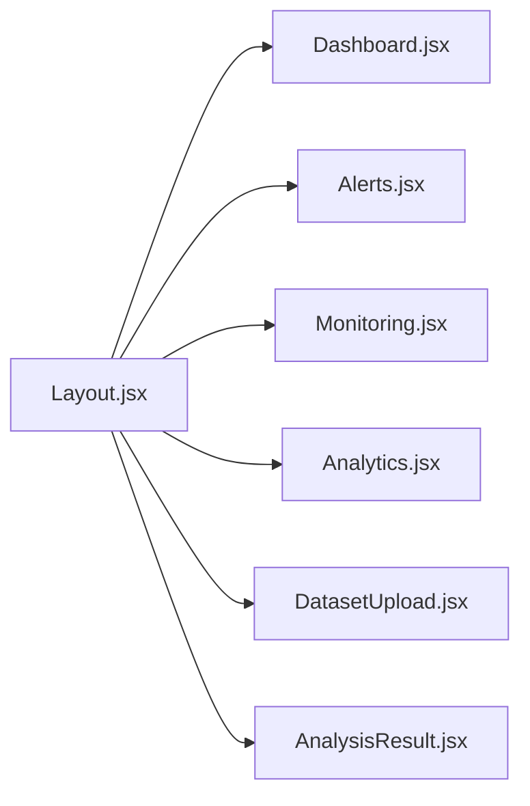
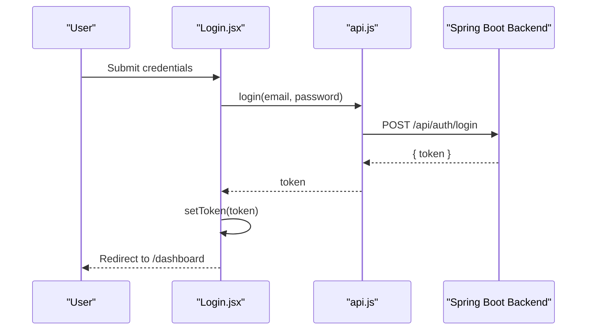
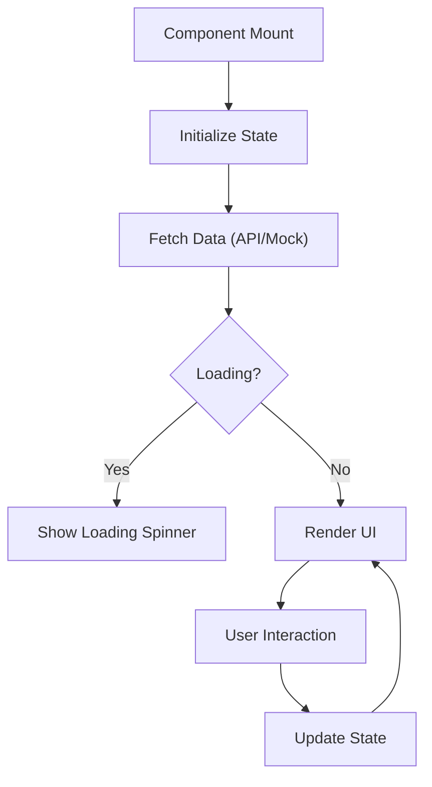
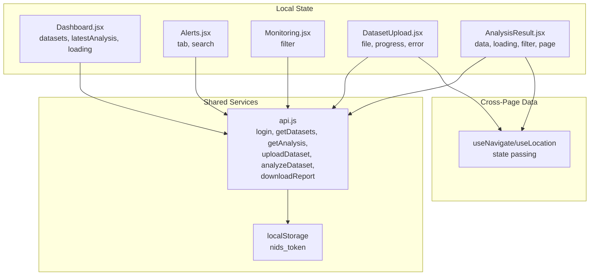
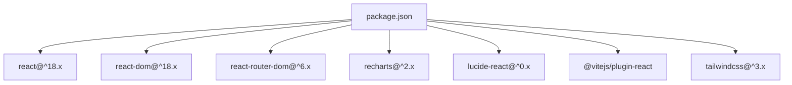

# React Application Architecture

<cite>
**Referenced Files in This Document**
- [main.jsx](file://Mini_Project/clinical-nids-dashboard/src/main.jsx)
- [App.jsx](file://Mini_Project/clinical-nids-dashboard/src/App.jsx)
- [Layout.jsx](file://Mini_Project/clinical-nids-dashboard/src/components/Layout.jsx)
- [Sidebar.jsx](file://Mini_Project/clinical-nids-dashboard/src/components/Sidebar.jsx)
- [TopNav.jsx](file://Mini_Project/clinical-nids-dashboard/src/components/TopNav.jsx)
- [Dashboard.jsx](file://Mini_Project/clinical-nids-dashboard/src/pages/Dashboard.jsx)
- [Login.jsx](file://Mini_Project/clinical-nids-dashboard/src/pages/Login.jsx)
- [Alerts.jsx](file://Mini_Project/clinical-nids-dashboard/src/pages/Alerts.jsx)
- [Monitoring.jsx](file://Mini_Project/clinical-nids-dashboard/src/pages/Monitoring.jsx)
- [Analytics.jsx](file://Mini_Project/clinical-nids-dashboard/src/pages/Analytics.jsx)
- [DatasetUpload.jsx](file://Mini_Project/clinical-nids-dashboard/src/pages/DatasetUpload.jsx)
- [AnalysisResult.jsx](file://Mini_Project/clinical-nids-dashboard/src/pages/AnalysisResult.jsx)
- [api.js](file://Mini_Project/clinical-nids-dashboard/src/data/api.js)
- [mockData.js](file://Mini_Project/clinical-nids-dashboard/src/data/mockData.js)
- [index.css](file://Mini_Project/clinical-nids-dashboard/src/index.css)
- [package.json](file://Mini_Project/clinical-nids-dashboard/package.json)
</cite>

## Table of Contents
1. [Introduction](#introduction)
2. [Project Structure](#project-structure)
3. [Core Components](#core-components)
4. [Architecture Overview](#architecture-overview)
5. [Detailed Component Analysis](#detailed-component-analysis)
6. [Dependency Analysis](#dependency-analysis)
7. [Performance Considerations](#performance-considerations)
8. [Troubleshooting Guide](#troubleshooting-guide)
9. [Conclusion](#conclusion)

## Introduction
This document describes the React application architecture for the Clinical-NIDS dashboard. It covers the routing system using React Router, the component hierarchy with a Layout wrapper, sidebar navigation, and top navigation bar. It also explains the overall application flow, component composition patterns, page organization under the main Layout, and how different pages are structured. The documentation includes details about routing configuration, protected routes, navigation patterns, component lifecycle, prop drilling strategies, and state sharing between components.

## Project Structure
The application follows a feature-based structure with clear separation between components, pages, data services, and styles:
- Entry point initializes the router and renders the root App component
- App defines route hierarchy and nested routes under Layout
- Layout composes Sidebar, TopNav, and Outlet for page rendering
- Pages implement specific views and orchestrate data fetching and UI
- Data module encapsulates API interactions and fallback logic
- Tailwind CSS provides styling with custom utilities and theme tokens

**Diagram sources**
- [main.jsx:1-14](file://Mini_Project/clinical-nids-dashboard/src/main.jsx#L1-L14)
- [App.jsx:1-32](file://Mini_Project/clinical-nids-dashboard/src/App.jsx#L1-L32)
- [Layout.jsx:1-18](file://Mini_Project/clinical-nids-dashboard/src/components/Layout.jsx#L1-L18)
- [Sidebar.jsx:1-76](file://Mini_Project/clinical-nids-dashboard/src/components/Sidebar.jsx#L1-L76)
- [TopNav.jsx:1-46](file://Mini_Project/clinical-nids-dashboard/src/components/TopNav.jsx#L1-L46)
- [Dashboard.jsx:1-328](file://Mini_Project/clinical-nids-dashboard/src/pages/Dashboard.jsx#L1-L328)
- [Login.jsx:1-157](file://Mini_Project/clinical-nids-dashboard/src/pages/Login.jsx#L1-L157)
- [api.js:1-236](file://Mini_Project/clinical-nids-dashboard/src/data/api.js#L1-L236)

**Section sources**
- [main.jsx:1-14](file://Mini_Project/clinical-nids-dashboard/src/main.jsx#L1-L14)
- [App.jsx:1-32](file://Mini_Project/clinical-nids-dashboard/src/App.jsx#L1-L32)
- [package.json:1-31](file://Mini_Project/clinical-nids-dashboard/package.json#L1-L31)

## Core Components
- Router initialization and routing configuration
- Layout wrapper with sidebar and top navigation
- Page components implementing domain-specific views
- API service layer with fallback strategies
- Styling via Tailwind utilities and custom CSS

Key implementation highlights:
- Routing uses nested routes under a shared Layout for authenticated views
- Sidebar provides primary navigation with active state styling
- TopNav displays status indicators and user actions
- Pages coordinate data fetching, filtering, and pagination
- API module centralizes HTTP requests and token management

**Section sources**
- [App.jsx:1-32](file://Mini_Project/clinical-nids-dashboard/src/App.jsx#L1-L32)
- [Layout.jsx:1-18](file://Mini_Project/clinical-nids-dashboard/src/components/Layout.jsx#L1-L18)
- [Sidebar.jsx:1-76](file://Mini_Project/clinical-nids-dashboard/src/components/Sidebar.jsx#L1-L76)
- [TopNav.jsx:1-46](file://Mini_Project/clinical-nids-dashboard/src/components/TopNav.jsx#L1-L46)
- [api.js:1-236](file://Mini_Project/clinical-nids-dashboard/src/data/api.js#L1-L236)

## Architecture Overview
The application employs a layered architecture:
- Presentation layer: React components (Layout, Sidebar, TopNav, Pages)
- Navigation layer: React Router for routing and nested outlets
- Data access layer: api.js encapsulating REST calls to backend and ML service
- Styling layer: Tailwind CSS with custom utilities and theme tokens

**Diagram sources**
- [App.jsx:1-32](file://Mini_Project/clinical-nids-dashboard/src/App.jsx#L1-L32)
- [Layout.jsx:1-18](file://Mini_Project/clinical-nids-dashboard/src/components/Layout.jsx#L1-L18)
- [Sidebar.jsx:1-76](file://Mini_Project/clinical-nids-dashboard/src/components/Sidebar.jsx#L1-L76)
- [TopNav.jsx:1-46](file://Mini_Project/clinical-nids-dashboard/src/components/TopNav.jsx#L1-L46)
- [Dashboard.jsx:1-328](file://Mini_Project/clinical-nids-dashboard/src/pages/Dashboard.jsx#L1-L328)
- [Alerts.jsx:1-157](file://Mini_Project/clinical-nids-dashboard/src/pages/Alerts.jsx#L1-L157)
- [Monitoring.jsx:1-191](file://Mini_Project/clinical-nids-dashboard/src/pages/Monitoring.jsx#L1-L191)
- [Analytics.jsx:1-124](file://Mini_Project/clinical-nids-dashboard/src/pages/Analytics.jsx#L1-L124)
- [DatasetUpload.jsx:1-287](file://Mini_Project/clinical-nids-dashboard/src/pages/DatasetUpload.jsx#L1-L287)
- [AnalysisResult.jsx:1-433](file://Mini_Project/clinical-nids-dashboard/src/pages/AnalysisResult.jsx#L1-L433)
- [Login.jsx:1-157](file://Mini_Project/clinical-nids-dashboard/src/pages/Login.jsx#L1-L157)
- [api.js:1-236](file://Mini_Project/clinical-nids-dashboard/src/data/api.js#L1-L236)
- [mockData.js:1-91](file://Mini_Project/clinical-nids-dashboard/src/data/mockData.js#L1-L91)
- [index.css:1-79](file://Mini_Project/clinical-nids-dashboard/src/index.css#L1-L79)

## Detailed Component Analysis

### Routing System and Layout Composition
The routing system uses React Router v6 with nested routes:
- Root route mounts Login at /login
- Root route at / wraps Layout, which hosts nested routes for authenticated pages
- Index route redirects to /dashboard
- Catch-all route navigates back to /dashboard for unknown paths

Layout composes three primary parts:
- Fixed sidebar with main menu and system links
- Sticky top navigation bar with status badges and user controls
- Outlet renders the matched child route

**Diagram sources**
- [main.jsx:1-14](file://Mini_Project/clinical-nids-dashboard/src/main.jsx#L1-L14)
- [App.jsx:1-32](file://Mini_Project/clinical-nids-dashboard/src/App.jsx#L1-L32)
- [Layout.jsx:1-18](file://Mini_Project/clinical-nids-dashboard/src/components/Layout.jsx#L1-L18)

**Section sources**
- [App.jsx:1-32](file://Mini_Project/clinical-nids-dashboard/src/App.jsx#L1-L32)
- [Layout.jsx:1-18](file://Mini_Project/clinical-nids-dashboard/src/components/Layout.jsx#L1-L18)

### Sidebar Navigation Structure
The sidebar organizes navigation into two groups:
- Main Menu: Dashboard, Dataset Upload, Threat Monitoring, Alert Management, Analytics
- System: Search Logs, Settings
It uses NavLink to render active state styling and integrates with Lucide icons.

**Diagram sources**
- [Sidebar.jsx:1-76](file://Mini_Project/clinical-nids-dashboard/src/components/Sidebar.jsx#L1-L76)

**Section sources**
- [Sidebar.jsx:1-76](file://Mini_Project/clinical-nids-dashboard/src/components/Sidebar.jsx#L1-L76)

### Top Navigation Bar Implementation
The top navigation bar displays:
- Security status indicators (network protection, monitoring active)
- Live clock (monospaced time)
- Notification bell with badge
- User profile avatar and dropdown affordances

**Diagram sources**
- [TopNav.jsx:1-46](file://Mini_Project/clinical-nids-dashboard/src/components/TopNav.jsx#L1-L46)

**Section sources**
- [TopNav.jsx:1-46](file://Mini_Project/clinical-nids-dashboard/src/components/TopNav.jsx#L1-L46)

### Page Organization Under Layout
Authenticated pages are organized under the Layout wrapper:
- Dashboard: Overview charts, recent datasets, quick actions
- Alerts: Alert list with filtering and status management
- Monitoring: Real-time traffic and AI explainability panels
- Analytics: Attack distribution and trend visualizations
- DatasetUpload: Drag-and-drop upload with progress and fallback
- AnalysisResult: Comprehensive results with charts and prediction table

**Diagram sources**
- [Layout.jsx:1-18](file://Mini_Project/clinical-nids-dashboard/src/components/Layout.jsx#L1-L18)
- [Dashboard.jsx:1-328](file://Mini_Project/clinical-nids-dashboard/src/pages/Dashboard.jsx#L1-L328)
- [Alerts.jsx:1-157](file://Mini_Project/clinical-nids-dashboard/src/pages/Alerts.jsx#L1-L157)
- [Monitoring.jsx:1-191](file://Mini_Project/clinical-nids-dashboard/src/pages/Monitoring.jsx#L1-L191)
- [Analytics.jsx:1-124](file://Mini_Project/clinical-nids-dashboard/src/pages/Analytics.jsx#L1-L124)
- [DatasetUpload.jsx:1-287](file://Mini_Project/clinical-nids-dashboard/src/pages/DatasetUpload.jsx#L1-L287)
- [AnalysisResult.jsx:1-433](file://Mini_Project/clinical-nids-dashboard/src/pages/AnalysisResult.jsx#L1-L433)

**Section sources**
- [Dashboard.jsx:1-328](file://Mini_Project/clinical-nids-dashboard/src/pages/Dashboard.jsx#L1-L328)
- [Alerts.jsx:1-157](file://Mini_Project/clinical-nids-dashboard/src/pages/Alerts.jsx#L1-L157)
- [Monitoring.jsx:1-191](file://Mini_Project/clinical-nids-dashboard/src/pages/Monitoring.jsx#L1-L191)
- [Analytics.jsx:1-124](file://Mini_Project/clinical-nids-dashboard/src/pages/Analytics.jsx#L1-L124)
- [DatasetUpload.jsx:1-287](file://Mini_Project/clinical-nids-dashboard/src/pages/DatasetUpload.jsx#L1-L287)
- [AnalysisResult.jsx:1-433](file://Mini_Project/clinical-nids-dashboard/src/pages/AnalysisResult.jsx#L1-L433)

### Protected Routes and Authentication Flow
The application implements implicit protection through route nesting:
- Login route is publicly accessible
- All other routes are rendered within Layout, implying authentication context
- Login page handles credentials and sets token in local storage
- API module reads token from local storage for authenticated requests

**Diagram sources**
- [Login.jsx:1-157](file://Mini_Project/clinical-nids-dashboard/src/pages/Login.jsx#L1-L157)
- [api.js:11-27](file://Mini_Project/clinical-nids-dashboard/src/data/api.js#L11-L27)

**Section sources**
- [Login.jsx:1-157](file://Mini_Project/clinical-nids-dashboard/src/pages/Login.jsx#L1-L157)
- [api.js:11-27](file://Mini_Project/clinical-nids-dashboard/src/data/api.js#L11-L27)

### Component Lifecycle and Data Flow
Pages implement lifecycle patterns using React hooks:
- Dashboard: fetches datasets and analysis on mount, handles loading states
- Alerts: local filtering and state management for tabs and search
- Monitoring: generates synthetic live data and maintains filter state
- Analytics: renders static charts from mock data
- DatasetUpload: orchestrates upload and analysis with progress tracking and fallback
- AnalysisResult: loads analysis data from API or location state, supports filtering and pagination

**Diagram sources**
- [Dashboard.jsx:30-56](file://Mini_Project/clinical-nids-dashboard/src/pages/Dashboard.jsx#L30-L56)
- [DatasetUpload.jsx:65-135](file://Mini_Project/clinical-nids-dashboard/src/pages/DatasetUpload.jsx#L65-L135)
- [AnalysisResult.jsx:41-52](file://Mini_Project/clinical-nids-dashboard/src/pages/AnalysisResult.jsx#L41-L52)

**Section sources**
- [Dashboard.jsx:30-56](file://Mini_Project/clinical-nids-dashboard/src/pages/Dashboard.jsx#L30-L56)
- [Alerts.jsx:15-32](file://Mini_Project/clinical-nids-dashboard/src/pages/Alerts.jsx#L15-L32)
- [Monitoring.jsx:19-22](file://Mini_Project/clinical-nids-dashboard/src/pages/Monitoring.jsx#L19-L22)
- [Analytics.jsx:8-15](file://Mini_Project/clinical-nids-dashboard/src/pages/Analytics.jsx#L8-L15)
- [DatasetUpload.jsx:65-135](file://Mini_Project/clinical-nids-dashboard/src/pages/DatasetUpload.jsx#L65-L135)
- [AnalysisResult.jsx:41-52](file://Mini_Project/clinical-nids-dashboard/src/pages/AnalysisResult.jsx#L41-L52)

### State Sharing Between Components
State management strategies:
- Local component state for UI state (filters, search, pagination)
- Shared API service for HTTP operations and token persistence
- Location state passed during navigation for cross-page data continuity
- Mock data module for development and fallback scenarios

**Diagram sources**
- [Dashboard.jsx:31-38](file://Mini_Project/clinical-nids-dashboard/src/pages/Dashboard.jsx#L31-L38)
- [Alerts.jsx:16-24](file://Mini_Project/clinical-nids-dashboard/src/pages/Alerts.jsx#L16-L24)
- [Monitoring.jsx:20-22](file://Mini_Project/clinical-nids-dashboard/src/pages/Monitoring.jsx#L20-L22)
- [DatasetUpload.jsx:14-23](file://Mini_Project/clinical-nids-dashboard/src/pages/DatasetUpload.jsx#L14-L23)
- [AnalysisResult.jsx:28-40](file://Mini_Project/clinical-nids-dashboard/src/pages/AnalysisResult.jsx#L28-L40)
- [api.js:21-31](file://Mini_Project/clinical-nids-dashboard/src/data/api.js#L21-L31)

**Section sources**
- [Dashboard.jsx:31-56](file://Mini_Project/clinical-nids-dashboard/src/pages/Dashboard.jsx#L31-L56)
- [Alerts.jsx:16-32](file://Mini_Project/clinical-nids-dashboard/src/pages/Alerts.jsx#L16-L32)
- [Monitoring.jsx:20-22](file://Mini_Project/clinical-nids-dashboard/src/pages/Monitoring.jsx#L20-L22)
- [DatasetUpload.jsx:14-23](file://Mini_Project/clinical-nids-dashboard/src/pages/DatasetUpload.jsx#L14-L23)
- [AnalysisResult.jsx:28-40](file://Mini_Project/clinical-nids-dashboard/src/pages/AnalysisResult.jsx#L28-L40)
- [api.js:21-31](file://Mini_Project/clinical-nids-dashboard/src/data/api.js#L21-L31)

## Dependency Analysis
External dependencies include React, React Router DOM, Recharts for visualizations, and Lucide React for icons. The project uses Vite for bundling and Tailwind CSS for styling.

**Diagram sources**
- [package.json:11-26](file://Mini_Project/clinical-nids-dashboard/package.json#L11-L26)

**Section sources**
- [package.json:1-31](file://Mini_Project/clinical-nids-dashboard/package.json#L1-L31)

## Performance Considerations
- Prefer server-side analytics and real-time data where possible; current implementation uses mock data for development
- Optimize chart rendering by limiting data points and using responsive containers
- Implement pagination for large datasets (already present in AnalysisResult)
- Debounce search inputs to reduce re-renders
- Use memoization for expensive computations in charts and tables
- Lazy load heavy components if needed

## Troubleshooting Guide
Common issues and resolutions:
- Backend unavailability: Login and upload flows include fallbacks to mock behavior and direct ML service calls
- Token errors: Verify token presence in localStorage and proper Authorization header usage
- Navigation failures: Ensure nested routes are properly defined under Layout and Outlet is present
- Styling inconsistencies: Confirm Tailwind directives are included and custom utilities are defined

**Section sources**
- [Login.jsx:15-31](file://Mini_Project/clinical-nids-dashboard/src/pages/Login.jsx#L15-L31)
- [DatasetUpload.jsx:77-87](file://Mini_Project/clinical-nids-dashboard/src/pages/DatasetUpload.jsx#L77-L87)
- [api.js:35-41](file://Mini_Project/clinical-nids-dashboard/src/data/api.js#L35-L41)
- [index.css:1-79](file://Mini_Project/clinical-nids-dashboard/src/index.css#L1-L79)

## Conclusion
The Clinical-NIDS React application demonstrates a clean, modular architecture with clear separation of concerns. React Router manages routing and nested layouts effectively, while the Layout wrapper ensures consistent navigation and branding. Pages implement focused responsibilities with robust data fetching and state management. The API service layer centralizes HTTP operations and provides fallback mechanisms for resilience. Together, these patterns create a maintainable and extensible dashboard suitable for cybersecurity operations.