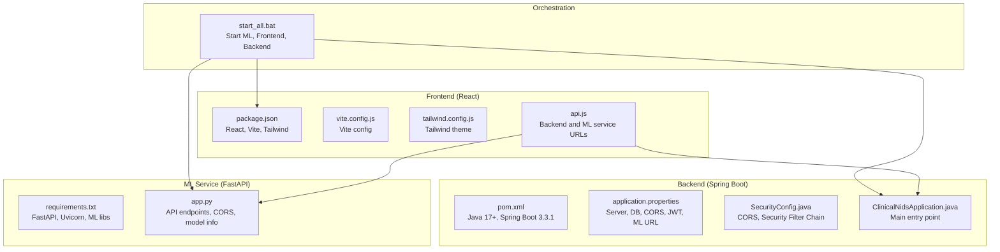

# Getting Started

<cite>
**Referenced Files in This Document**
- [pom.xml](file://Mini_Project/backend/pom.xml)
- [application.properties](file://Mini_Project/backend/src/main/resources/application.properties)
- [SecurityConfig.java](file://Mini_Project/backend/src/main/java/com/clinicalnids/backend/config/SecurityConfig.java)
- [ClinicalNidsApplication.java](file://Mini_Project/backend/src/main/java/com/clinicalnids/backend/ClinicalNidsApplication.java)
- [package.json](file://Mini_Project/clinical-nids-dashboard/package.json)
- [vite.config.js](file://Mini_Project/clinical-nids-dashboard/vite.config.js)
- [tailwind.config.js](file://Mini_Project/clinical-nids-dashboard/tailwind.config.js)
- [api.js](file://Mini_Project/clinical-nids-dashboard/src/data/api.js)
- [requirements.txt](file://Mini_Project/ml-service/requirements.txt)
- [app.py](file://Mini_Project/ml-service/app.py)
- [start_all.bat](file://Mini_Project/start_all.bat)
</cite>

## Table of Contents
1. [Introduction](#introduction)
2. [Project Structure](#project-structure)
3. [System Requirements](#system-requirements)
4. [Prerequisites](#prerequisites)
5. [Environment Setup](#environment-setup)
6. [Installation Instructions](#installation-instructions)
7. [Initial Configuration](#initial-configuration)
8. [Service Startup Procedures](#service-startup-procedures)
9. [Verification Steps](#verification-steps)
10. [Common Installation Issues](#common-installation-issues)
11. [Troubleshooting Guide](#troubleshooting-guide)
12. [Conclusion](#conclusion)

## Introduction
This guide helps you install and run the Clinical-NIDS system locally. It covers all three components:
- Spring Boot backend (Java 17+, Maven)
- React frontend (Node.js, npm)
- FastAPI ML service (Python 3.x, pip)

You will configure databases (PostgreSQL or H2), environment variables, and use the provided batch script to start all services. Finally, you will verify that all components are running and communicating correctly.

## Project Structure
The project is organized into three main parts:
- backend: Spring Boot REST API with security, JPA, and controllers
- clinical-nids-dashboard: React-based frontend using Vite and TailwindCSS
- ml-service: FastAPI machine learning microservice

**Diagram sources**
- [pom.xml:1-125](file://Mini_Project/backend/pom.xml#L1-L125)
- [application.properties:1-46](file://Mini_Project/backend/src/main/resources/application.properties#L1-L46)
- [SecurityConfig.java:1-73](file://Mini_Project/backend/src/main/java/com/clinicalnids/backend/config/SecurityConfig.java#L1-L73)
- [ClinicalNidsApplication.java:1-12](file://Mini_Project/backend/src/main/java/com/clinicalnids/backend/ClinicalNidsApplication.java#L1-L12)
- [package.json:1-31](file://Mini_Project/clinical-nids-dashboard/package.json#L1-L31)
- [vite.config.js:1-7](file://Mini_Project/clinical-nids-dashboard/vite.config.js#L1-L7)
- [tailwind.config.js:1-49](file://Mini_Project/clinical-nids-dashboard/tailwind.config.js#L1-L49)
- [api.js:1-236](file://Mini_Project/clinical-nids-dashboard/src/data/api.js#L1-L236)
- [requirements.txt:1-13](file://Mini_Project/ml-service/requirements.txt#L1-L13)
- [app.py:1-800](file://Mini_Project/ml-service/app.py#L1-L800)
- [start_all.bat:1-59](file://Mini_Project/start_all.bat#L1-L59)

**Section sources**
- [pom.xml:1-125](file://Mini_Project/backend/pom.xml#L1-L125)
- [package.json:1-31](file://Mini_Project/clinical-nids-dashboard/package.json#L1-L31)
- [requirements.txt:1-13](file://Mini_Project/ml-service/requirements.txt#L1-L13)
- [start_all.bat:1-59](file://Mini_Project/start_all.bat#L1-L59)

## System Requirements
- Java: 17 or higher (required for Spring Boot)
- Node.js: Required for React frontend development server
- Python: 3.x series (recommended: 3.9–3.11) for the ML service
- Database: Either H2 (default for development) or PostgreSQL (recommended for production)
- Maven: Required to run the Spring Boot backend locally
- Git (optional): To clone the repository

Notes:
- The backend uses Spring Boot 3.3.1 with Java 17.
- The frontend runs on Vite with React and TailwindCSS.
- The ML service uses FastAPI and Uvicorn with scikit-learn, XGBoost, and related libraries.

**Section sources**
- [pom.xml:20-23](file://Mini_Project/backend/pom.xml#L20-L23)
- [package.json:1-31](file://Mini_Project/clinical-nids-dashboard/package.json#L1-L31)
- [requirements.txt:1-13](file://Mini_Project/ml-service/requirements.txt#L1-L13)

## Prerequisites
Before installing, ensure you have:
- Java 17+ installed and available in PATH
- Node.js and npm installed and available in PATH
- Python 3.x installed and pip available
- PostgreSQL installed and running (if choosing PostgreSQL)
- Git (optional)

Verify installations:
- java -version
- node --version
- npm --version
- python --version
- pip --version
- psql --version (if using PostgreSQL)

**Section sources**
- [pom.xml:20-23](file://Mini_Project/backend/pom.xml#L20-L23)

## Environment Setup
Set up your local environment as follows:

### Backend (Spring Boot)
- Navigate to the backend directory
- Ensure Maven is installed and available
- The backend defaults to H2 for development; PostgreSQL is available for production

Key ports and endpoints:
- Backend server port: 8080
- H2 console: enabled at /h2-console when using H2

Database configuration:
- H2 (development): jdbc:h2:mem:clinicalnids
- PostgreSQL (production): jdbc:postgresql://localhost:5432/clinical_nids

JWT configuration:
- Secret key and expiration are configured in application.properties

CORS configuration:
- Allowed origins include the frontend URL (http://localhost:5173)

ML service URL:
- The backend expects the ML service at http://localhost:8000

**Section sources**
- [application.properties:4-36](file://Mini_Project/backend/src/main/resources/application.properties#L4-L36)
- [SecurityConfig.java:52-61](file://Mini_Project/backend/src/main/java/com/clinicalnids/backend/config/SecurityConfig.java#L52-L61)

### Frontend (React)
- Navigate to the frontend directory
- Install dependencies using npm
- The frontend runs on Vite and targets port 5173

Build and dev scripts:
- Development: npm run dev
- Build: npm run build
- Preview: npm run preview

Styling:
- TailwindCSS is configured with custom color palette and animations

**Section sources**
- [package.json:6-10](file://Mini_Project/clinical-nids-dashboard/package.json#L6-L10)
- [vite.config.js:1-7](file://Mini_Project/clinical-nids-dashboard/vite.config.js#L1-L7)
- [tailwind.config.js:1-49](file://Mini_Project/clinical-nids-dashboard/tailwind.config.js#L1-L49)

### ML Service (FastAPI)
- Navigate to the ML service directory
- Install Python dependencies using pip
- The service listens on port 8000

Key endpoints:
- Health check: GET /api/health
- Model info: GET /api/model/info
- Predictions: POST /api/predict and POST /api/predict/batch
- Dataset upload and analysis: POST /api/upload, POST /api/analyze/{id}, GET /api/analysis/{id}

CORS:
- The ML service allows cross-origin requests from any origin during development

**Section sources**
- [requirements.txt:1-13](file://Mini_Project/ml-service/requirements.txt#L1-L13)
- [app.py:40-53](file://Mini_Project/ml-service/app.py#L40-L53)
- [app.py:418-426](file://Mini_Project/ml-service/app.py#L418-L426)

## Installation Instructions

### Step 1: Install Backend Dependencies
- Change to the backend directory
- Build the Spring Boot application using Maven

Command:
- mvn clean install

Note: The batch script starts the backend separately using Maven.

**Section sources**
- [pom.xml:108-123](file://Mini_Project/backend/pom.xml#L108-L123)

### Step 2: Install Frontend Dependencies
- Change to the frontend directory
- Install dependencies using npm

Command:
- npm ci

Note: The batch script starts the frontend using Vite dev server.

**Section sources**
- [package.json:1-31](file://Mini_Project/clinical-nids-dashboard/package.json#L1-L31)

### Step 3: Install ML Service Dependencies
- Change to the ML service directory
- Install Python dependencies using pip

Command:
- pip install -r requirements.txt

Note: The batch script starts the ML service using Python.

**Section sources**
- [requirements.txt:1-13](file://Mini_Project/ml-service/requirements.txt#L1-L13)

## Initial Configuration

### Database Configuration
Choose one of the following:

Option A: H2 (Development)
- No external database required
- The backend connects to an in-memory H2 database
- Access the H2 console at http://localhost:8080/h2-console

Option B: PostgreSQL (Production)
- Install and start PostgreSQL
- Update the backend datasource URL, driver, username, and password in application.properties
- Set the Hibernate dialect to PostgreSQL

Environment variables (optional):
- Configure database connection via environment variables if desired

**Section sources**
- [application.properties:7-26](file://Mini_Project/backend/src/main/resources/application.properties#L7-L26)

### Environment Variables
Configure the following in the backend:
- Server port: 8080
- ML service URL: http://localhost:8000
- Allowed CORS origins: http://localhost:5173
- JWT secret and expiration
- File upload limits and directory

Frontend:
- Uses hardcoded backend and ML service URLs in api.js
- Adjust if hosting elsewhere

ML Service:
- Uses default host 0.0.0.0 and port 8000
- CORS allows any origin for development

**Section sources**
- [application.properties:4-45](file://Mini_Project/backend/src/main/resources/application.properties#L4-L45)
- [api.js:6-7](file://Mini_Project/clinical-nids-dashboard/src/data/api.js#L6-L7)
- [app.py:40-53](file://Mini_Project/ml-service/app.py#L40-L53)

## Service Startup Procedures

### Option A: Use the Provided Batch Script (Windows)
The batch script automates starting all services:
- Starts the ML service (FastAPI on port 8000)
- Starts the React frontend (Vite on port 5173)
- Provides instructions to start the Spring Boot backend manually using Maven

Important notes:
- The script prints the expected URLs for each service
- The backend requires Maven and must be started separately per the script’s instructions

**Section sources**
- [start_all.bat:1-59](file://Mini_Project/start_all.bat#L1-L59)

### Option B: Start Services Manually
1. Start the ML Service
   - Navigate to the ML service directory
   - Run the FastAPI app with Uvicorn

2. Start the Frontend
   - Navigate to the frontend directory
   - Start the Vite dev server

3. Start the Backend
   - Navigate to the backend directory
   - Run the Spring Boot application using Maven

Ports:
- ML Service: 8000
- Frontend: 5173
- Backend: 8080

**Section sources**
- [app.py:655-661](file://Mini_Project/ml-service/app.py#L655-L661)
- [package.json:6-10](file://Mini_Project/clinical-nids-dashboard/package.json#L6-L10)
- [start_all.bat:16-18](file://Mini_Project/start_all.bat#L16-L18)

## Verification Steps

### Verify ML Service
- Endpoint: GET http://localhost:8000/api/health
- Should return a healthy status and indicate the model is loaded

- Endpoint: GET http://localhost:8000/api/model/info
- Should return model metadata and performance metrics

- Endpoint: POST http://localhost:8000/api/predict
- Send test traffic features to receive a prediction result

**Section sources**
- [app.py:418-426](file://Mini_Project/ml-service/app.py#L418-L426)
- [app.py:429-436](file://Mini_Project/ml-service/app.py#L429-L436)
- [app.py:439-464](file://Mini_Project/ml-service/app.py#L439-L464)

### Verify Frontend
- Visit: http://localhost:5173
- Ensure the React app loads without errors
- Confirm it can reach the backend at http://localhost:8080

**Section sources**
- [api.js:6-7](file://Mini_Project/clinical-nids-dashboard/src/data/api.js#L6-L7)

### Verify Backend
- Health check: GET http://localhost:8080 (Spring Boot actuator or controller endpoint)
- H2 Console: http://localhost:8080/h2-console (when using H2)
- CORS: Ensure the frontend origin is permitted

**Section sources**
- [SecurityConfig.java:52-61](file://Mini_Project/backend/src/main/java/com/clinicalnids/backend/config/SecurityConfig.java#L52-L61)
- [application.properties:12-13](file://Mini_Project/backend/src/main/resources/application.properties#L12-L13)

### Cross-Service Communication
- The frontend communicates with the backend and ML service via hardcoded URLs
- The backend forwards ML-related requests to the ML service URL configured in application.properties

**Section sources**
- [api.js:6-7](file://Mini_Project/clinical-nids-dashboard/src/data/api.js#L6-L7)
- [application.properties](file://Mini_Project/backend/src/main/resources/application.properties#L33)

## Common Installation Issues

### Java Version Mismatch
- Symptom: Build fails or runtime errors
- Fix: Ensure Java 17+ is installed and set as the default JDK

**Section sources**
- [pom.xml:20-23](file://Mini_Project/backend/pom.xml#L20-L23)

### Node/npm Not Found
- Symptom: npm commands fail
- Fix: Install Node.js and npm; verify with node --version and npm --version

**Section sources**
- [package.json:1-31](file://Mini_Project/clinical-nids-dashboard/package.json#L1-L31)

### Python Dependencies Fail to Install
- Symptom: pip install fails or missing packages
- Fix: Use a virtual environment; install requirements.txt again

**Section sources**
- [requirements.txt:1-13](file://Mini_Project/ml-service/requirements.txt#L1-L13)

### Port Conflicts
- Symptom: Services fail to start or show binding errors
- Fix: Stop processes using ports 8000, 5173, 8080; or change ports in configuration

**Section sources**
- [application.properties](file://Mini_Project/backend/src/main/resources/application.properties#L5)
- [app.py:655-661](file://Mini_Project/ml-service/app.py#L655-L661)
- [package.json:6-10](file://Mini_Project/clinical-nids-dashboard/package.json#L6-L10)

### CORS Errors in Browser
- Symptom: Preflight or blocked requests from frontend
- Fix: Confirm allowed origins include http://localhost:5173 in both backend and ML service

**Section sources**
- [SecurityConfig.java:52-61](file://Mini_Project/backend/src/main/java/com/clinicalnids/backend/config/SecurityConfig.java#L52-L61)
- [app.py:40-53](file://Mini_Project/ml-service/app.py#L40-L53)

### Database Connection Issues
- Symptom: Application fails to connect to the database
- Fix: Verify PostgreSQL credentials and URL; ensure H2 console is enabled for in-memory mode

**Section sources**
- [application.properties:7-26](file://Mini_Project/backend/src/main/resources/application.properties#L7-L26)

## Troubleshooting Guide

### Backend Troubleshooting
- Check server port and CORS configuration
- Verify JWT secret and expiration settings
- Confirm ML service URL matches the running ML service

**Section sources**
- [application.properties:4-36](file://Mini_Project/backend/src/main/resources/application.properties#L4-L36)

### Frontend Troubleshooting
- Clear browser cache and reload
- Ensure Vite dev server is running on port 5173
- Verify API base URLs in api.js match backend and ML service locations

**Section sources**
- [api.js:6-7](file://Mini_Project/clinical-nids-dashboard/src/data/api.js#L6-L7)

### ML Service Troubleshooting
- Confirm model artifacts exist under the model directory
- Check CORS settings for development
- Validate that Uvicorn is listening on port 8000

**Section sources**
- [app.py:40-53](file://Mini_Project/ml-service/app.py#L40-L53)
- [app.py:655-661](file://Mini_Project/ml-service/app.py#L655-L661)

### Batch Script Issues
- Ensure paths in the batch script match your repository location
- Start the backend manually as instructed by the script

**Section sources**
- [start_all.bat:16-18](file://Mini_Project/start_all.bat#L16-L18)

## Conclusion
You now have all the steps to install, configure, and run the Clinical-NIDS system locally. Use the batch script for convenience or start each service manually. Verify each component and ensure cross-service communication works before proceeding with development or testing.