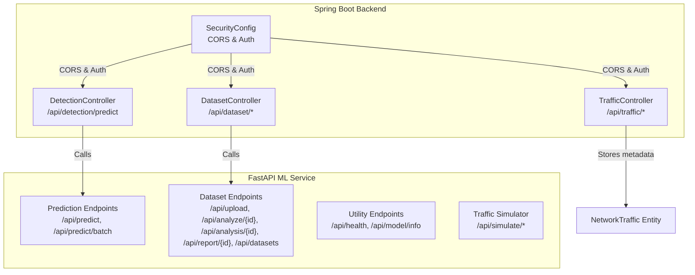
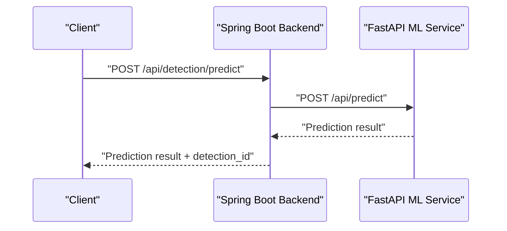
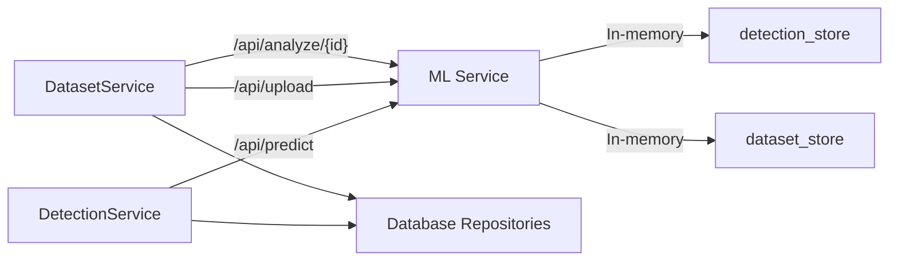

# API Endpoints Reference

<cite>
**Referenced Files in This Document**
- [app.py](file://Mini_Project/ml-service/app.py)
- [DetectionController.java](file://Mini_Project/backend/src/main/java/com/clinicalnids/backend/controller/DetectionController.java)
- [DatasetController.java](file://Mini_Project/backend/src/main/java/com/clinicalnids/backend/controller/DatasetController.java)
- [TrafficController.java](file://Mini_Project/backend/src/main/java/com/clinicalnids/backend/controller/TrafficController.java)
- [DetectionService.java](file://Mini_Project/backend/src/main/java/com/clinicalnids/backend/service/DetectionService.java)
- [DatasetService.java](file://Mini_Project/backend/src/main/java/com/clinicalnids/backend/service/DatasetService.java)
- [SecurityConfig.java](file://Mini_Project/backend/src/main/java/com/clinicalnids/backend/config/SecurityConfig.java)
- [application.properties](file://Mini_Project/backend/src/main/resources/application.properties)
- [TrafficRequest.java](file://Mini_Project/backend/src/main/java/com/clinicalnids/backend/dto/TrafficRequest.java)
- [DatasetAnalysisResponse.java](file://Mini_Project/backend/src/main/java/com/clinicalnids/backend/dto/DatasetAnalysisResponse.java)
- [DatasetUploadResponse.java](file://Mini_Project/backend/src/main/java/com/clinicalnids/backend/dto/DatasetUploadResponse.java)
- [Detection.java](file://Mini_Project/backend/src/main/java/com/clinicalnids/backend/entity/Detection.java)
- [DatasetAnalysis.java](file://Mini_Project/backend/src/main/java/com/clinicalnids/backend/entity/DatasetAnalysis.java)
</cite>

## Table of Contents
1. [Introduction](#introduction)
2. [Project Structure](#project-structure)
3. [Core Components](#core-components)
4. [Architecture Overview](#architecture-overview)
5. [Detailed Component Analysis](#detailed-component-analysis)
6. [Dependency Analysis](#dependency-analysis)
7. [Performance Considerations](#performance-considerations)
8. [Troubleshooting Guide](#troubleshooting-guide)
9. [Conclusion](#conclusion)
10. [Appendices](#appendices)

## Introduction
This document provides comprehensive API documentation for the ML service and supporting backend endpoints. It covers:
- Prediction endpoints for single and batch network flow classification
- Dataset operations for upload, analysis, retrieval, and report generation
- Utility endpoints for health checks and model information
- Traffic simulator endpoints for future live traffic support
- Authentication and CORS configuration
- Request/response schemas, error codes, and usage examples
- SDK integration guidelines and rate limiting considerations

## Project Structure
The system consists of:
- A Spring Boot backend exposing REST APIs for dataset management, detection orchestration, and traffic storage
- A FastAPI ML service providing prediction, analysis, and simulator endpoints
- Entities and DTOs defining request/response schemas
- Security configuration enabling CORS and JWT-based authentication



**Diagram sources**
- [DetectionController.java:14-51](file://Mini_Project/backend/src/main/java/com/clinicalnids/backend/controller/DetectionController.java#L14-L51)
- [DatasetController.java:19-95](file://Mini_Project/backend/src/main/java/com/clinicalnids/backend/controller/DatasetController.java#L19-L95)
- [TrafficController.java:12-41](file://Mini_Project/backend/src/main/java/com/clinicalnids/backend/controller/TrafficController.java#L12-L41)
- [SecurityConfig.java:25-73](file://Mini_Project/backend/src/main/java/com/clinicalnids/backend/config/SecurityConfig.java#L25-L73)
- [app.py:418-487](file://Mini_Project/ml-service/app.py#L418-L487)
- [app.py:253-393](file://Mini_Project/ml-service/app.py#L253-L393)
- [app.py:418-437](file://Mini_Project/ml-service/app.py#L418-L437)
- [app.py:618-650](file://Mini_Project/ml-service/app.py#L618-L650)

**Section sources**
- [DetectionController.java:14-51](file://Mini_Project/backend/src/main/java/com/clinicalnids/backend/controller/DetectionController.java#L14-L51)
- [DatasetController.java:19-95](file://Mini_Project/backend/src/main/java/com/clinicalnids/backend/controller/DatasetController.java#L19-L95)
- [TrafficController.java:12-41](file://Mini_Project/backend/src/main/java/com/clinicalnids/backend/controller/TrafficController.java#L12-L41)
- [SecurityConfig.java:25-73](file://Mini_Project/backend/src/main/java/com/clinicalnids/backend/config/SecurityConfig.java#L25-L73)
- [app.py:418-487](file://Mini_Project/ml-service/app.py#L418-L487)
- [app.py:253-393](file://Mini_Project/ml-service/app.py#L253-L393)
- [app.py:418-437](file://Mini_Project/ml-service/app.py#L418-L437)
- [app.py:618-650](file://Mini_Project/ml-service/app.py#L618-L650)

## Core Components
- Spring Boot Controllers:
  - DetectionController: orchestrates ML predictions and dashboard statistics
  - DatasetController: manages dataset lifecycle and report downloads
  - TrafficController: handles traffic metadata uploads and listings
- FastAPI ML Service:
  - Prediction endpoints for single and batch flows
  - Dataset endpoints for upload, analysis, retrieval, and report data
  - Utility endpoints for health and model info
  - Traffic simulator endpoints for future live traffic support
- Security:
  - CORS configuration allowing frontend origins
  - JWT filter chain for stateless authentication

**Section sources**
- [DetectionController.java:14-51](file://Mini_Project/backend/src/main/java/com/clinicalnids/backend/controller/DetectionController.java#L14-L51)
- [DatasetController.java:19-95](file://Mini_Project/backend/src/main/java/com/clinicalnids/backend/controller/DatasetController.java#L19-L95)
- [TrafficController.java:12-41](file://Mini_Project/backend/src/main/java/com/clinicalnids/backend/controller/TrafficController.java#L12-L41)
- [SecurityConfig.java:25-73](file://Mini_Project/backend/src/main/java/com/clinicalnids/backend/config/SecurityConfig.java#L25-L73)

## Architecture Overview
The backend acts as an orchestrator, delegating ML tasks to the FastAPI service. The ML service persists detections in memory and exposes endpoints for predictions, dataset analysis, and simulator controls.



**Diagram sources**
- [DetectionController.java:26-29](file://Mini_Project/backend/src/main/java/com/clinicalnids/backend/controller/DetectionController.java#L26-L29)
- [DetectionService.java:47-137](file://Mini_Project/backend/src/main/java/com/clinicalnids/backend/service/DetectionService.java#L47-L137)
- [app.py:439-464](file://Mini_Project/ml-service/app.py#L439-L464)

**Section sources**
- [DetectionController.java:26-29](file://Mini_Project/backend/src/main/java/com/clinicalnids/backend/controller/DetectionController.java#L26-L29)
- [DetectionService.java:47-137](file://Mini_Project/backend/src/main/java/com/clinicalnids/backend/service/DetectionService.java#L47-L137)
- [app.py:439-464](file://Mini_Project/ml-service/app.py#L439-L464)

## Detailed Component Analysis

### Prediction Endpoints
- Endpoint: POST /api/predict
  - Purpose: Predict attack type for a single network flow
  - Request: TrafficFeatures object
  - Response: Prediction result with metadata and explanation
  - Example curl:
    ```bash
    curl -X POST http://localhost:8000/api/predict \
      -H "Content-Type: application/json" \
      -d '{"flow_duration": 100, "protocol": 6, ...}'
    ```
  - Notes: Stores detection in memory with rolling buffer

- Endpoint: POST /api/predict/batch
  - Purpose: Predict for multiple flows
  - Request: Array of TrafficFeatures
  - Response: Array of predictions and count
  - Example curl:
    ```bash
    curl -X POST http://localhost:8000/api/predict/batch \
      -H "Content-Type: application/json" \
      -d '[{...}, {...}]'
    ```

- Endpoint: POST /api/detection/predict (Backend)
  - Purpose: Delegates to ML service and persists detection
  - Request: TrafficRequest (with source/destination IP/port and features map)
  - Response: ML prediction result plus detection_id
  - Example curl:
    ```bash
    curl -X POST http://localhost:8080/api/detection/predict \
      -H "Content-Type: application/json" \
      -d '{"sourceIp":"192.168.1.1","destinationIp":"10.0.0.1","protocol":"TCP","features":{"flow_duration":100,...}}'
    ```

**Section sources**
- [app.py:439-464](file://Mini_Project/ml-service/app.py#L439-L464)
- [app.py:467-486](file://Mini_Project/ml-service/app.py#L467-L486)
- [DetectionController.java:26-29](file://Mini_Project/backend/src/main/java/com/clinicalnids/backend/controller/DetectionController.java#L26-L29)
- [DetectionService.java:47-137](file://Mini_Project/backend/src/main/java/com/clinicalnids/backend/service/DetectionService.java#L47-L137)
- [TrafficRequest.java:7-14](file://Mini_Project/backend/src/main/java/com/clinicalnids/backend/dto/TrafficRequest.java#L7-L14)

### Dataset Operations
- Endpoint: POST /api/dataset/upload
  - Purpose: Upload .parquet dataset file
  - Request: multipart/form-data with file field
  - Response: DatasetUploadResponse
  - Example curl:
    ```bash
    curl -X POST http://localhost:8080/api/dataset/upload \
      -F "file=@/path/to/data.parquet"
    ```

- Endpoint: POST /api/dataset/{id}/analyze
  - Purpose: Trigger ML analysis on uploaded dataset
  - Request: None
  - Response: DatasetAnalysisResponse
  - Example curl:
    ```bash
    curl -X POST http://localhost:8080/api/dataset/123/analyze
    ```

- Endpoint: GET /api/dataset/{id}/analysis
  - Purpose: Retrieve stored analysis result
  - Request: None
  - Response: DatasetAnalysisResponse
  - Example curl:
    ```bash
    curl http://localhost:8080/api/dataset/123/analysis
    ```

- Endpoint: GET /api/dataset/{id}/report
  - Purpose: Download PDF report
  - Request: None
  - Response: application/pdf attachment
  - Example curl:
    ```bash
    curl -OJ http://localhost:8080/api/dataset/123/report
    ```

- Endpoint: GET /api/datasets
  - Purpose: List uploaded datasets
  - Request: None
  - Response: Array of dataset summaries
  - Example curl:
    ```bash
    curl http://localhost:8080/api/datasets
    ```

**Section sources**
- [DatasetController.java:34-93](file://Mini_Project/backend/src/main/java/com/clinicalnids/backend/controller/DatasetController.java#L34-L93)
- [DatasetService.java:62-155](file://Mini_Project/backend/src/main/java/com/clinicalnids/backend/service/DatasetService.java#L62-L155)
- [DatasetService.java:284-379](file://Mini_Project/backend/src/main/java/com/clinicalnids/backend/service/DatasetService.java#L284-L379)
- [DatasetUploadResponse.java:8-14](file://Mini_Project/backend/src/main/java/com/clinicalnids/backend/dto/DatasetUploadResponse.java#L8-L14)
- [DatasetAnalysisResponse.java:10-68](file://Mini_Project/backend/src/main/java/com/clinicalnids/backend/dto/DatasetAnalysisResponse.java#L10-L68)

### Utility Endpoints
- Endpoint: GET /api/health
  - Purpose: Health check
  - Response: Service status and model availability
  - Example curl:
    ```bash
    curl http://localhost:8000/api/health
    ```

- Endpoint: GET /api/model/info
  - Purpose: Model metadata and performance
  - Response: JSON with metrics
  - Example curl:
    ```bash
    curl http://localhost:8000/api/model/info
    ```

- Endpoint: GET /api/dashboard/statistics (Backend)
  - Purpose: Aggregated dashboard stats
  - Response: Dashboard statistics
  - Example curl:
    ```bash
    curl http://localhost:8080/api/dashboard/statistics
    ```

**Section sources**
- [app.py:418-426](file://Mini_Project/ml-service/app.py#L418-L426)
- [app.py:429-436](file://Mini_Project/ml-service/app.py#L429-L436)
- [DetectionController.java:46-49](file://Mini_Project/backend/src/main/java/com/clinicalnids/backend/controller/DetectionController.java#L46-L49)

### Traffic Simulator Endpoints
- Endpoint: POST /api/simulate/start
  - Purpose: Start traffic simulation
  - Response: Status message
  - Example curl:
    ```bash
    curl -X POST http://localhost:8000/api/simulate/start
    ```

- Endpoint: POST /api/simulate/stop
  - Purpose: Stop simulation
  - Response: Status and index
  - Example curl:
    ```bash
    curl -X POST http://localhost:8000/api/simulate/stop
    ```

- Endpoint: GET /api/simulate/status
  - Purpose: Get simulation status
  - Response: Running state, index, totals
  - Example curl:
    ```bash
    curl http://localhost:8000/api/simulate/status
    ```

**Section sources**
- [app.py:618-650](file://Mini_Project/ml-service/app.py#L618-L650)

### Traffic Metadata Endpoints
- Endpoint: POST /api/traffic/upload
  - Purpose: Upload traffic metadata (file stored by ML service)
  - Response: Upload confirmation
  - Example curl:
    ```bash
    curl -X POST http://localhost:8080/api/traffic/upload -F "file=@/path/to/traffic.pcap"
    ```

- Endpoint: GET /api/traffic
  - Purpose: List recent traffic records
  - Response: Array of traffic entries
  - Example curl:
    ```bash
    curl http://localhost:8080/api/traffic?limit=100
    ```

**Section sources**
- [TrafficController.java:22-39](file://Mini_Project/backend/src/main/java/com/clinicalnids/backend/controller/TrafficController.java#L22-L39)

## Dependency Analysis
- Backend-to-ML Service Communication:
  - DetectionService posts TrafficRequest to ML /api/predict
  - DatasetService posts multipart files to ML /api/upload and triggers /api/analyze/{id}
- In-Memory Storage:
  - ML service maintains detection_store and dataset_store
- Persistence:
  - Backend stores detections, alerts, and dataset metadata in database



**Diagram sources**
- [DetectionService.java:47-137](file://Mini_Project/backend/src/main/java/com/clinicalnids/backend/service/DetectionService.java#L47-L137)
- [DatasetService.java:112-155](file://Mini_Project/backend/src/main/java/com/clinicalnids/backend/service/DatasetService.java#L112-L155)
- [app.py:439-464](file://Mini_Project/ml-service/app.py#L439-L464)
- [app.py:295-347](file://Mini_Project/ml-service/app.py#L295-L347)

**Section sources**
- [DetectionService.java:47-137](file://Mini_Project/backend/src/main/java/com/clinicalnids/backend/service/DetectionService.java#L47-L137)
- [DatasetService.java:112-155](file://Mini_Project/backend/src/main/java/com/clinicalnids/backend/service/DatasetService.java#L112-L155)
- [app.py:439-464](file://Mini_Project/ml-service/app.py#L439-L464)
- [app.py:295-347](file://Mini_Project/ml-service/app.py#L295-L347)

## Performance Considerations
- Memory Management:
  - ML service maintains a rolling detection_store capped at 10,000 items
- Dataset Analysis:
  - Large datasets may take several minutes; timeouts configured in backend service calls
- CORS:
  - ML service allows all origins for development; restrict origins in production
- File Upload Limits:
  - Backend supports up to 500 MB per file

**Section sources**
- [app.py:461-463](file://Mini_Project/ml-service/app.py#L461-L463)
- [app.py:483-485](file://Mini_Project/ml-service/app.py#L483-L485)
- [DatasetService.java:139](file://Mini_Project/backend/src/main/java/com/clinicalnids/backend/service/DatasetService.java#L139)
- [application.properties:43-45](file://Mini_Project/backend/src/main/resources/application.properties#L43-L45)

## Troubleshooting Guide
- Common HTTP Errors:
  - 400 Bad Request: Invalid file type (.parquet required), invalid request payload
  - 404 Not Found: Dataset ID not found, analysis not yet performed
  - 409 Conflict: Dataset already analyzing
  - 500 Internal Server Error: Analysis failure, ML service unavailable
- Validation Rules:
  - Only .parquet files accepted for dataset upload
  - Traffic features mapped via feature map; missing keys default to zero
- Security:
  - CORS enabled for frontend origins; adjust origins in production
  - JWT filter chain configured for stateless authentication

**Section sources**
- [app.py:261-266](file://Mini_Project/ml-service/app.py#L261-L266)
- [app.py:309-315](file://Mini_Project/ml-service/app.py#L309-L315)
- [SecurityConfig.java:52-61](file://Mini_Project/backend/src/main/java/com/clinicalnids/backend/config/SecurityConfig.java#L52-L61)

## Conclusion
This API reference documents the ML service and backend endpoints for network intrusion detection. The system supports single and batch predictions, dataset upload and analysis, health checks, and a traffic simulator. Use the provided curl examples and DTO schemas to integrate with the backend and ML service.

## Appendices

### Request/Response Schemas

- TrafficFeatures (Prediction)
  - Fields: extensive set of network flow features and optional IPs/ports
  - Reference: [app.py:71-156](file://Mini_Project/ml-service/app.py#L71-L156)

- TrafficRequest (Backend)
  - Fields: sourceIp, destinationIp, sourcePort, destinationPort, protocol, features
  - Reference: [TrafficRequest.java:7-14](file://Mini_Project/backend/src/main/java/com/clinicalnids/backend/dto/TrafficRequest.java#L7-L14)

- DatasetUploadResponse
  - Fields: datasetId, filename, fileSize, status, message
  - Reference: [DatasetUploadResponse.java:8-14](file://Mini_Project/backend/src/main/java/com/clinicalnids/backend/dto/DatasetUploadResponse.java#L8-L14)

- DatasetAnalysisResponse
  - Fields: dataset info, security summary, distributions, attack details, feature importance, predictions
  - Reference: [DatasetAnalysisResponse.java:10-68](file://Mini_Project/backend/src/main/java/com/clinicalnids/backend/dto/DatasetAnalysisResponse.java#L10-L68)

- Detection Entity
  - Fields: attackType, confidence, severity, explanation, IPs/ports, isAttack, probabilities, timestamps
  - Reference: [Detection.java:13-53](file://Mini_Project/backend/src/main/java/com/clinicalnids/backend/entity/Detection.java#L13-L53)

- DatasetAnalysis Entity
  - Fields: filenames, counts, file path, status, timestamps
  - Reference: [DatasetAnalysis.java:13-57](file://Mini_Project/backend/src/main/java/com/clinicalnids/backend/entity/DatasetAnalysis.java#L13-L57)

### Authentication and CORS
- Authentication:
  - JWT filter chain configured for stateless sessions
  - Reference: [SecurityConfig.java:34-46](file://Mini_Project/backend/src/main/java/com/clinicalnids/backend/config/SecurityConfig.java#L34-L46)
- CORS:
  - Allowed origins configured for frontend ports
  - Reference: [SecurityConfig.java:52-61](file://Mini_Project/backend/src/main/java/com/clinicalnids/backend/config/SecurityConfig.java#L52-L61)
  - ML service allows all origins
  - Reference: [app.py:47-53](file://Mini_Project/ml-service/app.py#L47-L53)

### Rate Limiting
- No explicit rate limiting implemented in the provided code
- Consider implementing rate limiting at the gateway or reverse proxy for production deployments

### SDK Integration Guidelines
- Backend:
  - Use WebClient to call /api/detection/predict and dataset endpoints
  - Configure base URL from application properties
  - Reference: [DetectionService.java:35-41](file://Mini_Project/backend/src/main/java/com/clinicalnids/backend/service/DetectionService.java#L35-L41), [application.properties:33](file://Mini_Project/backend/src/main/resources/application.properties#L33)
- ML Service:
  - Use HTTP client to call /api/predict, /api/predict/batch, /api/upload, /api/analyze/{id}
  - Respect file size limits and timeouts
  - Reference: [app.py:439-464](file://Mini_Project/ml-service/app.py#L439-L464), [app.py:295-347](file://Mini_Project/ml-service/app.py#L295-L347)