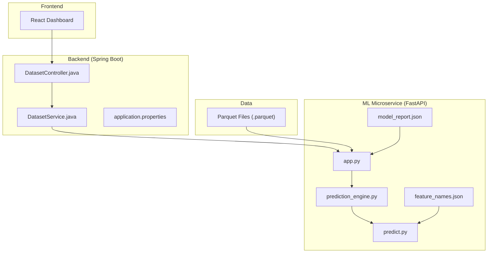
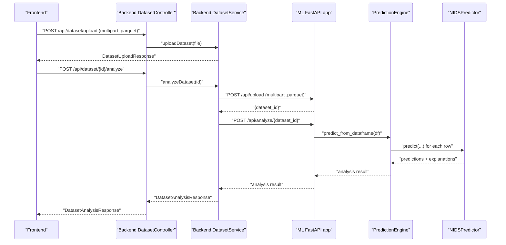
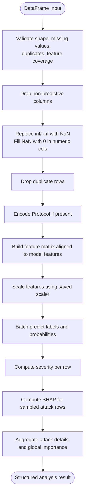
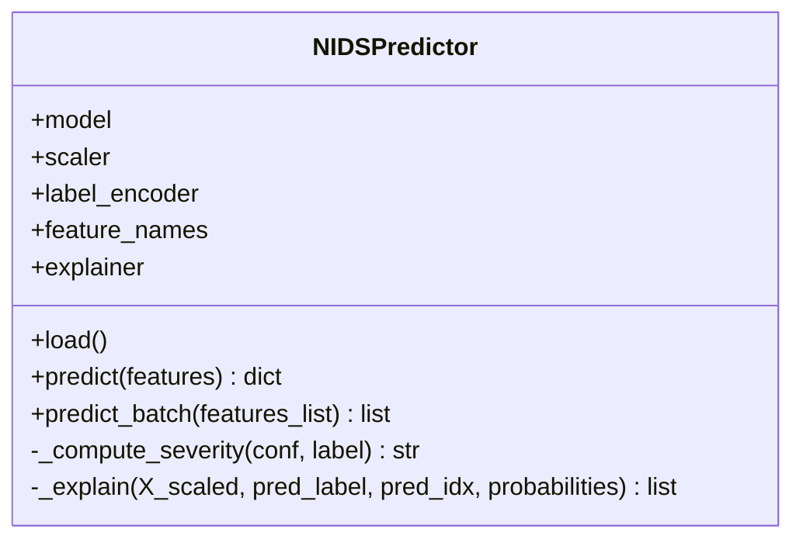
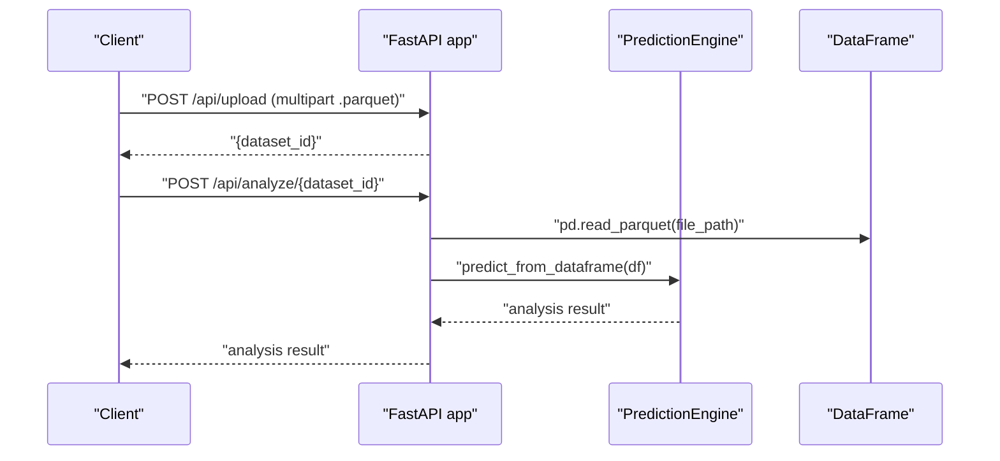
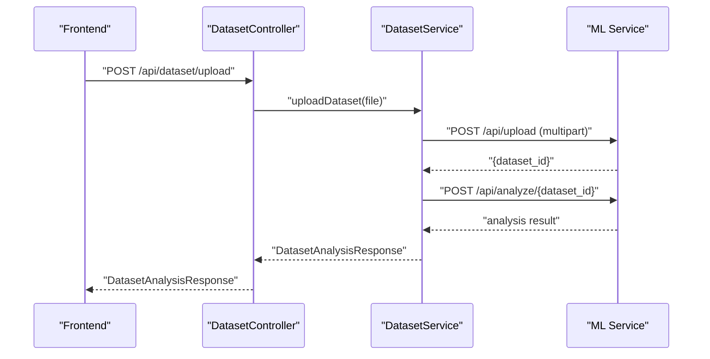
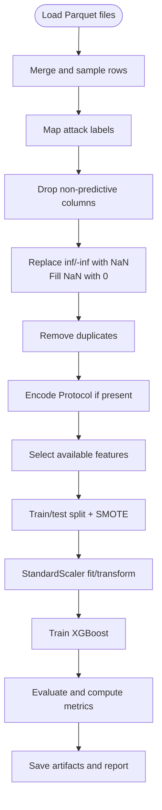
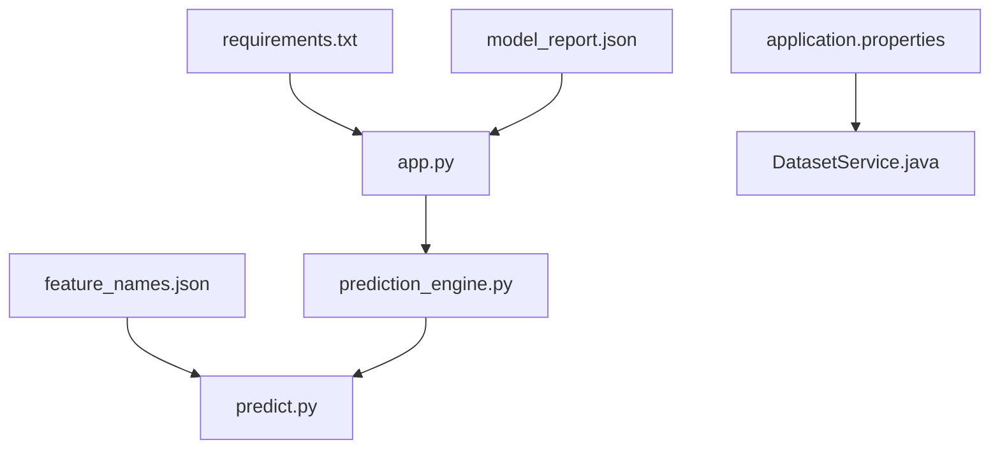

# Data Processing Pipeline

<cite>
**Referenced Files in This Document**
- [prediction_engine.py](file://Mini_Project/ml-service/prediction_engine.py)
- [predict.py](file://Mini_Project/ml-service/predict.py)
- [train_model.py](file://Mini_Project/ml-service/train_model.py)
- [app.py](file://Mini_Project/ml-service/app.py)
- [feature_names.json](file://Mini_Project/ml-service/model/feature_names.json)
- [model_report.json](file://Mini_Project/ml-service/model/model_report.json)
- [OpenParquet.py](file://Mini_Project/OpenParquet.py)
- [DatasetService.java](file://Mini_Project/backend/src/main/java/com/clinicalnids/backend/service/DatasetService.java)
- [DatasetController.java](file://Mini_Project/backend/src/main/java/com/clinicalnids/backend/controller/DatasetController.java)
- [application.properties](file://Mini_Project/backend/src/main/resources/application.properties)
- [requirements.txt](file://Mini_Project/ml-service/requirements.txt)
</cite>

## Table of Contents
1. [Introduction](#introduction)
2. [Project Structure](#project-structure)
3. [Core Components](#core-components)
4. [Architecture Overview](#architecture-overview)
5. [Detailed Component Analysis](#detailed-component-analysis)
6. [Dependency Analysis](#dependency-analysis)
7. [Performance Considerations](#performance-considerations)
8. [Troubleshooting Guide](#troubleshooting-guide)
9. [Conclusion](#conclusion)
10. [Appendices](#appendices)

## Introduction
This document explains the end-to-end data processing pipeline for the Clinical-NIDS machine learning service. It covers feature engineering, data validation, preprocessing workflows, model mapping, data type conversions, dataset validation logic, missing value handling, outlier detection mechanisms, Parquet file processing, batch prediction workflows, result formatting, transformation pipelines, feature scaling techniques, quality assurance checks, data integrity validation, error handling strategies, and performance optimizations for large datasets.

## Project Structure
The pipeline spans three primary areas:
- Frontend (React) uploads .parquet datasets to the Spring Boot backend.
- Backend (Java) validates, persists, and orchestrates analysis by calling the Python ML service.
- ML microservice (Python/FastAPI) ingests Parquet data, validates and preprocesses it, runs batch inference, computes SHAP explanations, aggregates statistics, and returns structured results.

**Diagram sources**
- [DatasetController.java:1-95](file://Mini_Project/backend/src/main/java/com/clinicalnids/backend/controller/DatasetController.java#L1-L95)
- [DatasetService.java:1-422](file://Mini_Project/backend/src/main/java/com/clinicalnids/backend/service/DatasetService.java#L1-L422)
- [application.properties:1-46](file://Mini_Project/backend/src/main/resources/application.properties#L1-L46)
- [app.py:1-800](file://Mini_Project/ml-service/app.py#L1-L800)
- [prediction_engine.py:1-413](file://Mini_Project/ml-service/prediction_engine.py#L1-L413)
- [predict.py:1-179](file://Mini_Project/ml-service/predict.py#L1-L179)
- [feature_names.json:1-79](file://Mini_Project/ml-service/model/feature_names.json#L1-L79)
- [model_report.json:1-21](file://Mini_Project/ml-service/model/model_report.json#L1-L21)

**Section sources**
- [DatasetController.java:1-95](file://Mini_Project/backend/src/main/java/com/clinicalnids/backend/controller/DatasetController.java#L1-L95)
- [DatasetService.java:1-422](file://Mini_Project/backend/src/main/java/com/clinicalnids/backend/service/DatasetService.java#L1-L422)
- [application.properties:1-46](file://Mini_Project/backend/src/main/resources/application.properties#L1-L46)
- [app.py:1-800](file://Mini_Project/ml-service/app.py#L1-L800)
- [prediction_engine.py:1-413](file://Mini_Project/ml-service/prediction_engine.py#L1-L413)
- [predict.py:1-179](file://Mini_Project/ml-service/predict.py#L1-L179)
- [feature_names.json:1-79](file://Mini_Project/ml-service/model/feature_names.json#L1-L79)
- [model_report.json:1-21](file://Mini_Project/ml-service/model/model_report.json#L1-L21)

## Core Components
- PredictionEngine: Orchestrates dataset validation, preprocessing, batch prediction, SHAP explanations, and aggregation into a structured analysis result.
- NIDSPredictor: Loads model artifacts, performs single-flow predictions, and generates SHAP explanations.
- FastAPI app: Exposes endpoints for dataset upload, analysis, prediction, and reporting; integrates with PredictionEngine.
- DatasetService: Bridges the Java backend to the ML service, invoking upload and analysis endpoints and persisting results.
- Training pipeline (train_model.py): Loads Parquet data, cleans and selects features, encodes categorical variables, scales features, trains models, and saves artifacts.

Key responsibilities:
- Feature engineering: Feature selection, protocol encoding, and consistent ordering.
- Validation: Missing values, duplicates, and feature availability checks.
- Preprocessing: Handling infinities and NaNs, scaling, and optional protocol encoding.
- Inference: Batch prediction, confidence computation, severity scoring, and SHAP explanations.
- Reporting: Aggregated statistics, attack details, and global feature importance.

**Section sources**
- [prediction_engine.py:70-413](file://Mini_Project/ml-service/prediction_engine.py#L70-L413)
- [predict.py:17-179](file://Mini_Project/ml-service/predict.py#L17-L179)
- [app.py:253-487](file://Mini_Project/ml-service/app.py#L253-L487)
- [DatasetService.java:102-278](file://Mini_Project/backend/src/main/java/com/clinicalnids/backend/service/DatasetService.java#L102-L278)
- [train_model.py:163-422](file://Mini_Project/ml-service/train_model.py#L163-L422)

## Architecture Overview
The system follows a microservice architecture:
- Frontend uploads .parquet files to the Spring Boot backend.
- Backend validates and triggers analysis via HTTP calls to the ML service.
- ML service reads Parquet, validates and preprocesses, runs batch inference, computes explanations, and returns structured results.
- Backend persists results and exposes them to the frontend.

**Diagram sources**
- [DatasetController.java:34-57](file://Mini_Project/backend/src/main/java/com/clinicalnids/backend/controller/DatasetController.java#L34-L57)
- [DatasetService.java:102-155](file://Mini_Project/backend/src/main/java/com/clinicalnids/backend/service/DatasetService.java#L102-L155)
- [app.py:253-347](file://Mini_Project/ml-service/app.py#L253-L347)
- [prediction_engine.py:115-366](file://Mini_Project/ml-service/prediction_engine.py#L115-L366)
- [predict.py:61-114](file://Mini_Project/ml-service/predict.py#L61-L114)

## Detailed Component Analysis

### PredictionEngine: Dataset Validation, Preprocessing, Batch Inference, and Aggregation
The PredictionEngine encapsulates the full analysis pipeline for a DataFrame:
- Dataset validation: Counts rows/columns, missing values, duplicates, and identifies missing features against the model’s expected feature set.
- Preprocessing:
  - Drops non-predictive identifiers.
  - Handles infinities and NaNs in numeric columns by replacing inf with NaN and filling with zeros.
  - Removes duplicate rows.
  - Encodes protocol if present and not already encoded.
- Batch prediction:
  - Builds a feature matrix aligned to the model’s ordered feature names, coercing to numeric and filling missing positions with zero.
  - Scales features using the saved scaler.
  - Predicts labels and class probabilities.
  - Computes severity per row and aggregates counts and averages.
- SHAP explanations:
  - Computes SHAP values for sampled attack rows.
  - Aggregates per-attack-type top features and global top features.
- Final result:
  - Dataset info, security summary, attack distribution, severity distribution, attack details, global feature importance, and sampled predictions.

**Diagram sources**
- [prediction_engine.py:143-366](file://Mini_Project/ml-service/prediction_engine.py#L143-L366)

**Section sources**
- [prediction_engine.py:115-366](file://Mini_Project/ml-service/prediction_engine.py#L115-L366)

### NIDSPredictor: Single-Row Prediction and SHAP Explanation
NIDSPredictor loads model artifacts and supports:
- Loading model, scaler, label encoder, feature names, and SHAP explainer.
- Single prediction: builds ordered feature vector, scales, predicts, computes confidence and severity, and generates SHAP explanation for the predicted class.
- Batch prediction convenience method.

**Diagram sources**
- [predict.py:17-179](file://Mini_Project/ml-service/predict.py#L17-L179)

**Section sources**
- [predict.py:17-179](file://Mini_Project/ml-service/predict.py#L17-L179)

### FastAPI App: Endpoints, Feature Mapping, and Dataset Workflow
The FastAPI app exposes:
- Upload endpoint: Saves .parquet files and returns a dataset identifier.
- Analysis endpoint: Reads Parquet, invokes PredictionEngine, stores results, and returns analysis.
- Prediction endpoints: Single and batch prediction with feature mapping from API field names to model column names.
- Report endpoint: Transforms analysis result into a report-ready payload.
- Simulation endpoints: Placeholder for future live traffic support.

Feature mapping ensures API fields align with model expectations, including protocol encoding.

**Diagram sources**
- [app.py:253-347](file://Mini_Project/ml-service/app.py#L253-L347)
- [prediction_engine.py:115-366](file://Mini_Project/ml-service/prediction_engine.py#L115-L366)

**Section sources**
- [app.py:158-247](file://Mini_Project/ml-service/app.py#L158-L247)
- [app.py:253-347](file://Mini_Project/ml-service/app.py#L253-L347)
- [app.py:439-487](file://Mini_Project/ml-service/app.py#L439-L487)

### Backend DatasetService: Orchestration and Persistence
The backend service:
- Validates file type and saves locally.
- Calls ML service upload and analysis endpoints.
- Parses and persists analysis results (dataset info, security summary, attack details, global feature importance).
- Exposes dataset listing and retrieval endpoints.

**Diagram sources**
- [DatasetController.java:34-57](file://Mini_Project/backend/src/main/java/com/clinicalnids/backend/controller/DatasetController.java#L34-L57)
- [DatasetService.java:102-155](file://Mini_Project/backend/src/main/java/com/clinicalnids/backend/service/DatasetService.java#L102-L155)

**Section sources**
- [DatasetController.java:1-95](file://Mini_Project/backend/src/main/java/com/clinicalnids/backend/controller/DatasetController.java#L1-L95)
- [DatasetService.java:102-278](file://Mini_Project/backend/src/main/java/com/clinicalnids/backend/service/DatasetService.java#L102-L278)

### Training Pipeline: Feature Engineering and Artifact Generation
The training pipeline:
- Loads Parquet files from results/, merges, and optionally samples rows.
- Maps raw labels to simplified categories.
- Drops non-predictive columns and handles infinities/NaNs.
- Encodes protocol if present and selects available features.
- Splits data, scales features, applies SMOTE oversampling, and trains models.
- Evaluates models and saves artifacts: model, scaler, label encoder, feature names, and metrics report.

**Diagram sources**
- [train_model.py:163-422](file://Mini_Project/ml-service/train_model.py#L163-L422)

**Section sources**
- [train_model.py:163-422](file://Mini_Project/ml-service/train_model.py#L163-L422)

## Dependency Analysis
- Python runtime dependencies are declared in requirements.txt.
- Backend configuration sets ML service URL and CORS policy.
- Feature names and model report define the model contract used by the ML service.

**Diagram sources**
- [requirements.txt:1-13](file://Mini_Project/ml-service/requirements.txt#L1-L13)
- [application.properties:32-33](file://Mini_Project/backend/src/main/resources/application.properties#L32-L33)
- [feature_names.json:1-79](file://Mini_Project/ml-service/model/feature_names.json#L1-L79)
- [model_report.json:1-21](file://Mini_Project/ml-service/model/model_report.json#L1-L21)
- [app.py:1-800](file://Mini_Project/ml-service/app.py#L1-L800)
- [prediction_engine.py:1-413](file://Mini_Project/ml-service/prediction_engine.py#L1-L413)
- [predict.py:1-179](file://Mini_Project/ml-service/predict.py#L1-L179)

**Section sources**
- [requirements.txt:1-13](file://Mini_Project/ml-service/requirements.txt#L1-L13)
- [application.properties:32-33](file://Mini_Project/backend/src/main/resources/application.properties#L32-L33)
- [feature_names.json:1-79](file://Mini_Project/ml-service/model/feature_names.json#L1-L79)
- [model_report.json:1-21](file://Mini_Project/ml-service/model/model_report.json#L1-L21)

## Performance Considerations
- Data sampling during training: Limits per-file rows to maintain training speed while preserving dataset characteristics.
- Feature alignment: Ensures minimal overhead by building feature matrices aligned to the model’s ordered feature names.
- Scaling: Uses StandardScaler consistently across training and inference.
- SHAP sampling: Limits SHAP computations to a capped number of attack rows to reduce latency.
- Memory limits: In-memory detection store capped at a fixed size to prevent unbounded growth.
- Asynchronous simulation: Background loop for traffic simulation avoids blocking the main thread.

Recommendations:
- For very large datasets, consider chunked processing or streaming reads.
- Cache model artifacts in memory after initial load.
- Use asynchronous workers for heavy SHAP computations.
- Monitor resource usage and adjust SHAP sample sizes dynamically.

**Section sources**
- [train_model.py:128-130](file://Mini_Project/ml-service/train_model.py#L128-L130)
- [prediction_engine.py:118-119](file://Mini_Project/ml-service/prediction_engine.py#L118-L119)
- [app.py:489-494](file://Mini_Project/ml-service/app.py#L489-L494)
- [app.py:618-639](file://Mini_Project/ml-service/app.py#L618-L639)

## Troubleshooting Guide
Common issues and resolutions:
- Missing model artifacts: Ensure model, scaler, label encoder, feature names, and report JSON exist in the model directory.
- Feature mismatch: Verify that uploaded Parquet columns match the model’s expected feature names; PredictionEngine reports missing features.
- File type errors: Only .parquet files are accepted for upload.
- Empty or failed analysis: Check ML service logs and verify dataset readability and sufficient rows.
- Protocol encoding: If Protocol exists but not encoded, PredictionEngine adds an encoded column; ensure the presence of the original Protocol column.
- Infinities and NaNs: PredictionEngine replaces infinities with NaN and fills with zeros; confirm numeric columns are properly coerced.
- SHAP failures: PredictionEngine catches exceptions and records errors; retry with smaller samples.

Quality assurance checks:
- Dataset info: Total records, columns, missing values, duplicates, and missing features are reported.
- Security summary: Normal vs attack counts, average confidence, risk level, and model accuracy.
- Attack details: Per-attack-type counts, average confidence, severity, and top features.
- Global feature importance: Top contributing features across all attacks.

**Section sources**
- [prediction_engine.py:143-151](file://Mini_Project/ml-service/prediction_engine.py#L143-L151)
- [prediction_engine.py:238-271](file://Mini_Project/ml-service/prediction_engine.py#L238-L271)
- [app.py:264-265](file://Mini_Project/ml-service/app.py#L264-L265)
- [app.py:343-346](file://Mini_Project/ml-service/app.py#L343-L346)

## Conclusion
The Clinical-NIDS data processing pipeline integrates a robust feature engineering and preprocessing workflow with scalable batch inference and explainability. It validates data integrity, manages missing values and duplicates, aligns features to the trained model, and produces actionable insights with aggregated statistics and SHAP-based explanations. The backend seamlessly orchestrates the process, ensuring reliable persistence and reporting for operational dashboards.

## Appendices

### Data Validation Procedures
- Shape validation: Records and columns counts.
- Missing values: Sum across all numeric columns.
- Duplicates: Row-level duplication removal.
- Feature coverage: Compares available columns to model’s expected feature names.

**Section sources**
- [prediction_engine.py:143-151](file://Mini_Project/ml-service/prediction_engine.py#L143-L151)

### Preprocessing Workflows
- Identifier removal: Non-predictive columns dropped prior to modeling.
- Numeric cleaning: Infinities replaced with NaN, then filled with zeros.
- Duplicate removal: Ensures unique rows for accurate modeling.
- Protocol encoding: Converts Protocol to numerical representation if present.

**Section sources**
- [prediction_engine.py:156-176](file://Mini_Project/ml-service/prediction_engine.py#L156-L176)
- [train_model.py:194-226](file://Mini_Project/ml-service/train_model.py#L194-L226)

### Feature Engineering and Model Mapping
- TrafficFeatures model mapping: API field names mapped to dataset column names, including protocol encoding.
- Model feature names: Ordered list of features used by the model.
- Severity thresholds: Confidence-based severity assignment.

**Section sources**
- [app.py:158-237](file://Mini_Project/ml-service/app.py#L158-L237)
- [feature_names.json:1-79](file://Mini_Project/ml-service/model/feature_names.json#L1-L79)
- [prediction_engine.py:56-67](file://Mini_Project/ml-service/prediction_engine.py#L56-L67)

### Data Type Conversions
- Numeric coercion: Features converted to numeric with NaN fill; zeros used for missing positions.
- Protocol encoding: Label-encoded to integer for model compatibility.
- Scaling: StandardScaler applied uniformly across training and inference.

**Section sources**
- [prediction_engine.py:178-185](file://Mini_Project/ml-service/prediction_engine.py#L178-L185)
- [train_model.py:247-250](file://Mini_Project/ml-service/train_model.py#L247-L250)

### Parquet File Processing
- Reading: Pandas reads .parquet files from disk.
- Sampling: During training, rows are randomly sampled per file to manage size.
- Upload: Backend saves files locally and registers metadata.

**Section sources**
- [train_model.py:167-173](file://Mini_Project/ml-service/train_model.py#L167-L173)
- [OpenParquet.py:3-9](file://Mini_Project/OpenParquet.py#L3-L9)
- [DatasetService.java:62-97](file://Mini_Project/backend/src/main/java/com/clinicalnids/backend/service/DatasetService.java#L62-L97)

### Batch Prediction Workflows
- Endpoint: POST /api/analyze/{dataset_id} triggers analysis.
- Engine: predict_from_dataframe orchestrates validation, preprocessing, prediction, and aggregation.
- Results: Structured payload with dataset info, security summary, attack details, and sampled predictions.

**Section sources**
- [app.py:295-347](file://Mini_Project/ml-service/app.py#L295-L347)
- [prediction_engine.py:115-366](file://Mini_Project/ml-service/prediction_engine.py#L115-L366)

### Result Formatting and Reporting
- Report payload: Transformed analysis result for PDF generation.
- Model metadata: Loaded from model_report.json for accuracy and class labels.

**Section sources**
- [prediction_engine.py:368-400](file://Mini_Project/ml-service/prediction_engine.py#L368-L400)
- [model_report.json:1-21](file://Mini_Project/ml-service/model/model_report.json#L1-L21)