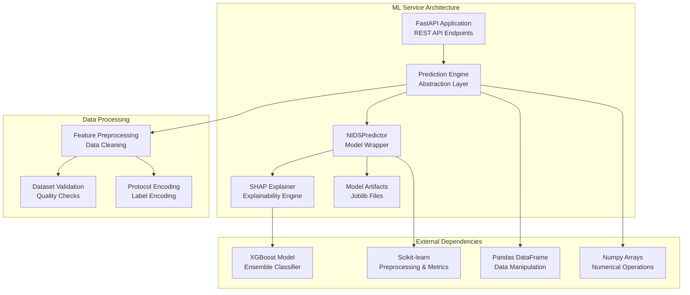
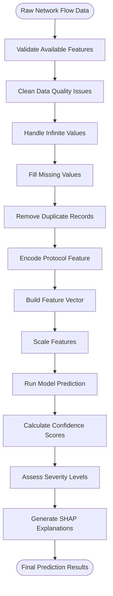
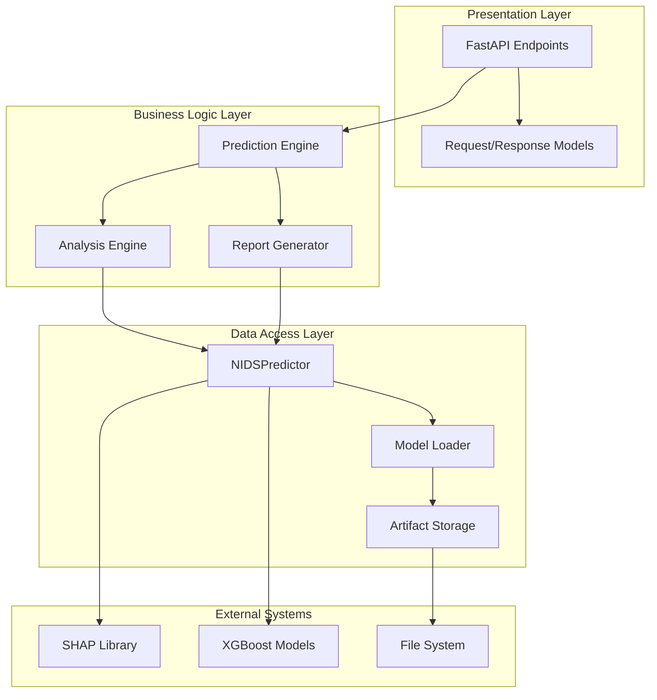
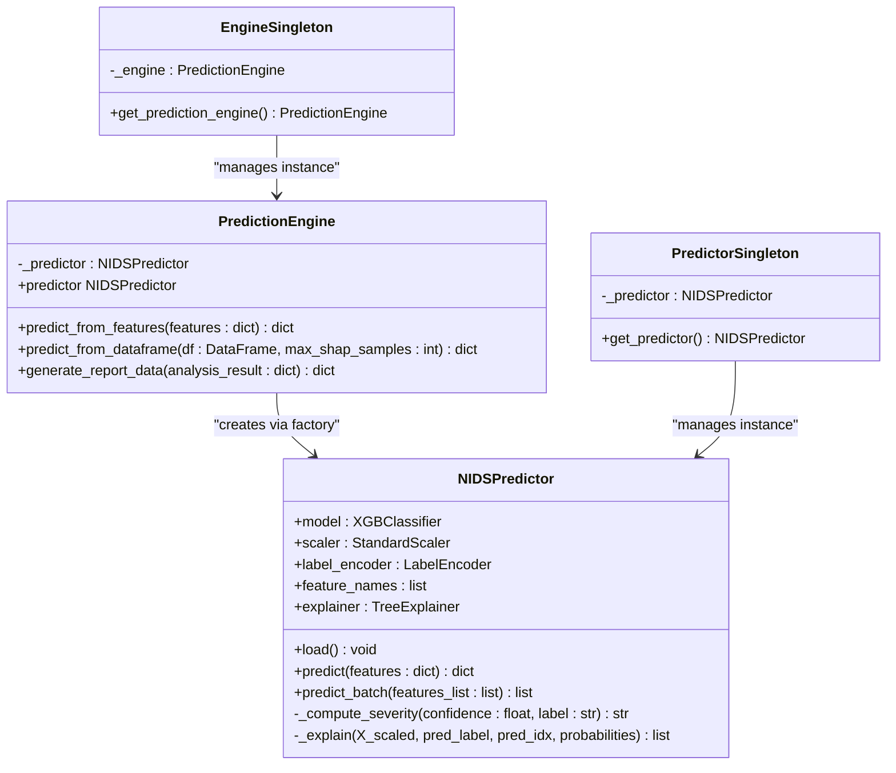
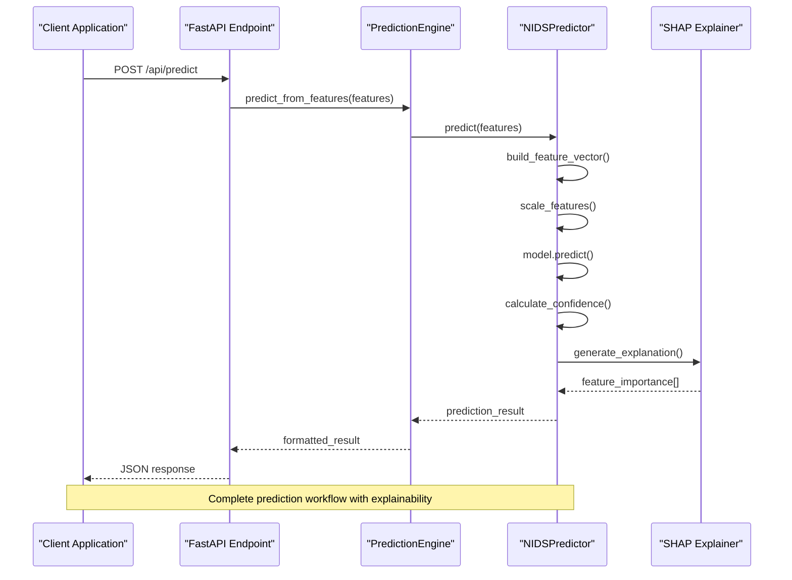
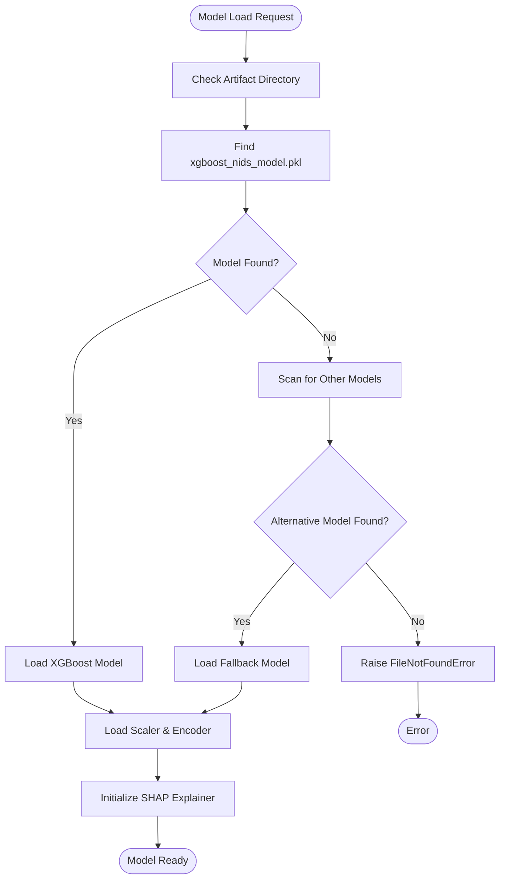
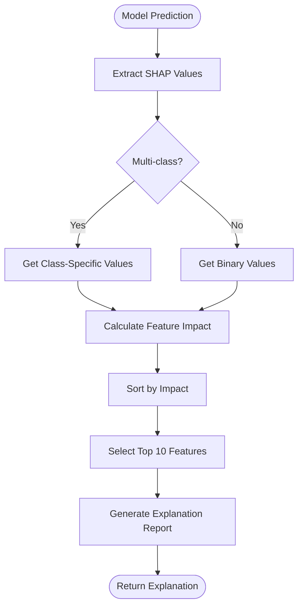
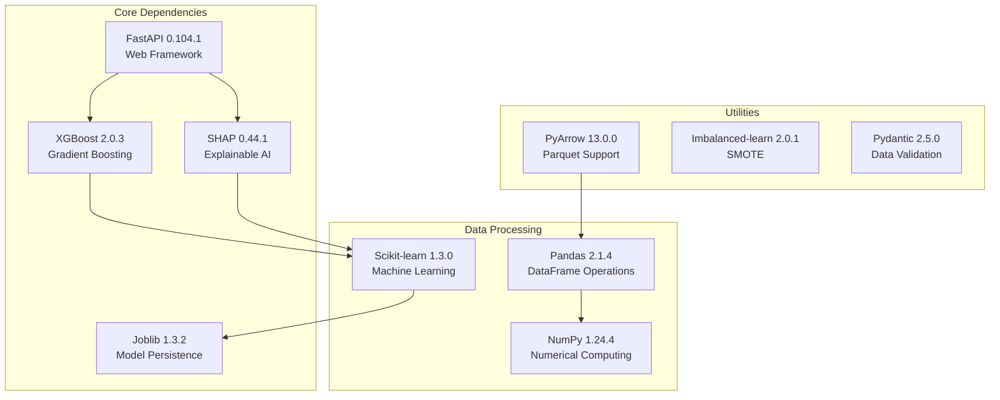

# ML Engine Architecture

<cite>
**Referenced Files in This Document**
- [prediction_engine.py](file://Mini_Project/ml-service/prediction_engine.py)
- [predict.py](file://Mini_Project/ml-service/predict.py)
- [app.py](file://Mini_Project/ml-service/app.py)
- [train_model.py](file://Mini_Project/ml-service/train_model.py)
- [feature_names.json](file://Mini_Project/ml-service/model/feature_names.json)
- [model_report.json](file://Mini_Project/ml-service/model/model_report.json)
- [requirements.txt](file://Mini_Project/ml-service/requirements.txt)
</cite>

## Table of Contents
1. [Introduction](#introduction)
2. [Project Structure](#project-structure)
3. [Core Components](#core-components)
4. [Architecture Overview](#architecture-overview)
5. [Detailed Component Analysis](#detailed-component-analysis)
6. [Dependency Analysis](#dependency-analysis)
7. [Performance Considerations](#performance-considerations)
8. [Troubleshooting Guide](#troubleshooting-guide)
9. [Conclusion](#conclusion)

## Introduction

The Clinical-NIDS ML Engine is a sophisticated machine learning system designed for network intrusion detection and prevention. Built with Python and FastAPI, it provides real-time threat detection capabilities using XGBoost ensemble models with explainable AI features powered by SHAP (SHapley Additive exPlanations).

The system follows modern software engineering principles with a clear separation of concerns, implementing design patterns such as the Factory Pattern for predictor creation and a robust abstraction layer that decouples data ingestion from the core prediction engine. This architecture enables seamless integration of live traffic streams while maintaining flexibility for future enhancements.

## Project Structure

The ML service is organized into several key modules that work together to provide comprehensive network security analysis:

**Diagram sources**
- [app.py:40-65](file://Mini_Project/ml-service/app.py#L40-L65)
- [prediction_engine.py:70-90](file://Mini_Project/ml-service/prediction_engine.py#L70-L90)
- [predict.py:17-60](file://Mini_Project/ml-service/predict.py#L17-L60)

**Section sources**
- [app.py:1-100](file://Mini_Project/ml-service/app.py#L1-L100)
- [prediction_engine.py:1-50](file://Mini_Project/ml-service/prediction_engine.py#L1-L50)
- [predict.py:1-30](file://Mini_Project/ml-service/predict.py#L1-L30)

## Core Components

### Prediction Engine Abstraction Layer

The Prediction Engine serves as the central orchestrator that manages the entire prediction workflow. It implements a Factory Pattern to create and manage predictor instances while providing two primary entry points for different use cases.

Key responsibilities include:
- **Single-flow prediction**: Handles individual network flow predictions for live traffic
- **Bulk analysis**: Processes entire datasets for batch analysis and reporting
- **Feature preprocessing**: Manages data cleaning, validation, and transformation
- **SHAP integration**: Generates explainable AI insights for model decisions
- **Result aggregation**: Compiles comprehensive analytics and risk assessments

### NIDSPredictor Model Wrapper

The NIDSPredictor encapsulates the XGBoost model and provides a unified interface for prediction tasks. It handles model loading, preprocessing, inference, and explainability generation.

Core functionality includes:
- **Model artifact management**: Loading trained models, scalers, and encoders
- **Feature vector construction**: Building standardized input vectors for predictions
- **Confidence scoring**: Computing prediction probabilities and confidence levels
- **Severity assessment**: Determining risk levels based on prediction confidence
- **SHAP explanation generation**: Providing feature importance insights

### Feature Preprocessing Pipeline

The preprocessing pipeline ensures data quality and consistency before model inference:

**Diagram sources**
- [prediction_engine.py:153-270](file://Mini_Project/ml-service/prediction_engine.py#L153-L270)
- [predict.py:77-91](file://Mini_Project/ml-service/predict.py#L77-L91)

**Section sources**
- [prediction_engine.py:27-32](file://Mini_Project/ml-service/prediction_engine.py#L27-L32)
- [prediction_engine.py:153-270](file://Mini_Project/ml-service/prediction_engine.py#L153-L270)
- [predict.py:28-60](file://Mini_Project/ml-service/predict.py#L28-L60)

## Architecture Overview

The ML Engine follows a layered architecture pattern with clear separation between presentation, business logic, and data access layers:

**Diagram sources**
- [app.py:253-393](file://Mini_Project/ml-service/app.py#L253-L393)
- [prediction_engine.py:70-140](file://Mini_Project/ml-service/prediction_engine.py#L70-L140)
- [predict.py:17-60](file://Mini_Project/ml-service/predict.py#L17-L60)

The architecture emphasizes:
- **Separation of Concerns**: Clear boundaries between prediction, analysis, and reporting
- **Extensibility**: Easy addition of new data sources and prediction modes
- **Performance**: Efficient batch processing and caching mechanisms
- **Explainability**: Built-in SHAP integration for model transparency

## Detailed Component Analysis

### Prediction Engine Implementation

The Prediction Engine implements a sophisticated Factory Pattern to manage predictor lifecycle and resource optimization:

**Diagram sources**
- [prediction_engine.py:70-140](file://Mini_Project/ml-service/prediction_engine.py#L70-L140)
- [predict.py:17-60](file://Mini_Project/ml-service/predict.py#L17-L60)
- [prediction_engine.py:407-413](file://Mini_Project/ml-service/prediction_engine.py#L407-L413)
- [predict.py:172-179](file://Mini_Project/ml-service/predict.py#L172-L179)

#### Prediction Workflow Sequence

The prediction workflow follows a systematic approach from raw features to final classification:

**Diagram sources**
- [app.py:439-465](file://Mini_Project/ml-service/app.py#L439-L465)
- [prediction_engine.py:94-110](file://Mini_Project/ml-service/prediction_engine.py#L94-L110)
- [predict.py:61-110](file://Mini_Project/ml-service/predict.py#L61-L110)

**Section sources**
- [prediction_engine.py:70-140](file://Mini_Project/ml-service/prediction_engine.py#L70-L140)
- [predict.py:17-115](file://Mini_Project/ml-service/predict.py#L17-L115)

### Model Loading Mechanisms

The model loading system implements intelligent artifact management with fallback mechanisms:

**Diagram sources**
- [predict.py:28-60](file://Mini_Project/ml-service/predict.py#L28-L60)

**Section sources**
- [predict.py:28-60](file://Mini_Project/ml-service/predict.py#L28-L60)
- [feature_names.json:1-79](file://Mini_Project/ml-service/model/feature_names.json#L1-L79)

### SHAP Explanation Generation

The SHAP integration provides comprehensive explainability features:

**Diagram sources**
- [predict.py:130-166](file://Mini_Project/ml-service/predict.py#L130-L166)
- [prediction_engine.py:232-271](file://Mini_Project/ml-service/prediction_engine.py#L232-L271)

**Section sources**
- [predict.py:130-166](file://Mini_Project/ml-service/predict.py#L130-L166)
- [prediction_engine.py:232-322](file://Mini_Project/ml-service/prediction_engine.py#L232-L322)

### Performance Optimization Features

The system implements several optimization strategies:

1. **Memory Management**: Singleton pattern prevents multiple model instances
2. **Batch Processing**: Optimized DataFrame operations for bulk analysis
3. **Sampling Strategies**: Configurable SHAP sampling for performance
4. **Caching**: In-memory detection storage with size limits
5. **Efficient Data Types**: Optimized numerical operations

**Section sources**
- [prediction_engine.py:407-413](file://Mini_Project/ml-service/prediction_engine.py#L407-L413)
- [app.py:489-495](file://Mini_Project/ml-service/app.py#L489-L495)

## Dependency Analysis

The ML Engine relies on a carefully selected set of dependencies that balance functionality with performance:

**Diagram sources**
- [requirements.txt:1-13](file://Mini_Project/ml-service/requirements.txt#L1-L13)

**Section sources**
- [requirements.txt:1-13](file://Mini_Project/ml-service/requirements.txt#L1-L13)

## Performance Considerations

### Memory Management Strategies

The system employs several strategies to optimize memory usage:

1. **Singleton Pattern**: Prevents multiple model instances in memory
2. **Detection Storage Limits**: Maintains bounded memory for recent detections
3. **Efficient Data Types**: Uses optimized NumPy arrays for numerical operations
4. **Lazy Loading**: Models are loaded only when needed

### Processing Optimization Techniques

- **Vectorized Operations**: Leverages NumPy for efficient numerical computations
- **Batch Processing**: Processes multiple samples simultaneously
- **Feature Selection**: Uses only relevant features for predictions
- **Sampling for Explainability**: Limits SHAP computation to attack samples

### Scalability Considerations

The architecture supports horizontal scaling through:
- **Stateless Design**: No session-dependent state
- **Model Artifact Separation**: Independent model loading
- **Asynchronous Processing**: Supports concurrent requests
- **Resource Limits**: Configurable memory and processing constraints

## Troubleshooting Guide

### Common Issues and Solutions

**Model Loading Failures**
- Verify model artifacts exist in the model/ directory
- Check feature_names.json alignment with incoming data
- Ensure joblib-compatible model files

**Prediction Errors**
- Validate feature names match model expectations
- Check for infinite or NaN values in input data
- Confirm proper data types for numerical features

**SHAP Generation Issues**
- Verify SHAP library installation
- Check model compatibility with TreeExplainer
- Monitor memory usage during explanation generation

**Performance Problems**
- Adjust max_shap_samples parameter for large datasets
- Implement proper batching for bulk operations
- Monitor memory usage and adjust detection storage limits

**Section sources**
- [predict.py:32-38](file://Mini_Project/ml-service/predict.py#L32-L38)
- [prediction_engine.py:269-271](file://Mini_Project/ml-service/prediction_engine.py#L269-L271)

## Conclusion

The Clinical-NIDS ML Engine represents a comprehensive solution for network intrusion detection that balances performance, accuracy, and explainability. Its modular architecture, implementing design patterns like the Factory Pattern, provides excellent extensibility while maintaining operational efficiency.

Key strengths include:
- **Robust Architecture**: Clear separation of concerns with Factory Pattern implementation
- **Explainable AI**: Integrated SHAP explanations for model transparency
- **Performance Optimization**: Memory-efficient design with batch processing capabilities
- **Production Ready**: Comprehensive error handling and monitoring
- **Extensible Design**: Foundation for future enhancements and integrations

The system successfully demonstrates how modern machine learning techniques can be effectively applied to cybersecurity challenges while maintaining the transparency and interpretability essential for security operations.