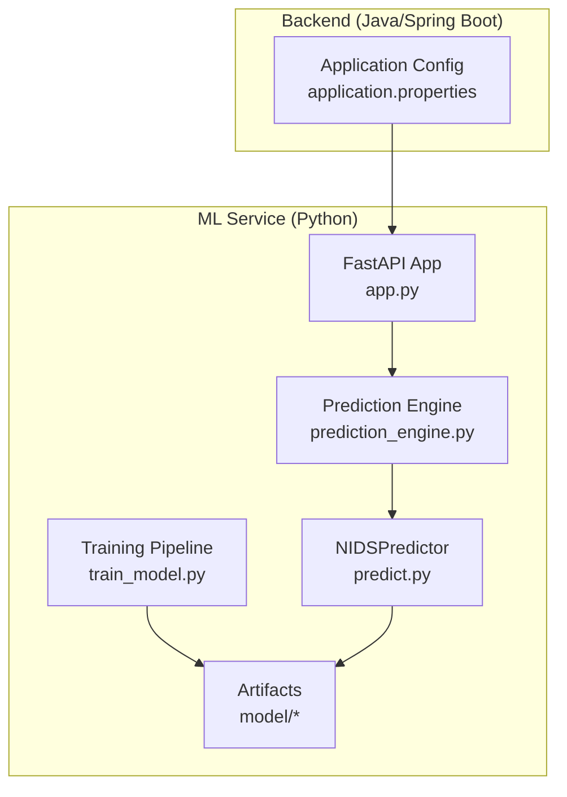
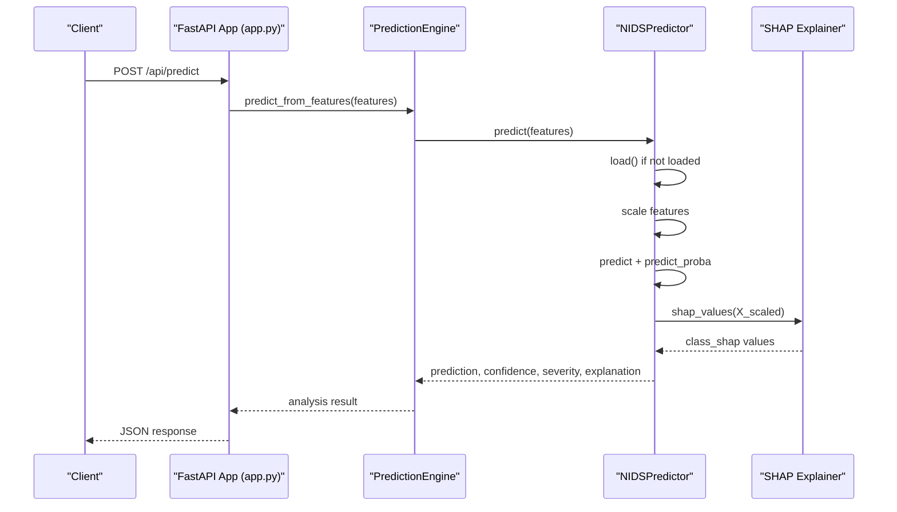
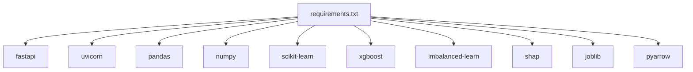

# Machine Learning Service Documentation

<cite>
**Referenced Files in This Document**
- [app.py](file://Mini_Project/ml-service/app.py)
- [prediction_engine.py](file://Mini_Project/ml-service/prediction_engine.py)
- [predict.py](file://Mini_Project/ml-service/predict.py)
- [train_model.py](file://Mini_Project/ml-service/train_model.py)
- [requirements.txt](file://Mini_Project/ml-service/requirements.txt)
- [feature_names.json](file://Mini_Project/ml-service/model/feature_names.json)
- [model_report.json](file://Mini_Project/ml-service/model/model_report.json)
- [application.properties](file://Mini_Project/backend/src/main/resources/application.properties)
</cite>

## Table of Contents
1. [Introduction](#introduction)
2. [Project Structure](#project-structure)
3. [Core Components](#core-components)
4. [Architecture Overview](#architecture-overview)
5. [Detailed Component Analysis](#detailed-component-analysis)
6. [Dependency Analysis](#dependency-analysis)
7. [Performance Considerations](#performance-considerations)
8. [Troubleshooting Guide](#troubleshooting-guide)
9. [Conclusion](#conclusion)
10. [Appendices](#appendices)

## Introduction
This document describes the FastAPI-based machine learning service for network intrusion detection. It covers the prediction engine architecture, XGBoost model integration, SHAP explanation generation, and the data preprocessing pipeline. It also documents model loading mechanisms, feature engineering processes, batch prediction workflows, real-time inference capabilities, API endpoints, input validation, result formatting, model training procedures, performance evaluation metrics, artifact management, usage examples, integration patterns, and extension possibilities for additional ML algorithms.

## Project Structure
The machine learning service is implemented as a Python FastAPI application with modular components:
- Application entrypoint and API endpoints
- Prediction engine abstraction layer
- Model predictor with XGBoost and SHAP integration
- Training pipeline for model creation and evaluation
- Artifact storage for model, scaler, label encoder, feature names, and reports
- Frontend integration configuration pointing to the ML service

**Diagram sources**
- [app.py:1-120](file://Mini_Project/ml-service/app.py#L1-L120)
- [prediction_engine.py:1-120](file://Mini_Project/ml-service/prediction_engine.py#L1-L120)
- [predict.py:1-80](file://Mini_Project/ml-service/predict.py#L1-L80)
- [train_model.py:1-120](file://Mini_Project/ml-service/train_model.py#L1-L120)
- [application.properties:1-46](file://Mini_Project/backend/src/main/resources/application.properties#L1-L46)

**Section sources**
- [app.py:1-120](file://Mini_Project/ml-service/app.py#L1-L120)
- [prediction_engine.py:1-120](file://Mini_Project/ml-service/prediction_engine.py#L1-L120)
- [predict.py:1-80](file://Mini_Project/ml-service/predict.py#L1-L80)
- [train_model.py:1-120](file://Mini_Project/ml-service/train_model.py#L1-L120)
- [application.properties:1-46](file://Mini_Project/backend/src/main/resources/application.properties#L1-L46)

## Core Components
- FastAPI application with CORS middleware and endpoint routing
- Prediction engine that orchestrates preprocessing, batching, and SHAP explanations
- NIDSPredictor that loads XGBoost artifacts, scales features, predicts, and generates SHAP explanations
- Training pipeline that loads parquet datasets, preprocesses data, trains models, evaluates metrics, and saves artifacts
- Artifact management for model.pkl, scaler.pkl, label_encoder.pkl, feature_names.json, and model_report.json
- Frontend integration configuration for ML service URL and CORS

Key responsibilities:
- API endpoints for single and batch prediction, dataset upload and analysis, health checks, and report generation
- Robust preprocessing including handling infinities, NaNs, duplicates, protocol encoding, and feature alignment
- Explainable AI via SHAP TreeExplainer for attack-type classification
- Scalable batch processing with confidence-based severity scoring and risk aggregation

**Section sources**
- [app.py:40-120](file://Mini_Project/ml-service/app.py#L40-L120)
- [prediction_engine.py:70-120](file://Mini_Project/ml-service/prediction_engine.py#L70-L120)
- [predict.py:17-80](file://Mini_Project/ml-service/predict.py#L17-L80)
- [train_model.py:32-120](file://Mini_Project/ml-service/train_model.py#L32-L120)
- [feature_names.json:1-79](file://Mini_Project/ml-service/model/feature_names.json#L1-L79)
- [model_report.json:1-21](file://Mini_Project/ml-service/model/model_report.json#L1-L21)
- [application.properties:32-36](file://Mini_Project/backend/src/main/resources/application.properties#L32-L36)

## Architecture Overview
The system follows a layered architecture:
- API layer: FastAPI routes handle requests, validate inputs, and delegate to the prediction engine
- Engine layer: PredictionEngine manages preprocessing, batch inference, and SHAP explanations
- Predictor layer: NIDSPredictor encapsulates model loading, scaling, prediction, and explanation generation
- Training layer: train_model.py builds, evaluates, and persists model artifacts
- Storage layer: model/ directory holds artifacts and reports

**Diagram sources**
- [app.py:439-465](file://Mini_Project/ml-service/app.py#L439-L465)
- [prediction_engine.py:94-111](file://Mini_Project/ml-service/prediction_engine.py#L94-L111)
- [predict.py:61-111](file://Mini_Project/ml-service/predict.py#L61-L111)

**Section sources**
- [app.py:439-465](file://Mini_Project/ml-service/app.py#L439-L465)
- [prediction_engine.py:94-111](file://Mini_Project/ml-service/prediction_engine.py#L94-L111)
- [predict.py:61-111](file://Mini_Project/ml-service/predict.py#L61-L111)

## Detailed Component Analysis

### FastAPI Application and Endpoints
The application defines:
- Health check endpoint
- Model info endpoint returning performance metrics
- Single and batch prediction endpoints with input validation
- Dataset upload, analysis, and report endpoints
- Simulation endpoints for future live traffic support
- In-memory stores for detections and dataset metadata

Input validation:
- Pydantic model TrafficFeatures validates feature fields and optional metadata
- Endpoint-level validations for file uploads and dataset availability

Output formatting:
- Standardized prediction responses with prediction, confidence, severity, and explanation
- Aggregated analysis results with security summaries, attack distributions, and feature importance

Real-time inference:
- Simulation loop reads preprocessed parquet data and streams predictions

**Section sources**
- [app.py:71-156](file://Mini_Project/ml-service/app.py#L71-L156)
- [app.py:253-293](file://Mini_Project/ml-service/app.py#L253-L293)
- [app.py:295-347](file://Mini_Project/ml-service/app.py#L295-L347)
- [app.py:418-465](file://Mini_Project/ml-service/app.py#L418-L465)
- [app.py:467-487](file://Mini_Project/ml-service/app.py#L467-L487)
- [app.py:576-639](file://Mini_Project/ml-service/app.py#L576-L639)

### Prediction Engine
Responsibilities:
- Validates dataset columns against model feature names
- Preprocesses data: drops identifiers, handles infinities/NaNs, removes duplicates, encodes protocol if needed
- Builds aligned feature matrix for batch prediction
- Computes predictions, confidence, severity, and probability distributions
- Generates SHAP explanations for attack samples and aggregates global feature importance
- Produces security summaries, attack details, and report-ready data

Severity computation:
- Threshold-based mapping from confidence and predicted label

Risk assessment:
- Determined by severity distribution across predictions

Report generation:
- Transforms analysis results into a structured payload for PDF generation

**Section sources**
- [prediction_engine.py:115-366](file://Mini_Project/ml-service/prediction_engine.py#L115-L366)
- [prediction_engine.py:368-401](file://Mini_Project/ml-service/prediction_engine.py#L368-L401)

### NIDSPredictor (XGBoost + SHAP)
Model loading:
- Loads XGBoost model, scaler, label encoder, and feature names from model/
- Initializes SHAP TreeExplainer when available

Prediction pipeline:
- Builds feature vector in the correct order
- Scales input using fitted StandardScaler
- Predicts class index and computes confidence from class probabilities
- Determines severity based on confidence and label
- Generates SHAP explanation for the predicted class

Explanations:
- Computes absolute and signed impacts for top features
- Handles multiclass SHAP value shapes robustly

**Section sources**
- [predict.py:28-60](file://Mini_Project/ml-service/predict.py#L28-L60)
- [predict.py:61-111](file://Mini_Project/ml-service/predict.py#L61-L111)
- [predict.py:130-166](file://Mini_Project/ml-service/predict.py#L130-L166)

### Training Pipeline
Data loading:
- Reads all parquet files from results/ and merges with sampling per file

Preprocessing:
- Maps raw labels to simplified attack categories
- Drops non-predictive identifiers
- Handles infinities and NaNs, removes duplicates
- Encodes protocol and target labels
- Selects CICIDS2017-style feature columns

Training:
- Splits data 80/20 with stratification
- Applies SMOTE oversampling to address class imbalance
- Fits StandardScaler and trains Random Forest baseline and XGBoost production model

Evaluation:
- Computes accuracy, precision, recall, F1-score, and ROC-AUC
- Saves artifacts and metrics report

Artifact management:
- Persist model, scaler, label encoder, feature names, and report

**Section sources**
- [train_model.py:163-178](file://Mini_Project/ml-service/train_model.py#L163-L178)
- [train_model.py:183-235](file://Mini_Project/ml-service/train_model.py#L183-L235)
- [train_model.py:240-259](file://Mini_Project/ml-service/train_model.py#L240-L259)
- [train_model.py:264-296](file://Mini_Project/ml-service/train_model.py#L264-L296)
- [train_model.py:301-338](file://Mini_Project/ml-service/train_model.py#L301-L338)
- [train_model.py:343-379](file://Mini_Project/ml-service/train_model.py#L343-L379)

### Data Models and Feature Engineering
Feature mapping:
- API feature names mapped to dataset column names for alignment
- Protocol encoded as a separate feature when present

Feature names:
- Complete ordered list of model features persisted in feature_names.json

Severity thresholds:
- Confidence-based severity mapping for alerts

Attack mapping:
- Simplified attack categories for reporting and risk assessment

**Section sources**
- [app.py:159-237](file://Mini_Project/ml-service/app.py#L159-L237)
- [feature_names.json:1-79](file://Mini_Project/ml-service/model/feature_names.json#L1-L79)
- [prediction_engine.py:50-68](file://Mini_Project/ml-service/prediction_engine.py#L50-L68)
- [prediction_engine.py:35-49](file://Mini_Project/ml-service/prediction_engine.py#L35-L49)

### API Endpoints and Workflows
Single prediction:
- POST /api/predict accepts TrafficFeatures and returns prediction, confidence, severity, and SHAP explanation

Batch prediction:
- POST /api/predict/batch accepts a list of TrafficFeatures and returns aggregated results

Dataset analysis:
- POST /api/upload accepts .parquet files and returns dataset_id
- POST /api/analyze/{dataset_id} runs preprocessing, batch prediction, SHAP, and aggregation
- GET /api/analysis/{dataset_id} retrieves stored analysis results
- GET /api/report/{dataset_id} returns report-ready data

Model and health:
- GET /api/model/info returns model metrics from model_report.json
- GET /api/health returns service status

Dashboard and detections:
- GET /api/detections, GET /api/dashboard/statistics aggregate recent detections

Real-time simulation:
- POST /api/simulate/start triggers continuous streaming of predictions
- POST /api/simulate/stop halts simulation
- GET /api/simulate/status reports progress

**Section sources**
- [app.py:418-465](file://Mini_Project/ml-service/app.py#L418-L465)
- [app.py:467-487](file://Mini_Project/ml-service/app.py#L467-L487)
- [app.py:253-347](file://Mini_Project/ml-service/app.py#L253-L347)
- [app.py:497-546](file://Mini_Project/ml-service/app.py#L497-L546)
- [app.py:618-649](file://Mini_Project/ml-service/app.py#L618-L649)

### Model Training Procedures and Evaluation
Training steps:
- Load merged dataset from parquet files
- Preprocess features and labels
- Split data and apply SMOTE oversampling
- Train Random Forest baseline and XGBoost production model
- Evaluate models and compare metrics
- Save artifacts and report

Metrics:
- Accuracy, precision, recall, F1-score, and ROC-AUC
- Stored in model_report.json for runtime consumption

**Section sources**
- [train_model.py:384-422](file://Mini_Project/ml-service/train_model.py#L384-L422)
- [model_report.json:1-21](file://Mini_Project/ml-service/model/model_report.json#L1-L21)

### Artifact Management
Artifacts:
- xgboost_nids_model.pkl (or equivalent)
- scaler.pkl
- label_encoder.pkl
- feature_names.json
- model_report.json

Storage location:
- model/ directory under ml-service

**Section sources**
- [predict.py:30-45](file://Mini_Project/ml-service/predict.py#L30-L45)
- [feature_names.json:1-79](file://Mini_Project/ml-service/model/feature_names.json#L1-L79)
- [model_report.json:1-21](file://Mini_Project/ml-service/model/model_report.json#L1-L21)

### Integration Patterns and Extension Possibilities
Integration with backend:
- Backend configuration points to ML service URL for API calls

Extending to additional algorithms:
- Replace XGBoost with other tree-based or ensemble models
- Update predictor loading logic to accommodate different explainer types
- Adjust preprocessing steps for algorithm-specific requirements

Adding live traffic:
- PredictionEngine supports live feature extraction adapters
- Simulation endpoints demonstrate streaming prediction patterns

**Section sources**
- [application.properties:32-36](file://Mini_Project/backend/src/main/resources/application.properties#L32-L36)
- [prediction_engine.py:1-12](file://Mini_Project/ml-service/prediction_engine.py#L1-L12)
- [app.py:576-639](file://Mini_Project/ml-service/app.py#L576-L639)

## Dependency Analysis
External dependencies include FastAPI, scikit-learn, XGBoost, SHAP, imbalanced-learn, pandas, numpy, joblib, and pyarrow. These enable web serving, ML modeling, preprocessing, evaluation, and serialization.

**Diagram sources**
- [requirements.txt:1-13](file://Mini_Project/ml-service/requirements.txt#L1-L13)

**Section sources**
- [requirements.txt:1-13](file://Mini_Project/ml-service/requirements.txt#L1-L13)

## Performance Considerations
- Feature alignment: Ensure dataset columns match model feature names to avoid zeros and misalignment
- Preprocessing: Inf/nan handling and duplicate removal improve prediction quality
- Scaling: Always scale features using the fitted StandardScaler
- SHAP computation: Limit samples for SHAP to reduce latency during bulk analysis
- Memory: In-memory detection store capped at 10,000 entries; consider persistence for production
- Simulation: Sampling and randomization in simulation provide realistic load testing

[No sources needed since this section provides general guidance]

## Troubleshooting Guide
Common issues and resolutions:
- Model not found: Verify model artifacts exist in model/ directory
- Missing feature columns: Ensure dataset includes all model features
- SHAP errors: Explainer initialization failure indicates unsupported model type
- Dataset upload failures: Confirm .parquet format and file permissions
- Analysis failures: Check dataset integrity and feature completeness

**Section sources**
- [predict.py:32-38](file://Mini_Project/ml-service/predict.py#L32-L38)
- [prediction_engine.py:143-152](file://Mini_Project/ml-service/prediction_engine.py#L143-L152)
- [app.py:261-266](file://Mini_Project/ml-service/app.py#L261-L266)
- [app.py:343-346](file://Mini_Project/ml-service/app.py#L343-L346)

## Conclusion
The FastAPI-based machine learning service provides a robust, explainable, and scalable solution for network intrusion detection. It integrates XGBoost with SHAP for accurate predictions and interpretable insights, includes comprehensive preprocessing and evaluation, and exposes clear APIs for single and batch inference. The modular design enables easy extension to additional algorithms and integration with broader systems.

[No sources needed since this section summarizes without analyzing specific files]

## Appendices

### API Reference Summary
- POST /api/predict: Single prediction with TrafficFeatures input
- POST /api/predict/batch: Batch prediction with list of TrafficFeatures
- POST /api/upload: Upload .parquet dataset
- POST /api/analyze/{dataset_id}: Run analysis pipeline
- GET /api/analysis/{dataset_id}: Retrieve analysis results
- GET /api/report/{dataset_id}: Get report data
- GET /api/model/info: Model metadata and metrics
- GET /api/health: Health check
- POST /api/simulate/start: Start simulation
- POST /api/simulate/stop: Stop simulation
- GET /api/simulate/status: Simulation status

**Section sources**
- [app.py:418-487](file://Mini_Project/ml-service/app.py#L418-L487)
- [app.py:253-347](file://Mini_Project/ml-service/app.py#L253-L347)