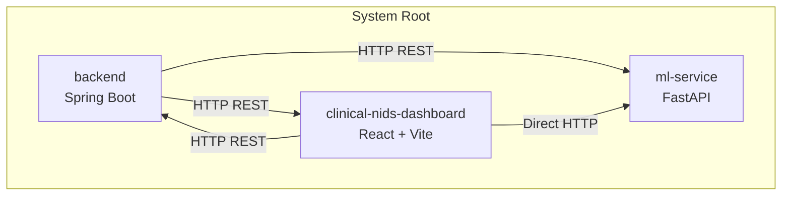
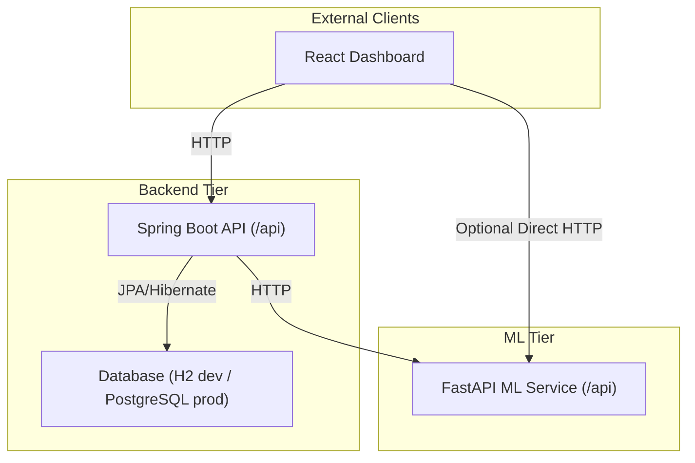
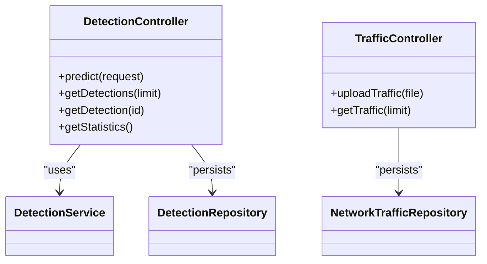
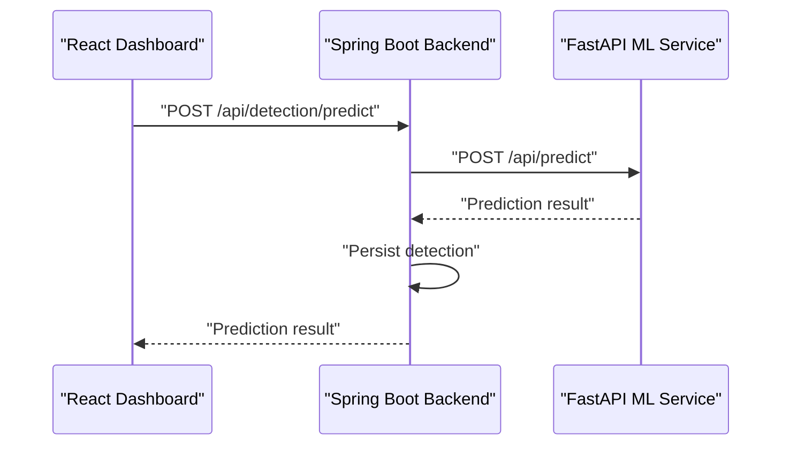
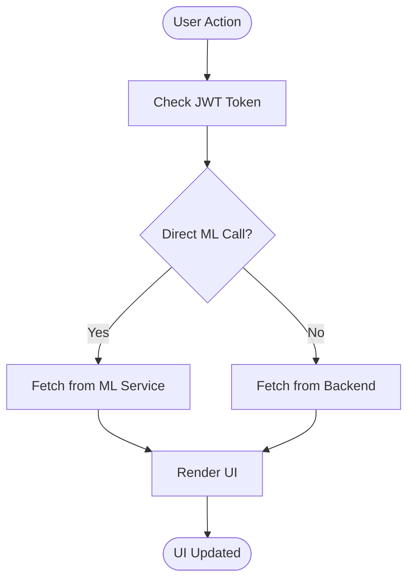
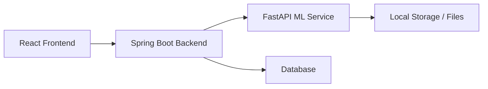
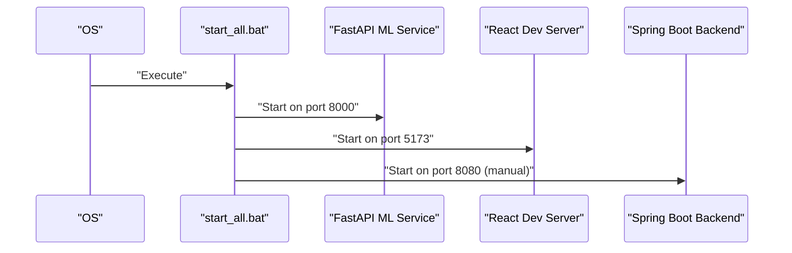

# Architecture Overview

<cite>
**Referenced Files in This Document**
- [ClinicalNidsApplication.java](file://Mini_Project/backend/src/main/java/com/clinicalnids/backend/ClinicalNidsApplication.java)
- [pom.xml](file://Mini_Project/backend/pom.xml)
- [application.properties](file://Mini_Project/backend/src/main/resources/application.properties)
- [DetectionController.java](file://Mini_Project/backend/src/main/java/com/clinicalnids/backend/controller/DetectionController.java)
- [TrafficController.java](file://Mini_Project/backend/src/main/java/com/clinicalnids/backend/controller/TrafficController.java)
- [app.py](file://Mini_Project/ml-service/app.py)
- [package.json](file://Mini_Project/clinical-nids-dashboard/package.json)
- [api.js](file://Mini_Project/clinical-nids-dashboard/src/data/api.js)
- [start_all.bat](file://Mini_Project/start_all.bat)
</cite>

## Table of Contents
1. [Introduction](#introduction)
2. [Project Structure](#project-structure)
3. [Core Components](#core-components)
4. [Architecture Overview](#architecture-overview)
5. [Detailed Component Analysis](#detailed-component-analysis)
6. [Dependency Analysis](#dependency-analysis)
7. [Performance Considerations](#performance-considerations)
8. [Troubleshooting Guide](#troubleshooting-guide)
9. [Conclusion](#conclusion)
10. [Appendices](#appendices)

## Introduction
This document describes the AI-Based Clinical Network Intrusion Detection System (NIDS) architecture. The system is composed of three main components:
- Spring Boot backend API service: Provides REST endpoints for authentication, detection, alerts, datasets, and analytics, integrates with a database, and proxies requests to the machine learning service.
- React frontend dashboard: A web UI built with React and Vite, consuming the Spring Boot backend APIs and optionally interacting directly with the ML service for real-time features.
- FastAPI machine learning service: An asynchronous prediction and analysis service exposing endpoints for dataset upload, bulk analysis, single and batch predictions, and simulated traffic.

The document explains component interactions, data flows, integration patterns, startup orchestration, and deployment topology options.

## Project Structure
The repository is organized into three primary areas:
- backend: Spring Boot application with controllers, services, repositories, and configuration.
- clinical-nids-dashboard: React-based frontend using Vite for development and Tailwind CSS for styling.
- ml-service: FastAPI application implementing ML prediction, dataset analysis, and simulated traffic.

**Diagram sources**
- [ClinicalNidsApplication.java:1-12](file://Mini_Project/backend/src/main/java/com/clinicalnids/backend/ClinicalNidsApplication.java#L1-L12)
- [package.json:1-31](file://Mini_Project/clinical-nids-dashboard/package.json#L1-L31)
- [app.py:1-800](file://Mini_Project/ml-service/app.py#L1-L800)

**Section sources**
- [ClinicalNidsApplication.java:1-12](file://Mini_Project/backend/src/main/java/com/clinicalnids/backend/ClinicalNidsApplication.java#L1-L12)
- [package.json:1-31](file://Mini_Project/clinical-nids-dashboard/package.json#L1-L31)
- [app.py:1-800](file://Mini_Project/ml-service/app.py#L1-L800)

## Core Components
- Spring Boot Backend
  - Exposes REST endpoints under /api for detection, traffic, alerts, datasets, and dashboard statistics.
  - Integrates with an in-memory H2 database in development; configured for PostgreSQL in production.
  - Uses JWT-based authentication and CORS configuration.
  - Proxies detection requests to the ML service and persists detections locally.

- React Frontend
  - Consumes Spring Boot backend APIs for authenticated operations.
  - Optionally calls ML service endpoints directly for prediction and simulation features.
  - Uses Recharts for analytics visualization and Lucide React for icons.

- FastAPI ML Service
  - Provides dataset upload, bulk analysis, and prediction endpoints.
  - Supports single and batch predictions, SHAP explanations, and simulated traffic generation.
  - Maintains in-memory detection storage and exposes dashboard statistics.

**Section sources**
- [DetectionController.java:1-51](file://Mini_Project/backend/src/main/java/com/clinicalnids/backend/controller/DetectionController.java#L1-L51)
- [TrafficController.java:1-41](file://Mini_Project/backend/src/main/java/com/clinicalnids/backend/controller/TrafficController.java#L1-L41)
- [application.properties:1-46](file://Mini_Project/backend/src/main/resources/application.properties#L1-L46)
- [package.json:1-31](file://Mini_Project/clinical-nids-dashboard/package.json#L1-L31)
- [app.py:1-800](file://Mini_Project/ml-service/app.py#L1-L800)

## Architecture Overview
The system follows a microservices-style layout with clear separation of concerns:
- Backend API: Centralized orchestration, persistence, and authentication.
- ML Service: Specialized for machine learning inference and analysis.
- Frontend: Thin client that delegates to backend and optionally to ML service.

**Diagram sources**
- [DetectionController.java:1-51](file://Mini_Project/backend/src/main/java/com/clinicalnids/backend/controller/DetectionController.java#L1-L51)
- [application.properties:1-46](file://Mini_Project/backend/src/main/resources/application.properties#L1-L46)
- [app.py:1-800](file://Mini_Project/ml-service/app.py#L1-L800)
- [api.js:1-236](file://Mini_Project/clinical-nids-dashboard/src/data/api.js#L1-L236)

## Detailed Component Analysis

### Spring Boot Backend API
Responsibilities:
- Authentication and authorization via JWT.
- Detection orchestration: forwards traffic features to the ML service and persists results.
- Dataset lifecycle: upload metadata and trigger analysis via ML service.
- Analytics aggregation: computes dashboard statistics from persisted detections.

Key endpoints:
- POST /api/detection/predict: Accepts traffic features, calls ML service, persists detection.
- GET /api/detections: Retrieves recent detections.
- GET /api/dashboard/statistics: Aggregates analytics for the dashboard.

Technology stack:
- Java 17, Spring Boot 3.x, Web MVC/WebFlux, JPA/Hibernate, PostgreSQL/H2, JWT (jjwt), OpenPDF.

**Diagram sources**
- [DetectionController.java:1-51](file://Mini_Project/backend/src/main/java/com/clinicalnids/backend/controller/DetectionController.java#L1-L51)
- [TrafficController.java:1-41](file://Mini_Project/backend/src/main/java/com/clinicalnids/backend/controller/TrafficController.java#L1-L41)

**Section sources**
- [DetectionController.java:1-51](file://Mini_Project/backend/src/main/java/com/clinicalnids/backend/controller/DetectionController.java#L1-L51)
- [TrafficController.java:1-41](file://Mini_Project/backend/src/main/java/com/clinicalnids/backend/controller/TrafficController.java#L1-L41)
- [pom.xml:1-125](file://Mini_Project/backend/pom.xml#L1-L125)
- [application.properties:1-46](file://Mini_Project/backend/src/main/resources/application.properties#L1-L46)

### FastAPI ML Service
Responsibilities:
- Dataset management: upload Parquet files, persist metadata, and compute analysis.
- Prediction pipeline: single and batch predictions with SHAP explanations.
- Simulation: generates synthetic traffic streams for demonstration.
- Analytics: aggregates dashboard statistics for the frontend.

Endpoints:
- POST /api/predict, POST /api/predict/batch: Real-time prediction.
- POST /api/upload, POST /api/analyze/{id}, GET /api/analysis/{id}: Dataset lifecycle.
- GET /api/dashboard/statistics: Dashboard metrics.
- POST /api/simulate/start, POST /api/simulate/stop, GET /api/simulate/status: Traffic simulation.

**Diagram sources**
- [DetectionController.java:1-51](file://Mini_Project/backend/src/main/java/com/clinicalnids/backend/controller/DetectionController.java#L1-L51)
- [app.py:439-487](file://Mini_Project/ml-service/app.py#L439-L487)
- [api.js:45-53](file://Mini_Project/clinical-nids-dashboard/src/data/api.js#L45-L53)

**Section sources**
- [app.py:1-800](file://Mini_Project/ml-service/app.py#L1-L800)
- [api.js:1-236](file://Mini_Project/clinical-nids-dashboard/src/data/api.js#L1-L236)

### React Frontend Dashboard
Responsibilities:
- User authentication and session management.
- Visualization of analytics and alerts.
- Dataset upload and report generation workflows.
- Optional direct communication with the ML service for prediction and simulation.

Technology stack:
- React 18, React Router, Recharts, Tailwind CSS, Vite.

**Diagram sources**
- [api.js:1-236](file://Mini_Project/clinical-nids-dashboard/src/data/api.js#L1-L236)
- [package.json:1-31](file://Mini_Project/clinical-nids-dashboard/package.json#L1-L31)

**Section sources**
- [api.js:1-236](file://Mini_Project/clinical-nids-dashboard/src/data/api.js#L1-L236)
- [package.json:1-31](file://Mini_Project/clinical-nids-dashboard/package.json#L1-L31)

## Dependency Analysis
Inter-service dependencies and integration points:
- Backend depends on ML service for prediction results and dataset analysis.
- Frontend depends on Backend for authenticated operations and optionally on ML service for real-time features.
- Database dependency: Backend uses JPA/Hibernate with H2 in development and PostgreSQL in production.

**Diagram sources**
- [application.properties:1-46](file://Mini_Project/backend/src/main/resources/application.properties#L1-L46)
- [app.py:1-800](file://Mini_Project/ml-service/app.py#L1-L800)
- [api.js:1-236](file://Mini_Project/clinical-nids-dashboard/src/data/api.js#L1-L236)

**Section sources**
- [application.properties:1-46](file://Mini_Project/backend/src/main/resources/application.properties#L1-L46)
- [pom.xml:1-125](file://Mini_Project/backend/pom.xml#L1-L125)

## Performance Considerations
- Asynchronous processing: FastAPI supports async simulations and batch predictions; leverage concurrency for throughput.
- Caching and limits: Frontend and backend enforce pagination and capped detection lists to control memory usage.
- Database scaling: Prefer PostgreSQL in production; enable connection pooling and indexing on frequently queried fields.
- CORS and JWT: Configure origins and token expiration appropriately to minimize cross-origin overhead.
- File uploads: Limit max file sizes and stream uploads to avoid memory spikes.

## Troubleshooting Guide
Common issues and resolutions:
- CORS errors: Ensure frontend origin matches backend allowed origins.
- Authentication failures: Verify JWT secret and expiration settings.
- ML service unavailability: Confirm ML service is running and reachable at configured URL.
- Database connectivity: Switch from H2 to PostgreSQL in production and verify credentials.

Operational checks:
- Backend health: Access H2 console in development or monitor PostgreSQL in production.
- ML health: Call the ML service health endpoint to confirm readiness.
- Startup order: Use the provided batch script to start services in the correct order.

**Section sources**
- [application.properties:1-46](file://Mini_Project/backend/src/main/resources/application.properties#L1-L46)
- [start_all.bat:1-59](file://Mini_Project/start_all.bat#L1-L59)

## Conclusion
The AI-Based Clinical NIDS employs a clean microservices architecture with specialized roles for each component. The Spring Boot backend centralizes orchestration and persistence, the FastAPI ML service handles inference and analysis, and the React frontend delivers analytics and controls. The provided startup script and configuration simplify local development, while the documented integration points enable scalable deployments.

## Appendices

### Startup Orchestration and Service Dependencies
The batch script starts services in sequence:
- ML Service (FastAPI on port 8000)
- React Frontend (Vite on port 5173)
- Spring Boot Backend (port 8080) — requires Maven

**Diagram sources**
- [start_all.bat:1-59](file://Mini_Project/start_all.bat#L1-L59)

**Section sources**
- [start_all.bat:1-59](file://Mini_Project/start_all.bat#L1-L59)

### Technology Stack Choices
- Backend: Java Spring Boot for robust enterprise-grade services, strong ecosystem, and reactive capabilities.
- Frontend: React for component-driven UI with routing and charts.
- ML Service: Python FastAPI for high-performance async APIs, Pydantic models, and straightforward ML integration.

**Section sources**
- [pom.xml:1-125](file://Mini_Project/backend/pom.xml#L1-L125)
- [package.json:1-31](file://Mini_Project/clinical-nids-dashboard/package.json#L1-L31)
- [app.py:1-800](file://Mini_Project/ml-service/app.py#L1-L800)