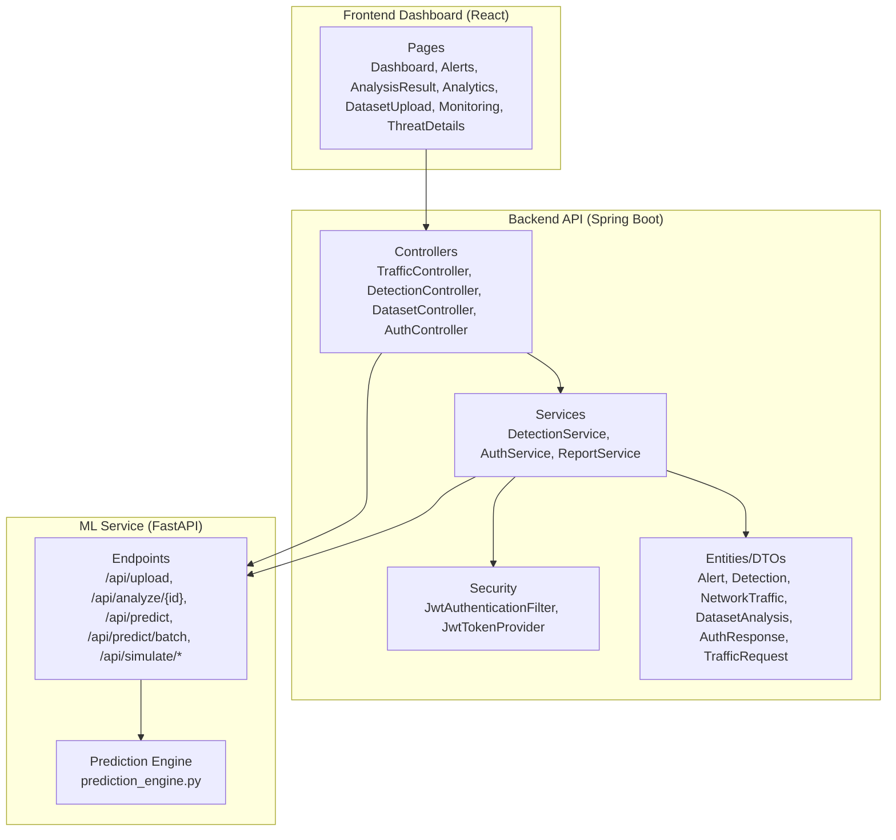
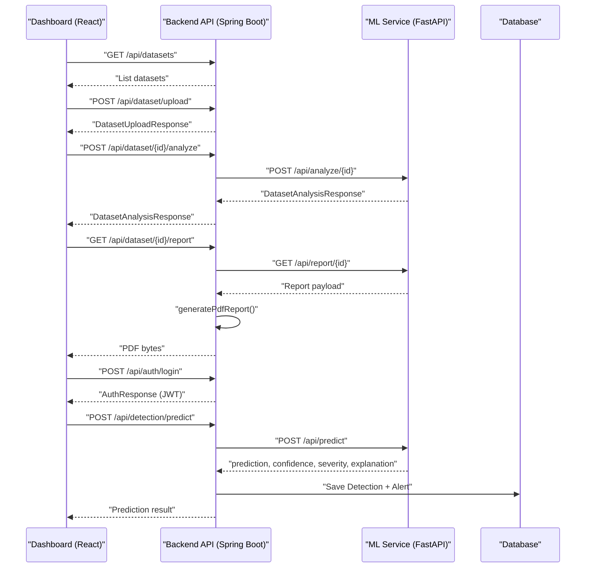
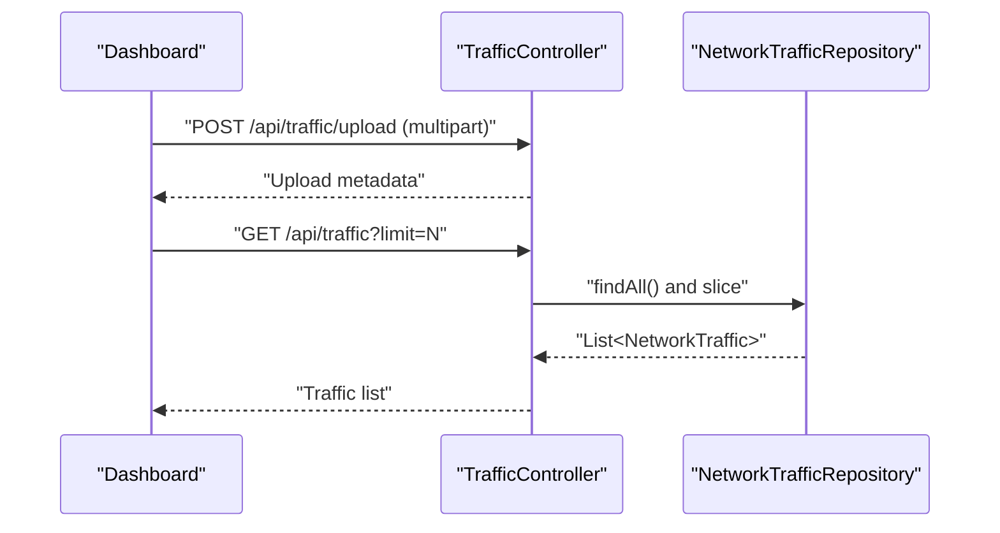
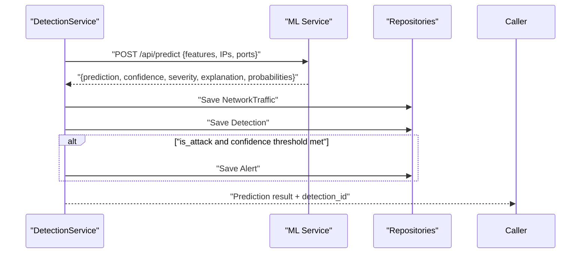
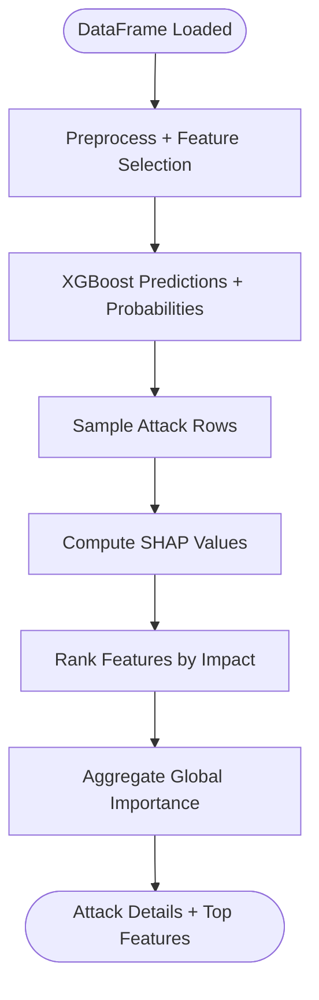
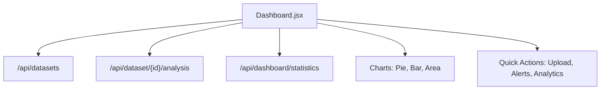
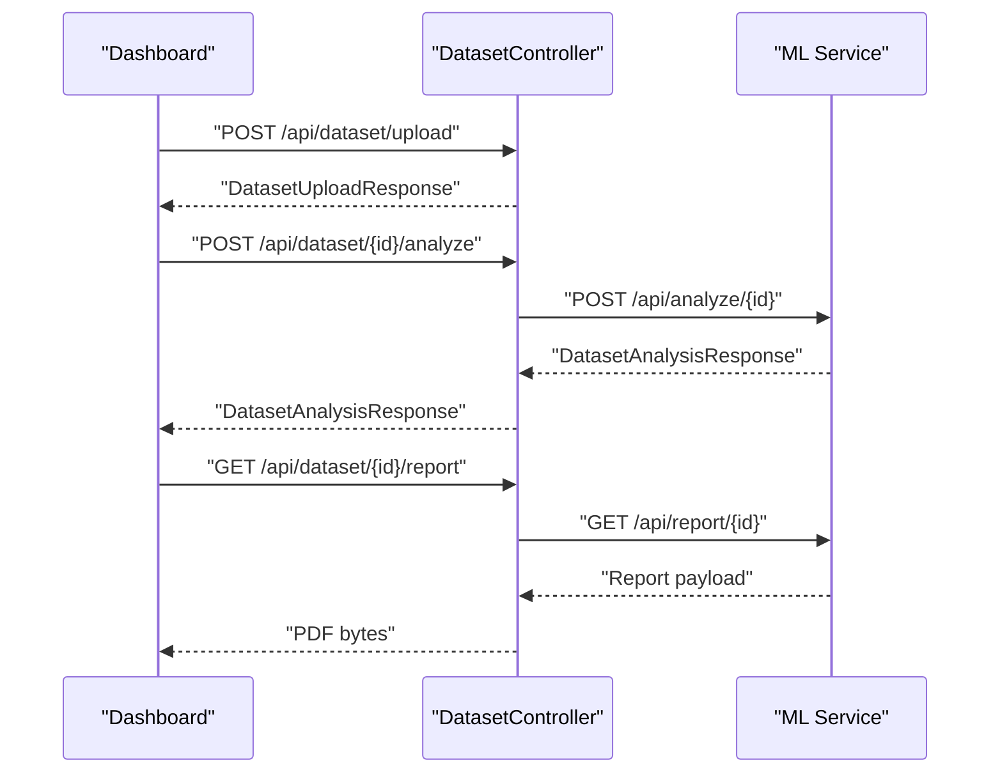
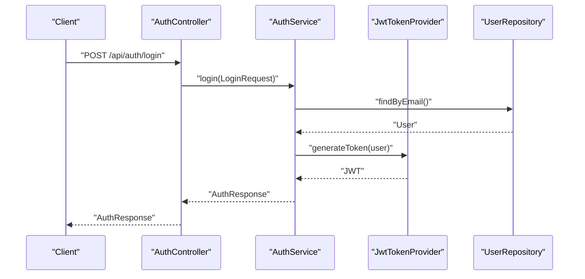
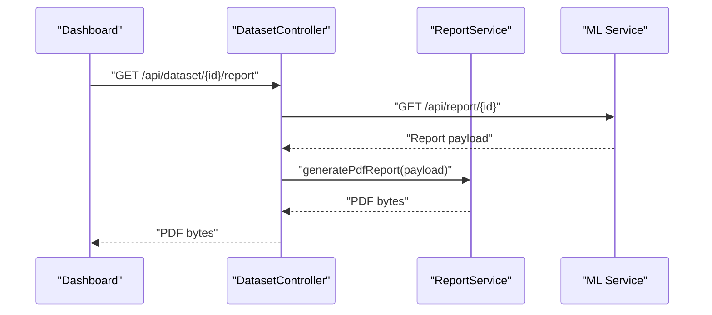
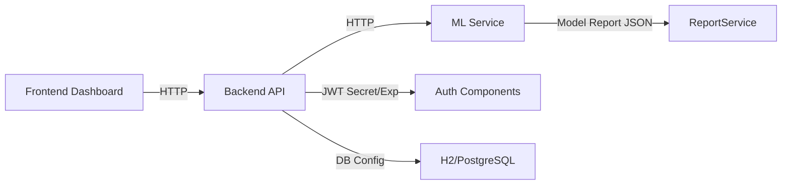

# Core Features

<cite>
**Referenced Files in This Document**
- [ClinicalNidsApplication.java](file://Mini_Project/backend/src/main/java/com/clinicalnids/backend/ClinicalNidsApplication.java)
- [TrafficController.java](file://Mini_Project/backend/src/main/java/com/clinicalnids/backend/controller/TrafficController.java)
- [DetectionController.java](file://Mini_Project/backend/src/main/java/com/clinicalnids/backend/controller/DetectionController.java)
- [DatasetController.java](file://Mini_Project/backend/src/main/java/com/clinicalnids/backend/controller/DatasetController.java)
- [AuthController.java](file://Mini_Project/backend/src/main/java/com/clinicalnids/backend/controller/AuthController.java)
- [DetectionService.java](file://Mini_Project/backend/src/main/java/com/clinicalnids/backend/service/DetectionService.java)
- [AuthService.java](file://Mini_Project/backend/src/main/java/com/clinicalnids/backend/service/AuthService.java)
- [ReportService.java](file://Mini_Project/backend/src/main/java/com/clinicalnids/backend/service/ReportService.java)
- [JwtAuthenticationFilter.java](file://Mini_Project/backend/src/main/java/com/clinicalnids/backend/security/JwtAuthenticationFilter.java)
- [JwtTokenProvider.java](file://Mini_Project/backend/src/main/java/com/clinicalnids/backend/security/JwtTokenProvider.java)
- [application.properties](file://Mini_Project/backend/src/main/resources/application.properties)
- [app.py](file://Mini_Project/ml-service/app.py)
- [prediction_engine.py](file://Mini_Project/ml-service/prediction_engine.py)
- [Dashboard.jsx](file://Mini_Project/clinical-nids-dashboard/src/pages/Dashboard.jsx)
</cite>

## Table of Contents
1. [Introduction](#introduction)
2. [Project Structure](#project-structure)
3. [Core Components](#core-components)
4. [Architecture Overview](#architecture-overview)
5. [Detailed Component Analysis](#detailed-component-analysis)
6. [Dependency Analysis](#dependency-analysis)
7. [Performance Considerations](#performance-considerations)
8. [Troubleshooting Guide](#troubleshooting-guide)
9. [Conclusion](#conclusion)
10. [Appendices](#appendices)

## Introduction
This document explains the core features of the AI-Based Clinical Network Intrusion Detection System (NIDS). It focuses on:
- Real-time network traffic monitoring and ingestion
- AI-powered intrusion detection using XGBoost
- SHAP-based explainable AI for detection decisions
- Interactive dashboard analytics
- Dataset upload and batch analysis
- User authentication and authorization
- PDF report generation

It also demonstrates how these features integrate to support healthcare cybersecurity workflows, including continuous monitoring, compliance reporting, and actionable insights for clinical network environments.

## Project Structure
The system comprises three primary parts:
- Backend API (Spring Boot): Controllers, services, repositories, security, and DTOs/entities
- ML Service (FastAPI): Dataset upload, batch prediction, SHAP explanations, and simulated traffic
- Frontend Dashboard (React): Visualizations, navigation, and analytics

**Diagram sources**
- [TrafficController.java:1-41](file://Mini_Project/backend/src/main/java/com/clinicalnids/backend/controller/TrafficController.java#L1-L41)
- [DetectionController.java:1-51](file://Mini_Project/backend/src/main/java/com/clinicalnids/backend/controller/DetectionController.java#L1-L51)
- [DatasetController.java:1-95](file://Mini_Project/backend/src/main/java/com/clinicalnids/backend/controller/DatasetController.java#L1-L95)
- [AuthController.java:1-25](file://Mini_Project/backend/src/main/java/com/clinicalnids/backend/controller/AuthController.java#L1-L25)
- [DetectionService.java:1-159](file://Mini_Project/backend/src/main/java/com/clinicalnids/backend/service/DetectionService.java#L1-L159)
- [AuthService.java:1-63](file://Mini_Project/backend/src/main/java/com/clinicalnids/backend/service/AuthService.java#L1-L63)
- [ReportService.java:1-287](file://Mini_Project/backend/src/main/java/com/clinicalnids/backend/service/ReportService.java#L1-L287)
- [JwtAuthenticationFilter.java:1-56](file://Mini_Project/backend/src/main/java/com/clinicalnids/backend/security/JwtAuthenticationFilter.java#L1-L56)
- [JwtTokenProvider.java:1-71](file://Mini_Project/backend/src/main/java/com/clinicalnids/backend/security/JwtTokenProvider.java#L1-L71)
- [app.py:1-1199](file://Mini_Project/ml-service/app.py#L1-L1199)
- [prediction_engine.py:1-413](file://Mini_Project/ml-service/prediction_engine.py#L1-L413)
- [Dashboard.jsx:1-328](file://Mini_Project/clinical-nids-dashboard/src/pages/Dashboard.jsx#L1-L328)

**Section sources**
- [ClinicalNidsApplication.java:1-12](file://Mini_Project/backend/src/main/java/com/clinicalnids/backend/ClinicalNidsApplication.java#L1-L12)
- [application.properties:1-46](file://Mini_Project/backend/src/main/resources/application.properties#L1-L46)

## Core Components
- Real-time traffic ingestion and retrieval: Backend accepts traffic uploads and exposes endpoints to fetch recent traffic records.
- AI-powered detection: Backend forwards traffic features to the ML service, receives predictions, severity, confidence, and SHAP explanations, and persists detections and alerts.
- Explainable AI: SHAP explanations are computed for attack samples and aggregated globally to highlight key features.
- Interactive dashboard: The frontend consumes backend and ML endpoints to render charts, summaries, and actionable insights.
- Dataset upload and batch analysis: Users upload Parquet datasets, trigger batch analysis, and download reports.
- Authentication and authorization: JWT-based login and middleware enforce secure access.
- PDF report generation: Backend generates comprehensive PDF reports from analysis results.

**Section sources**
- [TrafficController.java:1-41](file://Mini_Project/backend/src/main/java/com/clinicalnids/backend/controller/TrafficController.java#L1-L41)
- [DetectionController.java:1-51](file://Mini_Project/backend/src/main/java/com/clinicalnids/backend/controller/DetectionController.java#L1-L51)
- [DetectionService.java:1-159](file://Mini_Project/backend/src/main/java/com/clinicalnids/backend/service/DetectionService.java#L1-L159)
- [prediction_engine.py:1-413](file://Mini_Project/ml-service/prediction_engine.py#L1-L413)
- [Dashboard.jsx:1-328](file://Mini_Project/clinical-nids-dashboard/src/pages/Dashboard.jsx#L1-L328)
- [DatasetController.java:1-95](file://Mini_Project/backend/src/main/java/com/clinicalnids/backend/controller/DatasetController.java#L1-L95)
- [ReportService.java:1-287](file://Mini_Project/backend/src/main/java/com/clinicalnids/backend/service/ReportService.java#L1-L287)
- [AuthController.java:1-25](file://Mini_Project/backend/src/main/java/com/clinicalnids/backend/controller/AuthController.java#L1-L25)
- [JwtAuthenticationFilter.java:1-56](file://Mini_Project/backend/src/main/java/com/clinicalnids/backend/security/JwtAuthenticationFilter.java#L1-L56)
- [JwtTokenProvider.java:1-71](file://Mini_Project/backend/src/main/java/com/clinicalnids/backend/security/JwtTokenProvider.java#L1-L71)

## Architecture Overview
The system integrates a Spring Boot backend, a FastAPI ML service, and a React dashboard. The backend orchestrates authentication, persistence, and ML coordination, while the ML service performs batch and single-flow predictions with SHAP explanations.

**Diagram sources**
- [DatasetController.java:1-95](file://Mini_Project/backend/src/main/java/com/clinicalnids/backend/controller/DatasetController.java#L1-L95)
- [DetectionController.java:1-51](file://Mini_Project/backend/src/main/java/com/clinicalnids/backend/controller/DetectionController.java#L1-L51)
- [DetectionService.java:1-159](file://Mini_Project/backend/src/main/java/com/clinicalnids/backend/service/DetectionService.java#L1-L159)
- [app.py:253-393](file://Mini_Project/ml-service/app.py#L253-L393)
- [prediction_engine.py:115-366](file://Mini_Project/ml-service/prediction_engine.py#L115-L366)
- [ReportService.java:1-287](file://Mini_Project/backend/src/main/java/com/clinicalnids/backend/service/ReportService.java#L1-L287)
- [AuthController.java:1-25](file://Mini_Project/backend/src/main/java/com/clinicalnids/backend/controller/AuthController.java#L1-L25)

## Detailed Component Analysis

### Real-Time Network Traffic Monitoring
- Upload and retrieval: The backend exposes an upload endpoint for traffic files and a GET endpoint to retrieve recent traffic records. The upload metadata is stored; the ML service handles actual analysis.
- Future live capture: The ML service includes a traffic simulator to demonstrate real-time flow processing and storage.

**Diagram sources**
- [TrafficController.java:22-40](file://Mini_Project/backend/src/main/java/com/clinicalnids/backend/controller/TrafficController.java#L22-L40)

**Section sources**
- [TrafficController.java:1-41](file://Mini_Project/backend/src/main/java/com/clinicalnids/backend/controller/TrafficController.java#L1-L41)
- [app.py:618-650](file://Mini_Project/ml-service/app.py#L618-L650)

### AI-Powered Intrusion Detection Using XGBoost
- Prediction pipeline: The backend forwards traffic features to the ML service, which runs XGBoost predictions and computes confidence and severity. The backend persists detections and creates alerts based on confidence thresholds.
- Batch analysis: The ML service processes entire datasets, computes per-row predictions, aggregates statistics, and prepares SHAP explanations.

**Diagram sources**
- [DetectionService.java:46-137](file://Mini_Project/backend/src/main/java/com/clinicalnids/backend/service/DetectionService.java#L46-L137)
- [app.py:439-464](file://Mini_Project/ml-service/app.py#L439-L464)
- [prediction_engine.py:94-111](file://Mini_Project/ml-service/prediction_engine.py#L94-L111)

**Section sources**
- [DetectionController.java:26-49](file://Mini_Project/backend/src/main/java/com/clinicalnids/backend/controller/DetectionController.java#L26-L49)
- [DetectionService.java:1-159](file://Mini_Project/backend/src/main/java/com/clinicalnids/backend/service/DetectionService.java#L1-L159)
- [app.py:439-464](file://Mini_Project/ml-service/app.py#L439-L464)
- [prediction_engine.py:115-231](file://Mini_Project/ml-service/prediction_engine.py#L115-L231)

### SHAP-Based Explainable AI for Detection Decisions
- Per-row explanations: For attack samples, the ML service computes SHAP values for the predicted class and ranks features by impact.
- Aggregated insights: The prediction engine aggregates SHAP results to produce global feature importance and per-attack-type top features, enabling interpretable summaries.

**Diagram sources**
- [prediction_engine.py:232-322](file://Mini_Project/ml-service/prediction_engine.py#L232-L322)

**Section sources**
- [prediction_engine.py:232-322](file://Mini_Project/ml-service/prediction_engine.py#L232-L322)

### Interactive Dashboard Analytics
- Data sources: The dashboard fetches datasets, analysis results, and statistics from backend and ML endpoints. It renders charts for attack distribution, severity, and feature importance, and displays recent predictions.
- Mock fallback: When backend is unavailable, the dashboard uses mock data to remain functional.

**Diagram sources**
- [Dashboard.jsx:1-328](file://Mini_Project/clinical-nids-dashboard/src/pages/Dashboard.jsx#L1-L328)

**Section sources**
- [Dashboard.jsx:1-328](file://Mini_Project/clinical-nids-dashboard/src/pages/Dashboard.jsx#L1-L328)

### Dataset Upload and Batch Analysis
- Upload: Accepts Parquet files and returns a dataset identifier.
- Analysis: Triggers batch prediction and SHAP computation, storing results for later retrieval.
- Retrieval and reporting: Retrieves analysis results and generates a structured report payload consumed by the backend’s PDF generator.

**Diagram sources**
- [DatasetController.java:34-74](file://Mini_Project/backend/src/main/java/com/clinicalnids/backend/controller/DatasetController.java#L34-L74)
- [app.py:253-393](file://Mini_Project/ml-service/app.py#L253-L393)
- [prediction_engine.py:368-401](file://Mini_Project/ml-service/prediction_engine.py#L368-L401)

**Section sources**
- [DatasetController.java:1-95](file://Mini_Project/backend/src/main/java/com/clinicalnids/backend/controller/DatasetController.java#L1-L95)
- [app.py:253-393](file://Mini_Project/ml-service/app.py#L253-L393)
- [prediction_engine.py:368-401](file://Mini_Project/ml-service/prediction_engine.py#L368-L401)

### User Authentication and Authorization
- Login: Validates credentials and issues a JWT.
- Middleware: Extracts token from Authorization header, validates it, loads user details, and sets authentication in the security context.
- Defaults: Initializes default admin and analyst accounts on startup.

**Diagram sources**
- [AuthController.java:20-23](file://Mini_Project/backend/src/main/java/com/clinicalnids/backend/controller/AuthController.java#L20-L23)
- [AuthService.java:53-61](file://Mini_Project/backend/src/main/java/com/clinicalnids/backend/service/AuthService.java#L53-L61)
- [JwtTokenProvider.java:28-51](file://Mini_Project/backend/src/main/java/com/clinicalnids/backend/security/JwtTokenProvider.java#L28-L51)

**Section sources**
- [AuthController.java:1-25](file://Mini_Project/backend/src/main/java/com/clinicalnids/backend/controller/AuthController.java#L1-L25)
- [AuthService.java:1-63](file://Mini_Project/backend/src/main/java/com/clinicalnids/backend/service/AuthService.java#L1-L63)
- [JwtAuthenticationFilter.java:1-56](file://Mini_Project/backend/src/main/java/com/clinicalnids/backend/security/JwtAuthenticationFilter.java#L1-L56)
- [JwtTokenProvider.java:1-71](file://Mini_Project/backend/src/main/java/com/clinicalnids/backend/security/JwtTokenProvider.java#L1-L71)
- [application.properties:28-31](file://Mini_Project/backend/src/main/resources/application.properties#L28-L31)

### PDF Report Generation
- Payload preparation: The ML service prepares a structured report payload from analysis results.
- PDF generation: The backend composes a PDF using iText, rendering dataset info, model info, security summary, distributions, attack details, and global feature importance.

**Diagram sources**
- [DatasetController.java:62-74](file://Mini_Project/backend/src/main/java/com/clinicalnids/backend/controller/DatasetController.java#L62-L74)
- [ReportService.java:35-231](file://Mini_Project/backend/src/main/java/com/clinicalnids/backend/service/ReportService.java#L35-L231)
- [app.py:372-393](file://Mini_Project/ml-service/app.py#L372-L393)

**Section sources**
- [ReportService.java:1-287](file://Mini_Project/backend/src/main/java/com/clinicalnids/backend/service/ReportService.java#L1-L287)
- [DatasetController.java:1-95](file://Mini_Project/backend/src/main/java/com/clinicalnids/backend/controller/DatasetController.java#L1-L95)
- [app.py:372-393](file://Mini_Project/ml-service/app.py#L372-L393)

## Dependency Analysis
- Backend depends on:
  - ML service base URL configured in application properties
  - JWT secret and expiration for authentication
  - H2 in-memory database for development (switchable to PostgreSQL)
- ML service depends on:
  - Prediction engine module for XGBoost inference and SHAP
  - Feature mapping and preprocessing logic
  - In-memory detection store for simulated traffic
- Frontend depends on:
  - Backend and ML endpoints for data and analytics

**Diagram sources**
- [application.properties:28-46](file://Mini_Project/backend/src/main/resources/application.properties#L28-L46)
- [app.py:439-464](file://Mini_Project/ml-service/app.py#L439-L464)
- [prediction_engine.py:332-339](file://Mini_Project/ml-service/prediction_engine.py#L332-L339)
- [ReportService.java:35-231](file://Mini_Project/backend/src/main/java/com/clinicalnids/backend/service/ReportService.java#L35-L231)

**Section sources**
- [application.properties:1-46](file://Mini_Project/backend/src/main/resources/application.properties#L1-L46)
- [app.py:1-1199](file://Mini_Project/ml-service/app.py#L1-L1199)
- [prediction_engine.py:1-413](file://Mini_Project/ml-service/prediction_engine.py#L1-L413)
- [ReportService.java:1-287](file://Mini_Project/backend/src/main/java/com/clinicalnids/backend/service/ReportService.java#L1-L287)

## Performance Considerations
- ML inference batching: Prefer batch predictions for large datasets to reduce overhead.
- SHAP sampling: Limit SHAP computations to a subset of attack rows to balance interpretability and performance.
- Data preprocessing: Efficiently handle missing/infinite values and feature selection to minimize runtime.
- Caching and pagination: Use limit parameters for traffic and detection retrieval to avoid large payloads.
- CORS and timeouts: Configure appropriate timeouts and origins for frontend-backend communication.

## Troubleshooting Guide
- ML service unavailability:
  - Symptom: Empty or failed responses from ML service.
  - Action: Verify ML service health endpoint and base URL configuration.
- JWT validation failures:
  - Symptom: Unauthorized responses after login.
  - Action: Confirm JWT secret and expiration match backend configuration and client headers include a valid Bearer token.
- PDF generation errors:
  - Symptom: Exceptions during report generation.
  - Action: Ensure analysis results are complete and ReportService has required fields populated.
- Database connectivity:
  - Symptom: H2 console inaccessible or data not persisting.
  - Action: Check datasource URL and dialect settings; switch to PostgreSQL for production.

**Section sources**
- [DetectionService.java:130-137](file://Mini_Project/backend/src/main/java/com/clinicalnids/backend/service/DetectionService.java#L130-L137)
- [JwtTokenProvider.java:62-69](file://Mini_Project/backend/src/main/java/com/clinicalnids/backend/security/JwtTokenProvider.java#L62-L69)
- [ReportService.java:227-231](file://Mini_Project/backend/src/main/java/com/clinicalnids/backend/service/ReportService.java#L227-L231)
- [application.properties:7-27](file://Mini_Project/backend/src/main/resources/application.properties#L7-L27)

## Conclusion
The AI-Based Clinical NIDS integrates a Spring Boot backend, a FastAPI ML service, and a React dashboard to deliver comprehensive network security monitoring. Its modular design supports real-time traffic ingestion, robust AI detection with XGBoost, explainable insights via SHAP, interactive analytics, secure access control, and automated PDF reporting—addressing critical healthcare cybersecurity needs.

## Appendices
- Example workflows:
  - Upload a dataset → Trigger batch analysis → View dashboard insights → Generate PDF report
  - Login → Monitor detections → Review alerts → Drill into attack details
- Healthcare-specific benefits:
  - Automated anomaly detection reduces manual workload
  - SHAP explanations aid trust and validation by clinicians
  - Compliance-ready reports streamline audits