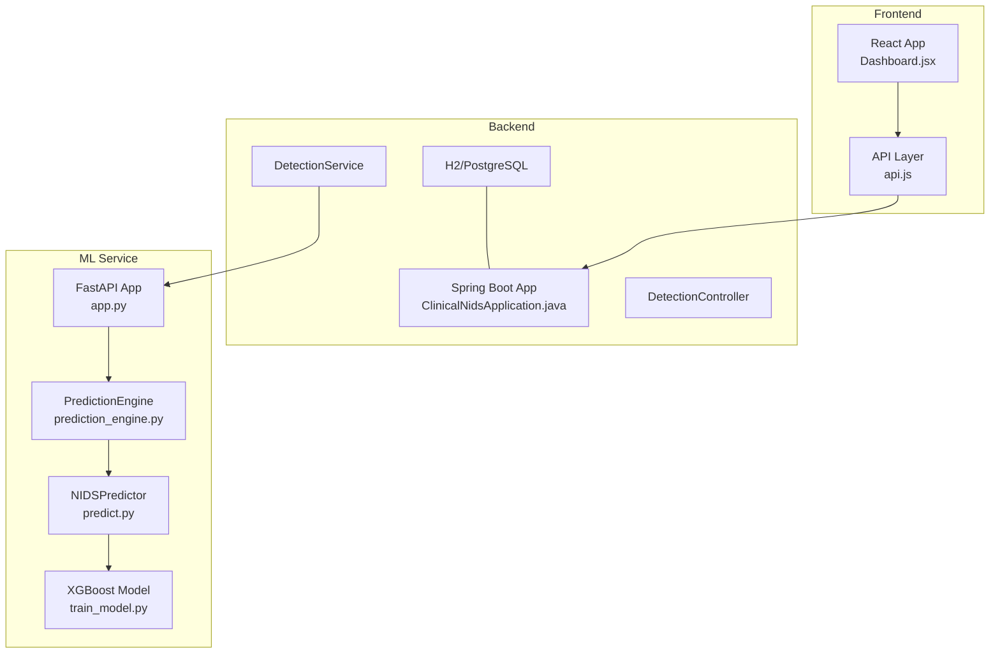
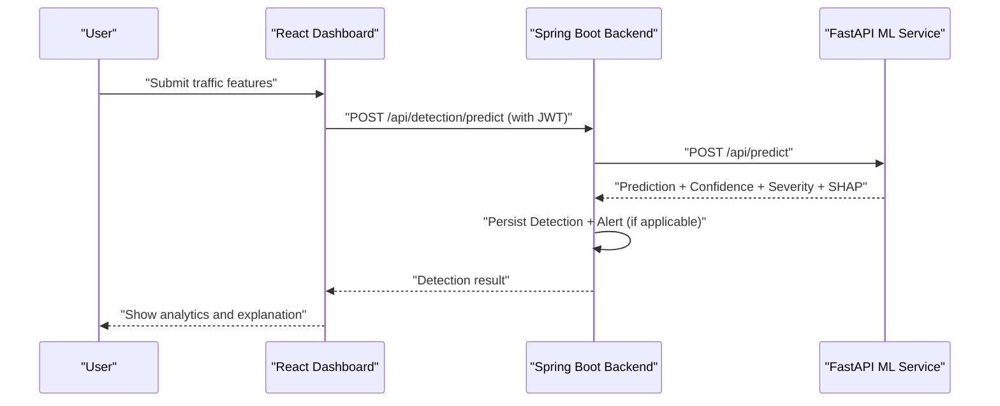
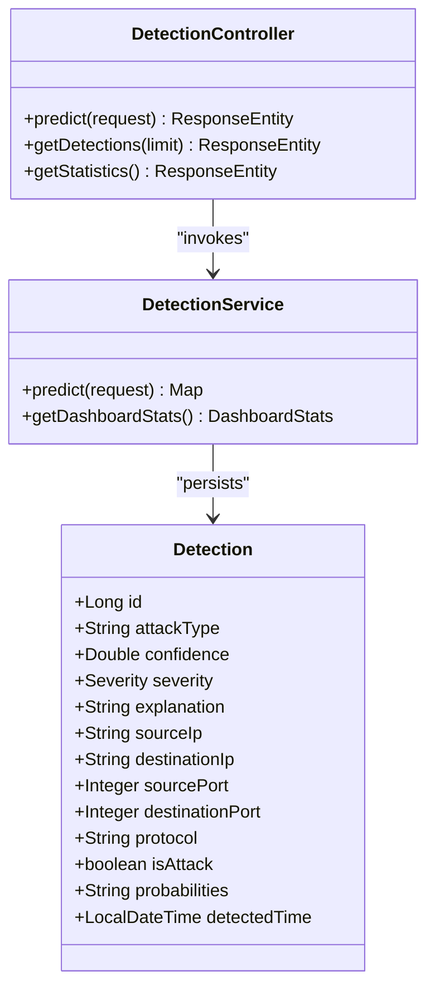
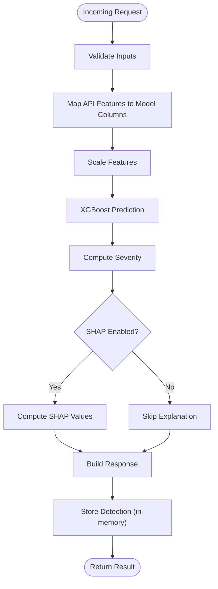
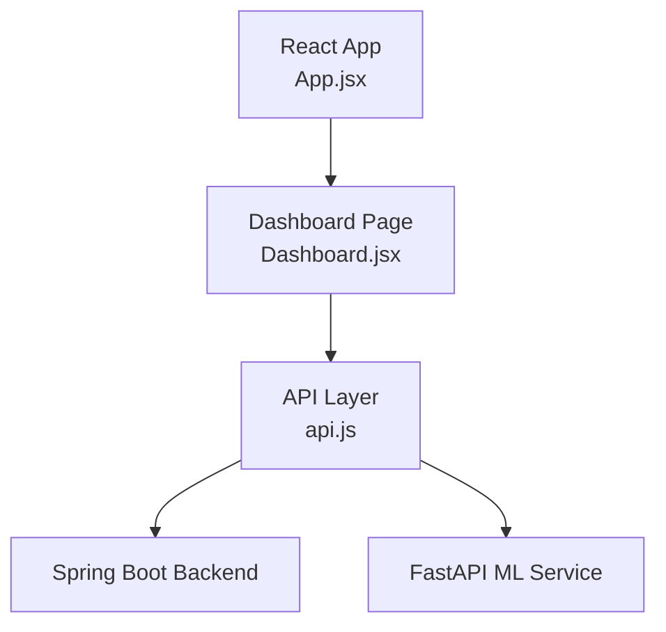
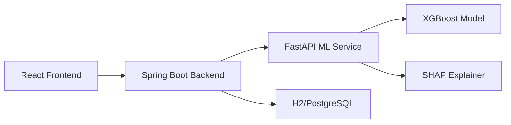

# Project Overview

<cite>
**Referenced Files in This Document**
- [ClinicalNidsApplication.java](file://Mini_Project/backend/src/main/java/com/clinicalnids/backend/ClinicalNidsApplication.java)
- [application.properties](file://Mini_Project/backend/src/main/resources/application.properties)
- [DetectionController.java](file://Mini_Project/backend/src/main/java/com/clinicalnids/backend/controller/DetectionController.java)
- [DetectionService.java](file://Mini_Project/backend/src/main/java/com/clinicalnids/backend/service/DetectionService.java)
- [Detection.java](file://Mini_Project/backend/src/main/java/com/clinicalnids/backend/entity/Detection.java)
- [app.py](file://Mini_Project/ml-service/app.py)
- [prediction_engine.py](file://Mini_Project/ml-service/prediction_engine.py)
- [predict.py](file://Mini_Project/ml-service/predict.py)
- [train_model.py](file://Mini_Project/ml-service/train_model.py)
- [App.jsx](file://Mini_Project/clinical-nids-dashboard/src/App.jsx)
- [Dashboard.jsx](file://Mini_Project/clinical-nids-dashboard/src/pages/Dashboard.jsx)
- [api.js](file://Mini_Project/clinical-nids-dashboard/src/data/api.js)
- [package.json](file://Mini_Project/clinical-nids-dashboard/package.json)
</cite>

## Table of Contents
1. [Introduction](#introduction)
2. [Project Structure](#project-structure)
3. [Core Components](#core-components)
4. [Architecture Overview](#architecture-overview)
5. [Detailed Component Analysis](#detailed-component-analysis)
6. [Dependency Analysis](#dependency-analysis)
7. [Performance Considerations](#performance-considerations)
8. [Troubleshooting Guide](#troubleshooting-guide)
9. [Conclusion](#conclusion)
10. [Appendices](#appendices)

## Introduction
This document presents a comprehensive overview of the AI-Based Clinical Network Intrusion Detection System (NIDS). The system is designed specifically for healthcare environments, combining real-time network traffic monitoring with explainable AI to detect and classify cyber threats. It integrates three primary components:
- A Spring Boot backend that authenticates users, orchestrates detection requests, persists results, and exposes analytics.
- A FastAPI machine learning (ML) service that performs XGBoost-based predictions, SHAP explainability, and dataset analysis.
- A React-based frontend dashboard that visualizes security analytics, alerts, and explainable insights.

The system emphasizes clinical network security by providing actionable insights, severity-aware alerts, and transparent explanations for AI-driven decisions.

## Project Structure
The repository follows a modular, microservices-style layout:
- backend: Spring Boot REST API with security, persistence, and orchestration.
- ml-service: FastAPI service implementing the ML pipeline, XGBoost inference, and SHAP explanations.
- clinical-nids-dashboard: React SPA for interactive analytics and visualization.

**Diagram sources**
- [ClinicalNidsApplication.java:1-12](file://Mini_Project/backend/src/main/java/com/clinicalnids/backend/ClinicalNidsApplication.java#L1-L12)
- [DetectionController.java:1-51](file://Mini_Project/backend/src/main/java/com/clinicalnids/backend/controller/DetectionController.java#L1-L51)
- [DetectionService.java:1-159](file://Mini_Project/backend/src/main/java/com/clinicalnids/backend/service/DetectionService.java#L1-L159)
- [app.py:1-1199](file://Mini_Project/ml-service/app.py#L1-L1199)
- [prediction_engine.py:1-413](file://Mini_Project/ml-service/prediction_engine.py#L1-L413)
- [predict.py:1-179](file://Mini_Project/ml-service/predict.py#L1-L179)
- [train_model.py:1-427](file://Mini_Project/ml-service/train_model.py#L1-L427)

**Section sources**
- [ClinicalNidsApplication.java:1-12](file://Mini_Project/backend/src/main/java/com/clinicalnids/backend/ClinicalNidsApplication.java#L1-L12)
- [application.properties:1-46](file://Mini_Project/backend/src/main/resources/application.properties#L1-L46)
- [package.json:1-31](file://Mini_Project/clinical-nids-dashboard/package.json#L1-L31)

## Core Components
- Backend API (Spring Boot):
  - Authentication and authorization with JWT.
  - Orchestration of detection requests to the ML service.
  - Persistence of detections, alerts, and network traffic.
  - Dashboard statistics aggregation.
- ML Service (FastAPI):
  - XGBoost-based classification of network flows.
  - SHAP explanations for interpretability.
  - Dataset upload, batch analysis, and report generation.
  - Simulation mode for future live traffic integration.
- Frontend Dashboard (React):
  - Secure login and navigation.
  - Real-time and historical analytics visualizations.
  - Dataset management and analysis result views.
  - Interactive charts powered by Recharts.

**Section sources**
- [DetectionController.java:1-51](file://Mini_Project/backend/src/main/java/com/clinicalnids/backend/controller/DetectionController.java#L1-L51)
- [DetectionService.java:1-159](file://Mini_Project/backend/src/main/java/com/clinicalnids/backend/service/DetectionService.java#L1-L159)
- [Detection.java:1-54](file://Mini_Project/backend/src/main/java/com/clinicalnids/backend/entity/Detection.java#L1-L54)
- [app.py:1-1199](file://Mini_Project/ml-service/app.py#L1-L1199)
- [prediction_engine.py:1-413](file://Mini_Project/ml-service/prediction_engine.py#L1-L413)
- [predict.py:1-179](file://Mini_Project/ml-service/predict.py#L1-L179)
- [train_model.py:1-427](file://Mini_Project/ml-service/train_model.py#L1-L427)
- [Dashboard.jsx:1-328](file://Mini_Project/clinical-nids-dashboard/src/pages/Dashboard.jsx#L1-L328)
- [api.js:1-236](file://Mini_Project/clinical-nids-dashboard/src/data/api.js#L1-L236)

## Architecture Overview
The system employs a microservices architecture:
- The React frontend communicates with the Spring Boot backend over HTTPS with JWT authentication.
- The backend forwards detection requests to the FastAPI ML service.
- The ML service encapsulates the trained XGBoost model and SHAP explainer, returning predictions enriched with severity and feature importance.
- The backend persists detections and generates dashboard statistics.

**Diagram sources**
- [DetectionService.java:46-137](file://Mini_Project/backend/src/main/java/com/clinicalnids/backend/service/DetectionService.java#L46-L137)
- [app.py:440-464](file://Mini_Project/ml-service/app.py#L440-L464)
- [api.js:45-53](file://Mini_Project/clinical-nids-dashboard/src/data/api.js#L45-L53)

## Detailed Component Analysis

### Backend API (Spring Boot)
- Responsibilities:
  - Authentication and authorization.
  - Delegation of detection requests to the ML service.
  - Persistence of detections, alerts, and network traffic.
  - Aggregation of dashboard statistics.
- Key endpoints:
  - POST /api/detection/predict: Forward features to ML service and persist results.
  - GET /api/detections: Retrieve recent detections.
  - GET /api/dashboard/statistics: Aggregate security metrics.
- Data model:
  - Detection entity captures attack type, confidence, severity, explanation, and traffic metadata.

**Diagram sources**
- [Detection.java:1-54](file://Mini_Project/backend/src/main/java/com/clinicalnids/backend/entity/Detection.java#L1-L54)
- [DetectionService.java:1-159](file://Mini_Project/backend/src/main/java/com/clinicalnids/backend/service/DetectionService.java#L1-L159)
- [DetectionController.java:1-51](file://Mini_Project/backend/src/main/java/com/clinicalnids/backend/controller/DetectionController.java#L1-L51)

**Section sources**
- [DetectionController.java:1-51](file://Mini_Project/backend/src/main/java/com/clinicalnids/backend/controller/DetectionController.java#L1-L51)
- [DetectionService.java:1-159](file://Mini_Project/backend/src/main/java/com/clinicalnids/backend/service/DetectionService.java#L1-L159)
- [Detection.java:1-54](file://Mini_Project/backend/src/main/java/com/clinicalnids/backend/entity/Detection.java#L1-L54)
- [application.properties:1-46](file://Mini_Project/backend/src/main/resources/application.properties#L1-L46)

### ML Service (FastAPI)
- Responsibilities:
  - Load XGBoost model and SHAP explainer.
  - Single and batch predictions from network flow features.
  - Dataset upload, bulk analysis, and report generation.
  - Dashboard statistics aggregation for frontend.
- Key endpoints:
  - POST /api/predict: Single flow prediction with SHAP explanation.
  - POST /api/predict/batch: Batch prediction.
  - POST /api/upload: Upload .parquet dataset.
  - POST /api/analyze/{id}: Analyze dataset (validation, preprocessing, ML, SHAP, aggregation).
  - GET /api/dashboard/statistics: Aggregated metrics for dashboard.
- Prediction pipeline:
  - Feature mapping from API schema to model columns.
  - Scaling and prediction via XGBoost.
  - Severity computation and SHAP feature importance extraction.

**Diagram sources**
- [app.py:240-464](file://Mini_Project/ml-service/app.py#L240-L464)
- [prediction_engine.py:94-110](file://Mini_Project/ml-service/prediction_engine.py#L94-L110)
- [predict.py:61-110](file://Mini_Project/ml-service/predict.py#L61-L110)

**Section sources**
- [app.py:1-1199](file://Mini_Project/ml-service/app.py#L1-L1199)
- [prediction_engine.py:1-413](file://Mini_Project/ml-service/prediction_engine.py#L1-L413)
- [predict.py:1-179](file://Mini_Project/ml-service/predict.py#L1-L179)

### Frontend Dashboard (React)
- Responsibilities:
  - User authentication and navigation.
  - Fetch datasets, analysis results, and dashboard statistics.
  - Visualize attack distributions, severity trends, and AI feature importance.
- Key routes:
  - /dashboard: Overview and analytics.
  - /upload: Dataset upload and analysis initiation.
  - /analysis/:datasetId: Detailed analysis results.
  - /alerts: Active and pending alerts.
  - /monitoring: Live traffic monitoring (placeholder).
- Data integration:
  - Uses api.js to communicate with both Spring Boot backend and FastAPI ML service.

**Diagram sources**
- [App.jsx:1-32](file://Mini_Project/clinical-nids-dashboard/src/App.jsx#L1-L32)
- [Dashboard.jsx:1-328](file://Mini_Project/clinical-nids-dashboard/src/pages/Dashboard.jsx#L1-L328)
- [api.js:1-236](file://Mini_Project/clinical-nids-dashboard/src/data/api.js#L1-L236)

**Section sources**
- [App.jsx:1-32](file://Mini_Project/clinical-nids-dashboard/src/App.jsx#L1-L32)
- [Dashboard.jsx:1-328](file://Mini_Project/clinical-nids-dashboard/src/pages/Dashboard.jsx#L1-L328)
- [api.js:1-236](file://Mini_Project/clinical-nids-dashboard/src/data/api.js#L1-L236)
- [package.json:1-31](file://Mini_Project/clinical-nids-dashboard/package.json#L1-L31)

## Dependency Analysis
- Backend depends on:
  - Spring Boot for web framework and security.
  - H2 in-memory database for development; PostgreSQL for production.
  - WebClient to call the ML service.
- ML service depends on:
  - XGBoost for classification.
  - SHAP for explainability.
  - Pandas and NumPy for data processing.
- Frontend depends on:
  - React and Recharts for visualization.
  - TailwindCSS for styling.

**Diagram sources**
- [application.properties:1-46](file://Mini_Project/backend/src/main/resources/application.properties#L1-L46)
- [app.py:1-1199](file://Mini_Project/ml-service/app.py#L1-L1199)
- [predict.py:1-179](file://Mini_Project/ml-service/predict.py#L1-L179)
- [Dashboard.jsx:1-328](file://Mini_Project/clinical-nids-dashboard/src/pages/Dashboard.jsx#L1-L328)

**Section sources**
- [application.properties:1-46](file://Mini_Project/backend/src/main/resources/application.properties#L1-L46)
- [package.json:1-31](file://Mini_Project/clinical-nids-dashboard/package.json#L1-L31)

## Performance Considerations
- Model inference:
  - Use scaled features and ordered feature vectors to minimize preprocessing overhead.
  - Batch predictions where feasible to improve throughput.
- Data handling:
  - Limit in-memory detection storage and cap history size to control memory usage.
- Frontend:
  - Paginate and lazy-load analytics data to reduce initial payload sizes.
- Scalability:
  - Replace in-memory detection store with persistent storage for production.
  - Deploy backend and ML service behind load balancers and autoscaling groups.

[No sources needed since this section provides general guidance]

## Troubleshooting Guide
- Authentication failures:
  - Verify JWT secret and expiration settings in backend configuration.
  - Confirm frontend stores and sends the bearer token correctly.
- ML service unavailability:
  - Check ML service health endpoint and model loading logs.
  - Ensure model artifacts are present in the model directory.
- Dataset analysis errors:
  - Validate .parquet file structure and required feature columns.
  - Review preprocessing steps for missing values and duplicates.
- Dashboard data gaps:
  - Confirm backend endpoints are reachable and CORS settings allow the frontend origin.

**Section sources**
- [application.properties:28-46](file://Mini_Project/backend/src/main/resources/application.properties#L28-L46)
- [api.js:11-19](file://Mini_Project/clinical-nids-dashboard/src/data/api.js#L11-L19)
- [app.py:418-426](file://Mini_Project/ml-service/app.py#L418-L426)

## Conclusion
The AI-Based Clinical Network Intrusion Detection System integrates a secure, scalable backend, an explainable ML service, and an interactive dashboard tailored for healthcare environments. By leveraging XGBoost and SHAP, it delivers accurate threat detection with transparent reasoning, enabling security teams to act confidently on real-time and historical network traffic insights.

[No sources needed since this section summarizes without analyzing specific files]

## Appendices

### Practical Use Cases in Healthcare Environments
- Real-time monitoring of hospital network segments to detect DoS, Brute Force, PortScan, Botnet, and Infiltration attempts.
- Post-incident analysis of captured traffic datasets to identify attack vectors and prioritize remediation.
- Compliance reporting using structured analysis reports generated from dataset analyses.
- Interactive training and awareness programs using dashboard visualizations to demonstrate attack patterns and feature importance.

[No sources needed since this section provides general guidance]