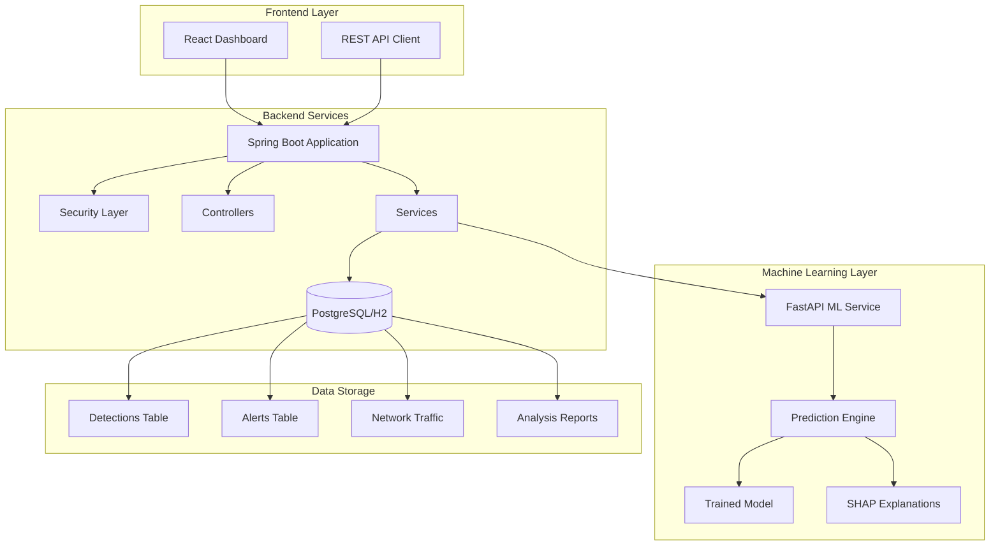
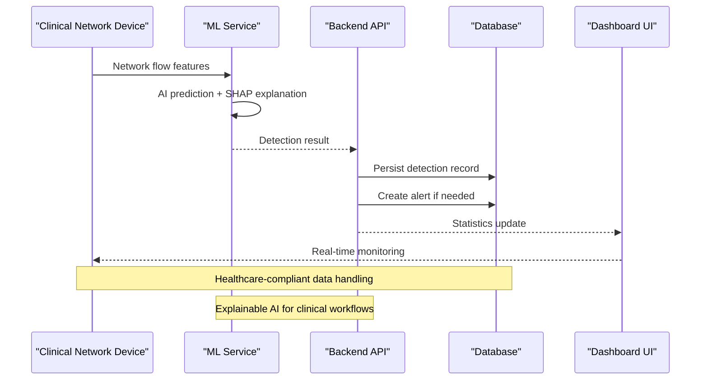
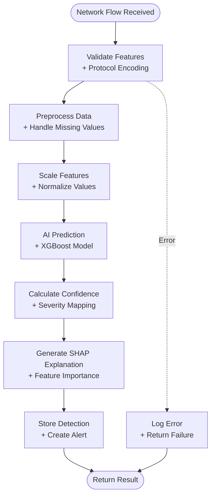
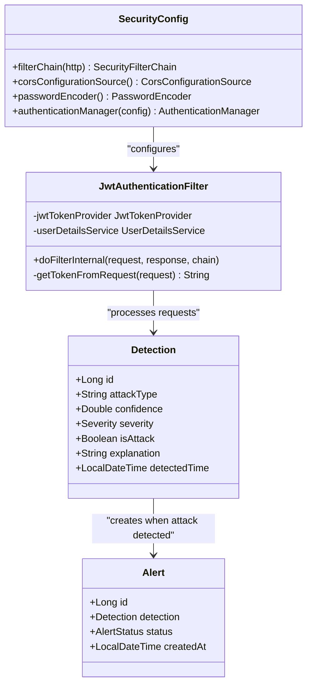
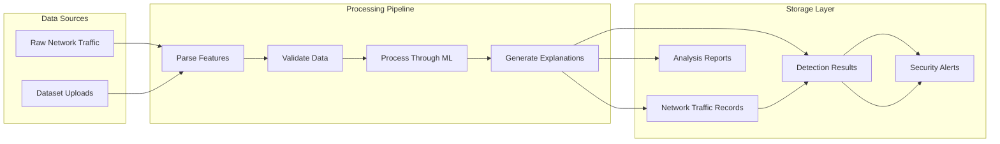
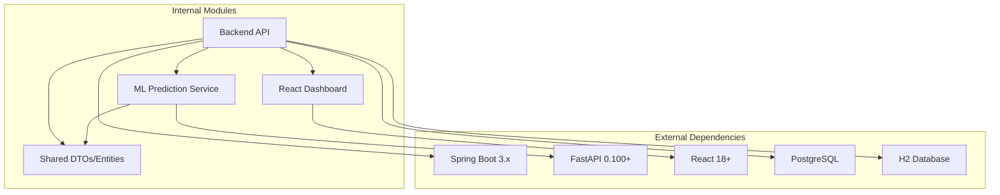

# System Introduction

<cite>
**Referenced Files in This Document**
- [README.md](file://README.md)
- [ClinicalNidsApplication.java](file://Mini_Project/backend/src/main/java/com/clinicalnids/backend/ClinicalNidsApplication.java)
- [application.properties](file://Mini_Project/backend/src/main/resources/application.properties)
- [SecurityConfig.java](file://Mini_Project/backend/src/main/java/com/clinicalnids/backend/config/SecurityConfig.java)
- [JwtAuthenticationFilter.java](file://Mini_Project/backend/src/main/java/com/clinicalnids/backend/security/JwtAuthenticationFilter.java)
- [DetectionController.java](file://Mini_Project/backend/src/main/java/com/clinicalnids/backend/controller/DetectionController.java)
- [DetectionService.java](file://Mini_Project/backend/src/main/java/com/clinicalnids/backend/service/DetectionService.java)
- [Detection.java](file://Mini_Project/backend/src/main/java/com/clinicalnids/backend/entity/Detection.java)
- [Alert.java](file://Mini_Project/backend/src/main/java/com/clinicalnids/backend/entity/Alert.java)
- [app.py](file://Mini_Project/ml-service/app.py)
- [prediction_engine.py](file://Mini_Project/ml-service/prediction_engine.py)
- [Dashboard.jsx](file://Mini_Project/clinical-nids-dashboard/src/pages/Dashboard.jsx)
- [mockData.js](file://Mini_Project/clinical-nids-dashboard/src/data/mockData.js)
</cite>

## Table of Contents
1. [Introduction](#introduction)
2. [Project Structure](#project-structure)
3. [Core Components](#core-components)
4. [Architecture Overview](#architecture-overview)
5. [Detailed Component Analysis](#detailed-component-analysis)
6. [Dependency Analysis](#dependency-analysis)
7. [Performance Considerations](#performance-considerations)
8. [Troubleshooting Guide](#troubleshooting-guide)
9. [Conclusion](#conclusion)

## Introduction
The AI-Based Clinical Network Intrusion Detection System (Clinical-NIDS) is a healthcare-focused cybersecurity platform designed to protect clinical networks from evolving cyber threats. It combines real-time network traffic analysis with explainable AI to deliver accurate, actionable insights for medical device networks and hospital IT infrastructures.

The system addresses critical challenges in healthcare cybersecurity:
- Real-time monitoring of high-volume, low-latency network traffic
- Accurate classification of attacks against medical devices and clinical applications
- Transparent, interpretable AI decisions to support clinical security workflows
- Compliance-ready architecture for healthcare environments

Target audience:
- Healthcare IT administrators responsible for clinical network security
- Cybersecurity analysts investigating network anomalies and incidents
- Medical device coordinators managing connected healthcare equipment
- Compliance officers ensuring regulatory adherence

## Project Structure
The system follows a modular microservices architecture with three primary components:

**Diagram sources**
- [ClinicalNidsApplication.java:1-12](file://Mini_Project/backend/src/main/java/com/clinicalnids/backend/ClinicalNidsApplication.java#L1-L12)
- [application.properties:1-46](file://Mini_Project/backend/src/main/resources/application.properties#L1-L46)
- [app.py:1-800](file://Mini_Project/ml-service/app.py#L1-L800)

**Section sources**
- [ClinicalNidsApplication.java:1-12](file://Mini_Project/backend/src/main/java/com/clinicalnids/backend/ClinicalNidsApplication.java#L1-L12)
- [application.properties:1-46](file://Mini_Project/backend/src/main/resources/application.properties#L1-L46)

## Core Components
The system comprises four fundamental components working in concert:

### Backend API Service
The Spring Boot backend provides:
- RESTful APIs for traffic analysis and alert management
- JWT-based authentication and authorization
- Database persistence for detections and alerts
- Integration with the machine learning service

### Machine Learning Service
The FastAPI-based ML service offers:
- Real-time prediction capabilities for network flows
- Comprehensive dataset analysis with SHAP explanations
- Model performance reporting and risk assessment
- Simulation framework for traffic testing

### Frontend Dashboard
The React-based interface delivers:
- Interactive visualizations of network activity
- Attack distribution analytics
- AI feature importance insights
- Dataset management and analysis workflows

### Data Management
Structured storage for:
- Network traffic records with timestamps
- Detection results with confidence scores
- Security alerts with severity classifications
- Analysis reports for compliance documentation

**Section sources**
- [DetectionController.java:1-51](file://Mini_Project/backend/src/main/java/com/clinicalnids/backend/controller/DetectionController.java#L1-L51)
- [DetectionService.java:1-159](file://Mini_Project/backend/src/main/java/com/clinicalnids/backend/service/DetectionService.java#L1-L159)
- [app.py:1-800](file://Mini_Project/ml-service/app.py#L1-L800)
- [Dashboard.jsx:1-328](file://Mini_Project/clinical-nids-dashboard/src/pages/Dashboard.jsx#L1-L328)

## Architecture Overview
The system implements a distributed architecture optimized for healthcare environments:

**Diagram sources**
- [DetectionService.java:46-137](file://Mini_Project/backend/src/main/java/com/clinicalnids/backend/service/DetectionService.java#L46-L137)
- [app.py:439-464](file://Mini_Project/ml-service/app.py#L439-L464)

The architecture addresses healthcare-specific requirements:
- HIPAA-compliant data handling and audit trails
- Real-time processing for critical medical device networks
- Explainable AI to support clinical decision-making
- Scalable infrastructure for hospital-wide deployments

## Detailed Component Analysis

### AI Prediction Pipeline
The core prediction engine processes network traffic through multiple stages:

**Diagram sources**
- [prediction_engine.py:115-366](file://Mini_Project/ml-service/prediction_engine.py#L115-L366)
- [DetectionService.java:47-137](file://Mini_Project/backend/src/main/java/com/clinicalnids/backend/service/DetectionService.java#L47-L137)

### Security and Compliance Framework
The system implements comprehensive security measures:

**Diagram sources**
- [SecurityConfig.java:25-73](file://Mini_Project/backend/src/main/java/com/clinicalnids/backend/config/SecurityConfig.java#L25-L73)
- [JwtAuthenticationFilter.java:18-56](file://Mini_Project/backend/src/main/java/com/clinicalnids/backend/security/JwtAuthenticationFilter.java#L18-L56)
- [Detection.java:13-54](file://Mini_Project/backend/src/main/java/com/clinicalnids/backend/entity/Detection.java#L13-L54)
- [Alert.java:13-44](file://Mini_Project/backend/src/main/java/com/clinicalnids/backend/entity/Alert.java#L13-L44)

**Section sources**
- [SecurityConfig.java:25-73](file://Mini_Project/backend/src/main/java/com/clinicalnids/backend/config/SecurityConfig.java#L25-L73)
- [JwtAuthenticationFilter.java:18-56](file://Mini_Project/backend/src/main/java/com/clinicalnids/backend/security/JwtAuthenticationFilter.java#L18-L56)
- [Detection.java:13-54](file://Mini_Project/backend/src/main/java/com/clinicalnids/backend/entity/Detection.java#L13-L54)
- [Alert.java:13-44](file://Mini_Project/backend/src/main/java/com/clinicalnids/backend/entity/Alert.java#L13-L44)

### Data Flow and Processing
The system handles data through well-defined pipelines:

**Diagram sources**
- [app.py:253-347](file://Mini_Project/ml-service/app.py#L253-L347)
- [prediction_engine.py:115-366](file://Mini_Project/ml-service/prediction_engine.py#L115-L366)
- [DetectionService.java:71-125](file://Mini_Project/backend/src/main/java/com/clinicalnids/backend/service/DetectionService.java#L71-L125)

**Section sources**
- [app.py:253-347](file://Mini_Project/ml-service/app.py#L253-L347)
- [prediction_engine.py:115-366](file://Mini_Project/ml-service/prediction_engine.py#L115-L366)
- [DetectionService.java:71-125](file://Mini_Project/backend/src/main/java/com/clinicalnids/backend/service/DetectionService.java#L71-L125)

## Dependency Analysis
The system exhibits clear separation of concerns with minimal coupling between components:

**Diagram sources**
- [application.properties:15-26](file://Mini_Project/backend/src/main/resources/application.properties#L15-L26)
- [app.py:40-44](file://Mini_Project/ml-service/app.py#L40-L44)

Key dependency characteristics:
- Loose coupling between backend and ML service via REST API
- Shared data models between services for consistency
- Configurable database backend (development H2, production PostgreSQL)
- Modular frontend architecture supporting scalability

**Section sources**
- [application.properties:15-26](file://Mini_Project/backend/src/main/resources/application.properties#L15-L26)
- [app.py:40-44](file://Mini_Project/ml-service/app.py#L40-L44)

## Performance Considerations
The system is optimized for healthcare environments with specific performance requirements:

- **Real-time processing**: ML predictions designed for sub-second response times
- **Memory efficiency**: In-memory caching for frequently accessed detection results
- **Scalable architecture**: Microservices enabling independent scaling of components
- **Database optimization**: Indexing strategies for high-throughput detection storage
- **Network efficiency**: Compressed feature transmission and batch processing capabilities

## Troubleshooting Guide
Common operational issues and resolutions:

### Authentication and Authorization
- Verify JWT configuration in application properties
- Check CORS settings for frontend integration
- Validate user credentials and role assignments

### ML Service Integration
- Confirm ML service availability at configured URL
- Monitor model loading and prediction performance
- Validate feature mapping between API and model expectations

### Database Connectivity
- Switch from H2 development to PostgreSQL for production
- Verify connection pooling and timeout configurations
- Monitor database performance under load

**Section sources**
- [application.properties:28-46](file://Mini_Project/backend/src/main/resources/application.properties#L28-L46)
- [SecurityConfig.java:34-49](file://Mini_Project/backend/src/main/java/com/clinicalnids/backend/config/SecurityConfig.java#L34-L49)

## Conclusion
Clinical-NIDS represents a comprehensive solution for healthcare cybersecurity, combining advanced AI capabilities with healthcare-specific requirements. The system addresses critical gaps in traditional network intrusion detection by providing:

- Real-time monitoring tailored for clinical environments
- Explainable AI that supports clinical workflows and decision-making
- Healthcare-compliant architecture meeting regulatory requirements
- Scalable infrastructure for hospital-wide deployments

The modular design enables seamless integration with existing healthcare IT systems while maintaining the security and reliability essential for protecting patient care networks. By focusing on accuracy, transparency, and compliance, Clinical-NIDS delivers a practical solution for modern healthcare cybersecurity challenges.