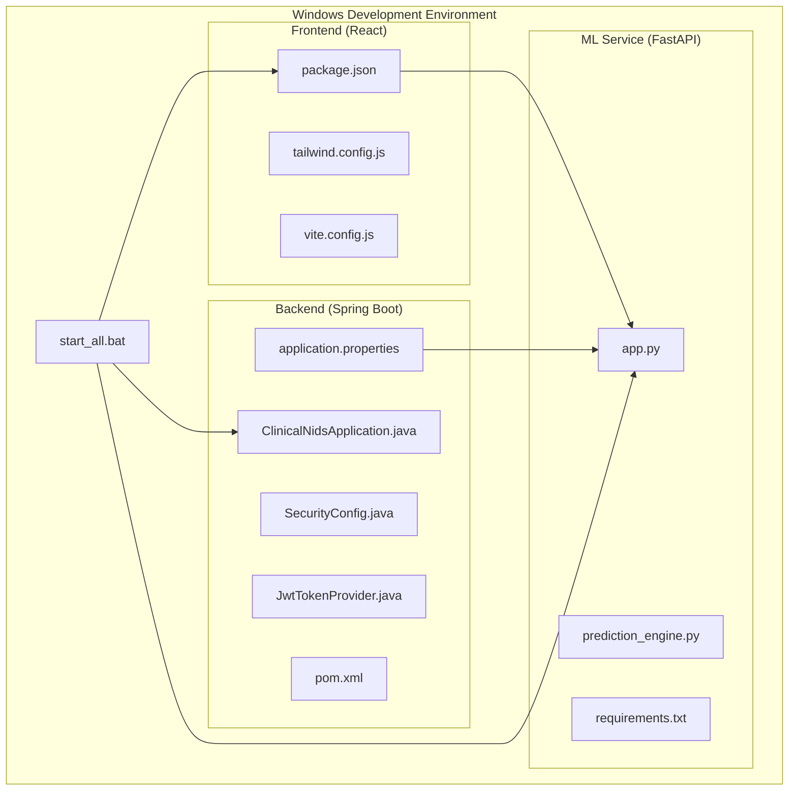
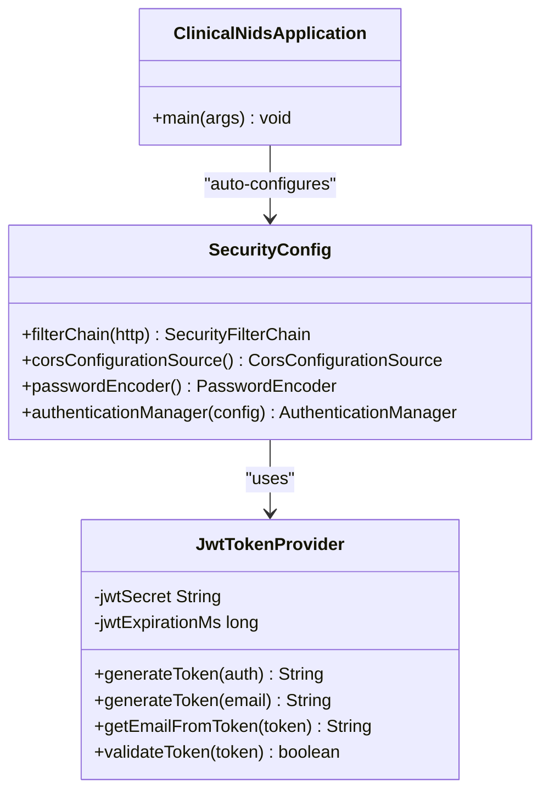
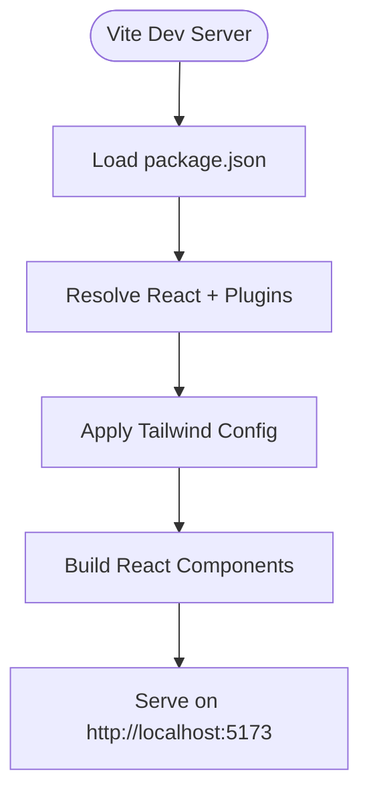
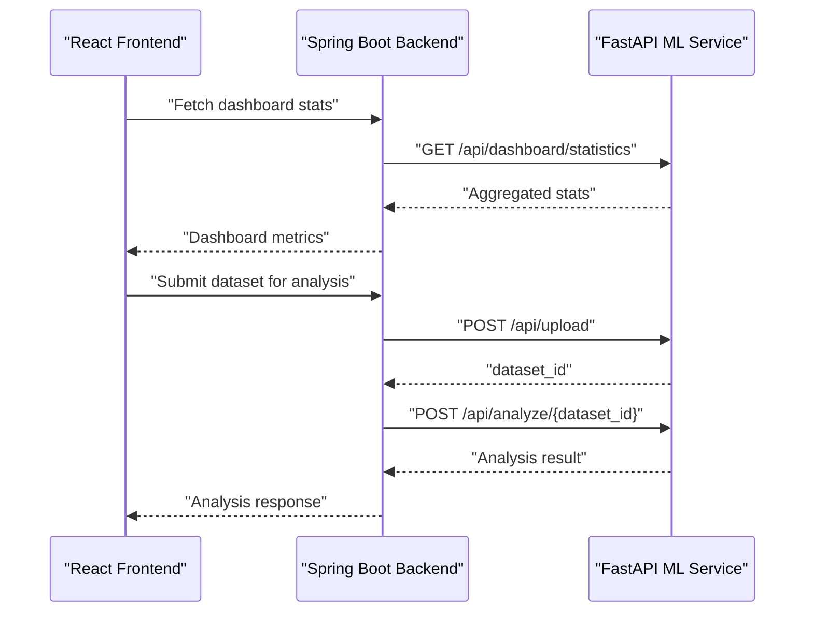
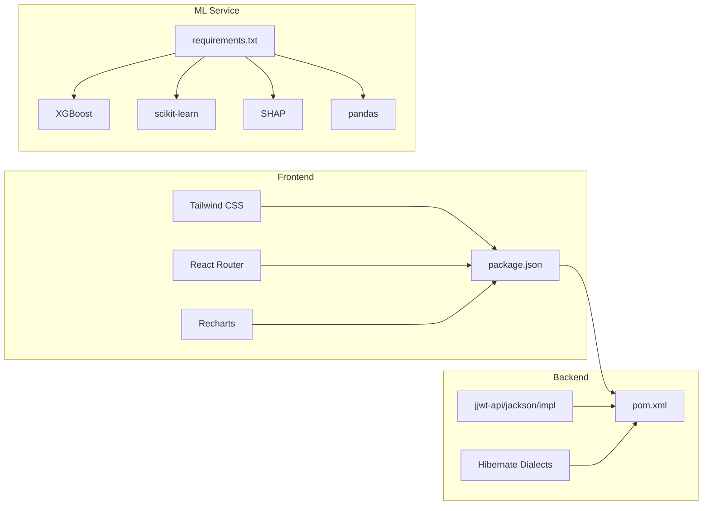

# Technology Stack

<cite>
**Referenced Files in This Document**
- [pom.xml](file://Mini_Project/backend/pom.xml)
- [application.properties](file://Mini_Project/backend/src/main/resources/application.properties)
- [ClinicalNidsApplication.java](file://Mini_Project/backend/src/main/java/com/clinicalnids/backend/ClinicalNidsApplication.java)
- [SecurityConfig.java](file://Mini_Project/backend/src/main/java/com/clinicalnids/backend/config/SecurityConfig.java)
- [JwtTokenProvider.java](file://Mini_Project/backend/src/main/java/com/clinicalnids/backend/security/JwtTokenProvider.java)
- [package.json](file://Mini_Project/clinical-nids-dashboard/package.json)
- [tailwind.config.js](file://Mini_Project/clinical-nids-dashboard/tailwind.config.js)
- [vite.config.js](file://Mini_Project/clinical-nids-dashboard/vite.config.js)
- [requirements.txt](file://Mini_Project/ml-service/requirements.txt)
- [app.py](file://Mini_Project/ml-service/app.py)
- [prediction_engine.py](file://Mini_Project/ml-service/prediction_engine.py)
- [start_all.bat](file://Mini_Project/start_all.bat)
</cite>

## Table of Contents
1. [Introduction](#introduction)
2. [Project Structure](#project-structure)
3. [Core Components](#core-components)
4. [Architecture Overview](#architecture-overview)
5. [Detailed Component Analysis](#detailed-component-analysis)
6. [Dependency Analysis](#dependency-analysis)
7. [Performance Considerations](#performance-considerations)
8. [Troubleshooting Guide](#troubleshooting-guide)
9. [Conclusion](#conclusion)
10. [Appendices](#appendices)

## Introduction
This document provides comprehensive technology stack documentation for the AI-Based Clinical NIDS system. It covers backend technologies (Spring Boot 3.3.1, Java 17, JWT authentication, PostgreSQL/H2 database, and WebFlux reactive programming), frontend technologies (React 18.3.1, Tailwind CSS, React Router, and Recharts), and the machine learning service stack (FastAPI 0.109.0, XGBoost for ensemble learning, SHAP for explainability, scikit-learn, and pandas for data processing). It also includes dependency versions, licensing considerations, technology selection rationale, development tools/build systems, deployment technologies, cross-platform compatibility, and Windows development environment requirements.

## Project Structure
The project is organized into three primary components:
- Backend API built with Spring Boot 3.3.1 and Java 17
- Frontend dashboard built with React 18.3.1, Vite, Tailwind CSS, and Recharts
- Machine learning service built with FastAPI 0.109.0 and Python libraries



**Diagram sources**
- [ClinicalNidsApplication.java:1-12](file://Mini_Project/backend/src/main/java/com/clinicalnids/backend/ClinicalNidsApplication.java#L1-L12)
- [SecurityConfig.java:1-73](file://Mini_Project/backend/src/main/java/com/clinicalnids/backend/config/SecurityConfig.java#L1-L73)
- [JwtTokenProvider.java:1-71](file://Mini_Project/backend/src/main/java/com/clinicalnids/backend/security/JwtTokenProvider.java#L1-L71)
- [pom.xml:1-125](file://Mini_Project/backend/pom.xml#L1-L125)
- [application.properties:1-46](file://Mini_Project/backend/src/main/resources/application.properties#L1-L46)
- [package.json:1-31](file://Mini_Project/clinical-nids-dashboard/package.json#L1-L31)
- [tailwind.config.js:1-49](file://Mini_Project/clinical-nids-dashboard/tailwind.config.js#L1-L49)
- [vite.config.js:1-7](file://Mini_Project/clinical-nids-dashboard/vite.config.js#L1-L7)
- [app.py:1-800](file://Mini_Project/ml-service/app.py#L1-L800)
- [prediction_engine.py:1-200](file://Mini_Project/ml-service/prediction_engine.py#L1-L200)
- [requirements.txt:1-13](file://Mini_Project/ml-service/requirements.txt#L1-L13)
- [start_all.bat:1-59](file://Mini_Project/start_all.bat#L1-L59)

**Section sources**
- [pom.xml:1-125](file://Mini_Project/backend/pom.xml#L1-L125)
- [application.properties:1-46](file://Mini_Project/backend/src/main/resources/application.properties#L1-L46)
- [ClinicalNidsApplication.java:1-12](file://Mini_Project/backend/src/main/java/com/clinicalnids/backend/ClinicalNidsApplication.java#L1-L12)
- [SecurityConfig.java:1-73](file://Mini_Project/backend/src/main/java/com/clinicalnids/backend/config/SecurityConfig.java#L1-L73)
- [JwtTokenProvider.java:1-71](file://Mini_Project/backend/src/main/java/com/clinicalnids/backend/security/JwtTokenProvider.java#L1-L71)
- [package.json:1-31](file://Mini_Project/clinical-nids-dashboard/package.json#L1-L31)
- [tailwind.config.js:1-49](file://Mini_Project/clinical-nids-dashboard/tailwind.config.js#L1-L49)
- [vite.config.js:1-7](file://Mini_Project/clinical-nids-dashboard/vite.config.js#L1-L7)
- [requirements.txt:1-13](file://Mini_Project/ml-service/requirements.txt#L1-L13)
- [app.py:1-800](file://Mini_Project/ml-service/app.py#L1-L800)
- [prediction_engine.py:1-200](file://Mini_Project/ml-service/prediction_engine.py#L1-L200)
- [start_all.bat:1-59](file://Mini_Project/start_all.bat#L1-L59)

## Core Components
This section documents the core technologies and their roles in the system.

- Backend (Spring Boot 3.3.1, Java 17)
  - Core framework: Spring Boot 3.3.1 parent POM
  - Reactive web: Spring WebFlux starter
  - Persistence: Spring Data JPA with Hibernate
  - Security: Spring Security with JWT authentication
  - Validation: Bean Validation
  - Database drivers: PostgreSQL (runtime) and H2 (development)
  - Utilities: Lombok, OpenPDF for reports
  - Build: Spring Boot Maven Plugin

- Frontend (React 18.3.1, Tailwind CSS, React Router, Recharts)
  - Runtime: React 18.3.1 and React DOM 18.3.1
  - Routing: React Router DOM 6.x
  - Visualization: Recharts 2.x
  - Build tooling: Vite 5.x with React plugin
  - Styling: Tailwind CSS 3.x, PostCSS, Autoprefixer
  - Types: TypeScript types for React and React DOM

- Machine Learning Service (FastAPI 0.109.0, XGBoost, SHAP, scikit-learn, pandas)
  - API framework: FastAPI 0.109.0 with Uvicorn
  - Data processing: pandas, NumPy
  - ML: scikit-learn, XGBoost, imbalanced-learn
  - Explainability: SHAP
  - Serialization: PyArrow, joblib, python-multipart, Pydantic
  - Model artifacts: JSON reports and feature names

- Development Tools and Scripts
  - Windows batch script orchestrates startup of ML service, React frontend, and Spring Boot backend

**Section sources**
- [pom.xml:20-106](file://Mini_Project/backend/pom.xml#L20-L106)
- [application.properties:1-46](file://Mini_Project/backend/src/main/resources/application.properties#L1-L46)
- [package.json:11-26](file://Mini_Project/clinical-nids-dashboard/package.json#L11-L26)
- [requirements.txt:1-13](file://Mini_Project/ml-service/requirements.txt#L1-L13)
- [start_all.bat:1-59](file://Mini_Project/start_all.bat#L1-L59)

## Architecture Overview
The system follows a microservice-like architecture with three distinct components communicating over HTTP:
- React frontend communicates with Spring Boot backend via REST endpoints
- Spring Boot backend integrates with the FastAPI ML service for predictions and analytics
- H2 is used during development; PostgreSQL is configured for production

```mermaid
graph TB
subgraph "Client Layer"
FE["React Frontend<br/>Vite Dev Server"]
end
subgraph "Backend API"
SB["Spring Boot 3.3.1<br/>Java 17"]
SEC["Spring Security<br/>JWT Filter"]
DBH2["H2 (Dev)<br/>PostgreSQL (Prod)"]
end
subgraph "Machine Learning"
FA["FastAPI 0.109.0<br/>Uvicorn"]
ML["XGBoost + scikit-learn<br/>SHAP Explainability"]
end
FE --> SB
SB --> DBH2
SB <- --> FA
FA --> ML
```

**Diagram sources**
- [application.properties:7-36](file://Mini_Project/backend/src/main/resources/application.properties#L7-L36)
- [SecurityConfig.java:34-48](file://Mini_Project/backend/src/main/java/com/clinicalnids/backend/config/SecurityConfig.java#L34-L48)
- [JwtTokenProvider.java:17-21](file://Mini_Project/backend/src/main/java/com/clinicalnids/backend/security/JwtTokenProvider.java#L17-L21)
- [app.py:40-53](file://Mini_Project/ml-service/app.py#L40-L53)

## Detailed Component Analysis

### Backend (Spring Boot 3.3.1, Java 17, JWT, WebFlux, JPA)
- Dependencies and starters
  - WebFlux for reactive HTTP handling
  - Security for authentication and authorization
  - JPA/Hibernate for persistence
  - PostgreSQL and H2 drivers
  - Lombok and OpenPDF
- Security configuration
  - Stateless sessions
  - CSRF disabled
  - CORS enabled for frontend origins
  - JWT filter integrated
- Database configuration
  - H2 in-memory for development
  - PostgreSQL for production
  - JPA dialects selected accordingly
- Application entry point
  - Spring Boot main class initializes the application



**Diagram sources**
- [SecurityConfig.java:23-72](file://Mini_Project/backend/src/main/java/com/clinicalnids/backend/config/SecurityConfig.java#L23-L72)
- [JwtTokenProvider.java:14-70](file://Mini_Project/backend/src/main/java/com/clinicalnids/backend/security/JwtTokenProvider.java#L14-L70)
- [ClinicalNidsApplication.java:6-11](file://Mini_Project/backend/src/main/java/com/clinicalnids/backend/ClinicalNidsApplication.java#L6-L11)

**Section sources**
- [pom.xml:25-106](file://Mini_Project/backend/pom.xml#L25-L106)
- [application.properties:7-36](file://Mini_Project/backend/src/main/resources/application.properties#L7-L36)
- [SecurityConfig.java:34-61](file://Mini_Project/backend/src/main/java/com/clinicalnids/backend/config/SecurityConfig.java#L34-L61)
- [JwtTokenProvider.java:23-69](file://Mini_Project/backend/src/main/java/com/clinicalnids/backend/security/JwtTokenProvider.java#L23-L69)
- [ClinicalNidsApplication.java:7-10](file://Mini_Project/backend/src/main/java/com/clinicalnids/backend/ClinicalNidsApplication.java#L7-L10)

### Frontend (React 18.3.1, Tailwind CSS, React Router, Recharts)
- Dependencies
  - React and ReactDOM 18.3.1
  - React Router DOM 6.x
  - Recharts 2.x
  - Vite 5.x with React plugin
  - Tailwind CSS 3.x, PostCSS, Autoprefixer
- Build configuration
  - Vite dev server on port 5173
  - Tailwind content scanning for tree-shaking
- Routing and layout
  - Pages include Alerts, AnalysisResult, Analytics, Dashboard, DatasetUpload, Login, Monitoring, ThreatDetails
  - Shared components for layout, sidebar, and top navigation



**Diagram sources**
- [package.json:6-16](file://Mini_Project/clinical-nids-dashboard/package.json#L6-L16)
- [tailwind.config.js:3-48](file://Mini_Project/clinical-nids-dashboard/tailwind.config.js#L3-L48)
- [vite.config.js:4-6](file://Mini_Project/clinical-nids-dashboard/vite.config.js#L4-L6)

**Section sources**
- [package.json:11-26](file://Mini_Project/clinical-nids-dashboard/package.json#L11-L26)
- [tailwind.config.js:1-49](file://Mini_Project/clinical-nids-dashboard/tailwind.config.js#L1-L49)
- [vite.config.js:1-7](file://Mini_Project/clinical-nids-dashboard/vite.config.js#L1-L7)

### Machine Learning Service (FastAPI 0.109.0, XGBoost, SHAP, scikit-learn, pandas)
- API endpoints
  - Dataset upload and analysis
  - Prediction endpoints (single and batch)
  - Health checks and model info
  - Simulation endpoints for live traffic
  - Dashboard statistics aggregation
- Data processing and ML pipeline
  - DataFrame ingestion and preprocessing
  - Feature mapping and normalization
  - XGBoost predictions with scikit-learn compatibility
  - SHAP explanations for attack samples
  - Aggregated statistics and report data generation
- CORS and middleware
  - CORS enabled for frontend origin
  - In-memory stores for detections and datasets



**Diagram sources**
- [app.py:497-546](file://Mini_Project/ml-service/app.py#L497-L546)
- [app.py:253-346](file://Mini_Project/ml-service/app.py#L253-L346)

**Section sources**
- [requirements.txt:1-13](file://Mini_Project/ml-service/requirements.txt#L1-L13)
- [app.py:40-53](file://Mini_Project/ml-service/app.py#L40-L53)
- [app.py:253-346](file://Mini_Project/ml-service/app.py#L253-L346)
- [app.py:497-546](file://Mini_Project/ml-service/app.py#L497-L546)
- [prediction_engine.py:70-200](file://Mini_Project/ml-service/prediction_engine.py#L70-L200)

## Dependency Analysis
This section maps the interdependencies among components and highlights external libraries.



**Diagram sources**
- [pom.xml:25-80](file://Mini_Project/backend/pom.xml#L25-L80)
- [application.properties:25-26](file://Mini_Project/backend/src/main/resources/application.properties#L25-L26)
- [package.json:11-16](file://Mini_Project/clinical-nids-dashboard/package.json#L11-L16)
- [requirements.txt:1-13](file://Mini_Project/ml-service/requirements.txt#L1-L13)

**Section sources**
- [pom.xml:25-106](file://Mini_Project/backend/pom.xml#L25-L106)
- [application.properties:21-26](file://Mini_Project/backend/src/main/resources/application.properties#L21-L26)
- [package.json:11-26](file://Mini_Project/clinical-nids-dashboard/package.json#L11-L26)
- [requirements.txt:1-13](file://Mini_Project/ml-service/requirements.txt#L1-L13)

## Performance Considerations
- Backend
  - WebFlux enables reactive, non-blocking I/O suitable for concurrent requests
  - H2 in-memory database is optimized for development; PostgreSQL is recommended for production throughput and durability
  - JWT stateless authentication reduces server-side session overhead
- Frontend
  - Vite provides fast builds and hot module replacement
  - Tailwind CSS enables efficient styling with minimal runtime overhead
- ML Service
  - XGBoost offers high-performance gradient boosting suitable for large-scale network traffic datasets
  - SHAP explanations are computed on sampled attack rows to balance accuracy and latency
  - In-memory stores are capped to prevent unbounded growth

[No sources needed since this section provides general guidance]

## Troubleshooting Guide
- CORS issues
  - Verify allowed origins in backend security configuration and frontend origin match
- Database connectivity
  - Confirm datasource URL and driver class align with chosen database (H2 vs PostgreSQL)
- ML service availability
  - Ensure the FastAPI service is running on the configured port and accessible to the backend
- File uploads
  - Check multipart limits and upload directory permissions in backend configuration

**Section sources**
- [SecurityConfig.java:52-61](file://Mini_Project/backend/src/main/java/com/clinicalnids/backend/config/SecurityConfig.java#L52-L61)
- [application.properties:35-46](file://Mini_Project/backend/src/main/resources/application.properties#L35-L46)
- [app.py:47-53](file://Mini_Project/ml-service/app.py#L47-L53)

## Conclusion
The AI-Based Clinical NIDS system leverages modern, complementary technologies across backend, frontend, and machine learning domains. Spring Boot 3.3.1 with WebFlux and JWT provides a secure, reactive backend foundation. React with Vite and Tailwind delivers a responsive, maintainable frontend. FastAPI powers scalable ML inference with XGBoost and SHAP for explainability. The architecture supports development with H2 and production readiness with PostgreSQL, and the Windows startup script streamlines local development.

[No sources needed since this section summarizes without analyzing specific files]

## Appendices

### Dependency Versions and Licensing Considerations
- Backend (Spring Boot 3.3.1, Java 17)
  - jjwt-api/jackson/impl: Apache License 2.0
  - Lombok: MIT License
  - OpenPDF: BSD 3-Clause License
  - PostgreSQL driver: MIT License
  - H2 database: EPL 1.0
- Frontend (React 18.3.1, Tailwind CSS, React Router, Recharts)
  - React: MIT License
  - React Router: MIT License
  - Recharts: MIT License
  - Tailwind CSS: MIT License
  - Vite: MIT License
- ML Service (FastAPI 0.109.0, XGBoost, SHAP, scikit-learn, pandas)
  - FastAPI: BSD 2-Clause License
  - Uvicorn: BSD 2-Clause License
  - XGBoost: Apache License 2.0
  - scikit-learn: BSD 3-Clause License
  - SHAP: MIT License
  - pandas: BSD 3-Clause License
  - NumPy: BSD 3-Clause License
  - Pydantic: MIT License

**Section sources**
- [pom.xml:63-93](file://Mini_Project/backend/pom.xml#L63-L93)
- [package.json:11-26](file://Mini_Project/clinical-nids-dashboard/package.json#L11-L26)
- [requirements.txt:1-13](file://Mini_Project/ml-service/requirements.txt#L1-L13)

### Technology Selection Rationale
- Backend: Spring Boot 3.3.1 and WebFlux for reactive, production-grade APIs; JWT for secure, stateless authentication; PostgreSQL/H2 for robust persistence options
- Frontend: React 18.3.1 for component-driven UI; Vite for fast builds; Tailwind CSS for utility-first styling; Recharts for data visualization
- ML Service: FastAPI for high-performance async APIs; XGBoost for accurate, scalable classification; SHAP for model interpretability; pandas/scikit-learn for robust data processing

[No sources needed since this section provides general guidance]

### Development Tools, Build Systems, and Deployment Technologies
- Build systems
  - Maven for Spring Boot backend
  - Vite for React frontend
  - pip/requirements.txt for Python ML service
- Development scripts
  - Windows batch script to start ML service, React frontend, and Spring Boot backend
- Deployment considerations
  - Backend: Package as executable JAR/WAR with Spring Boot plugin
  - Frontend: Build static assets with Vite and serve via Nginx/Apache
  - ML Service: Containerize FastAPI app with Uvicorn; expose health and prediction endpoints

**Section sources**
- [pom.xml:108-123](file://Mini_Project/backend/pom.xml#L108-L123)
- [start_all.bat:7-26](file://Mini_Project/start_all.bat#L7-L26)

### Cross-Platform Compatibility and Windows Development Environment
- Backend
  - Java 17 required; Spring Boot runs on Windows/macOS/Linux
- Frontend
  - Node.js/npm required; Vite supports Windows development
- ML Service
  - Python 3.x required; FastAPI/Uvicorn compatible with Windows
- Database
  - H2 for Windows development; PostgreSQL installation required for production on Windows
- Startup orchestration
  - Windows batch script automates starting all services locally

**Section sources**
- [pom.xml:20-23](file://Mini_Project/backend/pom.xml#L20-L23)
- [package.json:1-10](file://Mini_Project/clinical-nids-dashboard/package.json#L1-L10)
- [requirements.txt:1-13](file://Mini_Project/ml-service/requirements.txt#L1-L13)
- [start_all.bat:1-59](file://Mini_Project/start_all.bat#L1-L59)