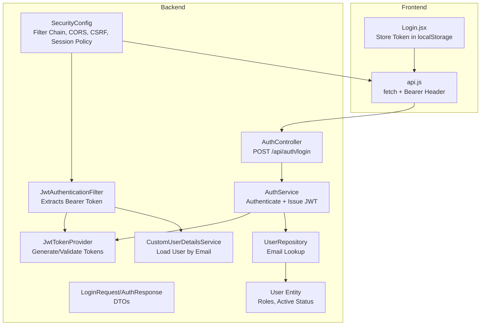
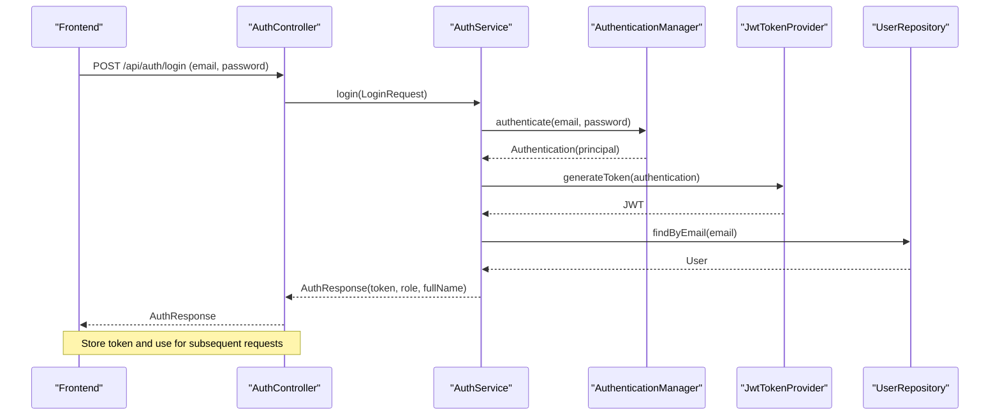
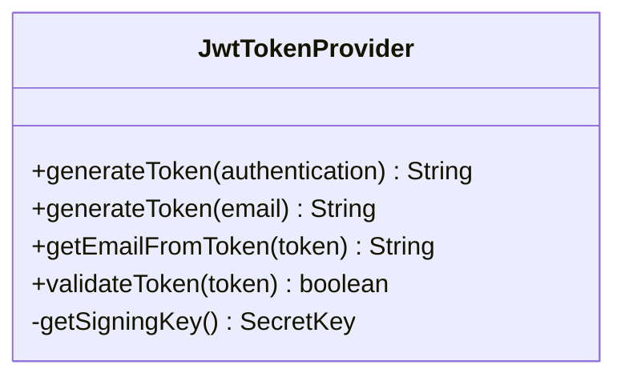
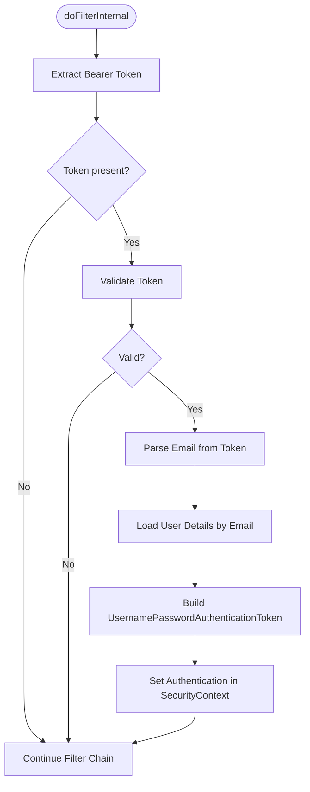
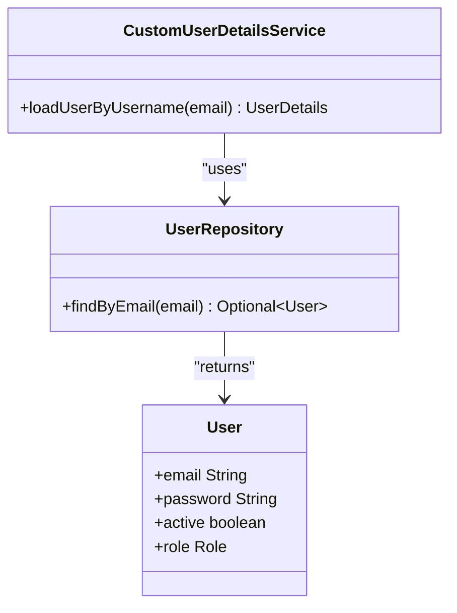
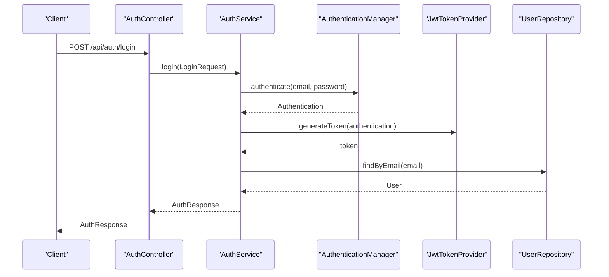
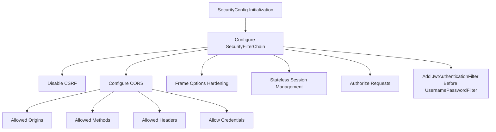
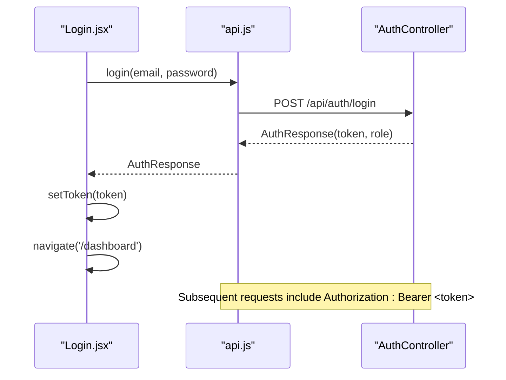
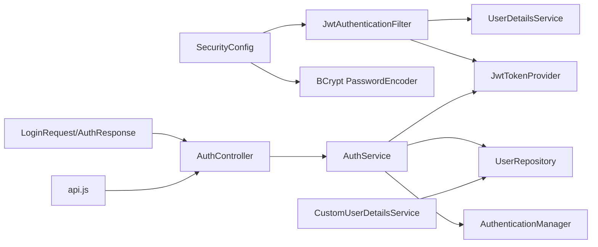

# Security Implementation

<cite>
**Referenced Files in This Document**
- [SecurityConfig.java](file://Mini_Project/backend/src/main/java/com/clinicalnids/backend/config/SecurityConfig.java)
- [JwtTokenProvider.java](file://Mini_Project/backend/src/main/java/com/clinicalnids/backend/security/JwtTokenProvider.java)
- [JwtAuthenticationFilter.java](file://Mini_Project/backend/src/main/java/com/clinicalnids/backend/security/JwtAuthenticationFilter.java)
- [CustomUserDetailsService.java](file://Mini_Project/backend/src/main/java/com/clinicalnids/backend/service/CustomUserDetailsService.java)
- [AuthService.java](file://Mini_Project/backend/src/main/java/com/clinicalnids/backend/service/AuthService.java)
- [AuthController.java](file://Mini_Project/backend/src/main/java/com/clinicalnids/backend/controller/AuthController.java)
- [LoginRequest.java](file://Mini_Project/backend/src/main/java/com/clinicalnids/backend/dto/LoginRequest.java)
- [AuthResponse.java](file://Mini_Project/backend/src/main/java/com/clinicalnids/backend/dto/AuthResponse.java)
- [User.java](file://Mini_Project/backend/src/main/java/com/clinicalnids/backend/entity/User.java)
- [UserRepository.java](file://Mini_Project/backend/src/main/java/com/clinicalnids/backend/repository/UserRepository.java)
- [application.properties](file://Mini_Project/backend/src/main/resources/application.properties)
- [api.js](file://Mini_Project/clinical-nids-dashboard/src/data/api.js)
- [Login.jsx](file://Mini_Project/clinical-nids-dashboard/src/pages/Login.jsx)
</cite>

## Table of Contents
1. [Introduction](#introduction)
2. [Project Structure](#project-structure)
3. [Core Components](#core-components)
4. [Architecture Overview](#architecture-overview)
5. [Detailed Component Analysis](#detailed-component-analysis)
6. [Dependency Analysis](#dependency-analysis)
7. [Performance Considerations](#performance-considerations)
8. [Troubleshooting Guide](#troubleshooting-guide)
9. [Conclusion](#conclusion)
10. [Appendices](#appendices)

## Introduction
This document provides comprehensive security documentation for the JWT-based authentication system, authorization mechanisms, and security configurations implemented in the backend. It covers token generation and validation, password encoding with BCrypt, CORS configuration, and CSRF protection. It also explains the user authentication flow, role-based access control, session management, security best practices, input validation strategies, SQL injection prevention, secure communication protocols, the custom user details service implementation, security filter chain, and integration with the frontend authentication system.

## Project Structure
The security implementation spans several layers:
- Configuration: Security filter chain, CORS, CSRF, session management, and password encoder
- Authentication: JWT provider, authentication filter, and authentication service
- Authorization: Custom user details service and role-based authorities
- Controllers: Public authentication endpoint and secured endpoints
- Frontend: Token storage and Authorization header injection

**Diagram sources**
- [SecurityConfig.java:34-49](file://Mini_Project/backend/src/main/java/com/clinicalnids/backend/config/SecurityConfig.java#L34-L49)
- [JwtAuthenticationFilter.java:29-46](file://Mini_Project/backend/src/main/java/com/clinicalnids/backend/security/JwtAuthenticationFilter.java#L29-L46)
- [JwtTokenProvider.java:28-39](file://Mini_Project/backend/src/main/java/com/clinicalnids/backend/security/JwtTokenProvider.java#L28-L39)
- [CustomUserDetailsService.java:22-34](file://Mini_Project/backend/src/main/java/com/clinicalnids/backend/service/CustomUserDetailsService.java#L22-L34)
- [AuthController.java:20-23](file://Mini_Project/backend/src/main/java/com/clinicalnids/backend/controller/AuthController.java#L20-L23)
- [AuthService.java:53-61](file://Mini_Project/backend/src/main/java/com/clinicalnids/backend/service/AuthService.java#L53-L61)
- [api.js:11-19](file://Mini_Project/clinical-nids-dashboard/src/data/api.js#L11-L19)
- [Login.jsx:15-31](file://Mini_Project/clinical-nids-dashboard/src/pages/Login.jsx#L15-L31)

**Section sources**
- [SecurityConfig.java:23-73](file://Mini_Project/backend/src/main/java/com/clinicalnids/backend/config/SecurityConfig.java#L23-L73)
- [application.properties:28-46](file://Mini_Project/backend/src/main/resources/application.properties#L28-L46)

## Core Components
- Security filter chain: Stateless JWT authentication, permissive CORS, disabled CSRF, and frame options hardening
- JWT token provider: HMAC-SHA signing with configurable secret and expiration
- JWT authentication filter: Extracts Bearer token, validates, loads user details, and sets authentication in SecurityContext
- Custom user details service: Loads user by email, maps roles to authorities, and enforces active status
- Authentication service: Authenticates credentials, generates JWT, and returns structured response
- DTOs: LoginRequest and AuthResponse for request/response contracts
- Frontend integration: Stores token and injects Authorization header for authenticated requests

**Section sources**
- [SecurityConfig.java:33-71](file://Mini_Project/backend/src/main/java/com/clinicalnids/backend/config/SecurityConfig.java#L33-L71)
- [JwtTokenProvider.java:14-70](file://Mini_Project/backend/src/main/java/com/clinicalnids/backend/security/JwtTokenProvider.java#L14-L70)
- [JwtAuthenticationFilter.java:18-56](file://Mini_Project/backend/src/main/java/com/clinicalnids/backend/security/JwtAuthenticationFilter.java#L18-L56)
- [CustomUserDetailsService.java:13-36](file://Mini_Project/backend/src/main/java/com/clinicalnids/backend/service/CustomUserDetailsService.java#L13-L36)
- [AuthService.java:15-63](file://Mini_Project/backend/src/main/java/com/clinicalnids/backend/service/AuthService.java#L15-L63)
- [LoginRequest.java:1-16](file://Mini_Project/backend/src/main/java/com/clinicalnids/backend/dto/LoginRequest.java#L1-L16)
- [AuthResponse.java:1-19](file://Mini_Project/backend/src/main/java/com/clinicalnids/backend/dto/AuthResponse.java#L1-L19)
- [api.js:21-41](file://Mini_Project/clinical-nids-dashboard/src/data/api.js#L21-L41)

## Architecture Overview
The authentication architecture follows a stateless JWT pattern:
- Clients send credentials to the authentication endpoint
- Backend authenticates via AuthenticationManager, generates a signed JWT, and returns it
- Subsequent requests include the JWT in the Authorization header
- Filter validates the token and establishes an authenticated SecurityContext
- Controllers enforce authorization policies based on roles

**Diagram sources**
- [AuthController.java:20-23](file://Mini_Project/backend/src/main/java/com/clinicalnids/backend/controller/AuthController.java#L20-L23)
- [AuthService.java:53-61](file://Mini_Project/backend/src/main/java/com/clinicalnids/backend/service/AuthService.java#L53-L61)
- [JwtTokenProvider.java:28-39](file://Mini_Project/backend/src/main/java/com/clinicalnids/backend/security/JwtTokenProvider.java#L28-L39)
- [UserRepository.java:10-13](file://Mini_Project/backend/src/main/java/com/clinicalnids/backend/repository/UserRepository.java#L10-L13)

## Detailed Component Analysis

### JWT Token Provider
Implements token generation and validation using HMAC-SHA with a configurable secret and expiration. It supports generating tokens from Authentication principal or raw email.

**Diagram sources**
- [JwtTokenProvider.java:14-70](file://Mini_Project/backend/src/main/java/com/clinicalnids/backend/security/JwtTokenProvider.java#L14-L70)

**Section sources**
- [JwtTokenProvider.java:23-39](file://Mini_Project/backend/src/main/java/com/clinicalnids/backend/security/JwtTokenProvider.java#L23-L39)
- [JwtTokenProvider.java:53-69](file://Mini_Project/backend/src/main/java/com/clinicalnids/backend/security/JwtTokenProvider.java#L53-L69)

### JWT Authentication Filter
Extracts the Bearer token from the Authorization header, validates it, loads user details by email, and sets an authenticated token in SecurityContext.

**Diagram sources**
- [JwtAuthenticationFilter.java:29-46](file://Mini_Project/backend/src/main/java/com/clinicalnids/backend/security/JwtAuthenticationFilter.java#L29-L46)

**Section sources**
- [JwtAuthenticationFilter.java:29-54](file://Mini_Project/backend/src/main/java/com/clinicalnids/backend/security/JwtAuthenticationFilter.java#L29-L54)

### Custom User Details Service
Loads user by email, constructs UserDetails with active status, and assigns authorities based on user role.

**Diagram sources**
- [CustomUserDetailsService.java:22-34](file://Mini_Project/backend/src/main/java/com/clinicalnids/backend/service/CustomUserDetailsService.java#L22-L34)
- [UserRepository.java:10-13](file://Mini_Project/backend/src/main/java/com/clinicalnids/backend/repository/UserRepository.java#L10-L13)
- [User.java:41-43](file://Mini_Project/backend/src/main/java/com/clinicalnids/backend/entity/User.java#L41-L43)

**Section sources**
- [CustomUserDetailsService.java:22-34](file://Mini_Project/backend/src/main/java/com/clinicalnids/backend/service/CustomUserDetailsService.java#L22-L34)
- [User.java:19-32](file://Mini_Project/backend/src/main/java/com/clinicalnids/backend/entity/User.java#L19-L32)

### Authentication Service and Controller
Handles credential authentication, JWT issuance, and structured response construction.

**Diagram sources**
- [AuthController.java:20-23](file://Mini_Project/backend/src/main/java/com/clinicalnids/backend/controller/AuthController.java#L20-L23)
- [AuthService.java:53-61](file://Mini_Project/backend/src/main/java/com/clinicalnids/backend/service/AuthService.java#L53-L61)
- [JwtTokenProvider.java:28-39](file://Mini_Project/backend/src/main/java/com/clinicalnids/backend/security/JwtTokenProvider.java#L28-L39)
- [UserRepository.java:10-13](file://Mini_Project/backend/src/main/java/com/clinicalnids/backend/repository/UserRepository.java#L10-L13)

**Section sources**
- [AuthService.java:31-51](file://Mini_Project/backend/src/main/java/com/clinicalnids/backend/service/AuthService.java#L31-L51)
- [AuthService.java:53-61](file://Mini_Project/backend/src/main/java/com/clinicalnids/backend/service/AuthService.java#L53-L61)
- [AuthController.java:20-23](file://Mini_Project/backend/src/main/java/com/clinicalnids/backend/controller/AuthController.java#L20-L23)

### Security Configuration
Defines the security filter chain, CORS policy, CSRF disabling, frame options, session management, password encoder, and authentication manager.

**Diagram sources**
- [SecurityConfig.java:34-49](file://Mini_Project/backend/src/main/java/com/clinicalnids/backend/config/SecurityConfig.java#L34-L49)
- [SecurityConfig.java:51-61](file://Mini_Project/backend/src/main/java/com/clinicalnids/backend/config/SecurityConfig.java#L51-L61)

**Section sources**
- [SecurityConfig.java:33-71](file://Mini_Project/backend/src/main/java/com/clinicalnids/backend/config/SecurityConfig.java#L33-L71)
- [application.properties:28-46](file://Mini_Project/backend/src/main/resources/application.properties#L28-L46)

### Frontend Authentication Integration
Frontend performs login, stores the JWT in localStorage, and injects the Authorization header for authenticated requests.

**Diagram sources**
- [Login.jsx:15-31](file://Mini_Project/clinical-nids-dashboard/src/pages/Login.jsx#L15-L31)
- [api.js:11-19](file://Mini_Project/clinical-nids-dashboard/src/data/api.js#L11-L19)
- [AuthController.java:20-23](file://Mini_Project/backend/src/main/java/com/clinicalnids/backend/controller/AuthController.java#L20-L23)

**Section sources**
- [api.js:21-41](file://Mini_Project/clinical-nids-dashboard/src/data/api.js#L21-L41)
- [Login.jsx:15-31](file://Mini_Project/clinical-nids-dashboard/src/pages/Login.jsx#L15-L31)

## Dependency Analysis
The security subsystem exhibits low coupling and clear separation of concerns:
- SecurityConfig orchestrates filter chain and global security policies
- JwtAuthenticationFilter depends on JwtTokenProvider and UserDetailsService
- AuthService depends on AuthenticationManager, JwtTokenProvider, and UserRepository
- CustomUserDetailsService depends on UserRepository
- DTOs decouple request/response contracts from services
- Frontend integrates via api.js helpers

**Diagram sources**
- [SecurityConfig.java:33-71](file://Mini_Project/backend/src/main/java/com/clinicalnids/backend/config/SecurityConfig.java#L33-L71)
- [JwtAuthenticationFilter.java:21-27](file://Mini_Project/backend/src/main/java/com/clinicalnids/backend/security/JwtAuthenticationFilter.java#L21-L27)
- [AuthService.java:23-29](file://Mini_Project/backend/src/main/java/com/clinicalnids/backend/service/AuthService.java#L23-L29)
- [CustomUserDetailsService.java:16-20](file://Mini_Project/backend/src/main/java/com/clinicalnids/backend/service/CustomUserDetailsService.java#L16-L20)
- [AuthController.java:14-18](file://Mini_Project/backend/src/main/java/com/clinicalnids/backend/controller/AuthController.java#L14-L18)
- [api.js:11-19](file://Mini_Project/clinical-nids-dashboard/src/data/api.js#L11-L19)

**Section sources**
- [SecurityConfig.java:63-71](file://Mini_Project/backend/src/main/java/com/clinicalnids/backend/config/SecurityConfig.java#L63-L71)
- [AuthService.java:23-29](file://Mini_Project/backend/src/main/java/com/clinicalnids/backend/service/AuthService.java#L23-L29)
- [CustomUserDetailsService.java:16-20](file://Mini_Project/backend/src/main/java/com/clinicalnids/backend/service/CustomUserDetailsService.java#L16-L20)

## Performance Considerations
- Stateless JWT eliminates server-side session storage overhead
- Token validation uses symmetric signing; ensure efficient key derivation and avoid excessive re-computation
- Keep token expiration short to reduce risk while balancing user experience
- Use connection pooling and limit concurrent authentication requests to prevent resource exhaustion
- Consider adding rate limiting at the authentication endpoint to mitigate brute force attacks

## Troubleshooting Guide
Common issues and resolutions:
- Invalid or expired token: Verify token expiration and secret alignment between frontend and backend
- Authentication failures: Confirm credentials match stored BCrypt hashes and user is active
- CORS errors: Ensure frontend origin matches configured allowed origins and credentials are enabled
- CSRF warnings: CSRF is intentionally disabled for stateless JWT; confirm this aligns with intended architecture
- Session fixation: Session management is stateless; ensure clients do not rely on server-managed sessions
- Token not attached: Verify Authorization header format "Bearer <token>" and frontend token persistence

**Section sources**
- [SecurityConfig.java:36-38](file://Mini_Project/backend/src/main/java/com/clinicalnids/backend/config/SecurityConfig.java#L36-L38)
- [JwtAuthenticationFilter.java:48-54](file://Mini_Project/backend/src/main/java/com/clinicalnids/backend/security/JwtAuthenticationFilter.java#L48-L54)
- [api.js:35-41](file://Mini_Project/clinical-nids-dashboard/src/data/api.js#L35-L41)

## Conclusion
The system implements a robust, stateless JWT authentication mechanism with BCrypt password encoding, permissive yet secure CORS, and CSRF disabled for REST APIs. The filter chain enforces token validation and sets authenticated contexts, while the custom user details service maps roles to authorities. The frontend seamlessly integrates by storing tokens and injecting Authorization headers. Adhering to the best practices outlined ensures secure operation across development and production environments.

## Appendices

### Security Best Practices
- Rotate JWT secrets regularly and protect them in environment variables
- Enforce HTTPS in production to protect token transmission
- Limit token lifetimes and implement refresh token strategies if needed
- Log authentication events and monitor anomalies
- Sanitize and validate all inputs; use parameterized queries to prevent SQL injection
- Apply least privilege and enforce role-based access control consistently
- Regularly audit dependencies and apply security patches

### Input Validation Strategies
- DTO-level validation: Use annotations to enforce presence and format
- Repository queries: Use Spring Data JPA methods to avoid raw SQL
- Frontend validation: Complement client-side checks with server-side enforcement

### SQL Injection Prevention
- Use JPA repositories and named queries
- Avoid dynamic SQL concatenation
- Leverage parameter binding and typed parameters

### Secure Communication Protocols
- TLS termination at reverse proxy or API gateway
- Enforce HSTS and secure cookies if cookies are ever introduced
- Restrict exposed ports and enable network segmentation