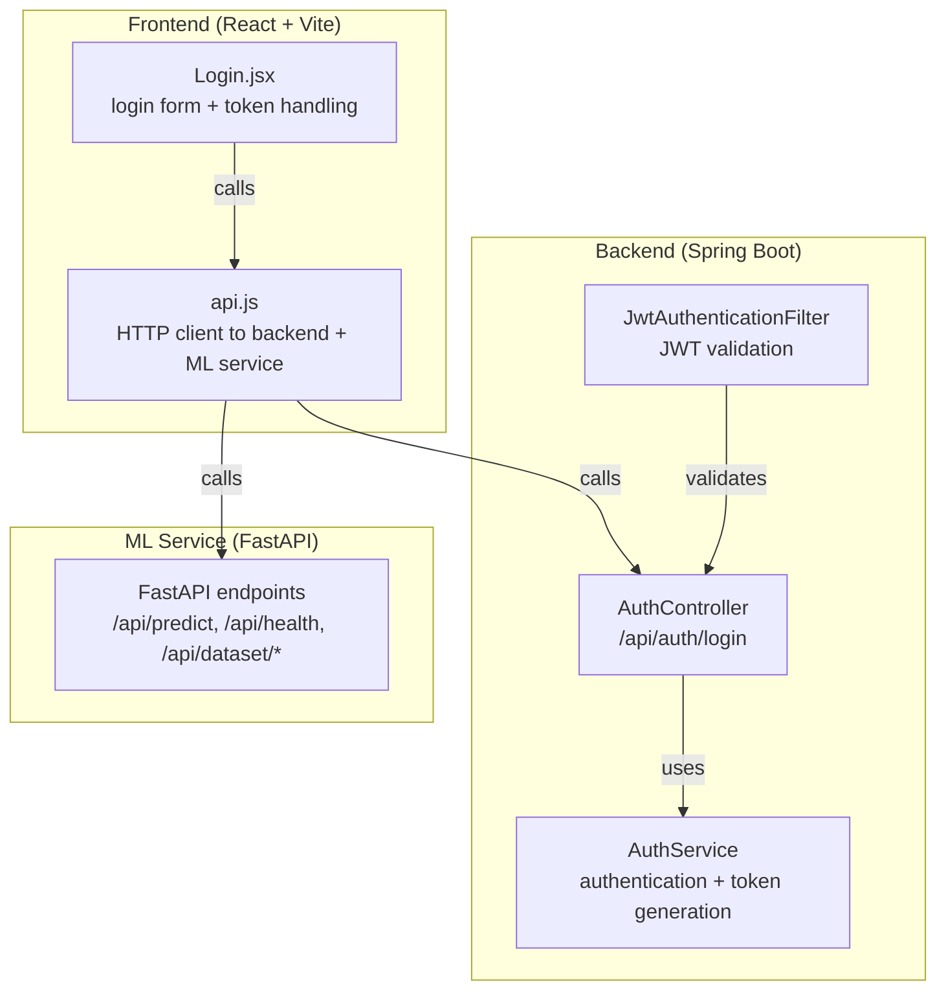
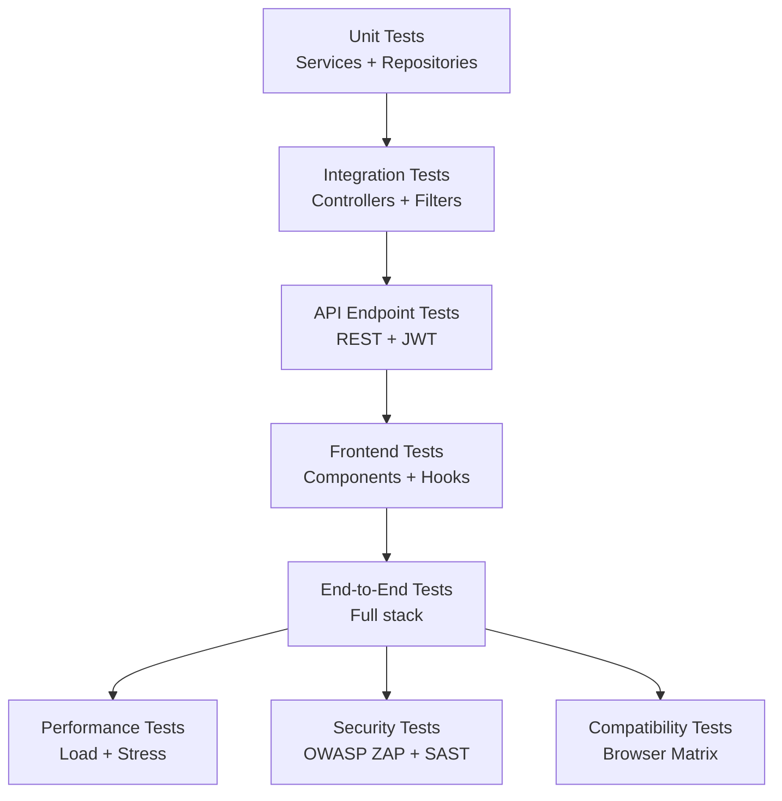
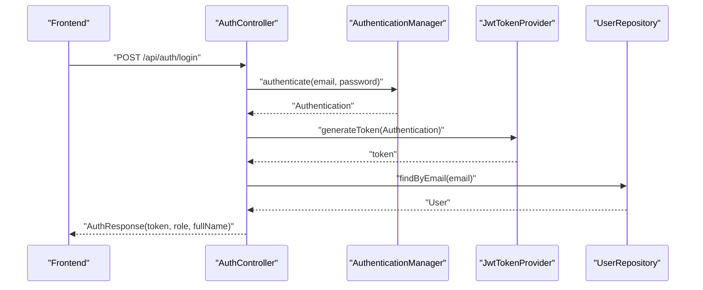
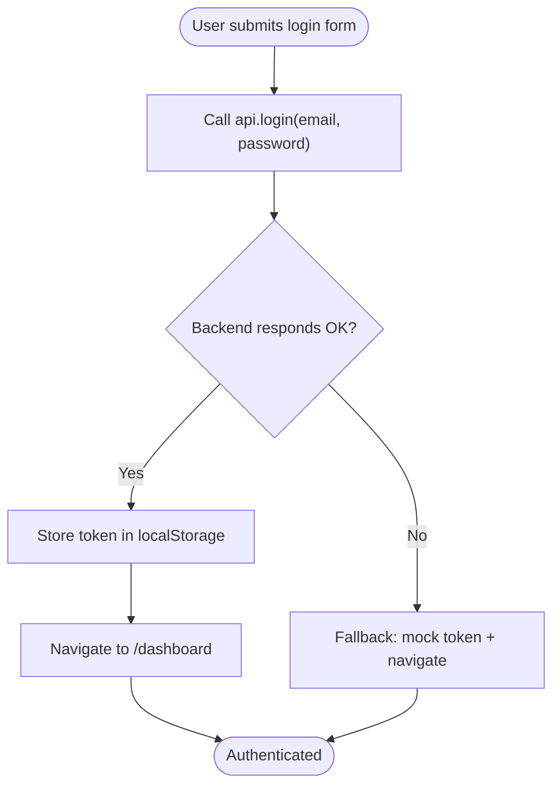
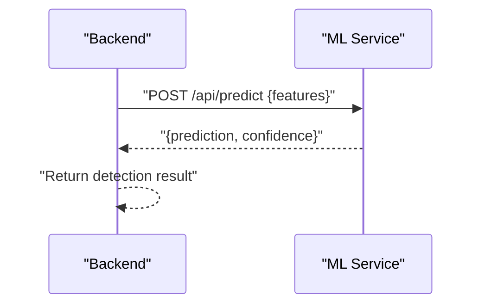
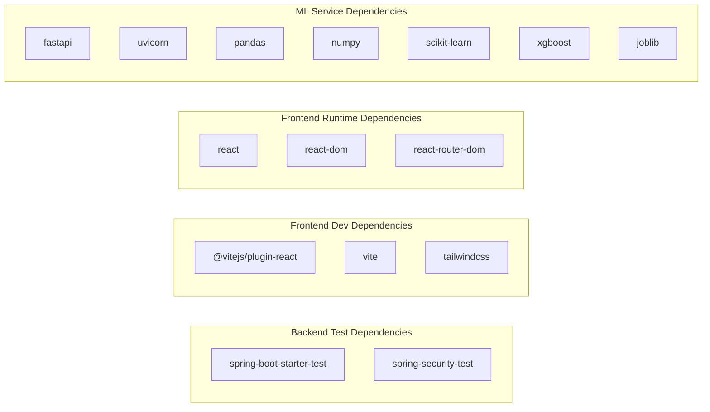

# Testing Strategy

<cite>
**Referenced Files in This Document**
- [pom.xml](file://Mini_Project/backend/pom.xml)
- [application.properties](file://Mini_Project/backend/src/main/resources/application.properties)
- [start_all.bat](file://Mini_Project/start_all.bat)
- [package.json](file://Mini_Project/clinical-nids-dashboard/package.json)
- [vite.config.js](file://Mini_Project/clinical-nids-dashboard/vite.config.js)
- [api.js](file://Mini_Project/clinical-nids-dashboard/src/data/api.js)
- [Login.jsx](file://Mini_Project/clinical-nids-dashboard/src/pages/Login.jsx)
- [ClinicalNidsApplication.java](file://Mini_Project/backend/src/main/java/com/clinicalnids/backend/ClinicalNidsApplication.java)
- [AuthController.java](file://Mini_Project/backend/src/main/java/com/clinicalnids/backend/controller/AuthController.java)
- [AuthService.java](file://Mini_Project/backend/src/main/java/com/clinicalnids/backend/service/AuthService.java)
- [JwtAuthenticationFilter.java](file://Mini_Project/backend/src/main/java/com/clinicalnids/backend/security/JwtAuthenticationFilter.java)
- [requirements.txt](file://Mini_Project/ml-service/requirements.txt)
</cite>

## Table of Contents
1. [Introduction](#introduction)
2. [Project Structure](#project-structure)
3. [Core Components](#core-components)
4. [Architecture Overview](#architecture-overview)
5. [Detailed Component Analysis](#detailed-component-analysis)
6. [Dependency Analysis](#dependency-analysis)
7. [Performance Considerations](#performance-considerations)
8. [Security Testing Considerations](#security-testing-considerations)
9. [Cross-Browser Compatibility Testing](#cross-browser-compatibility-testing)
10. [Test Data Management](#test-data-management)
11. [Continuous Integration Setup](#continuous-integration-setup)
12. [Automated Testing Pipelines](#automated-testing-pipelines)
13. [Troubleshooting Guide](#troubleshooting-guide)
14. [Conclusion](#conclusion)

## Introduction
This document defines a comprehensive testing strategy for the healthcare cybersecurity application. It covers unit testing, integration testing, API endpoint testing, frontend component testing, user interaction testing, performance testing, security testing, and cross-browser compatibility. It also outlines test data management, CI/CD pipeline setup, and automation for the Spring Boot backend, React/Vite frontend, and FastAPI machine learning service.

## Project Structure
The application consists of three primary parts:
- Backend (Spring Boot): exposes REST endpoints, handles authentication, integrates with the ML service, and manages persistence via H2 in-memory database during tests.
- Frontend (React + Vite): connects to the backend and ML service via HTTP requests, with local storage for tokens and fallback behavior when backend is unavailable.
- ML Service (FastAPI): provides prediction and dataset analysis endpoints consumed by the backend and frontend.

**Diagram sources**
- [AuthController.java:1-25](file://Mini_Project/backend/src/main/java/com/clinicalnids/backend/controller/AuthController.java#L1-L25)
- [JwtAuthenticationFilter.java:1-56](file://Mini_Project/backend/src/main/java/com/clinicalnids/backend/security/JwtAuthenticationFilter.java#L1-L56)
- [AuthService.java:1-63](file://Mini_Project/backend/src/main/java/com/clinicalnids/backend/service/AuthService.java#L1-L63)
- [api.js:1-236](file://Mini_Project/clinical-nids-dashboard/src/data/api.js#L1-L236)
- [Login.jsx:1-157](file://Mini_Project/clinical-nids-dashboard/src/pages/Login.jsx#L1-L157)

**Section sources**
- [pom.xml:1-125](file://Mini_Project/backend/pom.xml#L1-L125)
- [application.properties:1-46](file://Mini_Project/backend/src/main/resources/application.properties#L1-L46)
- [package.json:1-31](file://Mini_Project/clinical-nids-dashboard/package.json#L1-L31)
- [vite.config.js:1-7](file://Mini_Project/clinical-nids-dashboard/vite.config.js#L1-L7)
- [start_all.bat:1-59](file://Mini_Project/start_all.bat#L1-L59)

## Core Components
- Backend dependencies include Spring Web, WebFlux, Data JPA, Security, Validation, H2 for testing, JWT libraries, and OpenPDF for reports. Test dependencies include Spring Boot Starter Test and Spring Security Test.
- Frontend uses React, React Router, Recharts, Tailwind CSS, and Vite for build tooling.
- ML service depends on FastAPI, Uvicorn, pandas, numpy, scikit-learn, xgboost, imbalanced-learn, shap, pyarrow, joblib, python-multipart, and pydantic.

Key testing-relevant configurations:
- Backend profile switches to H2 in-memory database for development and testing.
- CORS allows the frontend origin.
- JWT secret and expiration are configured for authentication testing.
- ML service URL is configured for backend-to-ML integration.

**Section sources**
- [pom.xml:25-106](file://Mini_Project/backend/pom.xml#L25-L106)
- [application.properties:7-36](file://Mini_Project/backend/src/main/resources/application.properties#L7-L36)
- [requirements.txt:1-13](file://Mini_Project/ml-service/requirements.txt#L1-L13)

## Architecture Overview
The testing architecture leverages layered isolation:
- Unit tests for services and repositories using in-memory H2.
- Integration tests for controllers and security filters against a test server.
- API tests validating endpoint contracts and JWT flows.
- Frontend tests using React Testing Library and Vite’s test runner.
- End-to-end tests verifying user flows across backend, ML service, and frontend.

[No sources needed since this diagram shows conceptual workflow, not actual code structure]

## Detailed Component Analysis

### Backend Authentication Testing
Authentication involves:
- Controller endpoint for login.
- Service layer performing authentication manager validation and JWT token generation.
- Security filter extracting and validating JWT tokens from Authorization headers.

Recommended testing approach:
- Unit tests for AuthService focusing on authentication manager behavior, password encoding, and token generation.
- Mock AuthenticationManager and UserRepository to isolate service logic.
- Integration tests for AuthController validating request/response and HTTP status codes.
- Security filter tests ensuring proper token extraction and user details loading.

**Diagram sources**
- [AuthController.java:20-23](file://Mini_Project/backend/src/main/java/com/clinicalnids/backend/controller/AuthController.java#L20-L23)
- [AuthService.java:53-61](file://Mini_Project/backend/src/main/java/com/clinicalnids/backend/service/AuthService.java#L53-L61)
- [JwtAuthenticationFilter.java:34-43](file://Mini_Project/backend/src/main/java/com/clinicalnids/backend/security/JwtAuthenticationFilter.java#L34-L43)

**Section sources**
- [AuthController.java:1-25](file://Mini_Project/backend/src/main/java/com/clinicalnids/backend/controller/AuthController.java#L1-L25)
- [AuthService.java:1-63](file://Mini_Project/backend/src/main/java/com/clinicalnids/backend/service/AuthService.java#L1-L63)
- [JwtAuthenticationFilter.java:1-56](file://Mini_Project/backend/src/main/java/com/clinicalnids/backend/security/JwtAuthenticationFilter.java#L1-L56)

### Frontend API and Component Testing
Frontend testing focuses on:
- API client module (api.js) for network interactions.
- Login page component behavior, including token handling and navigation.
- Token storage and retrieval helpers for authenticated routes.

Recommended testing approach:
- Unit tests for api.js functions using fetch mocks to simulate backend responses.
- Component tests for Login.jsx using React Testing Library, simulating user interactions and route transitions.
- Token lifecycle tests verifying setToken/getToken/clearToken behavior.

**Diagram sources**
- [api.js:11-27](file://Mini_Project/clinical-nids-dashboard/src/data/api.js#L11-L27)
- [Login.jsx:15-31](file://Mini_Project/clinical-nids-dashboard/src/pages/Login.jsx#L15-L31)

**Section sources**
- [api.js:1-236](file://Mini_Project/clinical-nids-dashboard/src/data/api.js#L1-L236)
- [Login.jsx:1-157](file://Mini_Project/clinical-nids-dashboard/src/pages/Login.jsx#L1-L157)

### ML Service Integration Testing
The backend delegates predictions to the ML service. Testing should:
- Validate HTTP calls from backend to ML service endpoints.
- Mock ML service responses to test error handling and retry logic.
- Verify data serialization/deserialization between backend and ML service.

**Diagram sources**
- [api.js:45-53](file://Mini_Project/clinical-nids-dashboard/src/data/api.js#L45-L53)

**Section sources**
- [api.js:109-124](file://Mini_Project/clinical-nids-dashboard/src/data/api.js#L109-L124)

## Dependency Analysis
Testing dependencies and runtime dependencies are separated:
- Backend test dependencies include Spring Boot Starter Test and Spring Security Test.
- Frontend build-time dependencies include Vite, React, Tailwind, and PostCSS; runtime dependencies include React and React Router.
- ML service dependencies are defined in requirements.txt.

**Diagram sources**
- [pom.xml:95-105](file://Mini_Project/backend/pom.xml#L95-L105)
- [package.json:18-26](file://Mini_Project/clinical-nids-dashboard/package.json#L18-L26)
- [package.json:11-17](file://Mini_Project/clinical-nids-dashboard/package.json#L11-L17)
- [requirements.txt:1-13](file://Mini_Project/ml-service/requirements.txt#L1-L13)

**Section sources**
- [pom.xml:95-105](file://Mini_Project/backend/pom.xml#L95-L105)
- [package.json:11-26](file://Mini_Project/clinical-nids-dashboard/package.json#L11-L26)
- [requirements.txt:1-13](file://Mini_Project/ml-service/requirements.txt#L1-L13)

## Performance Considerations
- Load testing: Simulate concurrent users for login, detection prediction, and dataset upload to identify bottlenecks.
- Stress testing: Gradually increase load to observe failure points in backend and ML service.
- Database performance: Use H2 in-memory for tests; ensure repository queries are optimized and indexed appropriately.
- Caching: Introduce caching for frequently accessed dashboards and detections to reduce latency.
- Asynchronous processing: Offload heavy tasks (e.g., dataset analysis) to background jobs to improve responsiveness.

[No sources needed since this section provides general guidance]

## Security Testing Considerations
- Authentication and authorization: Verify JWT token validation, role-based access control, and secure token storage.
- Input validation: Ensure DTOs and request bodies are validated to prevent injection attacks.
- CORS policy: Confirm allowed origins and headers are restrictive and appropriate.
- Secret management: Avoid exposing secrets in logs or client-side code; rotate JWT secret regularly.
- Penetration testing: Use tools like OWASP ZAP or Burp Suite to scan for vulnerabilities.

[No sources needed since this section provides general guidance]

## Cross-Browser Compatibility Testing
- Browser matrix: Test on Chrome, Firefox, Safari, and Edge to ensure consistent behavior.
- Feature support: Validate chart rendering (Recharts), form controls, and layout across browsers.
- Responsive design: Verify mobile and tablet layouts using browser developer tools.

[No sources needed since this section provides general guidance]

## Test Data Management
- Backend: Use H2 in-memory database for tests; initialize seed data via @PostConstruct in services for predictable scenarios.
- Frontend: Use deterministic fixtures and mock APIs to avoid flaky tests.
- ML service: Provide synthetic datasets and fixed model outputs for reproducible predictions.

**Section sources**
- [application.properties:8-13](file://Mini_Project/backend/src/main/resources/application.properties#L8-L13)
- [AuthService.java:31-51](file://Mini_Project/backend/src/main/java/com/clinicalnids/backend/service/AuthService.java#L31-L51)

## Continuous Integration Setup
- Backend: Configure Maven build and test execution in CI. Use environment variables for database URLs and JWT secrets.
- Frontend: Configure Vite build and test scripts in CI. Use Node.js caching for faster builds.
- ML service: Build and run FastAPI containerized tests in CI.

**Section sources**
- [pom.xml:108-123](file://Mini_Project/backend/pom.xml#L108-L123)
- [package.json:6-10](file://Mini_Project/clinical-nids-dashboard/package.json#L6-L10)
- [start_all.bat:7-18](file://Mini_Project/start_all.bat#L7-L18)

## Automated Testing Pipelines
Recommended pipeline stages:
- Build: Compile backend, build frontend, and install ML service dependencies.
- Unit tests: Run backend service and repository unit tests.
- Integration tests: Spin up test containers for backend and ML service, then run integration tests.
- API tests: Validate REST endpoints and JWT flows.
- Frontend tests: Execute component and integration tests.
- Performance tests: Run load and stress tests.
- Security tests: Static analysis and dynamic scanning.
- Compatibility tests: Browser automation tests.
- Artifact publishing: Package artifacts for deployment.

[No sources needed since this section provides general guidance]

## Troubleshooting Guide
Common issues and resolutions:
- Backend not reachable: Ensure the backend starts on port 8080 and ML service URL matches configuration.
- Frontend login failures: Verify token storage and CORS settings; check fallback behavior in Login.jsx.
- ML service unresponsive: Confirm ML service health endpoint and model info endpoint are accessible.
- Database connectivity: Switch from H2 to PostgreSQL in CI environments and manage migrations.

**Section sources**
- [application.properties:5, 33, 36:5-5](file://Mini_Project/backend/src/main/resources/application.properties#L5-L5)
- [Login.jsx:23-28](file://Mini_Project/clinical-nids-dashboard/src/pages/Login.jsx#L23-L28)
- [api.js:121-124](file://Mini_Project/clinical-nids-dashboard/src/data/api.js#L121-L124)

## Conclusion
This testing strategy provides a structured approach to ensure reliability, security, and performance across the backend, frontend, and ML service. By combining unit, integration, API, and end-to-end testing with CI/CD automation, the team can maintain high-quality standards while supporting healthcare cybersecurity requirements.