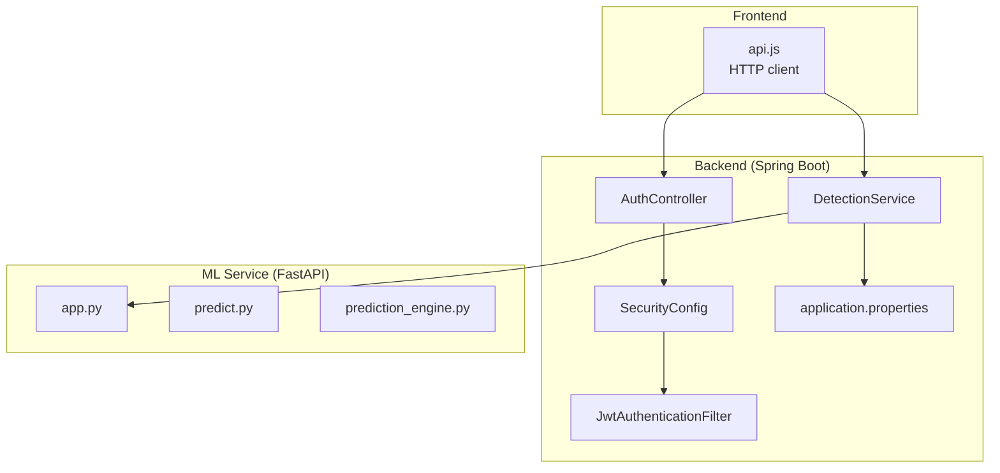
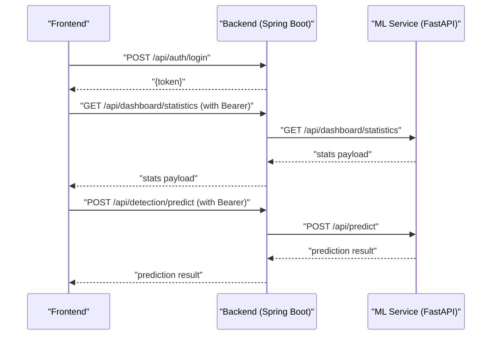
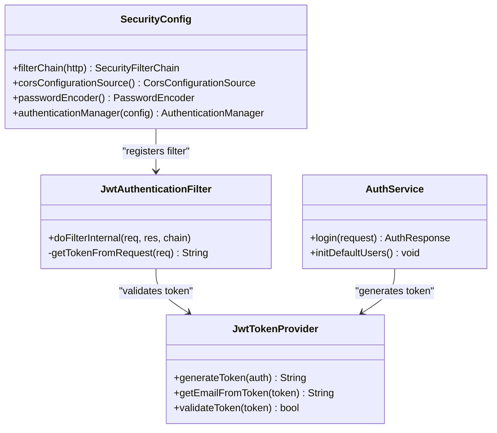
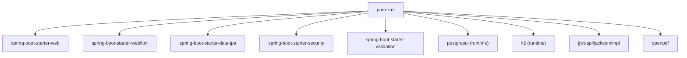

# Troubleshooting & FAQ

<cite>
**Referenced Files in This Document**
- [ClinicalNidsApplication.java](file://Mini_Project/backend/src/main/java/com/clinicalnids/backend/ClinicalNidsApplication.java)
- [application.properties](file://Mini_Project/backend/src/main/resources/application.properties)
- [SecurityConfig.java](file://Mini_Project/backend/src/main/java/com/clinicalnids/backend/config/SecurityConfig.java)
- [JwtAuthenticationFilter.java](file://Mini_Project/backend/src/main/java/com/clinicalnids/backend/security/JwtAuthenticationFilter.java)
- [JwtTokenProvider.java](file://Mini_Project/backend/src/main/java/com/clinicalnids/backend/security/JwtTokenProvider.java)
- [AuthService.java](file://Mini_Project/backend/src/main/java/com/clinicalnids/backend/service/AuthService.java)
- [AuthController.java](file://Mini_Project/backend/src/main/java/com/clinicalnids/backend/controller/AuthController.java)
- [DetectionService.java](file://Mini_Project/backend/src/main/java/com/clinicalnids/backend/service/DetectionService.java)
- [AlertService.java](file://Mini_Project/backend/src/main/java/com/clinicalnids/backend/service/AlertService.java)
- [AlertController.java](file://Mini_Project/backend/src/main/java/com/clinicalnids/backend/controller/AlertController.java)
- [api.js](file://Mini_Project/clinical-nids-dashboard/src/data/api.js)
- [app.py](file://Mini_Project/ml-service/app.py)
- [prediction_engine.py](file://Mini_Project/ml-service/prediction_engine.py)
- [predict.py](file://Mini_Project/ml-service/predict.py)
- [train_model.py](file://Mini_Project/ml-service/train_model.py)
- [pom.xml](file://Mini_Project/backend/pom.xml)
</cite>

## Table of Contents
1. [Introduction](#introduction)
2. [Project Structure](#project-structure)
3. [Core Components](#core-components)
4. [Architecture Overview](#architecture-overview)
5. [Detailed Component Analysis](#detailed-component-analysis)
6. [Dependency Analysis](#dependency-analysis)
7. [Performance Considerations](#performance-considerations)
8. [Troubleshooting Guide](#troubleshooting-guide)
9. [Conclusion](#conclusion)
10. [Appendices](#appendices)

## Introduction
This document provides comprehensive troubleshooting guidance for the Clinical-NIDS system. It focuses on diagnosing and resolving common issues across:
- Database connectivity (development vs. production)
- API integration failures (frontend-to-backend and backend-to-ML-service)
- Machine learning model loading errors
- Frontend rendering issues
It also covers debugging techniques, logging configuration, error tracking, performance profiling, and system integration checks tailored for healthcare network security environments.

## Project Structure
The system comprises three primary parts:
- Backend (Spring Boot): exposes REST endpoints, handles authentication, integrates with the ML service, and manages persistence.
- Frontend (React): communicates with the backend and optionally with the ML service directly.
- ML Service (FastAPI): performs model inference and analysis.

**Diagram sources**
- [api.js:1-236](file://Mini_Project/clinical-nids-dashboard/src/data/api.js#L1-L236)
- [AuthController.java:1-25](file://Mini_Project/backend/src/main/java/com/clinicalnids/backend/controller/AuthController.java#L1-L25)
- [DetectionService.java:1-33](file://Mini_Project/backend/src/main/java/com/clinicalnids/backend/service/DetectionService.java#L1-L33)
- [SecurityConfig.java:1-73](file://Mini_Project/backend/src/main/java/com/clinicalnids/backend/config/SecurityConfig.java#L1-L73)
- [JwtAuthenticationFilter.java:1-56](file://Mini_Project/backend/src/main/java/com/clinicalnids/backend/security/JwtAuthenticationFilter.java#L1-L56)
- [application.properties:1-46](file://Mini_Project/backend/src/main/resources/application.properties#L1-L46)
- [app.py:1-1199](file://Mini_Project/ml-service/app.py#L1-L1199)
- [predict.py:1-179](file://Mini_Project/ml-service/predict.py#L1-L179)
- [prediction_engine.py:1-413](file://Mini_Project/ml-service/prediction_engine.py#L1-L413)

**Section sources**
- [api.js:1-236](file://Mini_Project/clinical-nids-dashboard/src/data/api.js#L1-L236)
- [application.properties:1-46](file://Mini_Project/backend/src/main/resources/application.properties#L1-L46)

## Core Components
- Backend entrypoint initializes the Spring Boot application.
- Security configuration enables stateless JWT authentication and CORS.
- Authentication service generates tokens and initializes default users.
- Detection service integrates with the ML service via HTTP calls.
- ML service loads model artifacts and provides prediction endpoints.

**Section sources**
- [ClinicalNidsApplication.java:1-12](file://Mini_Project/backend/src/main/java/com/clinicalnids/backend/ClinicalNidsApplication.java#L1-L12)
- [SecurityConfig.java:1-73](file://Mini_Project/backend/src/main/java/com/clinicalnids/backend/config/SecurityConfig.java#L1-L73)
- [AuthService.java:1-63](file://Mini_Project/backend/src/main/java/com/clinicalnids/backend/service/AuthService.java#L1-L63)
- [DetectionService.java:1-33](file://Mini_Project/backend/src/main/java/com/clinicalnids/backend/service/DetectionService.java#L1-L33)
- [app.py:1-1199](file://Mini_Project/ml-service/app.py#L1-L1199)

## Architecture Overview
The system uses a layered architecture:
- Frontend calls backend endpoints for authenticated operations.
- Backend forwards certain requests to the ML service.
- ML service serves model-related endpoints independently.

**Diagram sources**
- [api.js:1-236](file://Mini_Project/clinical-nids-dashboard/src/data/api.js#L1-L236)
- [AuthController.java:1-25](file://Mini_Project/backend/src/main/java/com/clinicalnids/backend/controller/AuthController.java#L1-L25)
- [DetectionService.java:1-33](file://Mini_Project/backend/src/main/java/com/clinicalnids/backend/service/DetectionService.java#L1-L33)
- [app.py:1-1199](file://Mini_Project/ml-service/app.py#L1-L1199)

## Detailed Component Analysis

### Authentication and Security
Common issues:
- Token validation fails due to secret mismatch or expiration.
- CORS errors preventing frontend from accessing backend.
- Missing Authorization header causing unauthorized responses.

Diagnostic steps:
- Verify JWT secret and expiration in configuration.
- Confirm allowed origins in CORS configuration.
- Ensure frontend stores and sends the Bearer token.

**Diagram sources**
- [SecurityConfig.java:1-73](file://Mini_Project/backend/src/main/java/com/clinicalnids/backend/config/SecurityConfig.java#L1-L73)
- [JwtAuthenticationFilter.java:1-56](file://Mini_Project/backend/src/main/java/com/clinicalnids/backend/security/JwtAuthenticationFilter.java#L1-L56)
- [JwtTokenProvider.java:1-71](file://Mini_Project/backend/src/main/java/com/clinicalnids/backend/security/JwtTokenProvider.java#L1-L71)
- [AuthService.java:1-63](file://Mini_Project/backend/src/main/java/com/clinicalnids/backend/service/AuthService.java#L1-L63)

**Section sources**
- [SecurityConfig.java:1-73](file://Mini_Project/backend/src/main/java/com/clinicalnids/backend/config/SecurityConfig.java#L1-L73)
- [JwtAuthenticationFilter.java:1-56](file://Mini_Project/backend/src/main/java/com/clinicalnids/backend/security/JwtAuthenticationFilter.java#L1-L56)
- [JwtTokenProvider.java:1-71](file://Mini_Project/backend/src/main/java/com/clinicalnids/backend/security/JwtTokenProvider.java#L1-L71)
- [AuthService.java:1-63](file://Mini_Project/backend/src/main/java/com/clinicalnids/backend/service/AuthService.java#L1-L63)

### Database Connectivity
Issues:
- Development H2 console enabled; production PostgreSQL misconfigured.
- Dialect mismatch between H2 and PostgreSQL.
- Connection timeouts or invalid credentials.

Resolution checklist:
- Confirm datasource URL, driver, username, and password.
- Set dialect appropriate to the active database.
- Switch to PostgreSQL for production and disable H2 console.

**Section sources**
- [application.properties:1-46](file://Mini_Project/backend/src/main/resources/application.properties#L1-L46)

### API Integration Failures
Symptoms:
- 401/403 Unauthorized when calling backend endpoints.
- CORS preflight or blocked requests.
- Backend cannot reach ML service.

Checklist:
- Verify Authorization header presence and validity.
- Confirm allowed origins and credentials in CORS configuration.
- Ensure ML service base URL matches runtime address and port.

**Section sources**
- [api.js:1-236](file://Mini_Project/clinical-nids-dashboard/src/data/api.js#L1-L236)
- [SecurityConfig.java:1-73](file://Mini_Project/backend/src/main/java/com/clinicalnids/backend/config/SecurityConfig.java#L1-L73)
- [application.properties:32-36](file://Mini_Project/backend/src/main/resources/application.properties#L32-L36)

### ML Model Loading Errors
Symptoms:
- “No trained model found” during prediction.
- SHAP explainer initialization failure.
- Feature mismatch between dataset and model.

Resolution steps:
- Ensure model artifacts exist under the model directory.
- Verify feature names JSON matches dataset columns.
- Confirm model report exists for accuracy retrieval.

**Section sources**
- [predict.py:1-179](file://Mini_Project/ml-service/predict.py#L1-L179)
- [prediction_engine.py:1-413](file://Mini_Project/ml-service/prediction_engine.py#L1-L413)
- [app.py:1-1199](file://Mini_Project/ml-service/app.py#L1-L1199)

### Frontend Rendering Issues
Symptoms:
- Blank dashboard or missing data.
- Errors when fetching alerts or detections.
- Token not applied to requests.

Resolution steps:
- Confirm local storage token availability.
- Verify backend and ML service URLs in the API module.
- Check network tab for failed fetch calls and error messages.

**Section sources**
- [api.js:1-236](file://Mini_Project/clinical-nids-dashboard/src/data/api.js#L1-L236)

## Dependency Analysis
Runtime dependencies and their roles:
- Spring Boot starter web, security, data JPA, validation.
- PostgreSQL and H2 drivers.
- JWT libraries for token handling.
- OpenPDF for reports.

**Diagram sources**
- [pom.xml:1-125](file://Mini_Project/backend/pom.xml#L1-L125)

**Section sources**
- [pom.xml:1-125](file://Mini_Project/backend/pom.xml#L1-L125)

## Performance Considerations
- Logging levels: adjust backend logging to reduce overhead in production.
- File uploads: configure max sizes appropriately to avoid OOM.
- ML batch predictions: process in chunks to prevent memory spikes.
- CORS wildcard: restrict origins in production for security and performance.

[No sources needed since this section provides general guidance]

## Troubleshooting Guide

### Database Connectivity Problems
Symptoms:
- Application fails to start or persist data.
- H2 console inaccessible or PostgreSQL connection refused.

Checklist:
- Compare datasource URL and credentials with environment.
- Ensure the correct Hibernate dialect is set for the active database.
- Disable H2 console in production and enable PostgreSQL.

**Section sources**
- [application.properties:1-46](file://Mini_Project/backend/src/main/resources/application.properties#L1-L46)

### API Integration Failures
Symptoms:
- 401/403 responses for authenticated routes.
- CORS errors blocking frontend requests.

Checklist:
- Confirm Authorization header is present and valid.
- Verify allowed origins and credentials in CORS configuration.
- Ensure backend and ML service base URLs are reachable from the browser.

**Section sources**
- [api.js:1-236](file://Mini_Project/clinical-nids-dashboard/src/data/api.js#L1-L236)
- [SecurityConfig.java:1-73](file://Mini_Project/backend/src/main/java/com/clinicalnids/backend/config/SecurityConfig.java#L1-L73)

### ML Model Loading Errors
Symptoms:
- Model not found or explainer creation fails.
- Feature mismatch leading to prediction errors.

Checklist:
- Confirm model artifacts exist in the model directory.
- Validate feature names JSON aligns with dataset columns.
- Re-run training pipeline to regenerate artifacts.

**Section sources**
- [predict.py:1-179](file://Mini_Project/ml-service/predict.py#L1-L179)
- [prediction_engine.py:1-413](file://Mini_Project/ml-service/prediction_engine.py#L1-L413)
- [train_model.py:1-427](file://Mini_Project/ml-service/train_model.py#L1-L427)

### Frontend Rendering Issues
Symptoms:
- Dashboard shows empty data or errors.
- Alerts and detections fail to load.

Checklist:
- Verify token is present in local storage after login.
- Confirm backend and ML service URLs match running instances.
- Inspect network tab for failed requests and error payloads.

**Section sources**
- [api.js:1-236](file://Mini_Project/clinical-nids-dashboard/src/data/api.js#L1-L236)

### Authentication Problems
Symptoms:
- Login succeeds but subsequent requests fail.
- Token validation errors.

Checklist:
- Ensure JWT secret and expiration are consistent across deployments.
- Confirm the filter extracts and validates the Bearer token correctly.
- Verify default users exist and passwords are encoded.

**Section sources**
- [JwtTokenProvider.java:1-71](file://Mini_Project/backend/src/main/java/com/clinicalnids/backend/security/JwtTokenProvider.java#L1-L71)
- [JwtAuthenticationFilter.java:1-56](file://Mini_Project/backend/src/main/java/com/clinicalnids/backend/security/JwtAuthenticationFilter.java#L1-L56)
- [AuthService.java:1-63](file://Mini_Project/backend/src/main/java/com/clinicalnids/backend/service/AuthService.java#L1-L63)

### Service Communication Failures
Symptoms:
- Backend cannot reach ML service endpoints.
- Timeouts or unexpected status codes.

Checklist:
- Validate ML service base URL in backend configuration.
- Confirm ML service is running and responds to health checks.
- Review backend logs for WebClient exceptions.

**Section sources**
- [application.properties:32-36](file://Mini_Project/backend/src/main/resources/application.properties#L32-L36)
- [DetectionService.java:1-33](file://Mini_Project/backend/src/main/java/com/clinicalnids/backend/service/DetectionService.java#L1-L33)
- [app.py:1-1199](file://Mini_Project/ml-service/app.py#L1-L1199)

### Debugging Techniques
- Enable DEBUG logging for backend packages and Spring Security.
- Use H2 console for quick database inspection in development.
- Inspect browser network tab for request/response details.
- Add centralized error handling in the API client to surface meaningful messages.

**Section sources**
- [application.properties:38-41](file://Mini_Project/backend/src/main/resources/application.properties#L38-L41)
- [api.js:1-236](file://Mini_Project/clinical-nids-dashboard/src/data/api.js#L1-L236)

### Logging Configuration
- Backend logging levels configured in application properties.
- Adjust levels per environment to balance observability and performance.

**Section sources**
- [application.properties:38-41](file://Mini_Project/backend/src/main/resources/application.properties#L38-L41)

### Error Tracking Implementation
- Centralize error handling in the frontend API module to throw descriptive errors.
- Log backend exceptions with structured context (endpoint, user, correlation ID).
- Surface actionable messages to users with minimal sensitive detail.

**Section sources**
- [api.js:1-236](file://Mini_Project/clinical-nids-dashboard/src/data/api.js#L1-L236)

### Performance Profiling Methods
- Monitor backend request latency and error rates.
- Profile ML inference time and memory usage.
- Optimize batch sizes and feature preprocessing.
- Reduce CORS wildcard usage and refine allowed origins.

[No sources needed since this section provides general guidance]

### System Integration Diagnostics
- Verify inter-service URLs and ports.
- Confirm firewall rules allow internal communication.
- Validate shared secrets and tokens across services.

**Section sources**
- [application.properties:32-36](file://Mini_Project/backend/src/main/resources/application.properties#L32-L36)
- [SecurityConfig.java:1-73](file://Mini_Project/backend/src/main/java/com/clinicalnids/backend/config/SecurityConfig.java#L1-L73)

### Frequently Asked Questions

Q1: How do I switch from H2 to PostgreSQL?
- Update datasource URL, driver, username, and password.
- Set the PostgreSQL dialect.
- Disable H2 console in production.

Q2: Why am I getting CORS errors?
- Ensure the frontend origin is included in allowed origins.
- Allow credentials and necessary methods/headers.

Q3: The ML service says “no trained model found.”
- Place model artifacts in the model directory.
- Regenerate artifacts by running the training pipeline.

Q4: How do I fix blank dashboards?
- Confirm a valid token is present and sent with requests.
- Verify backend and ML service endpoints are reachable.

Q5: How can I improve performance?
- Tune logging levels, optimize ML batch sizes, and refine CORS policies.

**Section sources**
- [application.properties:1-46](file://Mini_Project/backend/src/main/resources/application.properties#L1-L46)
- [SecurityConfig.java:1-73](file://Mini_Project/backend/src/main/java/com/clinicalnids/backend/config/SecurityConfig.java#L1-L73)
- [predict.py:1-179](file://Mini_Project/ml-service/predict.py#L1-L179)
- [api.js:1-236](file://Mini_Project/clinical-nids-dashboard/src/data/api.js#L1-L236)

## Conclusion
This guide consolidates practical diagnostics and resolutions for the most common issues in the Clinical-NIDS system. By validating configuration, ensuring secure and correct service communication, and leveraging the provided logging and error-handling strategies, teams can maintain a robust and secure deployment aligned with healthcare network security requirements.

## Appendices

### Quick Diagnostic Checklist
- Backend
  - Datasource and dialect correct
  - JWT secret and expiration consistent
  - CORS origins and credentials configured
  - Logging level appropriate
- ML Service
  - Model artifacts present
  - Feature names aligned
  - Health endpoint reachable
- Frontend
  - Token present and sent
  - Base URLs correct
  - Network tab clean

[No sources needed since this section provides general guidance]